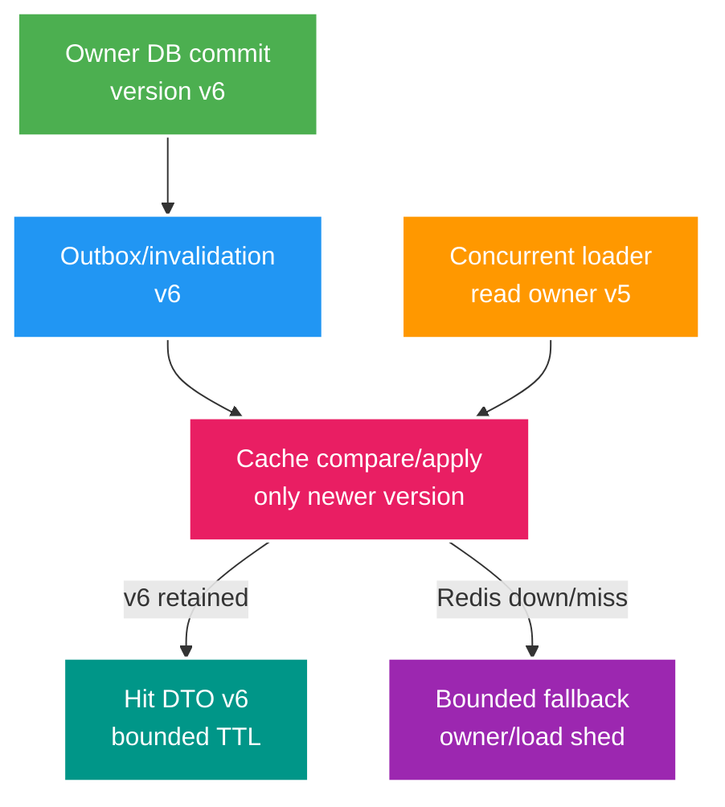

# Phân tích chuyên sâu: Version của cache, cache stampede và khôi phục từ nguồn dữ liệu gốc

> Type: `DEEP_DIVE` 
> Domain: `redis` 
> Target depth: `D4 — design cache projection under reorder/outage/eviction and protect PostgreSQL owner` 
> Teaching readiness: `TEACHABLE_DRAFT` 
> Status: `DRAFT` 
> Evidence status: `NOT RUN` 
> Prerequisites: [Cache consistency core](../core/cache-consistency-stampede-and-outage.md) 
> Related cases: `RED-01`; [question bank](../../question-bank/cache-consistency-stampede-and-outage.md) 
> Owner: `Project learner; Codex teaches, learner writes back` 
> Updated: `2026-07-26`

## 1. Cache là bản chiếu có version, không phải nguồn sự thật

PostgreSQL sở hữu sự thật durable; Redis chỉ giữ một bản chiếu DTO có kiểu, version của key/schema/nghiệp vụ, TTL và quy ước rõ cho kết quả âm hoặc trạng thái kết thúc. Cache hit vẫn có thể stale. Cache miss có thể do eviction, outage hay đổi version key, không đồng nghĩa dữ liệu không tồn tại. Tính đúng không được phụ thuộc hoàn toàn vào cache trừ khi nghiệp vụ chủ động chấp nhận rủi ro đó.

## 2. Các lịch sử tranh chấp giữa ghi database và ghi cache

Với cache-aside, service update database rồi xóa cache. Nếu lệnh xóa bị mất, value cũ sống tới TTL. Nguy hiểm hơn, reader có thể đọc dữ liệu cũ trước commit rồi ghi value cũ vào cache sau lần invalidation; đây là **stale fill**. Value có version cùng conditional set, invalidation lần hai có trì hoãn hoặc outbox durable giúp giảm race. Write-through phối hợp ghi nhưng database và Redis vẫn không có một transaction nguyên tử, đồng thời availability bị ghép với Redis. Refresh-ahead lại thêm scheduler và quy tắc owner.

Chỉ xóa key không thể chặn loader cũ tới muộn; cần tombstone hoặc version marker. Compare-and-set bằng Lua chỉ đúng khi mọi writer tuân thủ và value có version; database vẫn là authority. TTL chỉ giới hạn thời gian sai, không phải cơ chế bảo đảm consistency.

Negative cache cho “không tìm thấy” bảo vệ database trước key ngẫu nhiên nhưng có thể che object vừa được tạo; dùng TTL ngắn, version hoặc invalidation. Với ban/revoke, stale allow có rủi ro bảo mật khác hẳn metadata công khai; đường rủi ro cao phải đọc owner hoặc có fail policy rõ.

## 3. Vì sao cache stampede xảy ra

Khi hot key hết hạn hoặc bị eviction, hàng nghìn request cùng miss và query database. Single-flight trong một process vẫn để mỗi pod tạo một query. Distributed lease có thể chọn một loader, nhưng holder có thể pause hoặc chết; waiter phải có thời gian chờ hữu hạn rồi dùng stale-while-revalidate nếu được phép, hoặc fail. Lock chỉ điều phối tải chứ không bảo vệ dữ liệu database. Cần kết hợp TTL jitter, soft/hard expiry, refresh-ahead, request coalescing và bulkhead cho đường fallback DB.

Stale-while-revalidate chỉ dành cho dữ liệu chấp nhận cũ; secret, revoke hay wallet không được áp dụng mù. Loader có timeout và maximum wait; lock key có TTL và chỉ owner token mới được release. Nếu loader chết, bên khác thử lại sau lease với jitter. Với cache penetration từ key ngẫu nhiên, validate input, rate limit, negative cache hoặc Bloom filter khi phù hợp và tránh key cardinality không giới hạn.

## 4. Redis ngừng hoạt động và quá trình phục hồi

Khi Redis down, mọi request trở thành miss và fallback có thể đánh sập PostgreSQL. Phải giới hạn concurrency fallback, tắt bớt feature phụ thuộc cache, dùng circuit/rate limit và dành capacity cho lệnh ghi quan trọng. Quyết định fail-open hay fail-closed theo từng đường. Session/revocation thường ưu tiên fail-closed hoặc owner check; metadata công khai có thể fallback database.

Sau khi Redis phục hồi, cold cache tạo một cơn bão miss dù server đã healthy. Warm top key theo capacity, mở traffic dần và giữ single-flight/jitter. Không coi snapshot Redis cũ là authority; so với version database rồi rebuild. Khi đổi serializer/key version, có thể dual-read và new-write trong cửa sổ chuyển tiếp rồi để namespace cũ hết hạn. Deserialization lỗi phải thành miss có metric, không được trả object hỏng hay mặc định allow.

## 5. Ràng buộc về cluster và thiết kế key

Trên Redis Cluster, thao tác nguyên tử nhiều key hoặc script chỉ chạy khi mọi key cùng hash slot. Hash tag giúp gom slot nhưng có thể tạo hot slot. Replication/failover có thể mất write gần nhất tùy durability/configuration; cache có thể chịu được, còn idempotent operation quan trọng không được dựa riêng vào Redis. Value/key lớn và eviction policy ảnh hưởng latency. Tên key phải có version, không chứa PII/secret thô và TTL phải tường minh.

Tránh `KEYS` trên production. Nếu cần duyệt, duy trì index có giới hạn hoặc dùng `SCAN` với hiểu biết rằng kết quả không phải snapshot. Metric không gắn raw key; theo dõi hit/miss theo tên cache và loại kết quả, latency, error, eviction, memory, DB fallback và thời gian chờ stampede.

## 6. Phòng lab tiêm lỗi

Lab dùng barrier để ép stale fill, cho hot key hết hạn đồng thời, giết loader, tiêm latency, dừng/khởi động Redis, đổi serializer version và gây eviction. Assertion phải kiểm version được trả, staleness policy, DB QPS có bị chặn và khả năng phục hồi. Chốt đúng Redis topology, Spring Data serializer và pool. Bằng chứng hiện `NOT RUN`.

### 6.1. Pathology A — late loader ghi đè cache mới

Reader R miss cache và đọc PostgreSQL version 5. Writer W commit version 6 rồi invalidate/cache version 6. R chạy chậm sau đó `SET` DTO version 5, biến cache quay lùi. Delete-after-write không ngăn được fill cũ đến muộn; TTL chỉ giới hạn thời gian sai.

Mitigation cần monotonic version trong value và conditional apply, hoặc protocol tombstone/version marker mà mọi writer/loader tuân thủ. Loader có thể recheck owner version trước set nhưng vẫn có race nếu compare/set không atomic. Lua compare-and-set bảo vệ Redis transition, còn outbox bảo đảm invalidation intent không mất sau DB commit. Test dùng barriers ép đúng order R-read-v5 -> W-commit-v6 -> R-set.

### 6.2. Pathology B — hot-key expiry đánh sập PostgreSQL

Một stream 100k viewers dùng chung metadata key. Key expire, hàng nghìn requests miss và cùng query owner. Per-JVM single-flight vẫn tạo một load mỗi pod; distributed lease holder có thể pause/crash khiến waiters hết timeout rồi tự load. DB QPS và pool pending bùng lên trước khi Redis metrics báo error.

Defense in depth gồm TTL jitter để tránh cohort expiry, soft/hard expiry và stale-while-revalidate chỉ khi stale acceptable, cluster-aware coalescing/lease có token-safe release, bounded wait và DB fallback bulkhead. Nếu data là ban/revocation/balance, không serve stale mù; chọn fail policy theo invariant. Success metric là DB QPS bounded và request outcomes đúng khi loader chết.

### 6.3. Pathology C — Redis hồi nhưng cold cache tạo recovery storm

Sau restart/flush-like loss, Redis healthy nhưng gần như mọi request miss. Cho full traffic fallback owner tái tạo tất cả keys có thể collapse PostgreSQL; restore snapshot cũ lại có thể phục vụ version stale. Recovery đọc durable owner, warm top keys theo capacity, mở traffic dần và giữ admission/single-flight. Serializer/key migration có dual-read-new-write window rồi expire old namespace; deserialize error là miss + metric, không default allow.

## 6.4. Quy trình chẩn đoán và tính capacity

Theo dõi hit/miss theo cache name/result, loader concurrency/wait, value version/age bucket, evictions/memory, Redis latency/errors và DB fallback QPS/pool. Không label raw key/stream/user. Khi incident, phân biệt miss do expiry/eviction, outage, serializer/key-version drift hay legitimate absence; negative cache có semantics riêng.

Lab chạy four histories: stale fill barrier; simultaneous hot expiry; loader death while holding lease; Redis down/restart recovery. Giữ offered load cố định, assert max DB concurrency/QPS, returned version/staleness policy và time-to-warm. Pin Redis topology, persistence/failover config, Spring Data Redis serializer và client pool/timeouts. Evidence vẫn `NOT RUN`.

## 6.5. Lập luận kiến trúc và phỏng vấn

Cache-aside đơn giản và owner-independent nhưng race invalidation/fill. Write-through làm read-after-write dễ hơn nhưng couple availability và vẫn không atomic DB+Redis. Versioned projection + durable invalidation tăng metadata/protocol nhưng chịu reorder tốt hơn. Stale-while-revalidate đổi consistency lấy availability/latency và chỉ hợp read models cho phép stale.

Senior phải kể một concrete race và evidence. Architect thêm owner capacity, outage policy, schema/key migration và recovery. Expert phân tích cluster slots/failover loss, negative cache/security risk và residual inconsistency dù có version/TTL.

## 7. Bài tập diễn đạt lại và tự kiểm tra

> **Bài viết của tôi — `LEARNER TODO`:** tell late v5 loader vs v6 invalidation and Redis-down capacity.

1. **Question:** Viết timeline late loader v5 ghi sau commit/invalidation v6 và chọn protocol chống quay lùi. 
   **Đọc lại nếu bí:** mục 2 và 6.1. 
   **Một câu trả lời tốt phải có:** exact interleaving, monotonic version/conditional apply, durable invalidation, TTL limitation và barrier test. 
   **My answer:** `LEARNER TODO`
2. **Question:** Bảo vệ PostgreSQL khi hot key expire như thế nào? 
   **Đọc lại nếu bí:** mục 3 và 6.2. 
   **Một câu trả lời tốt phải có:** cluster coalescing/lease failure, jitter, stale policy, bounded fallback/bulkhead và DB-QPS evidence. 
   **My answer:** `LEARNER TODO`
3. **Question:** Recovery cold cache khác normal cache miss ở điểm nào? 
   **Đọc lại nếu bí:** mục 4 và 6.3–6.5. 
   **Một câu trả lời tốt phải có:** correlated misses, owner capacity, bounded warm/traffic ramp, version/serializer migration và no-stale-authority rule. 
   **My answer:** `LEARNER TODO`

## 8. Tài liệu tham khảo

- [Redis — Cache Patterns](https://redis.io/docs/latest/develop/use/patterns/)
- [Redis — Distributed Locks](https://redis.io/docs/latest/develop/use/patterns/distributed-locks/)

- [ ] Evidence remains `NOT RUN`.
