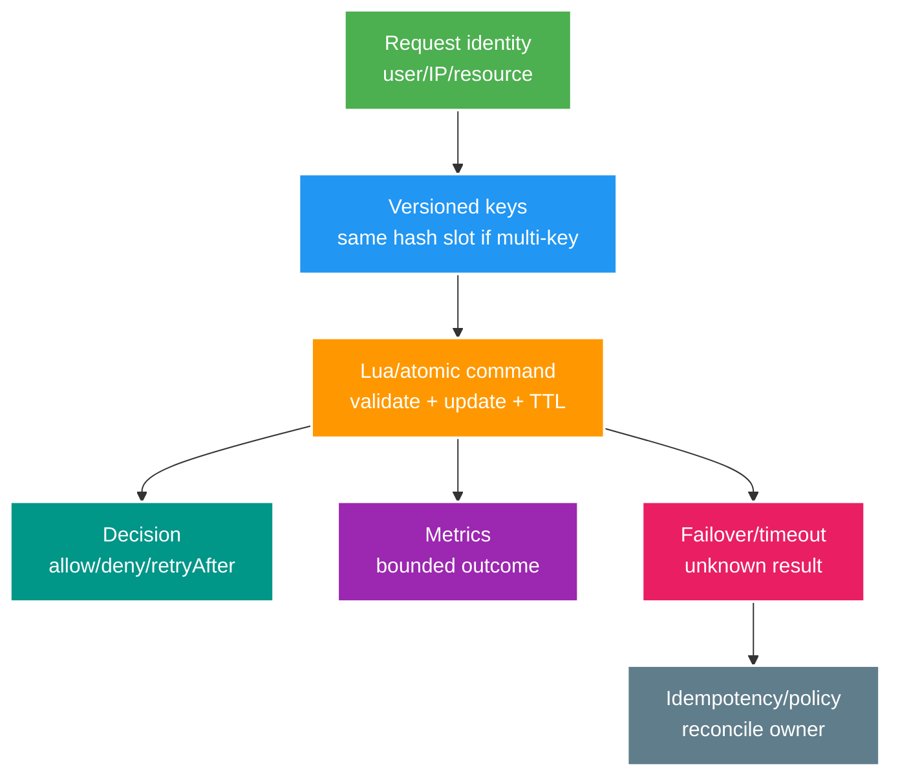

# Phân tích chuyên sâu: Tính nguyên tử của Lua, rate limiter và hot key của leaderboard

> Type: `DEEP_DIVE` 
> Domain: `redis` 
> Target depth: `D4 — prove atomic state transitions, cluster slot limits and abuse/hot-key behavior` 
> Teaching readiness: `TEACHABLE_DRAFT` 
> Status: `DRAFT` 
> Evidence status: `NOT RUN` 
> Prerequisites: [Redis atomic structures core](../core/atomic-data-structures-rate-limiting-and-leaderboards.md) 
> Related cases: `RED-02`; [question bank](../../question-bank/atomic-data-structures-rate-limiting-and-leaderboards.md) 
> Owner: `Project learner; Codex teaches, learner writes back` 
> Updated: `2026-07-26`

## 1. Tính nguyên tử luôn có phạm vi

Một command Redis là nguyên tử so với command khác trên event loop của primary. `MULTI/EXEC` xếp command thành một nhóm thực thi nhưng không có rollback tùy ý như database; `WATCH` cung cấp optimistic compare. Lua/function chạy nguyên tử trên server nhưng chặn command khác trong thời gian chạy. Phạm vi nguyên tử này không bao gồm PostgreSQL, broker hay service ngoài; durability và failover còn phụ thuộc configuration cụ thể.

Script phải ngắn và deterministic, khai báo mọi key, validate argument và giới hạn kích thước. Đặt TTL trong cùng transition nguyên tử để không sinh key bất tử. Trên Cluster, các key phải cùng slot thông qua hash tag khi cần, nhưng một tag quá phổ biến sẽ biến thành hotspot.

## 2. Các thuật toán giới hạn tần suất

Fixed window dùng `INCR` và `EXPIRE` đơn giản nhưng cho burst gần gấp đôi ở ranh giới; nếu expiry là command riêng còn có race, nên Lua gộp hai bước. Sliding log bằng ZSET chính xác từng event nhưng memory/CPU tăng theo số event và cần cleanup; sliding counter theo bucket là xấp xỉ. Token bucket giữ số token và thời điểm refill, cho phép burst nhưng giới hạn tốc độ trung bình; leaky bucket làm dòng ra đều hơn. Nên dùng server time theo hợp đồng rõ để client không thao túng và kiểm hành vi theo Redis version.

Identity cần nhiều lớp: IP, account, device, resource và global, vì attacker có thể xoay từng lớp. Chuẩn hóa input, giới hạn cardinality và TTL của key. Đặt admission check rẻ trước bước băm password, query DB hoặc fan-out đắt. Trả `retry-after` có giới hạn mà không lộ account tồn tại. Với limiter phân tán, phải chọn consistency hay availability khi Redis down; local emergency cap cộng global cap có thể chỉ xấp xỉ. Quota tài chính hoặc chỉ dùng một lần phải thuộc durable owner, không giao cho Redis dễ mất state.

Script đồng thời phải trả allow/deny, số còn lại và thời điểm reset từ cùng một state. Timeout sau khi script chạy tạo unknown outcome: retry có thể trừ token hai lần, thường nghiêng về từ chối bảo thủ. Thêm request ID để idempotent làm tăng memory/cardinality. Hợp đồng phải nói rõ chọn cách nào.

## 3. Leaderboard và Sorted Set (`ZSET`)

Trong Sorted Set, member là duy nhất còn score là số `double`; thứ tự tie phụ thuộc score rồi member và có giới hạn precision với số nguyên lớn. `ZINCRBY` nguyên tử cho một member nhưng không nguyên tử cùng business score trong DB hay outbox. Leaderboard Redis chỉ là projection có thể rebuild từ owner event, version và idempotency. Cần tie-breaker deterministic hoặc cách mã hóa score/time nằm trong giới hạn precision; không dùng floating point cho tiền.

Một ZSET global là một key/slot nên mọi update nối đuôi. Có thể shard theo contest, region hoặc time bucket rồi merge top-K, đổi lại global rank và update phức tạp hơn. Đọc top range tương đối rẻ nhưng member lớn làm tốn memory; cần trim, TTL và chính sách history. Rank thay đổi khi có write, nên cursor phải dựa trên score/member và API phải nói rõ consistency.

Bot có thể bơm score và event có thể bị gửi trùng. Inbox, event version và authorization ở owner phải chặn trước; increment nguyên tử trong Redis không tự chứng minh sự kiện bên ngoài hợp lệ.

## 4. Cấu trúc dữ liệu cho presence và đếm gần đúng

Set đếm member chính xác nhưng tốn memory và cần cleanup. ZSET dùng score là thời điểm nhìn thấy gần nhất để quét hết hạn. Bitmap phù hợp ID số dày. HyperLogLog (`HLL`) ước lượng cardinality với memory cố định nhưng không trả membership chính xác và không xóa tùy ý. Chọn theo độ chính xác, operation và vòng đời. Presence là dữ liệu tạm có TTL/heartbeat và reconciliation, không tạo key vĩnh viễn. Race giữa heartbeat với cleanup cần điều kiện timestamp hoặc script.

Key theo stream có thể thành hotspot khi creator nổi tiếng. Chia viewer theo shard rồi aggregate count; phép union chính xác có chi phí, còn HLL merge cho kết quả xấp xỉ. Không gắn stream ID vào label metric vì cardinality.

## 5. Script lỗi và quản lý version

Lua chạy lâu chặn toàn server; không gọi network hay database bên trong. Script được thực thi nguyên tử so với command khác, nhưng runtime error sau một số lệnh có thể để lại side effect theo semantics cụ thể, nên phải viết phòng thủ và test đúng Redis version. Khi `NOSCRIPT`, client cần reload an toàn và theo dõi SHA/code version. Fleet chạy lẫn script version có thể diễn giải key khác nhau; key và script phải có version, canary và cửa sổ tương thích.

Failover có thể mất write đã acknowledge tùy replication/AOF. Rate limit có thể chấp nhận sai số hữu hạn, wallet thì không. Khi reshard, client nhận `MOVED` và retry script có thể gặp unknown outcome. Timeout, backpressure và pool của client đều phải được đưa vào test.

## 6. Bằng chứng khi tiêm lỗi và tạo tải

Lab cần tạo concurrency ở ranh giới thuật toán và window, sai lệch clock, timeout/failover, hot key, tấn công cardinality, script chậm, khác cluster slot và duplicate/rebuild leaderboard. Đo command/giây, p99, CPU/event loop, memory, số key, eviction, quyết định allow/deny và invariant ở owner. Bằng chứng hiện `NOT RUN`.

### 6.1. Pathology A — `INCR` thành công nhưng `EXPIRE` không chạy

Fixed-window limiter thực hiện hai commands riêng: `INCR`, rồi nếu lần đầu thì `EXPIRE`. Client/process chết giữa chúng tạo key không TTL và user bị limit vĩnh viễn. Race giữa clients cũng làm reset semantics không nhất quán. Lua/function gộp validate, increment và TTL trong một atomic server transition; script trả allow/remaining/reset từ cùng state.

Script phải ngắn, deterministic, validate bounded args và khai báo mọi keys. Atomic ở Redis không bao gồm app/DB và không bảo đảm client biết result khi timeout. Nếu timeout sau execution, retry có thể consume thêm token; policy có thể chấp nhận conservative deny hoặc thêm request identity với memory/cardinality cost.

### 6.2. Pathology B — attacker tạo hàng triệu identity keys

Limiter theo raw IP/account/resource nhưng không normalize/validate input; attacker xoay IDs và tạo key mới mỗi request. Dù mỗi key có TTL, creation rate vượt expiry làm memory/key count tăng và eviction ảnh hưởng cache khác. Metrics gắn raw identity còn tạo cardinality/PII issue.

Admission cần identity layers đáng tin, length/character bounds, TTL trong atomic path, global/emergency cap và bounded metric dimensions. Rate limiter không thay authentication/abuse detection. Redis down policy khác login, public read và financial quota; durable one-time quota không được giao riêng cho evaporating Redis state.

### 6.3. Pathology C — global leaderboard biến thành một hot slot

Mọi gift update cùng một ZSET; Redis single command atomic nhưng một key/slot phải serialize. Một celebrity event làm p99 tăng cho mọi contest cùng slot. Shard theo contest/region/time bucket giảm hotspot, nhưng global top-K phải merge candidates và rank có thể approximate/stale. Score double còn mất precision với large integer/composite encoding; ties cần deterministic member/order contract.

Redis leaderboard là projection từ durable, idempotent owner events. Duplicate event phải bị inbox/business identity chặn trước increment; rebuild từ owner phải cho cùng result. Timeout/failover có thể mất/duplicate recent projection update và được reconcile, không dùng ZSET như monetary truth.

### 6.4. Pathology D — Lua dài khóa event loop

Script quét/cleanup một ZSET khổng lồ trong một invocation. Vì execution atomic trên Redis thread, các unrelated commands cũng chờ; latency spike dẫn client timeout/retry. Chunk cleanup ngoài script hoặc dùng bounded operations/data lifecycle. `NOSCRIPT`, mixed script versions và cluster `MOVED` cần client behavior/test rõ; retry sau unknown execution không luôn safe.

## 6.5. Quy trình tiêm lỗi, tạo tải và ranh giới phiên bản

Test boundary bursts ngay trước/sau window, concurrent token refill, client clock manipulation, timeout after script, Redis failover và key-cardinality attack. Với leaderboard, tạo hot contest skew, duplicates, score ties/precision boundary và rebuild. Đo command rate, event-loop CPU, p99, memory/key count, slot distribution, decisions và owner invariant.

Multi-key Lua/transaction trên Redis Cluster chỉ hoạt động khi keys cùng hash slot; hash tag gom keys nhưng có thể tạo hot slot. Exact scripting/functions, replication/AOF acknowledgement và failover semantics phụ thuộc Redis/client version/topology. Pin Spring Data/Lettuce serializer, timeout/retry behavior và code SHA/version. Evidence `NOT RUN`.

## 6.6. Ra quyết định và lập luận phỏng vấn

Fixed window rẻ nhưng boundary burst; sliding log chính xác nhưng memory/cleanup theo events; token bucket kiểm soát average + burst với state/time math; local limiter availability cao nhưng không enforce global chặt. ZSET phù hợp ordered projection, HLL cho approximate cardinality chứ không membership/rank.

Senior giải thích atomic scope và một algorithm. Architect thêm identity/abuse, fail policy, cluster slot và rebuild. Expert phân tích unknown script outcome, event-loop blocking, hot-key sharding/merge và durability gap.

## 7. Bài tập diễn đạt lại và tự kiểm tra

> **Bài viết của tôi — `LEARNER TODO`:** design login token bucket and contest leaderboard with failure/slot/owner.

1. **Question:** Vì sao `INCR` rồi `EXPIRE` tách rời sai và Lua sửa được boundary nào? 
   **Đọc lại nếu bí:** mục 1 và 6.1. 
   **Một câu trả lời tốt phải có:** crash/race timeline, atomic TTL transition, unknown client outcome và giới hạn DB/failover. 
   **My answer:** `LEARNER TODO`
2. **Question:** Thiết kế login token bucket chống key-cardinality abuse như thế nào? 
   **Đọc lại nếu bí:** mục 2 và 6.2. 
   **Một câu trả lời tốt phải có:** identity/normalization, algorithm state/time, TTL/global cap, fail policy, bounded metrics và durable-quota boundary. 
   **My answer:** `LEARNER TODO`
3. **Question:** Scale leaderboard hot key mà vẫn rebuild/reconcile được như thế nào? 
   **Đọc lại nếu bí:** mục 3, 6.3 và 6.5. 
   **Một câu trả lời tốt phải có:** projection owner/idempotency, shard/merge trade-off, ties/precision, slot/load evidence và failover recovery. 
   **My answer:** `LEARNER TODO`

## 8. Tài liệu tham khảo

- [Redis — Scripting](https://redis.io/docs/latest/develop/programmability/eval-intro/)
- [Redis — Sorted Sets](https://redis.io/docs/latest/develop/data-types/sorted-sets/)
- [Redis — HyperLogLog](https://redis.io/docs/latest/develop/data-types/probabilistic/hyperloglogs/)

- [ ] Evidence remains `NOT RUN`.
