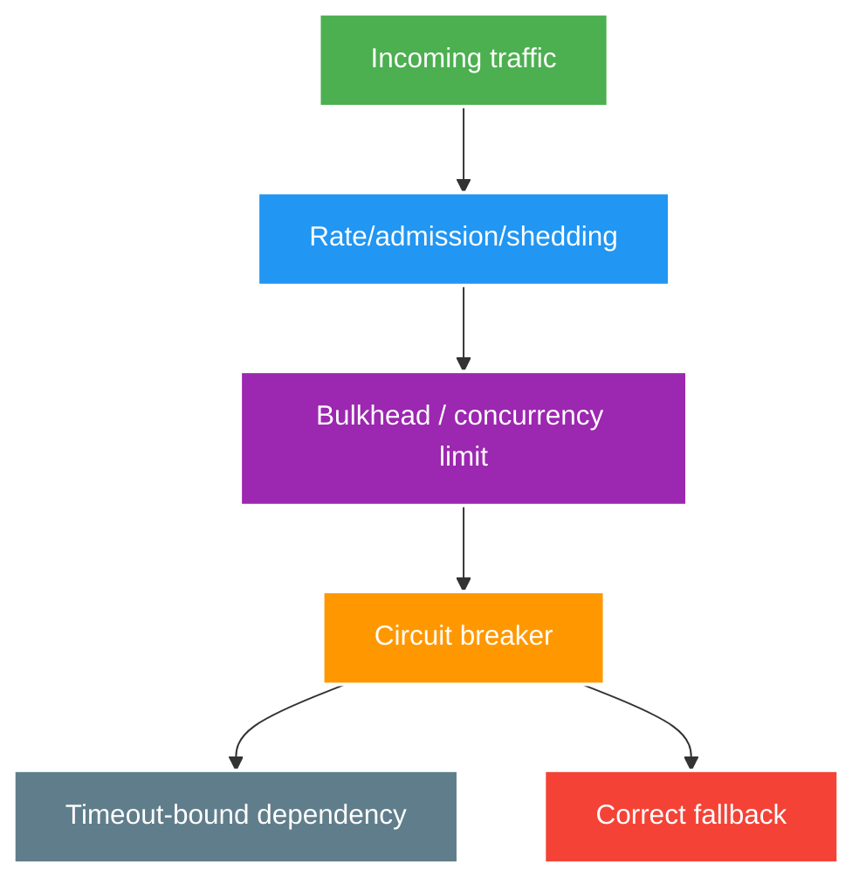

# Circuit Breaker, Bulkhead and Load Shedding

> Type: `CORE` 
> Domain: `distributed-systems` 
> Target depth: `D3 — chọn isolation/overload control theo bottleneck và kiểm chứng state transition/recovery` 
> Teaching readiness: `TEACHABLE_DRAFT` 
> Status: `DRAFT` 
> Evidence status: `NOT RUN` 
> Prerequisites: [Timeouts and pool exhaustion](timeouts-cancellation-and-pool-exhaustion.md), [Retry storms](retry-backoff-jitter-and-retry-storms.md) 
> Related cases: [`CHAT-UC-01`](../../../../use-case-catalog.md#31-foundation-và-senior-cases), [`RATE-UC-01`](../../../../use-case-catalog.md#31-foundation-và-senior-cases), [`CACHE-UC-01`](../../../../use-case-catalog.md#31-foundation-và-senior-cases) 
> Owner: `Project learner; Codex assists` 
> Updated: `2026-07-26`

Source canonical cho [circuit/bulkhead question bank](../../question-bank/circuit-breaker-bulkhead-and-load-shedding.md).

## 0. Cách học file này

Với mỗi control, viết resource nó bảo vệ và signal nó dùng. Breaker nhìn outcome quá khứ; bulkhead chia capacity; rate/concurrency limiter chặn arrival/in-flight; shedding bảo vệ survival. Sau đó kiểm tra fallback có đúng business semantics và recovery có ramp hay flood.

## 1. Learning objectives

1. Phân biệt circuit breaker, bulkhead, rate limiting, concurrency limiting và load shedding.
2. Chọn signal/window/threshold/fallback và tránh breaker flapping hoặc false recovery.
3. Chứng minh critical path còn capacity khi optional dependency bị chậm/hỏng.

## 2. Mental model do người dạy cung cấp

Resilience controls là nhiều cổng khác nhau trên traffic path. Admission quyết định có nhận work; bulkhead quyết định work được dùng partition capacity nào; timeout giới hạn thời gian giữ; breaker ngừng gọi dependency có tín hiệu xấu; fallback quyết định degraded result. Đặt sai thứ tự hoặc dùng một control thay control khác để lại bottleneck không được bảo vệ.

## 3. Cơ chế cốt lõi

Circuit breaker quan sát outcome; khi failure/slow-call signal vượt threshold trong đủ sample, nó mở để fail fast, sau đó cho số probe giới hạn ở half-open. Nó giảm waste khi dependency unhealthy nhưng không tự giới hạn concurrency trước khi breaker đủ dữ liệu.

Bulkhead chia pool/semaphore/queue để failure của một dependency/tenant/workload không chiếm toàn capacity. Rate limiter giới hạn arrivals theo identity/time; concurrency limiter giới hạn in-flight; load shedding từ chối công việc khi system không còn budget. Chúng bảo vệ các bottleneck khác nhau và thường phải phối hợp.

Fallback chỉ hợp lệ nếu trả semantics degraded nhưng đúng: stale cache có age/authorization rule, optional enrichment có thể bỏ, money/security decision không được giả success. Recovery cần warm-up/probe/ramp thay vì mở floodgate.

### Worked example — optional moderation làm sập chat

Nếu moderation remote chậm và dùng chung connection/thread pool với chat delivery, optional calls chiếm hết capacity; critical path timeout dù chat core khỏe. Bulkhead tách permits/pool và shedding moderation enrichment giữ chat core. Breaker chỉ mở sau đủ samples nên không thay admission/concurrency limit tức thời.

### Worked example — half-open surge

Dependency vừa hồi, hàng nghìn requests cùng probe có thể làm nó ngã lại. Half-open cần probe count nhỏ, success window/ramp và retry coordination. Metric phải thấy breaker state, permitted/rejected probes, downstream saturation và fallback quality.

## 4. Invariants và boundaries

1. Critical traffic có reserved/bounded capacity hoặc admission priority rõ.
2. Rejection/fallback không vi phạm security, money hoặc freshness invariant.
3. Breaker key/granularity không trộn unrelated dependency/tenant một cách gây blast radius.
4. Half-open probes bounded; recovery không tạo retry surge.
5. Metrics có state, rejection, saturation, fallback quality và downstream outcome.

## 5. Failure modes

| Failure | Trigger | Symptom |
| --- | --- | --- |
| Breaker flapping | Window/threshold/sample sai | Open/close liên tục |
| Shared pool collapse | Optional slow call chiếm threads/connections | Critical path timeout |
| Unsafe fallback | Stale/unauthorized/default success | Invariant/security violation |
| Global breaker | Một tenant/endpoint lỗi | Blast radius toàn service |
| Recovery surge | Half-open/unthrottle quá nhanh | Dependency ngã lại |

## 6. Trade-off matrix

| Control | Bảo vệ chính | Cost/risk |
| --- | --- | --- |
| Circuit breaker | Waste trên unhealthy dependency | Tuning/state/false open |
| Semaphore bulkhead | In-flight slots | Caller thread có thể block/reject |
| Thread/pool bulkhead | Isolation + queue | Context/resource overhead |
| Rate limiter | Arrival quota/fairness | Burst/user identity policy |
| Load shedding | Whole-system survival | Explicit degraded availability |

## 7. Deep-dive và case

- [Timeout, retry, circuit, bulkhead and overload control](../deep-dives/timeout-retry-circuit-bulkhead-and-overload-control.md).
- `CHAT-UC-01`: isolate fan-out/moderation/chat hot path.
- `RATE-UC-01`: fair admission and abuse traffic.
- `CACHE-UC-01`: stale fallback/fail-open/fail-closed decision.

## 8. Interview outline, recap và learner write-back

Chọn control theo bottleneck, giải breaker state/window/sample, bulkhead capacity và shedding policy. Nêu fallback correctness, key granularity và recovery ramp. So bằng fault/load evidence thay vì library annotation.

- Breaker không thay concurrency/rate limiting.
- Bulkhead isolation đổi utilization lấy blast-radius control.
- Fallback là business contract, không phải catch-all success.
- Recovery traffic cũng cần admission.

`LEARNER TODO — thiết kế control chain cho CHAT-UC-01 và nêu protected resources.`

## 9. Guided self-check

1. **Question:** Ba controls khác nhau thế nào? **Đọc lại nếu bí:** mental model, mục 3, 6. **Rubric:** outcome health vs in-flight capacity vs arrivals/time quota. **My answer:** `LEARNER TODO`
2. **Question:** Recovery gây outage lần hai ra sao? **Đọc lại nếu bí:** half-open example, mục 4–5. **Rubric:** probe/unthrottle/retry surge; bounded probes and ramp. **My answer:** `LEARNER TODO`
3. **Question:** Fallback nào không chấp nhận? **Đọc lại nếu bí:** mục 3–4. **Rubric:** stale/allow/default success violating auth/money/freshness; fail closed or explicit unavailable. **My answer:** `LEARNER TODO`

## 10. References

- [Resilience4j — CircuitBreaker](https://resilience4j.readme.io/docs/circuitbreaker)
- [Resilience4j — Bulkhead](https://resilience4j.readme.io/docs/bulkhead)

## 11. Teach-back checklist

- [ ] Tôi chọn control theo resource/bottleneck cần bảo vệ.
- [ ] Tôi phân tích fallback correctness và recovery surge.
- [ ] Tôi có state/saturation/rejection evidence plan.
- [ ] Resilience evidence vẫn `NOT RUN`.
