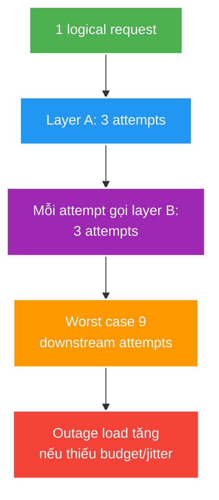

# Retry, Backoff, Jitter and Retry Storms

> Type: `CORE` 
> Domain: `distributed-systems` 
> Target depth: `D3 — phân loại retryable failure, tái hiện amplification và kiểm chứng budget/backoff/jitter` 
> Teaching readiness: `TEACHABLE_DRAFT` 
> Status: `DRAFT` 
> Evidence status: `NOT RUN` 
> Prerequisites: [Timeouts and cancellation](timeouts-cancellation-and-pool-exhaustion.md), [HTTP idempotency](../../../api/theory/core/http-rest-semantics-and-idempotency.md) 
> Related cases: [`RECONNECT-UC-01`](../../../../use-case-catalog.md#31-foundation-và-senior-cases), [`EVT-UC-01`](../../../../use-case-catalog.md#31-foundation-và-senior-cases) 
> Owner: `Project learner; Codex assists` 
> Updated: `2026-07-26`

Source canonical cho [retry question bank](../../question-bank/retry-backoff-jitter-and-retry-storms.md).

## 0. Cách học file này

Tính attempts và offered load trước khi chọn backoff. Với ba layers, ghi retry owner, terminal deadline và idempotency owner. Fault test phải quan sát recovery, không chỉ tỷ lệ success trong outage.

## 1. Learning objectives

1. Retry chỉ transient failure và operation idempotent/deduplicated trong remaining deadline.
2. Giải thích exponential backoff, jitter, retry budget và multiplicative retry layers.
3. Thiết kế fault experiment đo attempts, offered load, success, latency và recovery.

## 2. Mental model do người dạy cung cấp

Retry là load generator có điều kiện. Một logical request sinh thêm attempts đúng lúc dependency đang yếu; nhiều layers nhân nhau. Backoff tạo khoảng thở, jitter phân tán đám đông, budget giới hạn tổng load. Chỉ transient + retryable semantics + remaining deadline mới tạo cơ hội recovery tốt hơn.

## 3. Cơ chế cốt lõi

Retry biến một logical request thành nhiều attempts. Nó hữu ích khi failure transient và attempt sau có xác suất thành công; nó gây hại khi overload, validation/permanent error, non-idempotent side effect hoặc remaining budget không đủ.

Backoff giãn attempts; jitter phá đồng bộ giữa clients. Cần cap, max attempts, total deadline và retry budget theo traffic/capacity. Nếu gateway, service và client library đều retry, amplification nhân qua layers; nên chọn retry owner gần nơi hiểu semantics và quan sát outcome.

Retry sau timeout gặp ambiguous outcome: attempt đầu có thể đã commit. Idempotency/dedup và stable result là điều kiện business, không được thay bằng niềm tin rằng timeout nghĩa là chưa thực hiện.

### Worked example — full jitter

Nếu 10.000 clients dùng fixed delay 1 giây, chúng quay lại cùng nhịp và tạo spike tuần hoàn. Exponential backoff đặt cap tăng dần; full jitter chọn ngẫu nhiên trong khoảng từ 0 tới cap cho attempt đó, trải offered load theo thời gian. Nó không tạo capacity nên vẫn cần max attempts, global retry budget và admission control.

### Counterexample — retry validation

`400`, invalid credential hoặc permanent business conflict không thay đổi chỉ vì chờ. Retry tiêu deadline/load và che bug caller. Timeout/`5xx` cũng chưa tự động retryable nếu command non-idempotent hoặc remaining budget không đủ.

## 4. Invariants và boundaries

1. Mỗi retry policy có owner, retryable taxonomy, max attempts, backoff/jitter và total deadline.
2. Không retry validation/auth/permanent conflict mặc định.
3. Side effect phải idempotent/deduplicated hoặc có compensation rõ.
4. Retry budget không làm offered load vượt recovery capacity.
5. Metrics tách logical requests, attempts và terminal outcomes.

## 5. Failure modes

| Failure | Trigger | Symptom |
| --- | --- | --- |
| Retry storm | Outage + immediate synchronized retry | Dependency không hồi phục |
| Layer multiplication | N layers retry | Attempts tăng theo tích |
| Deadline overrun | Attempt mới khi budget gần hết | Work vô ích, tail cao |
| Duplicate side effect | Timeout after commit | Double charge/event |
| Poison retry | Permanent error | Queue lag/cost/log noise |

## 6. Trade-off matrix

| Policy | Strength | Risk |
| --- | --- | --- |
| No retry | Load predictable | Transient failure lộ ra |
| Fixed delay | Simple | Synchronization/thundering herd |
| Exponential + jitter | Recovery friendly | Longer latency/tuning |
| Hedging | Tail reduction cho safe reads | Extra concurrent load |
| Queue redelivery | Durable retry | Lag, ordering, poison handling |

## 7. Deep-dive và case

- [Timeout, retry, circuit, bulkhead and overload control](../deep-dives/timeout-retry-circuit-bulkhead-and-overload-control.md).
- `RECONNECT-UC-01`: reconnect/backoff/jitter under regional recovery.
- `EVT-UC-01`: consumer redelivery, poison message và idempotency.

## 8. Interview outline, recap và learner write-back

Phân loại transient/permanent/ambiguous, tính multiplicative layers, mô tả backoff+jitter+deadline+budget và gắn idempotency. Metrics tách logical request/attempt/offered load/terminal outcome/recovery.

- Retry owner nên gần semantics và tránh layers chồng.
- Jitter phá synchronization, không sửa overload gốc.
- Attempt mới phải fit remaining budget.
- Timeout after commit cần idempotency/reconciliation.

`LEARNER TODO — tính attempt tree và policy cho RECONNECT-UC-01.`

## 9. Guided self-check

1. **Question:** Khi nào retry làm tệ hơn? **Đọc lại nếu bí:** mục 2–5. **Rubric:** overload/permanent/non-idempotent/no budget/multiple layers. **My answer:** `LEARNER TODO`
2. **Question:** Full jitter giúp gì? **Đọc lại nếu bí:** worked example. **Rubric:** randomized interval breaks phase alignment; still needs cap/budget. **My answer:** `LEARNER TODO`
3. **Question:** Đo amplification/recovery gì? **Đọc lại nếu bí:** mục 4, 6. **Rubric:** logical vs attempts, offered load, success/p99/reject, time-to-recover. **My answer:** `LEARNER TODO`

## 10. References

- [RFC 9110 — Retry-After semantics](https://www.rfc-editor.org/rfc/rfc9110.html#name-retry-after)
- [AWS Builders' Library — Timeouts, retries and backoff](https://aws.amazon.com/builders-library/timeouts-retries-and-backoff-with-jitter/)

## 11. Teach-back checklist

- [ ] Tôi phân loại transient/permanent/ambiguous outcome.
- [ ] Tôi tính amplification xuyên layers.
- [ ] Tôi gắn retry vào deadline, idempotency và capacity.
- [ ] Retry evidence vẫn `NOT RUN`.
