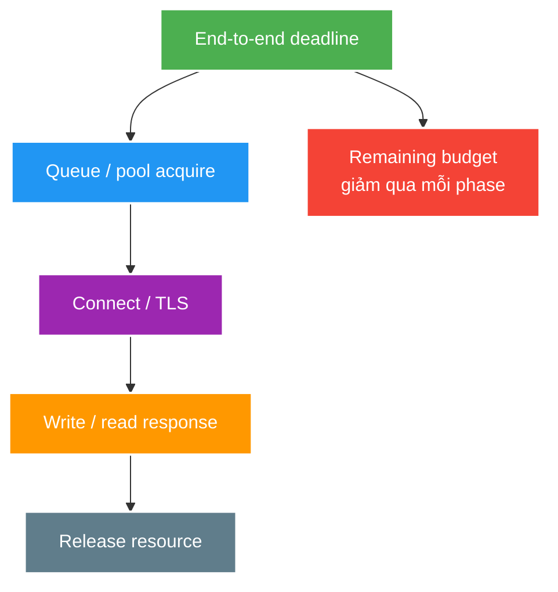

# Timeouts, Cancellation and Pool Exhaustion

> Type: `CORE` 
> Domain: `distributed-systems` 
> Target depth: `D3 — phân bổ deadline, tái hiện pool exhaustion và chứng minh cancellation giải phóng resource` 
> Teaching readiness: `TEACHABLE_DRAFT` 
> Status: `DRAFT` 
> Evidence status: `NOT RUN` 
> Prerequisites: HTTP client lifecycle, threads/executors and connection pools 
> Related cases: [`RECONNECT-UC-01`](../../../../use-case-catalog.md#31-foundation-và-senior-cases), [`API-UC-01`](../../../../use-case-catalog.md#32-architect-và-expert-cases) 
> Owner: `Project learner; Codex assists` 
> Updated: `2026-07-26`

Source canonical cho [timeout question bank](../../question-bank/timeouts-cancellation-and-pool-exhaustion.md).

## 0. Cách học file này

Vẽ toàn latency budget, không đặt một con số timeout chung. Đo riêng queue/pool acquire, DNS/connect/TLS, request/write/read và cleanup. Khi inject slow downstream, kiểm tra resource có thực sự quay về pool sau caller timeout.

## 1. Learning objectives

1. Phân biệt DNS, connect, TLS, pool-acquire, read/write và end-to-end deadline.
2. Propagate cancellation/deadline qua downstream work và resource ownership.
3. Tái hiện queue/pool saturation, đo wait/in-use/timeout và chọn bounded overload behavior.

## 2. Mental model do người dạy cung cấp

Deadline là ngân sách toàn operation; phase timeout là hàng rào cho từng đoạn. Thời gian đã dùng ở queue/acquire không được “reset” khi gọi downstream. Slow service giữ resource lâu hơn, làm in-flight tăng, pool wait tăng và tạo positive feedback. Cancellation chỉ hữu ích khi truyền tới work và giải phóng mọi ownership.

## 3. Cơ chế cốt lõi

Timeout riêng lẻ giới hạn một phase; deadline giới hạn toàn operation. Nếu mỗi downstream hop nhận full timeout mới, tổng latency có thể vượt client budget. Pool acquire timeout khác connect/read timeout: request có thể chưa ra network nhưng đã hết thời gian trong queue.

Cancellation là protocol/cooperation, không phải chỉ trả response sớm. Khi caller bỏ cuộc, task/downstream call/DB query phải được signal và resource phải được release; nếu work tiếp tục, hệ thống tiêu capacity cho kết quả không ai dùng.

Little's Law cho thấy concurrency xấp xỉ arrival rate nhân time-in-system; latency tăng kéo concurrency/pool demand tăng và có thể tạo feedback loop. Bounded queue/pool làm overload lộ ra; unbounded queue đổi rejection thành memory/latency collapse.

### Worked example — reachable host nhưng acquire timeout

Pool 20 connections, 20 calls bị downstream giữ 5 giây. Request thứ 21 timeout sau 100 ms khi chờ pool; nó chưa DNS/connect tới host. Tăng connect timeout không giúp. Metrics phải cho thấy leased=20, pending tăng, acquire wait/timeout cao và downstream service time dài.

### Worked example — cancellation leak

Caller timeout 200 ms nhưng DB query chạy 10 giây và giữ connection. Response nhanh hơn về mặt client nhưng capacity vẫn mất; retry còn nhân zombie queries. Driver/query timeout/cancel, task interruption/cooperation và `finally` release phải được fault-test.

## 4. Invariants và boundaries

1. Mỗi external dependency có phase timeout và end-to-end budget phù hợp SLO.
2. Pool/queue bounded; acquisition wait có metric và failure behavior rõ.
3. Timeout/cancellation luôn release connection, permit, lock và task ownership.
4. Remote call không nằm trong DB transaction/lock nếu không có bounded justification.
5. Timeout outcome có thể ambiguous; retry chỉ khi operation semantics cho phép.

## 5. Failure modes

| Failure | Causal chain | Symptom |
| --- | --- | --- |
| Pool starvation | Slow downstream giữ connections | Acquire timeout dù host reachable |
| Deadline inflation | Mỗi hop reset timeout | Client hết hạn, backend vẫn làm |
| Cancellation leak | Future/socket/query không cancel | Zombie work, pool không hồi |
| Unbounded queue | Arrival > service rate | Heap/p99 collapse |
| Transaction + remote wait | Connection/lock giữ lâu | DB pool/lock amplification |

## 6. Trade-off matrix

| Control | Bảo vệ | Trade-off |
| --- | --- | --- |
| Short timeout | Capacity/fail fast | False timeout khi tail hợp lệ |
| Deadline propagation | End-to-end bound | Cross-service contract/context |
| Bounded pool/queue | Resource cap | Rejection cần xử lý |
| Cancellation | Reclaim wasted work | Driver/protocol cooperation |
| Separate pool/bulkhead | Fault isolation | Lower utilization, tuning cost |

## 7. Deep-dive và case

- [Timeout, retry, circuit, bulkhead and overload control](../deep-dives/timeout-retry-circuit-bulkhead-and-overload-control.md).
- `RECONNECT-UC-01`: reconnect surge, handshake/downstream budgets.
- `API-UC-01`: client/gateway/server timeout alignment.

## 8. Interview outline, recap và learner write-back

Phân biệt phase timeouts/deadline, kể feedback loop theo Little's Law có điều kiện và cancellation-to-release chain. Nêu metrics acquire/in-use/service/queue age/cancel/recovery và ambiguous outcome.

- Acquire timeout có thể xảy ra trước network.
- Deadline phải giảm qua mỗi hop.
- Timeout response không bảo đảm capacity hồi phục.
- Bound + rejection biến overload thành control plane rõ.

`LEARNER TODO — phân bổ một deadline 1 giây và ghi metric từng phase.`

## 9. Guided self-check

1. **Question:** Các timeout khác nhau thế nào? **Đọc lại nếu bí:** diagram, mục 3. **Rubric:** phase ownership + end-to-end remaining budget. **My answer:** `LEARNER TODO`
2. **Question:** Query còn chạy gây gì? **Đọc lại nếu bí:** cancellation example, mục 4–5. **Rubric:** zombie work, held connection/lock, retry amplification, slow recovery. **My answer:** `LEARNER TODO`
3. **Question:** Metric phân biệt nguyên nhân? **Đọc lại nếu bí:** acquire example. **Rubric:** pool leased/pending/acquire wait + downstream latency/in-flight and configured capacity. **My answer:** `LEARNER TODO`

## 10. References

- [Java SE 21 — `HttpClient`](https://docs.oracle.com/en/java/javase/21/docs/api/java.net.http/java/net/http/HttpClient.html)
- [Reactive Streams specification](https://www.reactive-streams.org/)

## 11. Teach-back checklist

- [ ] Tôi phân bổ deadline thay vì đặt một timeout tùy ý.
- [ ] Tôi nối cancellation với resource release.
- [ ] Tôi giải thích queue/pool feedback loop bằng số đo.
- [ ] Timeout/pool evidence vẫn `NOT RUN`.
