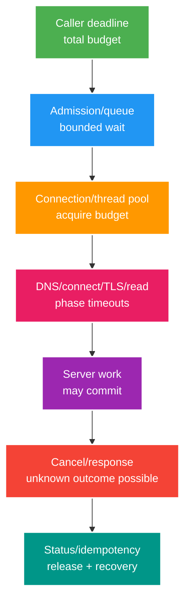

# Deep-dive: Deadline, Cancellation, Pool/Queue và Thread Exhaustion

> Type: `DEEP_DIVE` 
> Domain: `resilience` 
> Target depth: `D4 — diagnose timeout budget leakage and resource exhaustion across call chains` 
> Teaching readiness: `TEACHABLE_DRAFT` 
> Status: `DRAFT` 
> Evidence status: `NOT RUN` 
> Prerequisites: [Timeout/cancellation core](../core/timeouts-cancellation-and-pool-exhaustion.md) 
> Related cases: `RES-01`; [question bank](../../question-bank/timeouts-cancellation-and-pool-exhaustion.md) 
> Owner: `Project learner; Codex teaches, learner writes back` 
> Updated: `2026-07-26`

## 1. End-to-end deadline

Client deadline phải gồm queue, DNS/connect/TLS, pool acquisition, request/read, retry và response. Mỗi downstream chỉ nhận remaining budget trừ cleanup, không nhận lại full timeout mới. Timeout là quyết định của caller; work có thể vẫn chạy hoặc commit. Cancellation mang tính hợp tác và phụ thuộc boundary.

## 2. Pool exhaustion feedback

Dependency chậm giữ HTTP/DB connection và thread; waiter vào queue, timeout, retry rồi chiếm thêm. Pool lớn hơn capacity dependency chỉ tăng concurrency/latency. Giới hạn acquisition timeout, concurrency/bulkhead và queue; shed sớm. Tách pool critical/background thận trọng để cô lập, không nhân tổng tải tới owner.

Metric cần active/idle/pending/acquire timeout, duration từng request phase, thread state, DB session/lock, queue age, cancellation và late completion. CPU thấp là biểu hiện thường gặp. Virtual thread bỏ giới hạn OS thread-per-request nhưng không bỏ pool/dependency limit và có thể tạo nhiều work đang chờ hơn; vẫn cần admission.

## 3. Timeout layering

Phân biệt connect timeout, read/response timeout và call deadline. DNS/TLS có thể không chịu timeout như dự đoán. Căn server statement/lock timeout với app deadline và rollback transaction. Broker còn có processing/visibility/ack/grace. Circuit breaker đếm slow/error theo config nhưng không nhất thiết interrupt work.

Đặt timeout từ SLO, phân phối latency dependency và fail-fast capacity, không chọn tùy ý. Quá thấp tạo false timeout/retry; quá cao giữ resource lâu. Phải xét tail spike/failure. Tránh chỉ bọc `orTimeout` mà không cancel/release; interruption khi cancel Java Future vẫn là cooperative.

## 4. Cancellation cleanup

Khi disconnect/deadline, cancel task queued/chưa chạy và downstream nếu an toàn; release semaphore/connection trong `finally`; không rò MDC. Nếu DB/remote đã commit, dùng idempotency/status. Reactive cancellation signal không undo; virtual/platform thread có thể bỏ qua interruption hoặc xóa flag. External provider có thể tiếp tục.

Task dài cần durable state/checkpoint; HTTP trả accepted cùng status endpoint. Không giữ transaction trong lúc chờ external. Shutdown deadline phải kết hợp request deadline và grace period.

## 5. Pathologies

Executor queue vô hạn làm rejection không xuất hiện cho tới OOM hoặc tail kéo dài nhiều phút; dùng bounded queue, rejection và admission. DB pool acquisition có thể ăn hết request budget khiến query không còn thời gian. Thread-pool starvation deadlock xảy ra khi task submit rồi chờ chính bounded pool. Bulkhead partition sai có thể bất công hoặc idle; sizing theo dependency. Metric timeout gắn raw URL gây cardinality.

## 6. Recovery/runbook

Khi incident, xác định saturation owner; dừng retry/new work hoặc load shed; giảm concurrency thay vì mở pool mù; restore dependency rồi half-open/drain dần. Correlate thread dump, pool và database. Xác minh không leak và không còn operation outcome mơ hồ; sửa budget/queue rồi thêm load/fault regression. Evidence vẫn `NOT RUN`.

### 6.1. Pathology A — timeout 2 giây nhưng pool acquire đã ăn hết 1,9 giây

Request có SLO 2 giây. HTTP client chỉ đặt read timeout 2 giây, còn connection-pool acquire chờ 1,9 giây rồi call bắt đầu với thêm 2 giây. Caller đã bỏ đi nhưng downstream work tiếp tục; connection bị giữ lâu hơn và requests sau xếp queue. Metric “remote call 300 ms” gây hiểu nhầm vì không tính acquire wait.

Deadline phải là absolute/end-to-end budget. Mỗi phase lấy remaining time: admission, pool acquire, DNS/connect/TLS, read và cleanup. Khi remaining không đủ minimum useful work, reject trước thay vì bắt đầu call chắc chắn muộn. Telemetry tách phase duration và late completion để thấy budget leakage.

### 6.2. Pathology B — tăng DB pool làm database chậm hơn

Khi 30 connections bão hòa, team tăng lên 100. Database CPU/I/O/lock capacity không tăng; nhiều concurrent queries cạnh tranh, tail dài hơn, transactions giữ locks lâu hơn và timeout/retry tăng. Application có nhiều waiter đang “active” nhưng throughput giảm. Low app CPU không chứng minh cần thêm threads/connections.

Pool/bulkhead là admission controller cho dependency, không phải throughput knob vô hạn. Size dựa measured concurrency at sustainable latency; acquisition queue bounded, overflow shed rõ. Tách critical/background pool có thể bảo vệ priority nhưng tổng capacity vẫn phải nằm trong owner budget.

### 6.3. Pathology C — Future timeout nhưng task vẫn giữ resource

`CompletableFuture.orTimeout` hoàn tất future exceptional nhưng không bảo đảm underlying JDBC/HTTP work dừng. Interrupt có thể bị library bỏ qua; remote server có thể đã commit. Nếu cleanup chỉ nằm trên success path, semaphore/MDC/connection leak. Virtual thread làm waiting thread rẻ hơn nhưng không làm DB connections hoặc remote capacity vô hạn.

Cancellation phải propagate nơi API hỗ trợ, và resource release nằm trong `finally`/structured lifecycle. Sau write timeout, query operation status bằng idempotency identity. Với long work, chuyển thành durable job + status thay vì giữ HTTP transaction.

### 6.4. Pathology D — unbounded queue biến overload thành OOM chậm

Executor unbounded hiếm reject nên dashboard nhìn “accepted”. Arrival rate lớn hơn service rate làm queue age/memory tăng; tới phút sau requests hết relevance nhưng vẫn chạy, GC pressure và OOM. Bounded queue cho phép explicit overflow policy: reject/load shed, caller backoff hoặc durable queue nếu work phải giữ. Queue length một mình chưa đủ; queue age và estimated drain time cho biết work còn hữu ích hay không.

## 6.5. Diagnostic và load/fault procedure

1. Gắn một request deadline và phase timers; capture pool active/idle/pending, queue size/age, thread states, DB sessions/locks và downstream latency.
2. Giữ offered load cố định, làm dependency chậm theo step; quan sát điểm queue bắt đầu tăng và throughput dừng tăng.
3. So sánh unbounded, bounded-reject và bounded-admission configurations; không đổi nhiều knobs cùng lúc.
4. Cancel/disconnect giữa write, kiểm tra downstream task/resource và final business outcome.
5. Thử platform threads và virtual threads nhưng giữ DB/HTTP bulkhead như nhau; chứng minh bottleneck owner thay vì suy từ thread count.
6. Recovery: ngăn new/retry load, restore owner, drain theo priority và xác minh no leak/unknown operation. Evidence `NOT RUN`.

Exact interruption/cancellation behavior phụ thuộc JDBC driver, HTTP client, Spring async stack và Java version. Server statement/lock timeout không tự đồng bộ app deadline. Activation phải pin versions, transaction boundary và shutdown grace.

## 6.6. Interview outline

Senior phân biệt timeout, deadline và cancellation, kể pool feedback loop bằng metrics. Architect thêm admission/priority, capacity owner, shutdown/recovery và SLO. Expert phân tích late commit, unbounded queue, virtual-thread non-resource limits và version-specific cancellation semantics.

## 7. Learner write-back và self-check

> **Bài viết của tôi — `LEARNER TODO`:** allocate 2s deadline across pool/connect/read and explain post-timeout commit.

1. **Question:** Phân bổ deadline 2 giây qua acquire/connect/read như thế nào và vì sao fresh timeout mỗi hop sai? 
   **Đọc lại nếu bí:** mục 1, 3 và 6.1. 
   **Một câu trả lời tốt phải có:** absolute remaining budget, phase timers, fail-before-start và cleanup margin. 
   **My answer:** `LEARNER TODO`
2. **Question:** Vì sao tăng pool từ 30 lên 100 có thể giảm throughput? 
   **Đọc lại nếu bí:** mục 2 và 6.2. 
   **Một câu trả lời tốt phải có:** dependency capacity, contention/locks/tail, bounded acquisition/admission, measurement và priority trade-off. 
   **My answer:** `LEARNER TODO`
3. **Question:** Timeout một Future chứng minh điều gì về underlying write? 
   **Đọc lại nếu bí:** mục 4 và 6.3–6.5. 
   **Một câu trả lời tốt phải có:** cooperative cancellation, resource cleanup, possible commit, idempotency/status và driver/client version boundary. 
   **My answer:** `LEARNER TODO`

## 8. References

- [Resilience4j — TimeLimiter](https://resilience4j.readme.io/docs/timeout)
- [Java HttpClient](https://docs.oracle.com/en/java/javase/21/docs/api/java.net.http/java/net/http/HttpClient.html)

- [ ] Evidence remains `NOT RUN`.
