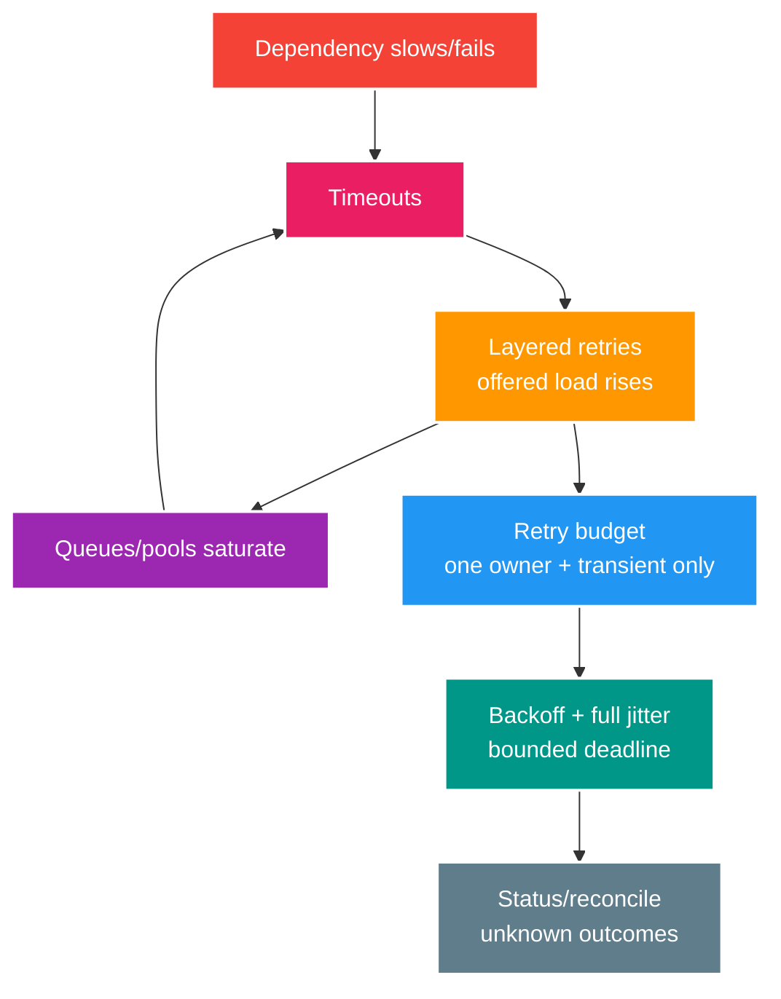

# Deep-dive: Retry Amplification, Idempotency và Recovery Budget

> Type: `DEEP_DIVE` 
> Domain: `resilience` 
> Target depth: `D4 — quantify retry amplification and preserve unknown-outcome invariants during recovery` 
> Teaching readiness: `TEACHABLE_DRAFT` 
> Status: `DRAFT` 
> Evidence status: `NOT RUN` 
> Prerequisites: [Retry/backoff core](../core/retry-backoff-jitter-and-retry-storms.md) 
> Related cases: `RES-02`; [question bank](../../question-bank/retry-backoff-jitter-and-retry-storms.md) 
> Owner: `Project learner; Codex teaches, learner writes back` 
> Updated: `2026-07-26`

## 1. Retry is extra offered load

Nếu gateway, service và client đều retry 3 attempt, một operation có thể tạo tối đa 27 call ở tầng dưới. Khi dependency mất capacity, retry tiêu phần capacity còn lại, tăng queue/tail/timeout rồi kích thêm retry. Mỗi boundary chỉ nên có một retry owner và budget toàn cục theo time, attempt hoặc token.

## 2. Classification and budget

Chỉ retry connection reset, timeout, 429 hoặc 503 khi contract và operation an toàn; validation, auth, not-found và constraint thường là permanent. Semantics idempotent của HTTP method chưa đủ nếu implementation/provider không giữ nó. Tôn trọng `Retry-After` có cap. Budget nằm trong caller deadline và gồm execution, sleep, cleanup; downstream chỉ nhận thời gian còn lại.

Exponential backoff cap delay; full jitter chọn ngẫu nhiên trong `[0, cap]`, còn equal/decorrelated jitter có trade-off khác. Fixed hoặc exponential chính xác làm herd thức cùng nhịp. Test random source/seed. Giới hạn concurrent retry riêng; token bucket dành một tỷ lệ retry để traffic gốc vẫn tiến được.

## 3. Unknown outcome

Nếu timeout sau server commit, retry cùng idempotency key phải trả stored result; key mới tạo duplicate. Query operation status trước retry/compensation. Idempotency record và domain effect phải atomic, có payload hash và retention. Với external provider cần key/status; nếu không có thì dùng reservation hoặc manual reconciliation. Cancellation không hoàn tác commit.

Read-only có thể retry nhưng vẫn tăng load/cost; stale fallback cần semantics rõ. Broker redelivery là retry với durable identity/inbox. Retry serialization/deadlock ở transaction boundary phải chạy lại toàn unit và không đặt external call bên trong.

## 4. Recovery wave

Khi dependency trở lại, client đang queue/retry cùng thức dậy. Dùng jitter, số half-open probe hữu hạn, admission và tăng concurrency dần; không mở mọi circuit đồng thời. Ưu tiên live/core traffic trước backlog và throttle redrive. Chỉ drain được nếu capacity lớn hơn arrival. Theo dõi attempt/original, success theo attempt, amplification ratio, dependency saturation, queue age và outcome cuối với label hữu hạn.

## 5. Pathologies

Các pathology gồm retry POST thiếu key tạo double gift; SDK retry ẩn cộng app retry; timeout ngắn hơn p99 bình thường tạo self-load; retry 401 refresh đệ quy; request vẫn queue sau circuit open; mọi pod cùng random seed; bulk redrive DLQ. Với từng lỗi, giới hạn attempt/concurrency, dùng idempotency/status và có repair/reconcile.

## 6. Evidence lab

Experiment nên cho proxy delay/drop response sau commit, trả 429 `Retry-After`, hạ rồi phục hồi dependency capacity và bật retry nhiều tầng. Đo traffic gốc/attempt/load/p99/queue, duplicate outcome và recovery. Pin version Resilience4j, client và Spring. Evidence vẫn `NOT RUN`.

### 6.1. Pathology A — retry ở ba tầng biến một lỗi nhỏ thành outage

Gateway gọi service A, A gọi provider B. Mỗi tầng cấu hình tối đa ba attempts. Khi B giảm capacity, một request ngoài có thể tạo tới `3 × 3 = 9` calls ở B; nếu client ngoài cũng retry ba lần thì thành 27. Queue và connection pool giữ attempts cũ, p99 vượt timeout, requests mới cũng timeout rồi sinh thêm attempts. Dependency recovery nhưng backlog/retry wave vẫn giữ nó quá tải.

Evidence không chỉ là error rate. Cần đếm original operations và total attempts theo hop, amplification ratio, pool pending, queue age, dependency saturation và success theo attempt. Fix chọn một retry owner gần boundary hiểu semantics, disable/giới hạn hidden SDK retries, đặt global deadline/attempt budget và retry token budget để original traffic vẫn tiến. Circuit half-open/admission hỗ trợ recovery nhưng không thay idempotency.

### 6.2. Pathology B — gift commit thành công, retry tạo gift thứ hai

Server commit rồi response bị proxy drop. Client nhận timeout nên không biết operation state. Retry với key mới là một intent mới theo server và có thể debit lần nữa. Cancellation ở client cũng không undo database commit. Đây là unknown outcome, không phải “request failed”.

Key phải ổn định cho cùng business intent và record key + payload hash + terminal outcome atomic với domain effect. Same key/same payload trả outcome trước; same key/different payload trả conflict. Nếu dependency external hỗ trợ idempotency/status, propagate stable identity; nếu không, dùng reservation/state machine và reconciliation. Retention của key phải vượt retry/offline window.

### 6.3. Pathology C — dependency hồi phục nhưng toàn fleet thức dậy cùng lúc

Fixed backoff hoặc cùng random seed khiến pods retry đồng pha. Cùng lúc circuit transitions half-open, queued jobs/DLQ redrive và user refresh tạo recovery surge. Capacity vừa phục hồi lại sụp. Full jitter phân tán wake-up nhưng không giới hạn tổng offered load; vẫn cần probe concurrency, retry tokens, redrive throttle và priority cho live traffic.

Recovery được coi là xong khi queue age/backlog về bình thường, amplification ratio hạ và final business outcomes được reconcile—not when health endpoint first turns green.

## 6.4. Budget calculation và version boundary

Với caller deadline 2 giây, không thể cấp mỗi attempt timeout 2 giây rồi sleep thêm. Budget gồm queue/acquire, execution, backoff và cleanup. Downstream nhận remaining time trừ safety margin. Ví dụ attempt đầu 500 ms, backoff tối đa 200 ms, attempt hai 500 ms và phần còn lại dành response/cleanup; con số thật phải dựa latency distribution và SLO.

Retry classification gắn contract: 429/503 có thể transient nhưng phải honor bounded `Retry-After`; timeout của non-idempotent write là unknown; auth/validation thường permanent; serialization/deadlock retry chạy lại toàn transaction, không giữ external side effect bên trong. Spring client, Resilience4j và provider SDK có order/config semantics theo version; activation phải inventory tất cả retry layers.

## 6.5. Experiment procedure và decision record

1. Chạy baseline với attempts=1, fixed offered load và known capacity.
2. Giảm dependency capacity/introduce delayed response; capture original vs attempts per hop.
3. Bật layered retries để chứng minh amplification, rồi cấu hình one owner + token/concurrency/deadline budget.
4. Drop response sau commit và assert duplicate count với new key versus stable key/status.
5. Khôi phục dependency, so fixed delay với jitter/half-open/redrive throttle.
6. Ghi workload, versions, config và residual unknown outcomes. Không claim policy tốt nếu generator hoặc dependency không được quan sát.

Senior answer nên phân loại failure và tính amplification. Architect thêm recovery capacity, priority/ownership và reconciliation. Expert phải nối deadline, hidden retries, unknown outcome, retry token economics và proof under recovery wave.

## 7. Learner write-back và self-check

> **Bài viết của tôi — `LEARNER TODO`:** calculate layered retry and gift unknown-outcome recovery.

1. **Question:** Vì sao ba tầng “retry 3 lần” có thể tạo 27 calls và bạn đo amplification thế nào? 
   **Đọc lại nếu bí:** mục 1 và 6.1. 
   **Một câu trả lời tốt phải có:** attempt multiplication, queue/pool feedback, original-vs-attempt metrics, one-owner và token/concurrency budget. 
   **My answer:** `LEARNER TODO`
2. **Question:** Xử lý timeout sau commit của một gift như thế nào? 
   **Đọc lại nếu bí:** mục 3 và 6.2. 
   **Một câu trả lời tốt phải có:** unknown outcome, stable business key/payload hash, atomic outcome, status/reconcile và retention. 
   **My answer:** `LEARNER TODO`
3. **Question:** Jitter giải quyết gì và không giải quyết gì trong recovery wave? 
   **Đọc lại nếu bí:** mục 4 và 6.3–6.5. 
   **Một câu trả lời tốt phải có:** synchronization versus total load, half-open/admission/redrive controls, success criteria và experiment evidence. 
   **My answer:** `LEARNER TODO`

## 8. References

- [AWS Builders' Library — Timeouts, retries and backoff with jitter](https://aws.amazon.com/builders-library/timeouts-retries-and-backoff-with-jitter/)

- [ ] Evidence remains `NOT RUN`.
