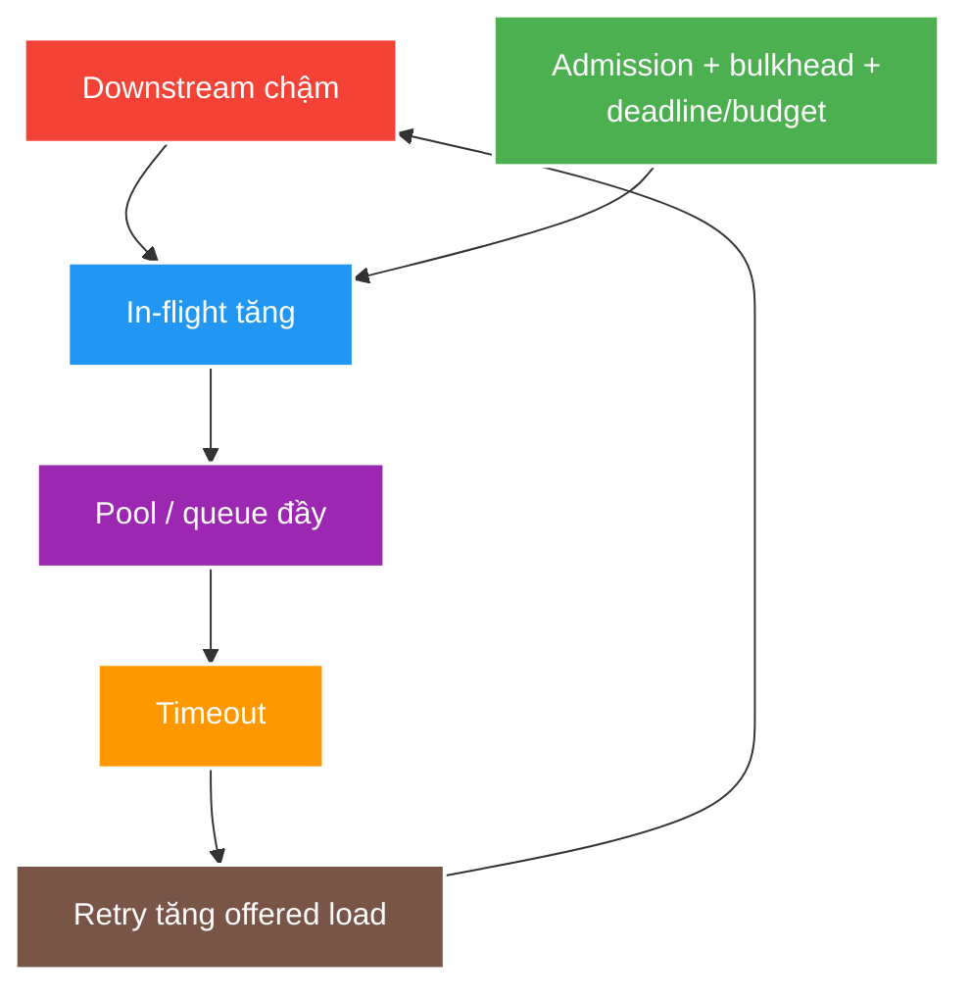

# Timeout, Retry, Circuit, Bulkhead and Overload Control

> Type: `DEEP_DIVE` 
> Domain: `distributed-systems` 
> Target depth: `D3 — thiết kế một resilience policy phối hợp và fault-test overload/recovery thay vì tuning từng annotation riêng lẻ` 
> Teaching readiness: `TEACHABLE_DRAFT` 
> Status: `DRAFT` 
> Evidence status: `NOT RUN` 
> Prerequisites: [Timeout core](../core/timeouts-cancellation-and-pool-exhaustion.md), [Retry core](../core/retry-backoff-jitter-and-retry-storms.md), [Circuit/bulkhead core](../core/circuit-breaker-bulkhead-and-load-shedding.md) 
> Related cases: [`RECONNECT-UC-01`](../../../../use-case-catalog.md#31-foundation-và-senior-cases), [`CHAT-UC-01`](../../../../use-case-catalog.md#31-foundation-và-senior-cases), [`RATE-UC-01`](../../../../use-case-catalog.md#31-foundation-và-senior-cases) 
> Owner: `Project learner; Codex assists` 
> Updated: `2026-07-26`

## 0. Mental model và cách học

Một policy phải đóng vòng capacity–deadline–failure–recovery. Vẽ traffic qua controls theo thứ tự thực, ghi breaker đếm logical call hay attempt và permit có giữ xuyên backoff/retry không. Fault test cả onset lẫn recovery; steady-state success không chứng minh system chống overload.

## 1. One policy, not independent knobs

Thứ tự hợp lý là admission/concurrency control trước resource khan hiếm, sau đó pool acquisition hữu hạn, timeout/cancellation cho từng attempt, retry nằm trong total deadline, circuit quan sát rồi fail-fast và cuối cùng fallback an toàn theo semantics. Thứ tự decorator cụ thể phụ thuộc breaker đếm từng attempt hay logical call và permit bulkhead có bao trùm retry không; phải chọn và test tường minh.

Budget phải nằm trong client deadline: thời gian queue cộng mỗi attempt, backoff và response margin. Maximum attempt nhân concurrency tạo offered load. Nếu base traffic đã sát capacity, chỉ một retry cũng có thể ngăn recovery. Breaker chỉ phản ứng sau khi có sample; admission/bulkhead chủ động bảo vệ capacity trước khi breaker mở.

## 2. Overload feedback loop

Chuỗi collapse là: downstream chậm → thời gian in-flight tăng → pool/queue đầy → request chờ rồi timeout → caller retry → offered load tăng → downstream chậm hơn. Queue vô hạn che rejection đầu tiên nhưng tăng memory và stale work. Khi dependency vừa hồi phục, retry đồng bộ hoặc quá nhiều half-open probe có thể lặp lại vòng này.

Mỗi control cắt một cạnh khác nhau trong vòng lỗi:

- Deadline/cancellation bounds wasted duration.
- Retry budget/jitter bounds extra arrivals and synchronization.
- Bulkhead limits blast radius/in-flight use.
- Circuit avoids calls likely to fail.
- Rate/concurrency limiter/load shedding keeps admitted work near capacity.

Worked example: base load 900 req/s trên capacity 1.000 req/s. Chỉ 20% request retry một lần đã có thể đẩy offered attempts lên 1.080 req/s, làm latency tăng và kích hoạt thêm timeout/retry. Breaker cần samples mới mở; admission/retry budget phải chặn loop trước đó.

## 3. Sizing and signals

Dùng service time và arrival rate đã đo, giới hạn connection/thread và target utilization; không copy pool size. Quan sát logical request rate, attempt rate, queue/acquire wait, capacity đang dùng, timeout theo phase, cancellation completion, breaker state, số reject/fallback, downstream latency/error và recovery time.

Minimum sample, window và threshold của breaker phải hiểu traffic. Endpoint ít tải có thể thiếu sample nên phản ứng chậm; global key tải cao có thể phản ứng quá mức vì một tenant/partition. Slow-call signal giúp mở trước hard failure nhưng phải khớp deadline/SLO thật.

## 4. Fault scenarios

| Injection | Correct response to prove |
| --- | --- |
| Added downstream latency | Queue bounded, deadlines honored, critical capacity remains |
| Connection refusal/DNS failure | Correct phase timeout/retry classification |
| Partial 5xx/429 | Retry respects semantics/`Retry-After`/budget |
| One tenant hot key | Isolation/fairness prevents global breaker/pool collapse |
| Dependency recovery | Bounded probes/ramp, no second surge |
| Caller cancellation | Downstream/task/permit/connection released |

Chưa có experiment nào được chạy; evidence vẫn `NOT RUN`.

## 5. Fallback correctness

Fallback phải được review như API/business behavior. Trả stale public metadata có max-age và auth scope có thể đúng; trả “gift success” khi ledger unavailable là fabricated success. Với chat, explicit rejection tốt hơn ACK rồi silent drop vì caller có thể quyết định retry/display failure.

| Workload | Possible fallback | Forbidden shortcut |
| --- | --- | --- |
| Public stream metadata | Bounded-age cached snapshot | Cross-tenant/private stale data |
| Optional recommendation | Empty/omit enrichment | Claim personalized result is fresh |
| Chat send | Explicit reject/queue contract | Return success then silently drop |
| Authorization/ban | Fail closed or explicit policy | Allow because cache/dependency down |
| Gift/payment | Pending/idempotent recovery | Fabricated success/double charge |

## 6. Trade-off matrix

| Strategy | Availability | Correctness/capacity consequence |
| --- | --- | --- |
| Aggressive retry | May hide transient fault | Amplification/duplicates |
| Aggressive fail-fast | Protects capacity | More visible errors |
| Large pools/queues | Absorb short burst | Longer tail/memory/downstream pressure |
| Strict bulkheads | Strong isolation | Stranded capacity/rejections |
| Stale fallback | Read availability | Freshness/security policy required |

## 7. Interview outline, recap và learner write-back

Vẽ feedback loop và control phá từng edge, tính deadline/attempt/capacity, giải decorator semantics, rồi nêu fault matrix + recovery ramp + safe fallback. Metrics tách logical traffic khỏi attempts.

- Controls không phải knobs độc lập.
- Large queue/pool có thể dời failure thành tail/memory pressure.
- Breaker granularity/sample phải hợp traffic.
- Recovery là một load event cần giới hạn.

`LEARNER TODO — tạo policy table cho RECONNECT-UC-01 gồm order, budget, metrics và fallback.`

## 8. Guided self-check

1. **Question:** Control phá từng edge nào? **Đọc lại nếu bí:** diagram, mục 1–3. **Rubric:** deadline/cancel duration, budget/jitter arrivals, bulkhead blast radius, breaker unhealthy calls, shedding admission. **My answer:** `LEARNER TODO`
2. **Question:** Breaker đếm gì? **Đọc lại nếu bí:** mục 1, 3. **Rubric:** explicit choice and consequence for retry attempts/logical SLO/window traffic. **My answer:** `LEARNER TODO`
3. **Question:** Test recovery thế nào? **Đọc lại nếu bí:** mục 3–4. **Rubric:** restore dependency gradually, synchronized clients, bounded probes/ramp, no queue/attempt second spike. **My answer:** `LEARNER TODO`

## 9. References

- [AWS Builders' Library — Timeouts, retries and backoff](https://aws.amazon.com/builders-library/timeouts-retries-and-backoff-with-jitter/)
- [Resilience4j documentation](https://resilience4j.readme.io/docs)

## 10. Teach-back checklist

- [ ] Tôi phối hợp controls theo one deadline/capacity model.
- [ ] Tôi đo logical calls và attempts riêng.
- [ ] Tôi test overload, cancellation và recovery ramp.
- [ ] Evidence vẫn `NOT RUN`.
