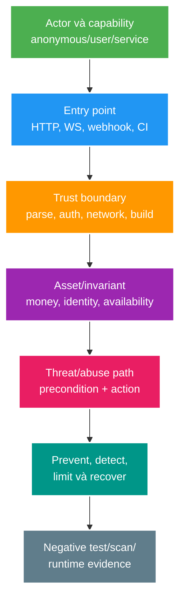

# Bảo mật ứng dụng, chống lạm dụng và chuỗi cung ứng phần mềm

> Type: `CORE` 
> Domain: `security` 
> Target depth: `D3 — threat-model API/business flows, thiết kế abuse controls và quản trị dependency/build provenance bằng evidence` 
> Teaching readiness: `TEACHABLE_DRAFT` 
> Status: `DRAFT` 
> Evidence status: `NOT RUN` 
> Prerequisites: [authorization boundaries](request-and-method-authorization.md), validation/HTTP semantics và dependency lifecycle cơ bản 
> Related cases: roadmap owner `SEC-04`/cross-cutting; [question bank](../../question-bank/application-security-abuse-and-supply-chain.md) 
> Owner: `Project learner; Codex teaches, learner writes back` 
> Updated: `2026-07-26`

## 0. Cách dùng và vấn đề

Security không kết thúc ở JWT. Một request đã authenticated vẫn có thể đổi object ID, bind field nội bộ, chèn SQL/template, khiến server fetch internal URL, tạo billion-row query hoặc lạm dụng gift/chat/recovery flow ở quy mô lớn. Build cũng là trust boundary: dependency/plugin/action/image bị compromise có thể chạy với CI credentials trước application runtime.

Bài này dạy cách chuyển “OWASP list” thành threat model, control và negative evidence. Nó không tuyên bố project đã scan sạch hoặc production-ready; scans/tests đều `NOT RUN`.

## 1. Mục tiêu học và từ vựng

Bạn sẽ:

1. Threat-model actor, asset, entry point, trust boundary và abuse case.
2. Phân biệt injection, unsafe binding/deserialization, SSRF, resource exhaustion và security misconfiguration.
3. Thiết kế authentication abuse controls: enumeration, brute force, credential stuffing, recovery/MFA boundaries.
4. Quản trị dependency, plugin, container, CI secret, SBOM, provenance và patching.
5. Thiết kế security tests/telemetry không lộ dữ liệu nhạy cảm.

**Threat** là potential cause of harm; **vulnerability** là weakness; **risk** kết hợp likelihood/impact/context. **Abuse case** dùng valid feature theo cách gây hại. **Attack surface** là reachable entry points/capabilities. **Mass assignment** bind attacker-controlled fields vào model có privileged properties. **SSRF** khiến server gửi request tới destination attacker ảnh hưởng. **SBOM** kê components; nó không chứng minh an toàn. **Provenance/attestation** mô tả artifact được build từ đâu/như thế nào; signature không chứng minh source không có vulnerability.

## 2. Mô hình tư duy cốt lõi

Câu cần nhớ: **security control phải gắn asset/invariant và failure recovery; scanner chỉ là một nguồn evidence, không phải threat model**.

## 3. Rủi ro ở tầng ứng dụng và API

Broken object/function authorization được xử lý tại resource/action gates, không bằng ID khó đoán. Mass assignment dùng explicit request DTO/allowlist mapping; không bind entity hoặc role/owner/status fields. Injection phòng bằng parameterized query/safe APIs, output encoding theo context và không xây interpreter strings từ input. Validation chỉ kiểm format/range; authorization và invariant vẫn riêng.

Unsafe deserialization xảy ra khi input chọn arbitrary type/class hoặc gadget behavior; dùng fixed DTO/schema, type allowlist, size/depth limits và cập nhật libraries. SSRF cần destination allowlist, scheme/port policy, DNS resolution/IP range validation sau redirect, egress control, response/time/size limits; URL regex đơn giản không đủ vì rebinding/redirect/IPv6/metadata endpoints.

Resource exhaustion gồm request body lớn, expensive regex, unbounded pagination/sort/filter, decompression bomb, WebSocket connections/messages, login/hash CPU, fan-out và high-cardinality keys/metrics. Controls phải nhiều tầng: ingress limits, app validation, concurrency/rate budgets, timeouts, queue bounds, DB query/index/cost và load shedding. Rate limit không thay authorization/idempotency.

Security misconfiguration gồm default credentials, debug endpoints, wildcard CORS, verbose errors, exposed actuator/Swagger, permissive matcher, weak TLS/headers và production logging secrets. Config-as-code, profiles, startup assertions và environment-specific negative tests giảm drift.

## 4. Lạm dụng đăng nhập và lạm dụng nghiệp vụ

Login response/timing không nên tiết lộ account tồn tại; vẫn cần usability/recovery. Password lưu adaptive salted hash với work factor đo trên hardware, có rehash-on-login migration. Brute force là nhiều attempts một account; password spraying là ít passwords nhiều accounts; credential stuffing dùng leaked pairs. Controls phối hợp IP/device/account risk, rate limits, progressive delay/challenge, breach-password check, alerts và safe lockout để tránh attacker khóa nạn nhân.

Recovery thường yếu hơn login: reset token one-time, high entropy, short lifetime, bind user/action, invalidate/review sessions, notify user và chống enumeration. MFA giảm password compromise nhưng có phishing/SIM-swap/push-fatigue/recovery risks; step-up áp cho sensitive action. Không tự xây TOTP/WebAuthn protocol khi mature libraries/IdP có thể dùng.

Business abuse: bot tạo views, gift replay, spam/chat harassment, scrape public data, reserve resources không trả, report bombing. Request hợp lệ về schema/auth vẫn harmful. Cần per-flow invariant, velocity/relationship/device signals, idempotency, quotas, moderation, audit/appeal và human/automated recovery.

## 5. Bảo mật chuỗi cung ứng phần mềm

Threat surface gồm Maven dependencies/transitives, build plugins, wrapper/distribution, base images, GitHub/CI actions, package repositories, developer credentials và artifact registry. Pin/lock versions/digests nơi phù hợp; kiểm checksum/signature/provenance từ trusted channel; least-privilege CI token, protected branches/reviews và isolated build runners.

SCA/CVE scan cần reachability/context/patch SLA. CVSS cao trong unused path có priority khác exploited reachable flaw; “không có CVE” không nghĩa package safe. SBOM versioned theo artifact giúp inventory/incident lookup. Secret scanning, SAST, dependency scan, container/IaC scan và DAST bổ sung nhau; mỗi tool có false positives/negatives và suppressions có owner/expiry.

Reproducible/hermetic build giảm hidden inputs; signed artifact/provenance giúp deployment verify origin. Runtime image tối thiểu/non-root/read-only filesystem/capability restrictions giảm blast radius nhưng không sửa application flaw. Patch process cần test/rollback và emergency path; bỏ upgrade mãi vì sợ regression cũng là risk.

## 6. Ví dụ phân tích từng bước

### 6.1. Mass assignment

Update profile request được bind trực tiếp `User` entity; attacker gửi `role=ADMIN`. Field không có trên UI vẫn được binder set. Fix explicit `UpdateProfileRequest`, mapping allowed fields, service ownership/current-state rule và negative test malicious extra property. “Frontend không gửi” không phải control.

### 6.2. SSRF thumbnail URL

API nhận URL, backend fetch để tạo preview. Attacker trỏ `http://169.254.169.254/...` hoặc hostname resolve internal IP/redirect. Fix prefer upload/object-storage workflow; nếu fetch bắt buộc, egress proxy/allowlist, DNS/IP check per hop, no credentials, body/time limits và audit. Test loopback/private/link-local/redirect/IPv6/slow response.

### 6.3. Login defense thành DoS

Global account lock sau 5 failures cho phép attacker khóa hàng nghìn users. Better multi-dimensional throttling/risk, progressive friction, notifications and recovery. Password hashing concurrency cũng bounded để bot không exhaust CPU.

### 6.4. Compromised build plugin

Unpinned plugin/action update chạy code trong CI và exfiltrate signing/deploy secret. Dependency scan runtime libraries có thể không thấy. Pin trusted version/digest, minimize workflow permissions, isolate release signing, provenance/attestation và audit changes. Rotate credentials/artifacts if compromise.

## 7. Invariant, chẩn đoán và đánh đổi

- Mọi untrusted input có schema, size/depth/cardinality và destination/resource policy.
- Authentication không cấp object/function/business permission ngầm.
- Sensitive flow có abuse budget, idempotency và recovery.
- CI/build component không có quyền ngoài job purpose; release artifact trace được source/build.
- Security finding có owner, severity context, SLA, suppression reason/expiry và verification.

False positive control quá mạnh có thể khóa user/revenue; fail-open tăng abuse; fail-closed tăng outage. Adaptive control tăng detection nhưng privacy/explainability/operability cost. Managed security service giảm maintenance nhưng thêm data/vendor dependency. Decision dựa asset/impact/evidence, không chọn “maximum security” trừu tượng.

## 8. Áp dụng vào dự án và phỏng vấn

Khi topic active, threat-model login/refresh/webhook/chat/gift/viewer flows; inventory endpoints/build dependencies; chạy negative tests và approved scans; triage bằng reachable code/config và lưu report thật. Không thêm production attack tooling hoặc claim scan pass trong docs preview.

**30 giây:** “Tôi bắt đầu từ actor, entry point, trust boundary và asset/invariant, rồi viết abuse path. Controls gồm prevent/detect/limit/recover và negative evidence. Với API tôi ưu tiên BOLA/BFLA, binding/injection/SSRF/resource limits; với supply chain tôi quản lý dependencies/plugins/images, SBOM, provenance và CI least privilege. Scanner không thay threat model.”

## 8.1. Hai ví dụ phân tích và một phản ví dụ

**Worked example tối thiểu — login abuse:** rate limit kết hợp IP/account/device/global, normalize/bound key cardinality, không leak account existence và giữ emergency local cap khi Redis lỗi. Authentication failure không được log credential/token.

**Worked example gần project — malicious dependency/image:** pin/lock dependency và base image digest, generate SBOM, scan/sign/provenance, least-privilege CI identity và controlled patch rollout. Scanner finding được triage theo reachability/exposure nhưng không bị tắt để pipeline xanh.

**Phản ví dụ:** thêm CAPTCHA/WAF/scanner rồi coi application secure. Business abuse, authorization, secret lifecycle, deserialization/resource exhaustion và compromised build identity vẫn cần threat model/negative test/incident recovery.

## 9. Tóm tắt, bài tập và tự kiểm tra

- Valid request vẫn có thể là abuse.
- Explicit DTO/query/policy giảm BOLA/mass assignment.
- SSRF cần network/destination policy, không chỉ URL validation.
- Availability là security invariant; bound mọi expensive resource.
- Recovery/MFA có threat model riêng.
- Supply chain bao gồm build-time code và CI credentials.
- SBOM/scans/provenance là evidence bổ sung, không chứng minh tuyệt đối.

> **Bài viết của tôi — `LEARNER TODO`:** threat-model một flow livestream với actor, asset, abuse, controls, recovery và evidence.

1. **Question:** Validation khác authorization và abuse control thế nào? 
   **Đọc lại nếu bí:** mục 2–4. 
   **Một câu trả lời tốt phải có:** format/range, action/resource permission, valid-but-harmful behavior và layered controls. 
   **My answer:** `LEARNER TODO`
2. **Question:** SSRF defense cần những lớp nào? 
   **Đọc lại nếu bí:** mục 3 và 6.2. 
   **Một câu trả lời tốt phải có:** avoid fetch, allowlist/scheme, DNS/IP/redirect/egress, limits, credentials và tests. 
   **My answer:** `LEARNER TODO`
3. **Question:** Chống credential stuffing mà không tạo lockout DoS thế nào? 
   **Đọc lại nếu bí:** mục 4 và 6.3. 
   **Một câu trả lời tốt phải có:** multi-dimensional signals, progressive controls, hashing budget, enumeration, alert/recovery. 
   **My answer:** `LEARNER TODO`
4. **Question:** SBOM và signed artifact chứng minh/không chứng minh gì? 
   **Đọc lại nếu bí:** mục 5. 
   **Một câu trả lời tốt phải có:** inventory, provenance/integrity, vulnerability/reachability limits, build trust và patch process. 
   **My answer:** `LEARNER TODO`

## 10. Nguồn chính thức và trình bày lại

- [OWASP API Security Top 10 — 2023](https://owasp.org/API-Security/editions/2023/en/0x03-introduction/)
- [OWASP ASVS](https://owasp.org/www-project-application-security-verification-standard/)
- [NIST SP 800-218 — Secure Software Development Framework](https://csrc.nist.gov/pubs/sp/800/218/final)

- [ ] Tôi threat-model thay vì đọc thuộc OWASP list.
- [ ] Tôi thiết kế abuse/resource recovery.
- [ ] Tôi phân biệt SBOM, scan, signature và provenance.
- [ ] Tôi biết security evidence vẫn `NOT RUN`.
