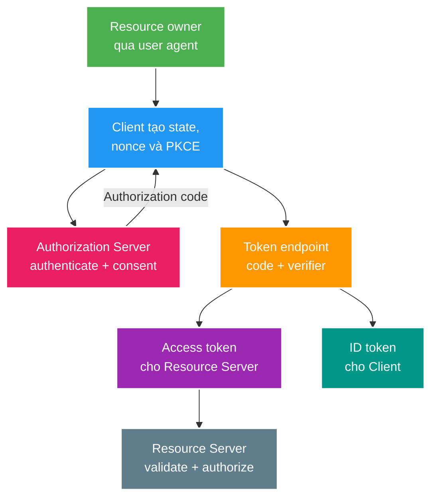

# OAuth2, OpenID Connect, resource server và vòng đời token

> Type: `CORE` 
> Domain: `security` 
> Target depth: `D3 — phân biệt delegation/identity, thiết kế Authorization Code + PKCE và bảo vệ resource server/token lifecycle bằng threat model` 
> Teaching readiness: `TEACHABLE_DRAFT` 
> Status: `DRAFT` 
> Evidence status: `NOT RUN` 
> Prerequisites: [token/session semantics](token-purpose-and-session-semantics.md), [authorization boundaries](request-and-method-authorization.md) 
> Related cases: roadmap owner `SEC-04`; [question bank](../../question-bank/oauth2-oidc-resource-server-and-token-lifecycle.md) 
> Owner: `Project learner; Codex teaches, learner writes back` 
> Version boundary: OAuth 2.0 Security BCP RFC 9700 và current Spring Security reference; exact IdP/framework behavior phải re-check khi `SEC-04` active 
> Updated: `2026-07-26`

## 0. Cách dùng và giới hạn

Đọc bài này sau custom JWT/session core để hiểu khi nào một hệ thống nên dùng Authorization Server/Identity Provider thay vì tự phát triển protocol. OAuth 2.x là framework **delegated authorization**; OpenID Connect (OIDC) thêm authentication/identity layer. Bài giảng không yêu cầu project tự xây IdP và không coi việc biết keyword OAuth là implementation evidence.

## 1. Vì sao topic này tồn tại?

Khi có web app, mobile app, backend APIs, third-party integration và nhiều services, password/JWT tự chế không còn đủ contract: client nào được xin quyền gì, user consent thế nào, redirect URI nào hợp lệ, access token dành cho resource nào, keys rotate ra sao và logout/revocation có biên giới nào. OAuth chia vai trò để delegation rõ; OIDC cho client biết user đã được authentication bởi issuer nào.

Nhầm lẫn phổ biến: dùng ID token gọi API; coi access token là proof login cho client; gửi client secret trong SPA; bỏ state/nonce/PKCE; resource server chỉ verify signature mà không kiểm issuer/audience/scope; coi logout ở client là revoke mọi token.

## 2. Mục tiêu học và từ vựng

Sau bài này, bạn có thể:

1. Phân biệt resource owner, client, authorization server, resource server và user agent.
2. Phân biệt access token, refresh token, authorization code và ID token theo audience/purpose.
3. Kể Authorization Code + PKCE flow và threat được từng parameter bảo vệ.
4. Thiết kế resource server validation, scope/role mapping và key rotation.
5. Giải thích revocation/logout/session/token lifetime không đồng nhất.

**Client** là application xin quyền, có thể public (không giữ secret như SPA/native) hoặc confidential (backend giữ secret). **Authorization endpoint** tương tác user; **token endpoint** đổi code/refresh credential thành tokens. **Redirect URI** là callback đã đăng ký chính xác. **Scope** là delegated permission vocabulary; role là local authorization concept và không tự tương đương scope. **PKCE** bind authorization request với token exchange qua verifier/challenge. **State** bind response với client transaction/chống CSRF; **nonce** bind OIDC ID token với authentication request và giảm replay. **JWKS** công bố public verification keys; `kid` chỉ key candidate, không phải trust root.

## 3. Mô hình tư duy cốt lõi

ID token có audience là client và mô tả authentication event/subject. Access token có audience là resource server và mang/đại diện delegated authority. Câu cần nhớ: **token chỉ được dùng bởi audience và protocol boundary đã phát hành nó**.

## 4. Authorization Code + PKCE từng bước

Client sinh high-entropy `state`, OIDC `nonce`, PKCE `code_verifier` và derived `code_challenge`; lưu transaction state ngắn hạn. Nó redirect user tới issuer với exact registered redirect URI, client ID, scopes, state, nonce và challenge. Authorization Server authenticate user, consent/policy rồi redirect code + state. Client verify state trước đổi code. Token endpoint verify redirect/client authentication theo client type và PKCE verifier; code one-time/short-lived.

PKCE giảm authorization-code interception: kẻ chỉ lấy code không có verifier. Nó không thay TLS, exact redirect matching, state hay secure client storage. Public client không có secret đáng tin; nhúng secret vào SPA/mobile chỉ biến secret thành public string. Confidential backend dùng client authentication phù hợp và rotation.

OIDC client validate ID token signature, exact issuer, audience/authorized party, expiry/issued-at, nonce và flow-specific hashes khi áp dụng. Nó không gửi ID token sang unrelated API. UserInfo endpoint/access token usage theo provider contract.

## 5. Resource server kiểm tra và cấp quyền thế nào

Resource server nhận bearer access token. Với JWT, nó pin trusted issuer/config/JWKS source, allow-list algorithms, chọn key an toàn, validate signature, `iss`, `aud`, time và token-type/profile claims. JWKS cache/refresh phải xử lý unknown `kid` nhưng không fetch arbitrary URL từ token header. Opaque token dùng introspection tới trusted AS, đổi lại network/availability/cache/revocation trade-off.

Sau authentication, map scopes/claims sang authorities có namespace rõ; không tin arbitrary role claim từ issuer/client chưa được governance. Scope chỉ cho phép class action; resource ownership/tenant/current state vẫn kiểm tra tại service. Token exchange/service-to-service identity cần audience attenuation, không forward end-user token qua mọi service như universal credential.

## 6. Vòng đời token, logout và xoay khóa

Access token ngắn hạn giảm exposure/revocation window. Refresh token dành cho authorized client, lưu an toàn, rotation/reuse detection đặc biệt quan trọng với public clients. Revocation endpoint có semantics riêng và không rút lại access JWT đã phát nếu resource server không introspect/denylist/check epoch. Client logout xóa local session không đồng nghĩa IdP session logout, refresh revocation hay downstream access-token invalidation.

Signing-key rotation: publish new verification key trước, signer chuyển sang key mới, giữ old key đủ token lifetime/clock skew rồi retire. Resource server phải refresh JWKS bounded khi gặp new `kid`, chống refresh storm và giữ last-known-good phù hợp availability policy. Compromise rotation khác planned rotation: revoke/shorten sessions/tokens và incident response có thể cần.

## 7. Ví dụ phân tích từng bước

### 7.1. SPA dùng Authorization Code + PKCE

SPA không giữ client secret. Nó tạo state/nonce/verifier, redirect, verify state, đổi code bằng verifier, giữ token theo threat model. Redirect URI exact; wildcard/open redirect có thể làm code/token leak. Backend-for-Frontend là alternative để token ở server và dùng secure cookie/CSRF controls, đổi lại thêm component/state.

### 7.2. ID token gọi livestream API

ID token có `aud=web-client`, resource API mong `aud=livestream-api`. Nếu API chỉ verify issuer/signature, token bị dùng sai boundary. Correct resource server reject audience/purpose trước principal. Access token đúng audience vẫn phải scope + owner policy.

### 7.3. Xoay khóa gây outage

AS ký K2 nhưng API JWKS cache chỉ K1 và refresh bị lỗi; mọi token mới 401. Rehearsal phải publish K2 trước signer switch, kiểm resource caches/egress, bounded refresh và overlap. Không “fix” bằng chấp nhận token không verify hoặc thử key từ untrusted header URL.

### 7.4. Phản ví dụ implicit/password flow

Legacy flows đưa token qua front channel hoặc thu password tại client, tăng exposure và phá trust separation. Security BCP hiện ưu tiên Authorization Code + PKCE và loại bỏ các pattern rủi ro; exact migration phải theo client type/provider.

## 8. Invariant và các kiểu hỏng

- Redirect URI exact allowlist; state/nonce/PKCE được verify, không chỉ gửi.
- ID token chỉ cho OIDC client; access token chỉ cho intended resource audience.
- Resource server pin issuer/algorithm/key source và áp scope + resource authorization.
- Public client không dựa vào embedded secret.
- Logout/revoke/session/access-token semantics được mô tả riêng.
- Key rotation được rehearsal với mixed old/new tokens và dependency outage.

Failure chains: state transaction mất/mismatch → login CSRF; permissive redirect → code exfiltration; audience omitted → token substitution; JWKS refresh per unknown `kid` → attacker gây outbound/CPU storm; scope-to-role mapping quá rộng → privilege escalation; refresh token reuse không phát hiện → persistent account takeover.

## 9. Đánh đổi kiến trúc và áp dụng vào dự án

Managed IdP giảm protocol/security maintenance nhưng tăng vendor/dependency/cost/data-residency considerations. Self-hosted authorization server tăng control nhưng đòi vận hành keys, clients, consent, MFA, recovery, audit và incident response. Custom session-backed JWT project có thể phù hợp lab/single first-party app nhưng không nên tiến hóa thành IdP chỉ để cover keyword.

Khi `SEC-04` active, dựng threat model với mock/real local IdP được phép, capture issuer metadata/version, test state/nonce/PKCE, wrong audience/issuer/scope, JWKS rotation/outage và logout boundaries. Evidence hiện `NOT RUN`.

## 10. Góc nhìn phỏng vấn

**30 giây:** “OAuth là delegation; OIDC thêm identity. Authorization Code + PKCE bind code với client instance; state chống request mix-up/CSRF, nonce bind ID token. ID token dành cho client, access token cho resource server. API pin issuer/JWKS, kiểm audience/time/scope rồi vẫn kiểm ownership. Logout và revocation không tự thu hồi mọi JWT.”

## 11. Tóm tắt, bài tập và tự kiểm tra

- Vai trò/audience quan trọng hơn hình thức JWT.
- Code+PKCE là baseline cho public clients; secret nhúng không bí mật.
- State, nonce và PKCE xử lý threats khác nhau.
- Resource server validate cryptographic + semantic + business authorization.
- JWKS rotation là distributed rollout.
- Refresh, IdP session, client session và access token có lifecycle khác nhau.

> **Bài viết của tôi — `LEARNER TODO`:** kể code+PKCE flow, phân biệt bốn credentials và nêu một key-rotation failure.

1. **Question:** OAuth2 khác OIDC ở đâu? 
   **Đọc lại nếu bí:** mục 1–3. 
   **Một câu trả lời tốt phải có:** delegation, identity/authentication layer, actors, access vs ID token và audience. 
   **My answer:** `LEARNER TODO`
2. **Question:** State, nonce và PKCE bảo vệ gì? 
   **Đọc lại nếu bí:** mục 2 và 4. 
   **Một câu trả lời tốt phải có:** transaction/CSRF, token/request replay binding, code interception và giới hạn từng control. 
   **My answer:** `LEARNER TODO`
3. **Question:** Resource server JWT validation gồm gì? 
   **Đọc lại nếu bí:** mục 5. 
   **Một câu trả lời tốt phải có:** issuer/key/algorithm, audience/time/type, scope mapping, ownership và JWKS failure policy. 
   **My answer:** `LEARNER TODO`
4. **Question:** Logout có revoke access token không? 
   **Đọc lại nếu bí:** mục 6. 
   **Một câu trả lời tốt phải có:** client/IdP session, refresh revocation, JWT lifetime/introspection/denylist và explicit SLO. 
   **My answer:** `LEARNER TODO`

## 12. Nguồn chính thức và trình bày lại

- [RFC 9700 — OAuth 2.0 Security Best Current Practice](https://www.rfc-editor.org/rfc/rfc9700)
- [RFC 7636 — PKCE](https://www.rfc-editor.org/rfc/rfc7636)
- [OpenID Connect Core 1.0](https://openid.net/specs/openid-connect-core-1_0.html)
- [Spring Security — OAuth2](https://docs.spring.io/spring-security/reference/servlet/oauth2/index.html)

- [ ] Tôi kể được flow và threat controls.
- [ ] Tôi không dùng ID/access token lẫn audience.
- [ ] Tôi thiết kế resource validation và rotation.
- [ ] Tôi biết lab/evidence vẫn `NOT RUN`.
