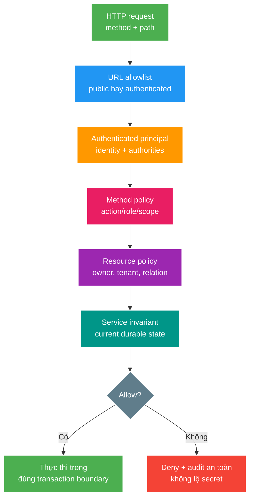

# Ranh giới phân quyền ở request và method

> Type: `CORE` 
> Domain: `security` 
> Target depth: `D3 — thiết kế deny-by-default URL/method/resource authorization và chứng minh bằng negative matrix` 
> Teaching readiness: `TEACHABLE_DRAFT` 
> Status: `DRAFT` 
> Evidence status: `NOT RUN` 
> Prerequisites: [token/session semantics](token-purpose-and-session-semantics.md) và [current security flow](../../../../../security/authorization-flow.md) 
> Related cases: roadmap owner `SEC-06`; [question bank](../../question-bank/request-and-method-authorization-boundaries.md) 
> Owner: `Project learner; Codex teaches, learner writes back` 
> Version boundary: Spring Boot 3.4/Spring Security baseline của project; matcher/method behavior phải re-check khi framework nâng version 
> Updated: `2026-07-26`

## 0. Cách dùng và vấn đề trung tâm

Authentication trả lời “caller là ai”; authorization trả lời “principal này có được thực hiện action này trên resource này trong current state không?”. Đọc bài từ request boundary tới method/resource invariant, rồi dùng worked examples lập ma trận anonymous/user/owner/moderator/admin. Đây là preview cho `SEC-06`, không thay matcher/code và tests vẫn `NOT RUN`.

Một matcher rộng như `/api/auth/** permitAll` có thể vô tình public `/me` hoặc `/logout-all`. Ngược lại, URL rule `authenticated()` chỉ chứng minh có principal, không chứng minh caller sở hữu `streamId`. Chỉ `@PreAuthorize("hasRole('USER')")` vẫn có Broken Object Level Authorization nếu user A sửa resource của user B. Security cần nhiều gates có trách nhiệm khác nhau và deny by default.

## 1. Mục tiêu học và từ vựng

Sau bài này, bạn có thể:

1. Phân biệt request/URL, method, resource/ownership và service invariant authorization.
2. Thiết kế public allowlist cụ thể, rule ordering và safe fallback.
3. Phân biệt RBAC, ownership/relationship và ABAC/policy state.
4. Giải thích 401/403/404 disclosure trade-off và TOCTOU giữa check/use.
5. Test negative authorization matrix cho HTTP, async/realtime và internal callers.

**RBAC** cấp quyền theo role. **Ownership** kiểm tra quan hệ principal–resource. **ABAC** dùng thuộc tính principal/resource/context như tenant, status, time, risk. **BOLA/IDOR** là caller truy cập object không thuộc quyền bằng cách đổi identifier. **BFLA** là gọi function/endpoint ngoài quyền role. **Deny by default** nghĩa chỉ explicit public/allowed paths được qua. **Confused deputy** là component có quyền cao bị caller lợi dụng để làm thay. **TOCTOU** là state đổi giữa time-of-check và time-of-use.

## 2. Mô hình tư duy cốt lõi

URL layer coarse-grained chặn attack surface sớm. Method/resource layer bảo vệ use case kể cả khi được gọi từ controller khác. Service invariant kiểm tra state hiện tại trong transaction, ví dụ stream còn thuộc owner và chưa ended/banned. Câu cần nhớ: **role không thay ownership; ownership không thay business invariant; URL matcher không thay method policy**.

## 3. Phân quyền ở tầng request

Security filter chain phải explicit public allowlist: login/register/refresh và public read endpoints theo contract, không dùng prefix rộng chỉ vì cùng controller. Rule ordering quan trọng vì matcher đầu phù hợp có thể quyết định. Cuối chain dùng authenticated/deny rule rõ; dev/test/Swagger endpoints phải profile/policy riêng, không trôi vào production.

HTTP method thuộc authorization identity: `GET /streams/{id}` có thể public nhưng `DELETE` cùng path không. CORS không phải authorization; nó hạn chế browser origins, không chặn curl/server attacker. CSRF liên quan browser tự gửi ambient credentials (đặc biệt cookie), không được tắt máy móc chỉ vì API có JSON.

Authentication missing/invalid trả 401 và challenge phù hợp; principal hợp lệ nhưng policy deny trả 403. Với resource existence nhạy cảm, API có thể trả 404 để giảm enumeration, nhưng internal audit vẫn phân biệt và contract phải nhất quán.

## 4. Phân quyền ở method, ownership và invariant của service

Method security (`@PreAuthorize` hoặc centralized authorization manager) diễn tả action/role/scope gần use case. Không dựa vào controller-only checks nếu service được scheduler/message listener/internal method gọi. Tuy nhiên Spring proxy-based method security có self-invocation/proxy boundary; exact behavior phải hiểu và test ở public bean boundary, không chỉ unit gọi method trực tiếp.

Ownership không nên “load rồi compare username” rải khắp controllers. Repository query có thể scope ngay `findByIdAndOwnerId`, hoặc policy component lấy principal/resource/context. Với mutation có concurrency, check và write phải cùng transaction/conditional statement; nếu check owner/status rồi state đổi trước update, TOCTOU có thể phá invariant.

Role hierarchy chỉ mô tả quyền role, không tự cấp mọi object. Admin override phải explicit, audited và tránh accidental global bypass. Multi-tenant identity phải bao gồm tenant scope; global object ID unique không thay tenant authorization.

## 5. Ví dụ phân tích từng bước

### 5.1. `/api/auth/** permitAll`

Register/login/refresh cần public, nhưng `/api/auth/me` và `/logout-all` cần principal. Prefix matcher public làm anonymous request tới sensitive function. Fix là allowlist exact method+path rồi fallback authenticated/deny. Negative matrix phải gọi mọi auth route anonymous; không chỉ test happy login.

### 5.2. Update livestream title

Authenticated user A gọi `PATCH /streams/streamB`. URL `authenticated()` pass, role USER pass. Service phải query/update với `streamId` + owner A hoặc policy cho moderator/admin. Nếu không match, deny 403/404 theo contract. Mutation nên đảm bảo current state cho phép edit trong cùng atomic boundary, tránh owner/status đổi giữa check và write.

### 5.3. Message consumer confused deputy

HTTP endpoint kiểm quyền rồi publish command chỉ chứa `streamId`; consumer chạy service account quyền cao và không mang actor/policy proof. Attacker hoặc bug có thể inject/replay command và consumer thực thi. Async message cần actor/tenant/action identity, trusted producer boundary, schema validation và consumer-side authorization/business invariant; “đã auth ở edge” không đủ khi trust boundary đổi.

### 5.4. Phản ví dụ client-hidden button

UI ẩn nút DELETE với non-admin nhưng endpoint chỉ kiểm authenticated. Attacker gọi trực tiếp. Client UX không phải enforcement; server negative test là bằng chứng.

## 6. Invariant, các kiểu hỏng và đánh đổi

- Public routes là allowlist nhỏ có owner; route mới không tự public theo prefix.
- Mọi mutation xác minh action + resource relationship + current state tại server.
- Caller-supplied `userId`, role, owner hoặc tenant không được tin thay principal/context.
- Internal/async/realtime entry points có policy tương đương trust boundary của chúng.
- Denial không log token/secret/PII quá mức; audit có actor/action/resource/result/correlation.

**Matcher shadowing:** broad rule đứng trước → sensitive route permit → anonymous success. Chứng minh bằng route inventory + MockMvc negative matrix. **BOLA:** authenticated ID swapping → repository load không owner scope → cross-user data. Chứng minh owner/non-owner pairs. **TOCTOU:** check pass → concurrent transfer/status change → write vẫn chạy. Chứng minh synchronized transactions; xử lý conditional update/locking/version theo invariant. **Policy drift:** URL docs, annotation và service check khác nhau → behavior tùy entry path. Dùng canonical matrix và tests ở từng boundary.

Central policy component tăng nhất quán/audit nhưng có coupling/data-loading cost. Query-scoped authorization hiệu quả và chống accidental over-read nhưng policy phức tạp có thể khó diễn đạt. Annotation dễ đọc nhưng expression dài/duplicate trở nên khó review. Chọn một owner và giữ service invariant, không dồn mọi logic vào SpEL.

## 7. WebSocket và ranh giới giữa các giao thức

HTTP handshake authenticated chưa tự authorize mọi STOMP destination. CONNECT xác thực principal; SUBSCRIBE kiểm quyền đọc topic/resource; SEND kiểm quyền action và payload; ban/mute/revoke phải được re-evaluate theo policy/TTL/event. Destination chứa user-supplied ID cần ownership/room membership. Reconnect không được hồi sinh session revoked. Topic này sẽ có realtime deep-dive riêng; nguyên tắc ở đây là mỗi protocol entry point đều cần identity/action/resource gate.

## 8. Áp dụng vào dự án và cách kiểm chứng

Khi `SEC-06` active, inventory exact paths/methods từ `SecurityConfig`, controllers và API contract. Lập matrix `{anonymous,user,owner,non-owner,moderator,admin} × {read,create,update,delete}`; chạy MockMvc cho 401/403/404/success và service tests cho ownership/state. Thêm alternate-entry tests nếu service được consumer/WebSocket gọi. Hiện chưa thay matcher và evidence `NOT RUN`.

## 9. Góc nhìn phỏng vấn

**30 giây:** “Tôi dùng URL rules cho coarse allowlist/authentication, method policy cho action/role và resource policy cho owner/tenant/current state. Deny by default, exact method+path, role không thay ownership. Mọi alternate entry như consumer/WebSocket phải enforce lại trust boundary. Tôi chứng minh bằng negative authorization matrix, không chỉ happy path.”

**Senior 2 phút:** kể broad `/api/auth/**`, BOLA ID swap, transactional TOCTOU và async confused deputy; kết thúc bằng audit/observability mà không lộ secrets.

## 10. Tóm tắt

- Authentication xác định identity; authorization quyết định action/resource/context.
- URL, method, ownership và business invariant là các layers bổ sung.
- Public access phải exact allowlist; default deny/authenticated.
- RBAC không chống BOLA; tenant/owner cần resource policy.
- Check và mutation cần atomic boundary khi state concurrent.
- CORS/UI hiding không phải server authorization.
- Async/WebSocket đổi trust boundary nên phải authorize riêng.
- Negative matrix là evidence chính.

## 11. Bài tập và tự kiểm tra

> **Bài viết của tôi — `LEARNER TODO`:** chọn update livestream, mô tả identity/action/resource/state gates, 401/403/404 và ba negative tests.

1. **Question:** URL security và method security chia trách nhiệm thế nào? 
   **Đọc lại nếu bí:** mục 2–4. 
   **Một câu trả lời tốt phải có:** coarse attack surface, reusable use-case policy, alternate entries, ownership/current state và deny default. 
   **My answer:** `LEARNER TODO`
2. **Question:** Authenticated + role USER vì sao vẫn BOLA? 
   **Đọc lại nếu bí:** mục 4 và 5.2. 
   **Một câu trả lời tốt phải có:** object relationship, ID swapping, owner-scoped query/policy và non-owner negative test. 
   **My answer:** `LEARNER TODO`
3. **Question:** Check ownership trước transaction có failure nào? 
   **Đọc lại nếu bí:** mục 4 và 6. 
   **Một câu trả lời tốt phải có:** TOCTOU interleaving, current state, conditional update/lock/version và synchronized evidence. 
   **My answer:** `LEARNER TODO`
4. **Question:** Test authorization matrix tối thiểu gồm gì? 
   **Đọc lại nếu bí:** mục 8. 
   **Một câu trả lời tốt phải có:** anonymous/invalid, owner/non-owner, roles, methods/routes, status/body non-disclosure và alternate entry. 
   **My answer:** `LEARNER TODO`

## 12. Nguồn chính thức và trình bày lại

- [Spring Security — Authorization](https://docs.spring.io/spring-security/reference/servlet/authorization/index.html)
- [Spring Security — Method Security](https://docs.spring.io/spring-security/reference/servlet/authorization/method-security.html)
- [OWASP API Security Top 10 2023](https://owasp.org/API-Security/editions/2023/en/0x03-introduction/)

- [ ] Tôi phân biệt URL/method/resource/service gates.
- [ ] Tôi giải thích BOLA/BFLA và TOCTOU bằng scenario.
- [ ] Tôi lập được negative matrix.
- [ ] Tôi không coi UI/CORS/edge auth là enforcement đủ.
- [ ] Tôi biết tests vẫn `NOT RUN`.
