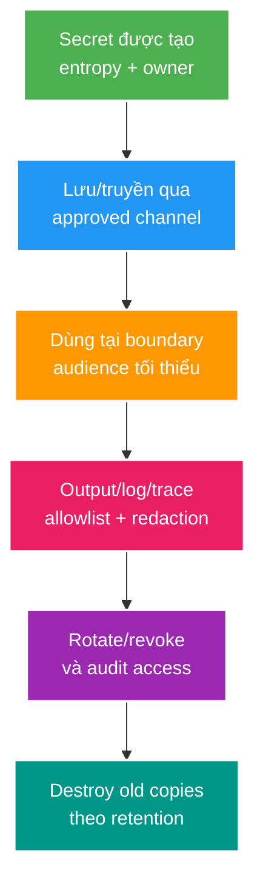

# Secret Exposure, Audience DTO và Log Redaction

> Type: `CORE` 
> Domain: `security` 
> Target depth: `D3 — map secret lifecycle, ngăn exposure qua API/log/telemetry và chứng minh rotation/redaction bằng negative evidence` 
> Teaching readiness: `TEACHABLE_DRAFT` 
> Status: `DRAFT` 
> Evidence status: `NOT RUN` 
> Prerequisites: authorization boundaries và API DTO design 
> Related cases: roadmap owner `SEC-03`; [question bank](../../question-bank/stream-key-secret-exposure-and-log-redaction.md) 
> Owner: `Project learner; Codex teaches, learner writes back` 
> Updated: `2026-07-26`

## 0. Vấn đề và objectives

Secret thường không lộ vì crypto bị phá mà vì cùng entity/DTO/log payload được tái sử dụng sai audience. Stream key dành cho ingest owner có thể xuất hiện trong public livestream response, exception, access log, trace attribute hoặc support screenshot. Khi đã vào log/analytics, xóa và xác định người đã đọc khó hơn rotate một database value.

Sau bài này, bạn phân loại secret/PII, thiết kế audience-specific DTO, redaction allowlist, storage/rotation lifecycle và incident response. Đây là preview `SEC-03`; chưa audit runtime logs hay sửa DTO.

## 1. Vocabulary và mental model

**Secret** cấp authority nếu bị sở hữu: password, bearer token, refresh token, stream key, webhook signing key, private key. **Sensitive data** có thể gây hại dù không trực tiếp cấp quyền: PII, internal IDs, risk signals. **Audience boundary** xác định consumer được phép thấy field nào. **Data minimization** chỉ thu/trả/log dữ liệu cần thiết. **Redaction** loại/biến đổi sensitive fields trước sink. **Rotation** thay credential và thu hồi old credential theo overlap plan. **Secret zero** là credential ban đầu để workload lấy secrets khác.

Câu cần nhớ: **secret safety là lifecycle xuyên source, memory, API, log, backup và rotation; `@JsonIgnore` chỉ bảo vệ một serialization path**.

## 2. Audience-specific design

JPA entity không phải API contract. Public `StreamSummaryDTO` chỉ có title/status/creator-safe fields. Owner ingest DTO có stream key nếu action thật sự cần, qua authenticated owner endpoint và có thể chỉ hiển thị khi rotate/create. Admin DTO cũng không mặc định được thấy secret plaintext; admin thường cần trạng thái/last-rotated, không cần credential.

Mapping explicit theo audience an toàn hơn dùng một giant DTO với conditional null. Mass assignment cũng là chiều vào: request DTO không nhận `ownerId`, `role`, `streamKey` hoặc internal state nếu caller không được điều khiển. Serializer annotations là defense phụ; projection/query nên tránh load secret khi không cần để giảm memory/log/debug exposure.

## 3. Storage, generation và comparison

Secret phải sinh bằng cryptographically secure random với entropy đủ, không dùng timestamp/UUID yếu theo assumption. Password lưu adaptive salted hash; token/API key có thể lưu hash/HMAC verifier nếu chỉ cần compare và plaintext chỉ trả một lần. Một số integration secret cần recover plaintext để ký outbound request, khi đó encrypt at rest với key management/access audit thay vì hash.

Config secrets không hard-code trong source, image hay default production config. Environment variables cũng có exposure qua process/debug/CI; secret manager/workload identity tốt hơn ở production nhưng vẫn cần least privilege, caching/renewal và failure policy. Không ghi secret vào command line hoặc URL query.

Comparison dùng constant-time primitive khi attacker quan sát timing có ý nghĩa. Không tự viết crypto. Key ID/version tách metadata không nhạy khỏi secret bytes.

## 4. Logging và telemetry

Ưu tiên allowlist fields thay blacklist tên `password`: secrets có thể mang tên `token`, `authorization`, `cookie`, `streamKey`, `signature`, nested headers hoặc raw body. Log correlation ID, actor ID đã policy, action, result và error code; không log full request/response theo default.

Redaction phải xảy ra trước formatter/exporter, áp dụng logs, traces, metrics labels, audit events và exception serialization. Metrics label không chứa user/token/key vì cardinality và privacy. Stack trace có thể chứa URL/config. Debug logging tạm thời cần approval, bounded duration và cleanup.

Hash secret để log vẫn nguy hiểm: stable fingerprint cho phép correlation/dictionary và có thể bị coi sensitive. Nếu cần điều tra token instance, dùng server-generated non-secret ID/JTI hoặc keyed short fingerprint với retention/access policy rõ.

## 5. Worked examples

### 5.1. Public livestream DTO lộ stream key

Controller trả entity hoặc reuse owner DTO; frontend public nhận `streamKey`; attacker publish giả/chiếm ingest. Fix không chỉ `@JsonIgnore`: tạo public/owner DTO riêng, query/map explicit, negative serialization/MockMvc test assert field absent, audit OpenAPI/examples/logs. Rotate key đã lộ và điều tra access logs/caches.

### 5.2. Exception log lộ bearer token

Auth filter catch parse error và log full `Authorization` header. Log aggregator trở thành credential store có nhiều readers/retention. Fix log error category + correlation, redact header at ingress/app/collector, scan existing logs và revoke exposed credentials. “Chỉ DEBUG” không an toàn nếu production có thể bật.

### 5.3. Rotation không downtime

Stream key version K1 đang dùng. Tạo K2, owner nhận qua secure channel; trong bounded overlap ingest validator chấp nhận K1/K2 và audit version; client chuyển K2; quan sát K1 không còn dùng; revoke K1. Nếu compromise nghiêm trọng, bỏ overlap và chấp nhận reconnect. Rotation plan phải nói rollback, expiry và old-copy destruction.

### 5.4. Phản ví dụ masking response

API trả `abcd****wxyz`. Prefix/suffix có thể đủ correlation/bruteforce khi entropy thấp; hơn nữa nó xác nhận secret exists. Chỉ trả metadata cần thiết hoặc one-time value, không masking theo thói quen.

## 6. Invariants, failure modes và trade-offs

- Public/non-owner response không chứa stream key, token, internal secret hay credential-derived material.
- Secret không xuất hiện trong logs/traces/metrics/errors/OpenAPI examples/fixtures.
- Access tới secret có identity, purpose, least privilege và audit.
- Rotation có version, overlap/revoke rule và tested consumer migration.
- Exposure incident dẫn tới revoke/rotate, scope/retention investigation và prevention test.

Failure: generic reflection logger serialize request DTO → secret leaks; centralized collector redaction muộn → local files already contain secret; shared DTO field được thêm cho owner → public endpoint tự có field; CI artifact/test snapshot giữ real credential. Chứng minh bằng automated secret scanning, negative response/log capture tests và repository/history scan; scanners có false positive/negative nên không thay design.

Separate DTOs tăng boilerplate nhưng tạo compile/review boundary. Dynamic field filtering ít files nhưng dễ fail-open. Encrypt reversible secrets hỗ trợ use nhưng cần key management; hash giảm breach impact nhưng không recover. Chọn theo operation.

## 7. Project application và phỏng vấn

Khi `SEC-03` active, inventory entity→DTO→OpenAPI→log/trace paths; test public/owner/admin audiences; capture logs của success/error; rotate disposable stream key và verify old rejection. Không dùng production secrets và không lưu sample secret trong docs.

**30 giây:** “Tôi phân loại secret theo authority và thiết kế DTO theo audience, không trả entity. Logging dùng allowlist và redact trước mọi sink; `@JsonIgnore` chỉ là defense phụ. Secret được sinh an toàn, storage theo need-to-recover, rotation có version/overlap/revoke. Khi lộ phải rotate và audit mọi copy, không chỉ xóa log line.”

## 8. Tóm tắt, learner và self-check

- Secret exposure thường là data-flow/audience bug.
- DTO theo audience bảo vệ cả accidental future fields.
- Không load/return/log dữ liệu không cần.
- Redaction bao phủ logs, traces, metrics, errors và examples.
- Hash khi chỉ compare; encrypt khi cần recover.
- Rotation là protocol nhiều version, không chỉ đổi config.

> **Bài viết của tôi — `LEARNER TODO`:** trace một stream key từ generation tới revoke, nêu mọi audience/sink và negative evidence.

1. **Question:** Vì sao `@JsonIgnore` chưa đủ chống secret exposure? 
   **Đọc lại nếu bí:** mục 1–2 và 5.1. 
   **Một câu trả lời tốt phải có:** alternate serializers/loggers/mapping, audience DTO, query minimization và negative tests. 
   **My answer:** `LEARNER TODO`
2. **Question:** Khi nào hash, khi nào encrypt secret? 
   **Đọc lại nếu bí:** mục 3. 
   **Một câu trả lời tốt phải có:** compare-only vs recover/use, key management, breach impact và rotation. 
   **My answer:** `LEARNER TODO`
3. **Question:** Stream key lộ trong log xử lý incident thế nào? 
   **Đọc lại nếu bí:** mục 4–6. 
   **Một câu trả lời tốt phải có:** revoke/rotate, scope/readers/retention/copies, evidence preservation, redaction fix và regression test. 
   **My answer:** `LEARNER TODO`

## 9. Official references và teach-back

- [OWASP — Secrets Management Cheat Sheet](https://cheatsheetseries.owasp.org/cheatsheets/Secrets_Management_Cheat_Sheet.html)
- [OWASP — Logging Cheat Sheet](https://cheatsheetseries.owasp.org/cheatsheets/Logging_Cheat_Sheet.html)

- [ ] Tôi map được secret lifecycle và audiences.
- [ ] Tôi thiết kế DTO/redaction fail-safe.
- [ ] Tôi biết exposure/rotation evidence vẫn `NOT RUN`.

