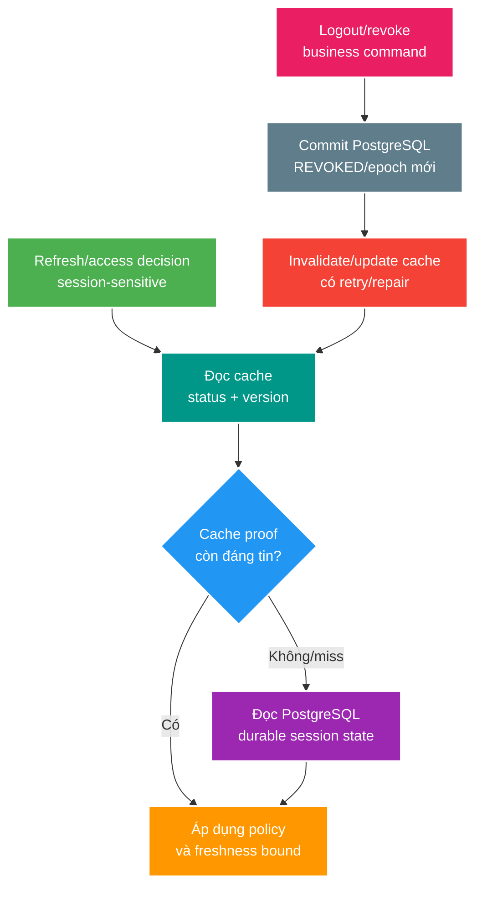

# Thu hồi session và giữ cache nhất quán

> Type: `CORE` 
> Domain: `security` 
> Target depth: `D3 — thiết kế logout/revoke thắng stale cache, tái hiện race và chứng minh fail-closed behavior` 
> Teaching readiness: `TEACHABLE_DRAFT` 
> Status: `DRAFT` 
> Evidence status: `NOT RUN` 
> Prerequisites: [token/session semantics](token-purpose-and-session-semantics.md), [Redis cache consistency](../../../redis/theory/core/cache-consistency-stampede-and-outage.md) 
> Related cases: roadmap owner `SEC-02`; [question bank](../../question-bank/logout-all-and-session-cache-invalidation.md) 
> Owner: `Project learner; Codex teaches, learner writes back` 
> Updated: `2026-07-26`

## 0. Cách dùng và vấn đề

Session-backed refresh token chỉ an toàn nếu `REVOKED` trong durable store thắng mọi bản sao `ACTIVE`. Logout-all hiện có thể update PostgreSQL nhưng bỏ sót các cache key theo session; request sau đọc stale Redis và hồi sinh session. Đọc bài theo owner state → cache index → revoke transaction → invalidation/recovery. Đây là preview, không active `SEC-02` và fault tests vẫn `NOT RUN`.

Revocation là thay đổi security state trước expiry. Logout-one thu hồi một session/device; logout-all thu hồi toàn bộ sessions của user; global epoch/credential change có thể thu hồi một lớp credentials. TTL chỉ giới hạn stale window, không chứng minh revoke tức thì. Cache availability không được ưu tiên hơn security invariant.

## 1. Mục tiêu học và từ vựng

Bạn cần phân biệt **durable session record**, **session cache**, **user-session index**, **revocation epoch/version**, **positive/negative cache**, **invalidation lag** và **fail-open/fail-closed**. Sau bài này, bạn thiết kế được key ownership, logout-all algorithm, concurrent refresh/revoke handling và negative matrix cache hit/miss/down.

PostgreSQL là authority cho session status. Redis là derived state để giảm lookup. User-session index ánh xạ user tới active session IDs để bounded invalidation; index này cũng là cache và có thể thiếu. Revocation epoch là monotonic version trên user/session; token/cache mang observed epoch và bị reject nếu nhỏ hơn current authoritative epoch.

## 2. Mô hình tư duy cốt lõi

Cache hit không phải security proof vĩnh viễn. Proof phải gắn version/freshness/policy. Revoke commit đi trước invalidation; crash giữa hai bước cần durable delivery, TTL hoặc authoritative recheck để residual window không vô hạn. Câu cần nhớ: **revocation state có một durable owner; cache chỉ được tăng tốc quyết định mà không đảo ngược owner**.

## 3. Cơ chế vòng đời session

Login tạo session ID ngẫu nhiên, user/device metadata, status `ACTIVE`, expiry và optional token-family/version. Chỉ sau commit mới populate cache typed DTO với TTL không vượt session expiry. Refresh validator kiểm token purpose, session identity và current durable/cache policy rồi mới phát token.

Logout-one dùng conditional transition `ACTIVE → REVOKED`, idempotent khi gọi lại. Sau commit xóa/update `session:v1:{id}`. Logout-all phải atomically revoke tất cả durable sessions hoặc tăng user revocation epoch; sau đó invalidate từng session cache/index. Nếu số sessions bị bounded (project dự kiến tối đa 5), enumerate từ DB result đáng tin hơn dựa hoàn toàn vào potentially incomplete Redis index.

DB commit + cache invalidation không atomic. Best-effort after-commit có crash gap. Nếu revoke SLO yêu cầu mạnh, outbox ghi cùng transaction rồi idempotent consumer invalidate; request path vẫn có fallback/version check để xử lý lag. Không publish invalidation trước commit vì rollback có thể làm active session bị deny sai.

Concurrent refresh và logout cần serialization rule. Nếu refresh đọc `ACTIVE`, logout commit, rồi refresh phát token, token mới có thể sống sau revoke. Giải pháp: lock/version/conditional update session trong transaction; phát token chỉ từ state/version đã thắng, hoặc token mang session epoch mà later validation từ chối. Exact design phụ thuộc access-token revocation policy.

## 4. Ví dụ phân tích từng bước

### 4.1. Stale cache sau logout-all

User có S1/S2 cached `ACTIVE`. Logout-all update cả hai DB rows nhưng chỉ xóa S1. Refresh S2 cache-hit và được phát access token nếu cache là authority. Correct design coi DB revoke/epoch là owner; logout command lấy affected IDs để invalidate, có repair/outbox, và refresh cache proof phải có bounded/current version. Test phải seed stale S2 có chủ đích rồi assert 401.

### 4.2. Redis down

Sai: Redis exception thì coi session active để giữ availability. Đúng: refresh/session-sensitive operation fallback PostgreSQL với bounded concurrency; nếu authority cũng unavailable, fail closed hoặc explicit degraded response. Public cached metadata có thể stale; credential refresh không cùng policy.

### 4.3. Concurrent refresh/revoke

Dùng barrier: refresh đọc active nhưng tạm dừng; revoke commit; refresh tiếp tục. Nếu token được phát usable, race tồn tại. Evidence gồm exact interleaving, session version/final state và access/refresh result. Fix phải khiến refresh abort hoặc credential mới mang version bị reject.

### 4.4. Phản ví dụ TTL ngắn

TTL 30 giây vẫn cho attacker 30 giây refresh nếu cache stale; expiry đồng loạt còn tăng DB load. TTL là safety bound và capacity decision, không thay invalidation/version/recheck.

## 5. Invariant, các kiểu hỏng và đánh đổi

- Durable `REVOKED` không bao giờ trở lại `ACTIVE` vì cache rebuild.
- Logout-all bao phủ mọi active session tại linearization point đã định.
- Cache key/index có owner, version, TTL và repair procedure.
- Redis outage không fail-open credential validation.
- Repeated logout/revoke idempotent và audit không chứa raw token.

Failure chains: incomplete session index → bỏ sót key → stale refresh; invalidation event mất → stale tới TTL; event reorder `ACTIVE` projection sau `REVOKED` → resurrection nếu không version; cache stampede khi flush → DB pool exhaustion. Version monotonic và compare-before-write chống reorder; bounded session count và DB query giúp enumerate; outbox/retry/metrics giảm missed invalidation.

Per-session lookup chính xác nhưng thêm DB/cache cost. User epoch thu hồi nhanh toàn user nhưng role/password change làm mọi device logout và request cần current epoch. Short access TTL giảm revoke window nhưng tăng refresh traffic. Introspection mạnh hơn nhưng thêm central dependency. Chọn theo threat model/SLO.

## 6. Áp dụng vào dự án và phỏng vấn

Khi `SEC-02` active: inventory session keys; tạo stale cache fixture; test logout-one/all với cache hit/miss/down, concurrent refresh, invalidation failure/retry và event reorder. Metrics: revoke-to-deny latency, stale-cache rejection, invalidation failure/backlog, DB fallback admitted/rejected. Không dùng `FLUSHALL`.

**30 giây:** “PostgreSQL sở hữu session revocation; Redis chỉ là derived cache. Logout commit `REVOKED`/epoch trước, rồi invalidation có retry/repair. Cache hit phải gắn version/freshness, Redis down không fail-open. Tôi test stale key cố ý và race refresh-versus-revoke, không chỉ happy logout.”

## 7. Tóm tắt, bài tập diễn đạt lại và tự kiểm tra

- Revocation là security state transition, không phải chỉ delete cache.
- TTL bound stale time nhưng không bảo đảm immediate logout.
- User-session index tiện invalidation nhưng không được là authority duy nhất.
- DB/cache gap cần version, durable invalidation và repair.
- Concurrent refresh/revoke cần atomic/version rule.
- Fail-closed policy khác theo operation.

> **Bài viết của tôi — `LEARNER TODO`:** kể logout-all với S1/S2, crash gap và concurrent refresh trong 12–18 câu.

1. **Question:** Vì sao stale `ACTIVE` cache không được thắng DB `REVOKED`? 
   **Đọc lại nếu bí:** mục 2–4.1. 
   **Một câu trả lời tốt phải có:** authority, version/freshness, invalidation gap, fallback và negative test. 
   **My answer:** `LEARNER TODO`
2. **Question:** Logout-all enumerate sessions thế nào khi Redis index thiếu? 
   **Đọc lại nếu bí:** mục 3 và 5. 
   **Một câu trả lời tốt phải có:** durable DB result/epoch, bounded sessions, cache index limitation, retry/repair. 
   **My answer:** `LEARNER TODO`
3. **Question:** Race refresh/revoke được tái hiện và xử lý ra sao? 
   **Đọc lại nếu bí:** mục 3 và 4.3. 
   **Một câu trả lời tốt phải có:** barrier interleaving, linearization/version, abort/reject và final evidence. 
   **My answer:** `LEARNER TODO`

## 8. Nguồn chính thức và trình bày lại

- [Spring Security — Session Management](https://docs.spring.io/spring-security/reference/servlet/authentication/session-management.html)
- [OWASP — Session Management Cheat Sheet](https://cheatsheetseries.owasp.org/cheatsheets/Session_Management_Cheat_Sheet.html)

- [ ] Tôi giải thích authority/cache/epoch.
- [ ] Tôi thiết kế logout-all chịu stale/missing cache.
- [ ] Tôi biết fault evidence vẫn `NOT RUN`.
