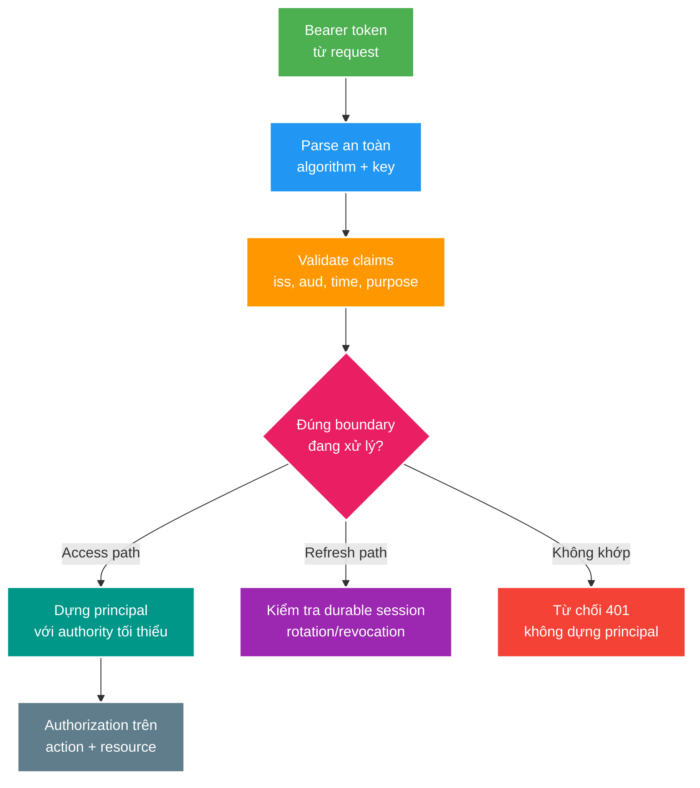

# Token Purpose, Access/Refresh Token và Session Semantics

> Type: `CORE` 
> Domain: `security` 
> Target depth: `D3 — thiết kế validation theo token purpose, tái hiện cross-use và bảo vệ lifecycle/revocation bằng negative evidence` 
> Teaching readiness: `TEACHABLE_DRAFT` 
> Status: `DRAFT` 
> Evidence status: `NOT RUN` 
> Prerequisites: HTTP authentication cơ bản và [current security flow](../../../../../security/authorization-flow.md) 
> Related cases: [`SEC-01`](../../../../cases/sec-01-access-vs-refresh-token.md); [question bank](../../question-bank/access-refresh-token-and-session-semantics.md) 
> Owner: `Project learner; Codex teaches, learner writes back` 
> Version boundary: current project dùng custom JJWT/session-backed design; đối chiếu JWT BCP và Spring Security version khi case active 
> Updated: `2026-07-26`

## 0. Cách dùng

Đọc bài này trước khi học OAuth2/OIDC. Mục tiêu là hiểu một credential được chấp nhận nhờ nhiều lớp contract, không phải thuộc cấu trúc JWT. Sau mục 6, tự vẽ hai đường: access request và refresh request; tại mỗi bước ghi rõ validator đang chứng minh điều gì. Đây là preview cho `SEC-01`; case đang `PAUSED`, chưa sửa code và negative test vẫn `NOT RUN`.

## 1. Vì sao topic này tồn tại?

JWT có signature đúng và chưa hết hạn vẫn có thể không hợp lệ cho request hiện tại. Signature chỉ chứng minh payload không bị sửa bởi bên không có key và được ký bởi key mà verifier tin. Nó không tự chứng minh issuer đúng, audience là service này, token được phát để truy cập resource, session chưa revoke hay caller được sửa resource cụ thể.

Access token và refresh token thường đều là bearer credentials nhưng có mục đích và blast radius khác nhau. Access token ngắn hạn đi tới resource server để dựng principal. Refresh token dài hạn hơn, chỉ đi tới token endpoint để xin access token mới và thường gắn durable session/rotation state. Nếu cùng parser chỉ hỏi signature+expiry, refresh token có thể bị nâng nhầm thành access credential. Client “không nên làm vậy” không phải security control.

## 2. Learning objectives và vocabulary

Sau bài này, bạn có thể:

1. Tách cryptographic, structural, semantic, session và authorization validation.
2. Thiết kế validator nhận expected token purpose/audience thay vì generic boolean.
3. Giải thích stateless access token và session-backed refresh token có revocation boundary khác nhau.
4. Xử lý expiry, clock skew, key rotation, legacy claim và refresh replay theo fail-closed rollout.
5. Thiết kế negative tests cho refresh-as-access, access-as-refresh, wrong issuer/audience/type và revoked session.

**Bearer credential** nghĩa ai sở hữu token có thể trình nó; token không tự chứng minh sender. **JOSE header `typ`** là type hint cho object, khác application claim mô tả purpose. **Issuer (`iss`)** là authority phát hành. **Audience (`aud`)** là recipient dự kiến. **Subject (`sub`)** là principal identity. **Purpose/token use** nói credential dùng ở flow nào. **Session binding** nối refresh credential với server-side session. **Revocation** làm credential/session mất hiệu lực trước expiry. **Rotation** phát refresh token mới và làm token cũ mất quyền tiếp tục family. **Replay** là dùng lại credential/message đã hợp lệ trước đó.

## 3. Mental model cốt lõi

Mỗi gate trả lời một câu khác nhau. Key/signature không thay claims. Claims không thay session state. Authentication không thay authorization. Câu cần nhớ: **token validity luôn là validity cho một expected boundary, không phải thuộc tính boolean chung của chuỗi JWT**.

## 4. Các lớp validation

### 4.1. Cryptographic và parser policy

Verifier phải allow-list algorithm mong đợi, chọn trusted key đúng issuer/key ID và từ chối algorithm/key confusion. Không tin header từ token để tải key tùy ý. Parser errors không log raw token. Key rotation cần overlap window: issuer bắt đầu ký key mới, verifier biết cả active/retiring keys, tokens cũ hết lifetime rồi key cũ mới rút.

### 4.2. Time và semantic claims

`exp` giới hạn sau thời điểm nào token không hợp lệ; `nbf` trước thời điểm nào chưa dùng; `iat` hỗ trợ policy/diagnostic nhưng không tự chống replay. Clock skew chỉ là tolerance nhỏ có chủ đích, không kéo dài lifetime tùy tiện. Validate issuer chính xác, audience chứa recipient mong đợi, purpose/type thuộc enum và khớp path. Claim thiếu/unknown phải fail closed sau rollout plan, không fallback generic parser.

### 4.3. Access path

Access validator yêu cầu `purpose=ACCESS`, audience resource server và lifetime ngắn. Chỉ sau tất cả checks mới dựng `Authentication`. Authorities trong token có freshness/revocation trade-off; resource ownership vẫn cần current data/service check. Access token stateless thường không bị thu hồi tức thì nếu không introspection/denylist/version/session check; đó là explicit bounded risk, không phải bug được che bởi chữ JWT.

### 4.4. Refresh path

Refresh validator yêu cầu `purpose=REFRESH`, đúng issuer/audience và session/token identity. PostgreSQL session là durable owner: active, chưa expiry/revoke, đúng user/device/family. Rotation tốt phát token mới và đánh dấu old token used/replaced trong một atomic transition; reuse old token có thể revoke family hoặc trigger risk response. Nếu response mất sau commit, retry semantics phải được thiết kế để không vô tình coi legitimate retry là theft hoặc phát song song vô hạn.

## 5. Session lifecycle và threat boundaries

Login tạo session record rồi credentials. Logout-one revoke session tương ứng; logout-all revoke mọi session/user. Redis có thể cache session nhưng stale `ACTIVE` không được thắng durable `REVOKED`. Password reset, role change hoặc suspected compromise có thể tăng user/session epoch để invalidate credentials theo policy. Access tokens hiện hữu có thể sống tới expiry nếu không check epoch mỗi request; lựa chọn này đổi latency, availability và revocation window.

Token storage cũng thuộc threat model. Browser refresh token thường hợp hơn trong Secure/HttpOnly/SameSite cookie với CSRF design; access token trong JavaScript memory giảm persistence nhưng vẫn chịu XSS. Mobile/native dùng secure OS storage. Không đưa bearer token vào URL, analytics hoặc logs. TLS là bắt buộc nhưng không sửa token-purpose confusion.

## 6. Worked examples

### 6.1. Refresh token đi qua access filter

Refresh JWT có signature/expiry đúng và `sub=alice`, `session_id=7`; generic `validateToken` pass; filter load Alice và dựng authenticated principal; protected endpoint trả data. Root cause không phải cùng signing key riêng lẻ mà là access boundary không enforce purpose/audience. Fix: `validateAccessToken(expectedIssuer, expectedAudience, ACCESS)` trước principal. Negative test phải dùng refresh token cryptographically valid để chứng minh semantic rejection.

### 6.2. Access token đi vào refresh endpoint

Access token signature đúng nhưng không có refresh session identity. Nếu workflow chỉ lỗi muộn khi đọc claim, error có thể thành 500 hoặc heuristic “có session_id thì refresh”. Validator phải từ chối purpose trước service workflow với 401. Có `session_id` không tự biến token thành refresh; explicit purpose và endpoint audience mới là contract.

### 6.3. Legacy rollout thiếu purpose claim

Deploy validator mới fail-closed ngay có thể logout mọi user; cho missing claim đi qua vĩnh viễn giữ lỗ hổng. Rollout an toàn có thể phát claim mới trước, đo legacy population, dùng bounded compatibility path chỉ tại controlled migration window, giảm token lifetime/re-authenticate, rồi bật strict rejection. Compatibility exception có deadline/telemetry và không được áp ở mọi path.

### 6.4. Phản ví dụ “hai keys là đủ”

Access/refresh dùng keys khác nhưng mọi endpoint verifier thử cả hai keys; token refresh vẫn được accept. Separate keys giảm blast radius chỉ khi verifier/key resolver bị giới hạn theo boundary. Ngược lại, cùng key vẫn có thể an toàn hơn baseline nếu purpose/audience được enforce, dù compromise blast radius lớn hơn. Defense in depth không thay semantic validation.

## 7. Invariants và failure modes

- Chỉ access-purpose credential mới dựng principal ở resource path.
- Refresh credential chỉ dùng tại refresh endpoint và phải có active durable session.
- Missing/unknown/wrong purpose, issuer hoặc audience bị từ chối trước business code.
- Authentication failure là 401; authenticated nhưng thiếu quyền là 403.
- Không log raw token, refresh proof hoặc secret claims.

**Generic validator reuse:** convenient boolean → callers quên expected semantics → cross-use credential → privilege window. Evidence bằng test matrix từng token×path. **Key rotation race:** issuer ký key mới trước verifier rollout → valid users nhận 401. Evidence bằng mixed-version/key-set test; mitigation publish verifier keys trước signer switch và giữ retiring key đủ lifetime. **Refresh replay:** token bị đánh cắp và legitimate client cùng dùng → nếu không rotation/reuse state, attacker duy trì session. Evidence bằng concurrent/repeated refresh test và final family state.

## 8. Trade-offs và architecture decisions

JWT access token giảm per-request session lookup nhưng revocation kém tức thì. Opaque access token/introspection tăng central dependency nhưng policy/revocation tập trung. JWT refresh tiện self-contained parsing nhưng vẫn cần session/rotation state; opaque random refresh token lưu hash thường giảm exposed claims và dễ model one-time identity. Asymmetric keys/JWKS tách signer/verifier tốt cho nhiều services; vận hành rotation/phân phối keys phức tạp hơn shared secret.

Không tự xây authorization server khi federation, consent, multiple clients, standards compliance và mature rotation trở thành requirement; dùng proven IdP/authorization server. Custom project flow vẫn hữu ích để học boundaries nhưng phải được mô tả đúng giới hạn.

## 9. Áp dụng vào project và evidence plan

`SEC-01` đã ghi baseline: current filter và refresh service dùng generic signature+expiry validation. Khi roadmap tới case, tạo unit matrix cho claims và MockMvc reproducer refresh-as-access/access-as-refresh trước khi sửa; verify no principal on failure, 401 mapping, no token logs và legacy policy. Không triển khai trong preview này.

## 10. Góc nhìn phỏng vấn

**30 giây:** “JWT signature và expiry chỉ là điều kiện cần. Tôi validate issuer, audience, time và expected purpose ở từng boundary. Access token mới được dựng principal; refresh token chỉ đi token endpoint và phải gắn active durable session. Wrong-purpose là 401, test bằng cryptographically valid token của loại kia.”

**Senior 2 phút:** thêm session revocation/rotation, generic-validator failure, key rollout, stateless access revocation window và negative test matrix.

## 11. Tóm tắt

- JWT là carrier; security nằm ở validation contract.
- Signature không chứng minh purpose, audience, session hay quyền.
- Access và refresh có lifetimes, recipients và revocation khác nhau.
- Validator phải nhận expected boundary và fail closed.
- Refresh rotation/reuse detection cần durable atomic state.
- Key rotation là distributed rollout, không chỉ đổi secret.
- Authentication và authorization là hai gates khác nhau.

## 12. Bài tập diễn đạt lại — phần của tôi

> **Bài viết của tôi — `LEARNER TODO`:** viết 12–18 câu kể access path và refresh path, các gates khác nhau, một cross-use failure và rollout claim/key an toàn.

## 13. Self-check có hướng dẫn

1. **Question:** JWT signature đúng còn thiếu những validation nào? 
   **Đọc lại nếu bí:** mục 3–4. 
   **Một câu trả lời tốt phải có:** algorithm/key, issuer, audience, time, purpose, session và authorization boundary. 
   **My answer:** `LEARNER TODO`
2. **Question:** Vì sao `session_id` không đủ phân biệt refresh token? 
   **Đọc lại nếu bí:** mục 4.4 và 6.2. 
   **Một câu trả lời tốt phải có:** schema heuristic, explicit purpose, audience/path và fail-closed behavior. 
   **My answer:** `LEARNER TODO`
3. **Question:** Refresh rotation/reuse detection cần state gì? 
   **Đọc lại nếu bí:** mục 4.4 và 7. 
   **Một câu trả lời tốt phải có:** token/family identity, one-time transition, concurrency/retry, theft response và durable owner. 
   **My answer:** `LEARNER TODO`
4. **Question:** Rollout purpose claim cho token cũ thế nào? 
   **Đọc lại nếu bí:** mục 6.3 và 7. 
   **Một câu trả lời tốt phải có:** issuer-first, observation, bounded compatibility, deadline, strict gate và negative telemetry. 
   **My answer:** `LEARNER TODO`

## 14. Official references và teach-back

- [RFC 7519 — JSON Web Token](https://www.rfc-editor.org/rfc/rfc7519)
- [RFC 8725 — JWT Best Current Practices](https://www.rfc-editor.org/rfc/rfc8725)
- [Spring Security Reference](https://docs.spring.io/spring-security/reference/)

- [ ] Tôi phân biệt cryptographic, semantic, session và authorization validity.
- [ ] Tôi vẽ được access/refresh paths và rejection point.
- [ ] Tôi giải thích key/purpose/rotation trade-offs.
- [ ] Tôi biết tests/runtime evidence vẫn `NOT RUN`.
