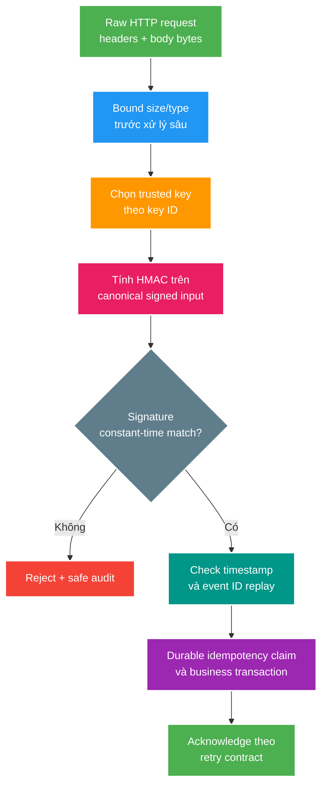

# Xác thực webhook, chống replay và bảo đảm idempotency

> Type: `CORE` 
> Domain: `security` 
> Target depth: `D3 — thiết kế HMAC canonicalization, replay gate, secret rotation và idempotent processing có negative evidence` 
> Teaching readiness: `TEACHABLE_DRAFT` 
> Status: `DRAFT` 
> Evidence status: `NOT RUN` 
> Prerequisites: HTTP bytes/headers, [secret lifecycle](secret-exposure-and-audience-boundaries.md) và transaction idempotency 
> Related cases: roadmap owner `SEC-05`; [question bank](../../question-bank/webhook-hmac-replay-and-secret-rotation.md) 
> Owner: `Project learner; Codex teaches, learner writes back` 
> Updated: `2026-07-26`

## 0. Vấn đề và mục tiêu học

Webhook endpoint nằm ở machine-to-machine trust boundary. “Có shared secret trong header” chỉ là bearer secret: ai lấy được có thể spoof; request hợp lệ bị capture có thể replay. HMAC chứng minh bên gửi biết key và bytes ký không đổi, nhưng không tự chống replay, duplicate business effect, secret leak hay SSRF từ callback payload.

Sau bài này, bạn thiết kế được signed envelope, raw-body verification, timestamp/event-ID replay window, durable idempotency, key rotation và negative test matrix. Đây là preview `SEC-05`; current webhook chưa được thay đổi.

## 1. Từ vựng

**HMAC** là message authentication code dùng cryptographic hash + shared key; nó cung cấp integrity/authenticity giữa parties biết key, không encryption. **Canonicalization** định nghĩa exact bytes/fields và order được ký. **Freshness window** chấp nhận timestamp trong bounded skew. **Nonce/event ID** định danh delivery/event để phát hiện replay. **Idempotency** bảo đảm lặp cùng logical event không tạo thêm effect. **Constant-time comparison** tránh timing leak khi so MAC. **Key ID/version** chọn key trong rotation mà không gửi secret.

## 2. Mô hình tư duy cốt lõi

Thứ tự quan trọng: bound request trước DoS; verify trên raw bytes trước parse/mutate; freshness/replay sau authentic signature; business idempotency trong durable transaction. Câu cần nhớ: **authentic request vẫn có thể cũ hoặc duplicate; replay gate và idempotent effect là hai lớp khác nhau**.

## 3. Hợp đồng tạo và kiểm tra chữ ký

Hai bên phải thống nhất algorithm, key ID, signature encoding, timestamp unit, event ID và signed input. Ví dụ conceptual:

`version + "\n" + timestamp + "\n" + eventId + "\n" + rawBodyBytes`

Không parse JSON rồi reserialize để verify: whitespace, field order, number/unicode normalization có thể đổi bytes. Framework cần cache raw body an toàn để verifier và parser cùng dùng, với max size. Không ký một số headers do intermediary có thể đổi trừ khi contract chuẩn hóa rõ. Signature header cần strict parser, reject duplicate/ambiguous versions và allow-list HMAC algorithm; không nhận algorithm từ attacker rồi dùng tùy ý.

HMAC key có entropy đủ, riêng theo provider/environment/tenant khi blast radius yêu cầu. Không dùng cùng JWT/database password. MAC so bằng constant-time library primitive. TLS vẫn cần để bảo vệ metadata/key-related traffic và endpoint identity; HMAC không mã hóa payload.

## 4. Chống replay và bảo đảm idempotency

Timestamp window loại request quá cũ/tương lai vượt skew, nhưng hai request giống nhau trong window vẫn replay được. Event ID/nonce cần store seen-state với uniqueness. Nếu chỉ Redis TTL và Redis mất, replay có thể sống lại; business-critical effect cần unique constraint/idempotency record trong PostgreSQL.

Replay record lifetime ít nhất bằng provider retry/replay threat window. Claim event ID và apply business effect phải cùng transaction khi có thể. Duplicate hợp lệ thường trả success của prior outcome để provider ngừng retry; invalid signature trả 401/403 theo contract, malformed payload 400, transient internal failure 5xx để retry. Không trả 2xx trước durable commit nếu provider coi 2xx là final.

Event ordering không tự được HMAC bảo đảm. Status event `ENDED` rồi delayed `STARTED` đều authentic; consumer cần version/sequence/state machine. Idempotency chỉ loại same ID, không giải quyết two different events có contradictory order.

## 5. Xoay secret

Key ID cho phép receiver chọn key mà không thử vô hạn keys. Rotation staged: provision K2 receiver trước; sender ký K2; bounded overlap receiver chấp nhận K1/K2; quan sát K1 usage; revoke K1. Nếu signature header cho phép multiple signatures, contract nói cách verify và chống downgrade. Unknown/retired key fail closed. Emergency compromise có thể bỏ overlap và chấp nhận failed deliveries/replay từ trusted source sau remediation.

Rotation phải bao phủ secrets ở sender, receiver, CI/config, caches và rollback. Metric theo key version (bounded label), không log key/signature/raw sensitive body.

## 6. Ví dụ phân tích từng bước

### 6.1. Serialize lại JSON làm chữ ký sai

Sender ký bytes `{"a":1,"b":2}`. Receiver parse thành object rồi serializer output có spaces/order khác; HMAC mismatch dù request thật. Verify exact raw bytes trước mapping. Test dùng semantically equal JSON có byte layout khác để chứng minh chỉ original signed bytes pass.

### 6.2. Replay vẫn nằm trong cửa sổ thời gian

Attacker capture signed “stream started” và gửi lại sau 10 giây; timestamp vẫn fresh, HMAC đúng. Unique `(provider,event_id)` claim thấy duplicate và trả stored success/no second effect. Nếu event ID không trusted unique, signed nonce/delivery ID contract cần rõ.

### 6.3. Process chết sau commit nhưng trước khi trả response

Receiver commit event/effect rồi process chết trước 2xx. Provider retry. Durable idempotency record trả prior outcome; không tạo stream transition/event lần hai. In-memory/Redis-only dedup có thể mất khi restart và không đủ.

### 6.4. Phản ví dụ static secret header

Endpoint so `X-Secret == config`. Nó không bind body/timestamp/event ID; leaked header cho phép forge tùy payload và captured request replay. HMAC bind fields nhưng vẫn cần key lifecycle/replay/idempotency.

## 7. Invariant và các kiểu hỏng

- Verify raw bytes và expected algorithm/key version trước business parsing.
- Timestamp + event ID đều nằm trong signed input.
- Same logical event tạo tối đa một durable effect.
- Authentic but out-of-order event không phá state machine.
- Rotation không tạo window accept unknown/retired downgrade.
- Logs không chứa secret, full signature hoặc sensitive payload.

Failure chains: proxy/body middleware consume/alter bytes → verifier sees different body → false rejection; Redis-only nonce store restart → replay accepted; dedup record commit tách business effect → partial state; clock skew/seconds-vs-ms → mass reject/accept rộng; retry storm on 5xx → resource exhaustion. Evidence cần raw fixtures, controlled clock, duplicate concurrency, crash injection và rotation matrix.

## 8. Đánh đổi và gia cố bảo mật

Timestamp window ngắn giảm replay nhưng tăng false reject do queue/skew; dài tăng seen-store retention/risk. PostgreSQL dedup bền nhưng adds write; Redis front filter có thể giảm load nhưng durable constraint vẫn owner. Mutual TLS tăng client/channel authentication nhưng certificate lifecycle phức tạp và vẫn không thay event idempotency. Asymmetric signatures giảm shared-key distribution nhưng key/JWKS/algorithm governance tăng; chọn theo parties/scale/compliance.

Rate limit/body limit, content type/schema validation và queue/bulkhead bảo vệ resource exhaustion. Payload URL không được server fetch tùy ý; nếu cần fetch, SSRF allowlist/DNS/IP/redirect/size/time policy riêng.

## 9. Áp dụng vào dự án và phỏng vấn

Khi `SEC-05` active, lấy webhook simulator và tạo golden raw-body vectors; test wrong/missing/duplicate headers, one-bit body change, old/future timestamp, duplicate/concurrent event, crash after commit, K1/K2 overlap/retire và log capture. Evidence hiện `NOT RUN`.

**30 giây:** “Webhook HMAC ký version, timestamp, event ID và raw body bằng key được chọn qua key ID. Receiver bound body, verify constant-time trước parse, rồi check freshness/replay. Durable unique event claim và business effect cùng transaction xử lý provider retry/crash. Rotation chấp nhận hai keys trong bounded overlap rồi revoke old.”

## 10. Tóm tắt, bài tập và tự kiểm tra

- HMAC cho integrity/authenticity, không encryption hay replay protection.
- Canonical contract phải dùng exact raw bytes.
- Timestamp bound age; event ID phát hiện duplicate trong window.
- Durable idempotency xử lý retry/crash.
- Ordering cần sequence/state machine riêng.
- Key rotation là staged protocol có key ID và retirement.

> **Bài viết của tôi — `LEARNER TODO`:** kể request từ raw bytes tới durable commit/response, chèn một replay và một crash window.

1. **Question:** Vì sao parse rồi reserialize JSON để verify là sai? 
   **Đọc lại nếu bí:** mục 3 và 6.1. 
   **Một câu trả lời tốt phải có:** byte-level MAC, normalization/order/encoding, raw-body capture và size bound. 
   **My answer:** `LEARNER TODO`
2. **Question:** Timestamp có chống replay đủ không? 
   **Đọc lại nếu bí:** mục 4 và 6.2. 
   **Một câu trả lời tốt phải có:** within-window replay, signed event ID, durable uniqueness, retention và clock skew. 
   **My answer:** `LEARNER TODO`
3. **Question:** Crash sau commit trước response xử lý ra sao? 
   **Đọc lại nếu bí:** mục 4 và 6.3. 
   **Một câu trả lời tốt phải có:** provider retry, atomic idempotency/effect, stored outcome và response contract. 
   **My answer:** `LEARNER TODO`
4. **Question:** Rotate webhook key không downtime thế nào? 
   **Đọc lại nếu bí:** mục 5. 
   **Một câu trả lời tốt phải có:** K2 provision, sender switch, bounded overlap, metrics, K1 revoke và emergency path. 
   **My answer:** `LEARNER TODO`

## 11. Nguồn chính thức và trình bày lại

- [RFC 2104 — HMAC](https://www.rfc-editor.org/rfc/rfc2104)
- [OWASP — REST Security Cheat Sheet](https://cheatsheetseries.owasp.org/cheatsheets/REST_Security_Cheat_Sheet.html)

- [ ] Tôi mô tả exact signed input và verify order.
- [ ] Tôi phân biệt authenticity, replay và idempotency.
- [ ] Tôi thiết kế rotation/negative matrix.
- [ ] Tôi biết evidence vẫn `NOT RUN`.
