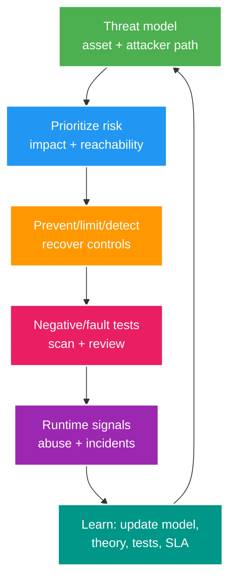

# Phân tích chuyên sâu: Chống lạm dụng, chuỗi cung ứng phần mềm và kiểm thử bảo mật

> Type: `DEEP_DIVE` 
> Domain: `security` 
> Target depth: `D4 — dẫn dắt threat-informed controls, build-chain governance và security evidence/incident feedback loop` 
> Teaching readiness: `TEACHABLE_DRAFT` 
> Status: `DRAFT` 
> Evidence status: `NOT RUN` 
> Prerequisites: [Application security core](../core/application-security-abuse-and-supply-chain.md) 
> Related cases: `SEC-04`, cross-cutting roadmap; [question bank](../../question-bank/application-security-abuse-and-supply-chain.md) 
> Owner: `Project learner; Codex teaches, learner writes back` 
> Updated: `2026-07-26`

## 1. Câu hỏi trung tâm

Làm sao ưu tiên control và finding theo đường tấn công thật thay vì checklist? Làm sao bảo vệ luồng login, chat, gift và viewer trước attacker biết thích nghi mà không tự gây DoS cho user thật? Làm sao chứng minh artifact build/deploy đúng source và rủi ro dependency được quản trị?

## 2. Vòng lặp từ mối đe dọa tới bằng chứng

Mỗi mục trong risk register phải có asset/invariant, actor và điều kiện trước, đường exploit, user/dữ liệu/availability bị ảnh hưởng, control hiện có, evidence, residual risk, owner và SLA. Severity từ scanner không tự quyết định priority; còn phải xem khả năng khai thác, reachability, exposure, compensating control và business impact. Mọi suppression cần lý do, bằng chứng, ngày hết hạn và reviewer.

## 3. Hệ thống chống lạm dụng thích ứng theo rủi ro

Rate limit là control phân tán trên các identity mà attacker có thể xoay. Cần nhiều lớp: IP/network, account, device/session, resource/target, payment method và global. Đặt admission check rẻ trước bước băm password, query DB hoặc fan-out đắt. Token bucket, bulkhead, queue hữu hạn và load shedding bảo vệ capacity. Risk signal không được biến thành metric cardinality vô hạn hoặc kho PII mới.

Account enumeration có thể lộ qua nội dung response, status, timing, email side effect và khác biệt rate limit. Response bên ngoài đồng nhất giúp giảm lộ, nhưng constant time tuyệt đối qua DB/email là không thực tế; hãy giới hạn timing và theo dõi. Email recovery không được để attacker spam nạn nhân. Khóa account theo ngưỡng cứng tạo DoS; ưu tiên friction tăng dần, thông báo, step-up và đường recovery thủ công.

Trong Livestream, bot viewer làm phồng HLL/ZSET/analytics; spam và reconnect làm cạn WebSocket; replay gift phá invariant tiền; report brigading làm quá tải moderation. Mỗi kiểu có động cơ kinh tế và vòng phản hồi vì control mới sẽ làm attacker đổi chiến thuật. Cần simulation hoặc shadow mode, metric false-positive/appeal và rollback an toàn.

## 4. Đồ thị tin cậy của chuỗi cung ứng phần mềm

Đồ thị build đi từ commit/review source → Maven wrapper/JDK → plugin/dependency/repository → CI action/runner/secret → base image → registry/signing → deployment policy. Pin một cạnh không làm các cạnh khác bất biến. Dùng repository đáng tin, kiểm checksum/signature khi hệ sinh thái hỗ trợ, pin CI action/digest, quyền workflow tối thiểu, runner tạm thời, environment được bảo vệ và signing identity tách biệt.

SBOM phải sinh từ artifact/image cuối, có version và lưu cùng provenance. Provenance chứng thực builder, source và parameter; consumer kiểm digest cùng policy. Cả hai không chứng minh code không có lỗ hổng. Reproducible build tăng khả năng so sánh nhưng timestamp, native tool và compiler input vẫn có thể khác. Đường release khẩn cấp vẫn phải giữ review/provenance tối thiểu hoặc audit bù ngay sau đó.

Giảm dependency confusion/typosquatting bằng namespace/repository policy, cấu hình artifact nội bộ và review. Version từ maintainer bị chiếm vẫn có thể được ký đúng; update vẫn cần kiểm reputation, change, test và rollback nhanh. Base image nên pin digest nhưng cũng rebuild/patch định kỳ; pin vĩnh viễn mà không refresh sẽ tích lũy lỗ hổng.

## 5. Bộ kiểm thử bảo mật theo nhiều lớp

Unit/property test bao phủ validator, policy, canonicalization và state machine. Integration test chạy toàn Spring Security chain cùng constraint DB, cache và broker. Contract test kiểm IdP, webhook và event schema. SAST tìm pattern code, SCA tìm component/CVE, secret scan tìm credential, scanner container/IaC tìm cấu hình, DAST kiểm hành vi reachable, fuzz/property test input lỗi, còn load/fault test kiểm cạn tài nguyên. Threat review thủ công tìm business abuse và confused deputy mà tool bỏ sót.

Môi trường test dùng secret/dữ liệu giả và ranh giới configuration giống production; không scan mục tiêu ngoài khi chưa được phép. Triage finding phải nối code, config, dependency version và reproducer. Một lần “scan sạch” chỉ là evidence tại timestamp/tool/config đó, không phải bảo đảm vĩnh viễn.

## 6. Các tình huống hỏng khó

### 6.1. Kẻ tấn công làm cạn CPU bằng bước băm mật khẩu

Login flood chưa xác thực kích hoạt adaptive hash đắt trước admission; CPU bão hòa và health check fail. Đặt cổng syntax, rate và concurrency rẻ trước, giới hạn hash pool, giữ response đồng nhất và reserve capacity cho user hợp lệ. Không âm thầm giảm work factor để sống sót.

### 6.2. Hệ thống phòng thủ sụp vì quá nhiều identity/cardinality

Metric và Redis key theo IP/user/path/reason do attacker điều khiển làm tăng memory và chi phí observability. Chuẩn hóa hoặc bucket label, giới hạn TTL/cardinality, sampling và dùng tín hiệu aggregate. Chỉ giữ raw detail trong security store hữu hạn có kiểm soát truy cập khi thật sự cần.

### 6.3. Vá theo scanner nhưng gây regression

Auto-upgrade major transitive dependency có thể vá CVE nhưng làm hỏng auth parser, gây outage hoặc bypass. Dùng patch branch với compatibility/security test, canary và rollback; lỗ hổng critical đang bị khai thác có thể đi fast path nhưng không bỏ toàn bộ verification. Ghi mitigation tạm thời và deadline.

### 6.4. Pull request đánh cắp secret trong CI

Code từ fork không tin cậy chạy với write token/cloud secret do workflow quá rộng. Tách untrusted build khỏi privileged release, giảm quyền, không cấp secret cho fork job, pin action, yêu cầu approval environment và audit. Control runtime của application không cứu được lớp này.

### 6.5. Artifact độc hại nhưng vẫn có chữ ký hợp lệ

CI hợp lệ bị chiếm vẫn ký artifact độc hại; chữ ký chỉ xác nhận artifact đến từ process đã bị chiếm. Provenance, branch protection, signer cách ly, release hai người và phát hiện hành vi runtime giúp giảm rủi ro. Trust là cả hệ thống, không phải một chữ ký.

## 7. Chẩn đoán và đưa bài học sự cố trở lại hệ thống

Tín hiệu abuse gồm allow/deny theo nhóm lý do hữu hạn, cost/latency, mức tập trung target, account recovery và false-positive/appeal. Tín hiệu supply chain gồm inventory dependency, đường lỗ hổng reachable, kiểm provenance, image digest và deployment identity. Sự cố phải cập nhật threat model, regression/fault test, cách tune control và roadmap, không chỉ vá code.

### 7.1. Ví dụ tính ngân sách chống lạm dụng cho login và chat

Login path có cost sequence: parse/validate rẻ, admission/rate decision, account lookup, password hash đắt, session write và notification. Budget phải giới hạn cả request identity và expensive-work concurrency; chỉ per-IP dễ bị botnet vượt, chỉ per-account cho phép attacker lock/flood victim. Global bulkhead giữ CPU cho authenticated traffic và operations. External response giảm enumeration, internal metric vẫn phân biệt bounded reason. Threshold được canary/shadow trước, theo dõi successful-login impact, recovery demand và false positive.

Chat path thêm long-lived connection, reconnect, destination subscription, SEND rate, payload parsing, moderation và fanout. Limit per connection/account/device/room và global expensive moderation; mute/ban check không được tạo một Redis key/metric label cho mọi attacker string. Khi dependency moderation down, policy degrade phải explicit: queue bounded, text-only basic filters, deny high-risk hoặc load shed—không unbounded buffer.

### 7.2. Từ phát hiện của scanner tới quyết định xử lý

Với một CVE dependency, ghi exact component/version/path trong final artifact, runtime reachability, attacker precondition, affected invariant, exploit/public evidence, compensating controls và upgrade compatibility. Nếu code path không reachable, suppression vẫn có expiry vì configuration/version có thể đổi. Nếu critical/reachable, lập patch/canary/rollback; không auto-merge rồi gọi scanner green là evidence đủ. Test phải target behavior/security boundary có thể regression.

SCA không thấy business BOLA, DAST không thấy poisoned CI, signature không thấy malicious authorized build. Portfolio được chọn từ threat model. Evidence record cần tool/version/config/time/artifact digest và result; nếu không, lần scan sau không so được. Secrets scan finding luôn rotate credential nếu từng commit/publish, kể cả history đã scrub.

### 7.3. Độ tin cậy của bản phát hành và đường xử lý khẩn cấp

Một release statement nên nối source commit được review, build workflow identity, pinned inputs quan trọng, test/security gates, SBOM/provenance, artifact digest/signature, registry và deployment admission. Mỗi link có owner và failure mode. CI có quyền ký/deploy production không nên chạy untrusted pull-request code với secrets. Signer tách biệt và chỉ ký digest từ trusted builder/policy làm giảm một compromised job tự phong artifact.

Emergency fix có thể rút ngắn approval nhưng không bỏ artifact identity, minimal tests, audit và rollback. Sau incident, reconcile change vào mainline, rebuild từ canonical source, verify digest/deployment và review privileges đã dùng. “Break glass” không được trở thành workflow thường xuyên không provenance.

### 7.4. Cổng chất lượng cho bằng chứng bảo mật

Một control chỉ được coi có evidence khi có invariant, test setup, expected/actual result và artifact/log/metric reference không chứa secret. `NOT RUN` phải giữ nguyên trước experiment; document design không được đổi thành `PASS`. Negative test cần chứng minh bypass bị chặn ở real enforcement chain, fault test chứng minh resource/outage behavior, và runtime signal chứng minh có thể phát hiện. Sau mỗi incident, thêm regression và cập nhật threat assumptions/residual risk.

### 7.5. Phân tích mối đe dọa Livestream từng bước

Tài sản gồm account/session, stream control/key, realtime availability, viewer/gift counts, money-like ledger, moderation integrity và private data. Attack paths nối nhau: credential stuffing chiếm creator account, lấy stream key, phát nội dung trái phép; bot reconnect tạo viewer inflation và WebSocket pressure; replay gift/webhook làm ledger sai; brigading báo cáo khiến moderator/tooling overload. Control theo từng hop: session security/step-up, secret audience/rotation, admission/bulkhead, durable idempotency/ledger invariant, rate/reputation và appeal/reconciliation.

Không tối ưu một metric riêng. Chặn bot bằng CAPTCHA quá mức có thể giảm accessibility/conversion; drop reconnect có thể phạt mobile network; aggressive moderation model tạo false positive. Rollout shadow/canary, segment legitimate cohorts, cap experiment risk và có rollback. D4 answer phải nêu business owner chấp nhận residual risk nào và signal nào cho thấy control đang bị attacker thích nghi.

### 7.6. Ví dụ xử lý khẩn cấp một dependency

Khi có RCE trong HTTP library, inventory xác nhận version ở final image và endpoint/parser có reachable không. Immediate mitigation có thể tắt feature/path, WAF rule hoặc network isolation với expiry; song WAF không thay patch. Upgrade branch chạy protocol/security/regression/load tests, canary theo sanitized exploit fixture, verify SBOM/provenance digest rồi deploy. Theo dõi errors/attack attempts và rollback chỉ về version an toàn/mitigated, không mặc nhiên về vulnerable build.

Nếu patch chưa có, accepted risk record có owner, compensating controls, monitoring, deadline và re-evaluation trigger. Nếu exploitation nghi ngờ, xử lý incident: isolate, preserve evidence, rotate possibly exposed credentials và rebuild trusted artifact; chỉ update dependency không chứng minh attacker persistence đã hết.

## 8. Các đánh đổi

Friction mạnh giảm abuse nhưng hại conversion và accessibility. Risk engine tập trung nối tín hiệu nhiều flow nhưng tăng rủi ro privacy và single point. Update dependency tự động giảm độ trễ vá nhưng đòi test/canary mạnh. Hermetic build cải thiện provenance nhưng thêm công bảo trì tool/cache. Chọn theo risk budget và outcome đo được.

## 9. Bài tập diễn đạt lại và tự kiểm tra

> **Bài viết của tôi — `LEARNER TODO`:** threat-to-evidence loop cho login abuse và CI dependency compromise.

1. **Question:** Vì sao CVSS không đủ ưu tiên fix? 
   **Đọc lại nếu bí:** mục 2 và 4. 
   **Một câu trả lời tốt phải có:** reachability/exposure/exploit/business impact, compensating control, provenance and owner/SLA. 
   **My answer:** `LEARNER TODO`
2. **Question:** Rate limit có thể tự gây DoS/cardinality abuse thế nào? 
   **Đọc lại nếu bí:** mục 3 và 6.1–6.2. 
   **Một câu trả lời tốt phải có:** expensive work order, identities, lockout, key/metric cardinality, bounded resources and recovery. 
   **My answer:** `LEARNER TODO`
3. **Question:** Signed artifact chưa chứng minh điều gì? 
   **Đọc lại nếu bí:** mục 4 và 6.5. 
   **Một câu trả lời tốt phải có:** integrity/origin scope, compromised builder/authorized malicious source, provenance/review/isolation and vulnerability distinction. 
   **My answer:** `LEARNER TODO`

## 10. Tài liệu tham khảo và trình bày lại

- [NIST SP 800-218 SSDF](https://csrc.nist.gov/pubs/sp/800/218/final)
- [OWASP ASVS](https://owasp.org/www-project-application-security-verification-standard/)
- [SLSA Specification](https://slsa.dev/spec/)

- [ ] Tôi nối threat tới evidence/residual risk.
- [ ] Tôi thiết kế adaptive abuse control không self-DoS.
- [ ] Tôi map build trust graph/provenance.
- [ ] Evidence vẫn `NOT RUN`.
