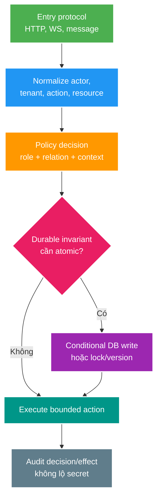

# Phân tích chuyên sâu: Chính sách phân quyền, TOCTOU và ranh giới giữa các giao thức

> Type: `DEEP_DIVE` 
> Domain: `security` 
> Target depth: `D4 — thiết kế policy nhất quán qua HTTP/async/WebSocket và xử lý authorization race bằng atomic invariant` 
> Teaching readiness: `TEACHABLE_DRAFT` 
> Status: `DRAFT` 
> Evidence status: `NOT RUN` 
> Prerequisites: [Request/method authorization core](../core/request-and-method-authorization.md) 
> Related cases: `SEC-06`, `RT-01`; [question bank](../../question-bank/request-and-method-authorization-boundaries.md) 
> Owner: `Project learner; Codex teaches, learner writes back` 
> Updated: `2026-07-26`

## 1. Câu hỏi trung tâm

Làm sao một policy giữ nguyên ý nghĩa khi cùng use case được gọi qua controller, scheduler, message consumer và WebSocket? Làm sao việc kiểm tra ownership/status không bị cũ trước khi mutation xảy ra? Làm sao tránh biểu thức phân quyền rải rác, khó audit nhưng cũng không tạo một “god authorization service” ôm mọi trách nhiệm?

## 2. Mô hình hóa chính sách phân quyền

Đầu vào của quyết định gồm `principal + action + resource + environment/current state`: ai đang làm, làm gì, trên tài nguyên nào và trong trạng thái nào. Kết quả là allow/deny, nhóm lý do an toàn và nghĩa vụ kèm theo như audit, xác thực tăng cường hoặc lọc field. Claim đăng nhập chỉ là một phần đầu vào; trạng thái resource phải đến từ kho dữ liệu sở hữu nó. Điểm thực thi policy nằm ở entry point/use case, còn logic quyết định có thể nằm trong component, query hoặc invariant của service.

Bước chuẩn hóa không được tin role/tenant do message hoặc user tự gửi. Principal HTTP đến từ `SecurityContext`; service identity đến từ mTLS, client credential hoặc metadata broker đã xác thực; delegated actor phải nằm trong envelope có chữ ký và đã kiểm tra. Nhãn “internal” không đồng nghĩa được tin cậy toàn quyền.

## 3. TOCTOU và cách thiết kế câu query

Mẫu nguy hiểm là load resource, so owner, gọi service ngoài rồi mới mở transaction update. Ownership hoặc status có thể đổi giữa hai thời điểm; đó là TOCTOU, “kiểm tra một lúc nhưng sử dụng ở lúc khác”. Với mutation, đưa predicate phân quyền vào conditional SQL như `UPDATE ... WHERE id=? AND owner_id=? AND status=?`, hoặc lock/version trong cùng transaction. Khi số row ảnh hưởng bằng 0, service phân loại not-found, denied hay conflict theo API contract mà không làm lộ thông tin bị che.

Phân quyền đọc cũng có race nhưng tác động và consistency contract khác. Projection có điều kiện `WHERE owner_id/tenant_id` tránh lấy thừa rồi vô tình serialize dữ liệu không thuộc quyền. Nhánh admin override phải viết tường minh và vẫn giữ tenant predicate; không bỏ ranh giới chỉ vì một chuỗi role. Với bulk operation, hoặc authorize toàn tập trước, hoặc trả outcome từng item; partial failure phải được định nghĩa.

Cache quyết định policy nguy hiểm khi membership, ban hoặc role cần được thu hồi nhanh. Key cache phải gắn policy version, tenant và quan hệ resource; đồng thời có TTL, invalidation và cách xử lý khi cache hỏng. Negative cache tạo stale deny, còn positive cache tạo stale allow nguy hiểm hơn. Với action nhạy cảm, bằng chứng allow thường phải ngắn hạn hoặc kiểm lại owner; quyết định cuối phụ thuộc availability policy đã công bố.

## 4. Thực thi quyền nhất quán qua nhiều giao thức

Trên HTTP, rule URL chỉ là cổng thô; method/use case vẫn quyết định theo action và resource. Trên WebSocket, phải xác thực `CONNECT`, phân quyền `SUBSCRIBE` theo destination/resource, rồi phân quyền từng `SEND` theo action, payload và trạng thái mute/ban hiện tại. Connection sống lâu phải được kiểm lại khi policy đổi. Quyền subscribe không tự cấp quyền gửi message.

Việc đọc được message từ broker không chứng minh quyền của end user. Envelope cần event/command ID, producer đáng tin, tenant, actor hoặc mục đích của service, schema/version và idempotency. Consumer vẫn kiểm invariant nghiệp vụ. Không replay command cũ sau khi actor bị thu hồi quyền, trừ khi hợp đồng nói quyền đã được chốt lúc nhận command. Phải phân biệt event fact như `GiftAccepted` với yêu cầu command như `SendGift`.

Scheduler và admin tooling dùng service account có least privilege, scope tường minh, ticket/approval khi cần, cùng invariant và audit như đường người dùng. Script gọi repository trực tiếp bỏ qua application policy nên phải đi qua quy trình vận hành có kiểm soát.

## 5. Các tình huống hỏng khó

### 5.1. Tranh chấp khi chuyển quyền sở hữu

User A vượt qua bước kiểm owner; ngay sau đó ownership chuyển cho B nhưng update của A vẫn commit. Dùng barrier giữa check và write để tái hiện. Conditional update hoặc version làm A thất bại với 0 row/conflict. Nếu nghiệp vụ cho phép cả chuyển quyền lẫn update theo một thứ tự, phải định nghĩa thứ tự tuần tự nào hợp lệ thay vì luôn deny chung chung.

### 5.2. Khoảng trống thu hồi quyền trên WebSocket

User đã đăng nhập và subscribe, sau đó bị ban nhưng connection cũ vẫn `SEND`. Chỉ kiểm ở handshake để quyền sống hàng giờ. Cần kiểm ban/version tại thời điểm message, phát event ngắt connection/thu hồi subscription, cache hữu hạn và audit. Khi Redis hỏng, đường kiểm ban không được fail-open mù quáng.

### 5.3. Consumer trở thành confused deputy (thực thi hộ sai quyền)

HTTP service kiểm owner rồi publish `DeleteStream(streamId)` mà không mang actor/policy context. Consumer đặc quyền xóa mọi ID nhận được; producer bị chiếm hoặc broker replay sẽ đi vòng qua cổng HTTP. Nên publish fact sau mutation đã authorize và commit, hoặc dùng command envelope được xác thực với actor/action cùng invariant ở consumer. Broker ACL, schema và idempotency bổ sung chứ không thay thế authorization.

### 5.4. Chính sách bị lệch giữa các entry point

Tài liệu nói moderator được mute, URL lại yêu cầu `ADMIN`, method cho `MODERATOR`, còn WebSocket cho mọi user đã đăng nhập. Bằng chứng là ma trận policy được sinh và so sánh giữa các protocol. Business rule canonical cùng fixture dùng chung giảm drift, nhưng component chung không được che nghĩa vụ riêng của từng protocol.

## 6. Chẩn đoán và thí nghiệm

Log quyết định ở mức hữu hạn: policy ID/version, ID actor/tenant/resource không nhạy cảm, action, result, nhóm lý do, protocol đầu vào và correlation ID. Không trả lý do deny nội bộ nếu nó làm lộ resource hay membership. Metric label không dùng raw ID.

Test gồm ma trận role × owner × state; inventory path/method; gọi service trực tiếp và entry point thay thế; hai transaction với barrier TOCTOU; WebSocket connect/subscribe/send rồi revoke; consumer nhận actor giả/replay; policy cache stale hoặc down. Tất cả vẫn `NOT RUN` cho tới khi case được kích hoạt.

### 6.1. Từ câu chính sách tới bằng chứng có thể chạy

Policy “owner hoặc admin được sửa stream đang ở DRAFT” phải được tách thành input và invariant: actor ID/roles/tenant, action `stream:update`, resource ID/owner/tenant/status và policy version. Với owner thường, SQL có thể là conditional update theo `id + owner_id + tenant_id + status + version`; admin là nhánh explicit vẫn giữ tenant/status. Kết quả 0 row không tự nói nguyên nhân, nên service quyết định contract: trả 404 để tránh enumeration, 403 khi existence được phép lộ, hoặc 409 khi version conflict đã biết. Điều quan trọng là behavior nhất quán và test được, không phải một status code áp cho mọi API.

Test matrix phải có happy path và các “near miss”: đúng role nhưng sai tenant, đúng owner nhưng status đã chuyển, admin nhưng tenant ngoài scope, resource đổi owner giữa read/write, stale version, direct service call và alternate protocol. Negative tests chứng minh không có đường vòng; chỉ test controller annotation không chứng minh scheduler/consumer/WebSocket giữ invariant.

### 6.2. Quyền được chốt lúc nhận lệnh hay kiểm tra lại lúc thực thi

Một command có thể đại diện yêu cầu còn phải authorize khi consume, hoặc quyết định đã được authorize/committed ở producer và event chỉ công bố fact. Hai semantics không được trộn. Ví dụ `DeleteStreamRequested(actor, streamId)` cần trusted actor context và consumer re-check state. `StreamDeleted(eventId, streamId, deletedAt)` là fact sau transaction; consumer analytics không “authorize lại” deletion nhưng phải xác thực producer/schema và idempotency. Nếu queue delay dài mà actor bị thu hồi quyền, team phải chọn authority tại acceptance hay execution dựa trên nghiệp vụ, rồi ghi decision vào contract.

Delegation cũng phải attenuation. Service A không nên gửi user role thô để B tin; B nhận service identity, explicit delegated action/resource/tenant và evidence phù hợp. Nếu A là policy decision point duy nhất, B vẫn giới hạn command schema và invariant để compromised A không trở thành universal deputy. Audit cần phân biệt initiating user, calling service và effective authority.

### 6.3. Triển khai phiên bản policy và khôi phục khi lỗi

Policy change giống schema migration. Triển khai code hiểu policy version mới, chạy shadow decision để so old/new, kiểm false-deny/false-allow, rồi enforce theo canary. Với central policy service, timeout không mặc nhiên allow: action read-public có thể dùng bounded last-known-good, còn transfer/secret/admin write thường deny hoặc degrade to manual path. Cache phải gắn policy/data version; rollback policy không được làm stale allow sống quá TTL.

Incident “banned user vẫn gửi chat” cần timeline: ban owner commit, invalidation publish/apply, connection policy version, từng SEND decision và effect. Recovery gồm disconnect/recheck active connections, sửa cache/backlog, ngăn tiếp tục effect và reconcile messages nếu business cho phép. Chỉ restart WebSocket nodes không chứng minh nguyên nhân hay ngăn tái diễn.

### 6.4. Ví dụ lập bảng kiểm kê policy

Lập inventory theo use case, không theo annotation: `action`, actor types, resource/tenant relation, mutable states, entry points, decision owner, atomic enforcement, response disclosure, audit và tests. Ví dụ `chat:send` có HTTP moderation tool, WebSocket SEND và replayed command; `stream:update` có REST và admin job. Inventory làm lộ entry point chưa có owner, policy cùng tên nhưng khác nghĩa và coarse route đang gánh business rule.

Khi policy dùng dữ liệu từ nhiều owner, không thể tạo atomic transaction tùy ý. Chọn source-of-truth/local projection với version và ghi rõ staleness budget; high-risk action có thể synchronous check hoặc saga reservation. Nếu policy service down, cached “allow” cho delete/admin có rủi ro khác cached “deny” cho public read. Decision record cần per-action fail behavior, không một global fail-open/fail-closed switch.

Review D4 phải trả lời: attacker có thể đổi tenant/resource ID ở đâu; quyền có thể bị revoke trong window nào; alternate entry nào bỏ qua check; audit có nối actor-service-effect không; và recovery có undo/quarantine effect hay chỉ chặn request mới. Đây là phần biến policy từ code expression thành operable security boundary.

## 7. Đánh đổi kiến trúc

Policy nhúng trong code dễ debug nhưng dễ lặp. Policy service tập trung hỗ trợ nhiều ngôn ngữ và governance, đổi lại thêm network hop, dependency availability và dữ liệu có thể cũ; local enforcement vẫn cần. Policy-as-code cải thiện review/test nhưng tăng độ phức tạp và nhu cầu lấy resource. Row-Level Security của database thêm lớp bảo vệ tenant, nhưng làm session identity, connection pool, migration và vận hành khó hơn; application vẫn phải phân quyền action.

## 8. Interview nâng cao

Ở level Senior, trình bày các lớp gate cùng BOLA/TOCTOU. Ở level Architect, chuẩn hóa policy qua protocol, cache/revocation và audit. Ở level Expert, phân tích thời điểm chốt quyền của command, policy service bị partition, tương tác RLS/application và consistency semantics.

## 9. Bài tập diễn đạt lại và tự kiểm tra

> **Bài viết của tôi — `LEARNER TODO`:** model một update stream qua HTTP và một SEND qua WebSocket, gồm actor/action/resource/state/atomic gate.

1. **Question:** Authorization check và write atomic khi nào? 
   **Đọc lại nếu bí:** mục 3 và 5.1. 
   **Một câu trả lời tốt phải có:** mutable relation/state, TOCTOU, conditional predicate/lock/version, outcome semantics. 
   **My answer:** `LEARNER TODO`
2. **Question:** Edge authorization có đủ cho consumer không? 
   **Đọc lại nếu bí:** mục 4 và 5.3. 
   **Một câu trả lời tốt phải có:** changed trust boundary, command/fact, actor/service purpose, broker ACL, consumer invariant/idempotency. 
   **My answer:** `LEARNER TODO`
3. **Question:** Long-lived WebSocket revoke quyền thế nào? 
   **Đọc lại nếu bí:** mục 4 và 5.2. 
   **Một câu trả lời tốt phải có:** connect/subscribe/send gates, policy version/cache, event disconnect, outage policy and evidence. 
   **My answer:** `LEARNER TODO`

## 10. Nguồn chính thức và trình bày lại

- [Spring Security — Authorization Architecture](https://docs.spring.io/spring-security/reference/servlet/authorization/architecture.html)
- [OWASP API1:2023 Broken Object Level Authorization](https://owasp.org/API-Security/editions/2023/en/0xa1-broken-object-level-authorization/)

- [ ] Tôi diễn đạt policy input/decision/obligation.
- [ ] Tôi xử lý TOCTOU tại owner boundary.
- [ ] Tôi áp policy xuyên HTTP/WS/async.
- [ ] Evidence vẫn `NOT RUN`.
