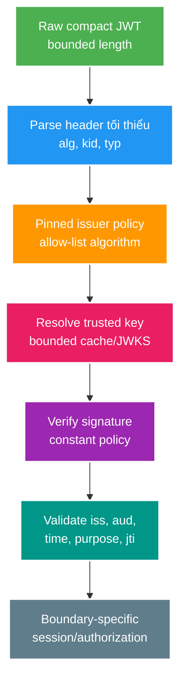

# Phân tích chuyên sâu: Kiểm tra JWT, xoay khóa và phát hiện refresh token bị dùng lại

> Type: `DEEP_DIVE` 
> Domain: `security` 
> Target depth: `D4 — chẩn đoán token substitution/key-rotation/reuse race và dẫn dắt rollout nhiều verifier` 
> Teaching readiness: `TEACHABLE_DRAFT` 
> Status: `DRAFT` 
> Evidence status: `NOT RUN` 
> Prerequisites: [Token purpose và session semantics](../core/token-purpose-and-session-semantics.md) 
> Related cases: `SEC-01`; [question bank](../../question-bank/access-refresh-token-and-session-semantics.md) 
> Owner: `Project learner; Codex teaches, learner writes back` 
> Updated: `2026-07-26`

## 1. Câu hỏi trung tâm

Core đã dạy tính hợp lệ của token theo đúng ranh giới sử dụng. Phần này trả lời ba câu khó hơn: attacker có thể điều khiển parser và bước chọn khóa ra sao; xoay signing key qua nhiều service thế nào để không gây outage; và khi refresh đồng thời, làm sao phân biệt retry hợp lệ với token bị đánh cắp rồi dùng lại?

## 2. Pipeline kiểm tra token bên trong resource server

Header là input do attacker kiểm soát. `alg` phải khớp allowlist của verifier, không để token tự chọn thuật toán. `kid` chỉ là khóa tra cứu trong tập key đáng tin; không nối nó vào filesystem, SQL hay URL. `jku`/`x5u` không được khiến verifier tải endpoint tùy ý. Issuer configuration phải được chốt trước để quyết định JWKS source. Kích thước token, header và độ phức tạp claim cũng phải giới hạn để chống lạm dụng parser, JSON và crypto.

Algorithm confusion xảy ra khi verifier chấp nhận `none`, trộn cách dùng key đối xứng/bất đối xứng hoặc dùng API thư viện quá chung. Cách phòng thủ là validator/config riêng cho từng token profile, thuật toán và key type tường minh, cùng bộ token âm để test. Chỉ sau khi chữ ký hợp lệ mới kiểm semantic claim; không đọc claim để route quyền trước khi thiết lập trust, ngoại trừ phần header tối thiểu cần chọn candidate key một cách an toàn.

## 3. Vòng đời khóa và triển khai trên hệ phân tán

Key đi qua các trạng thái: được sinh và bảo vệ offline → công bố chỉ để verify → active để ký → sắp nghỉ nhưng còn verify → bị revoke hoặc hủy. Xoay khóa có kế hoạch đi theo thứ tự:

1. Sinh K2 bằng hệ quản lý key đã phê duyệt; public key/JWKS có `kid` ổn định.
2. Công bố K2 tới cache của verifier trước; canary kiểm token K2 trong khi signer vẫn dùng K1.
3. Chuyển signer sang K2 và theo dõi lỗi unknown-`kid`/signature.
4. Giữ K1 ở trạng thái verify-only ít nhất bằng lifetime lớn nhất của token cộng clock skew và thời gian queue/offline client.
5. Cho K1 nghỉ rồi dùng negative test để chắc token K1 bị từ chối sau cutoff.

Verifier không được refresh JWKS không giới hạn cho mọi `kid` lạ, vì attacker sẽ tạo refresh storm. Dùng cache hữu hạn, single-flight refresh có rate limit, HTTPS/issuer đáng tin, last-known-good và maximum-stale policy. Dùng key cache khi IdP tạm down giữ availability cho traffic hợp lệ, nhưng sự cố key bị lộ đòi revoke nhanh. Kênh/config/version khẩn cấp phải được diễn tập trước.

Dùng chung key đối xứng cho nhiều service khiến mọi verifier cũng có khả năng ký; khi một service bị chiếm, blast radius lớn và khó truy trách nhiệm. Key bất đối xứng tách signer khỏi resource server. Tuy nhiên crypto bất đối xứng không sửa lỗi thiếu audience/purpose và còn thêm công việc KMS, JWKS cùng xoay khóa.

## 4. Máy trạng thái khi xoay refresh token

Một refresh family có family ID, token ID/hash, generation, status và session/user. Successful refresh atomically chuyển current token `ACTIVE → USED`, tạo next generation và lưu link/outcome. Hai requests cùng old token:

- winner commit next token;
- loser thấy old token USED;
- policy cần phân biệt concurrent retry do lost response với reuse từ attacker.

Có thể trả lại outcome đã lưu trong một cửa sổ retry rất ngắn nếu có bằng chứng gắn với client/transaction, nhưng lưu refresh token mới dạng plaintext để replay response làm tăng nguy cơ lộ secret. Hoặc coi mọi reuse là tấn công và revoke cả family; an toàn hơn nhưng retry do mạng có thể làm user bị logout. Một lựa chọn khác là bind idempotency key/request nonce để retry lấy kết quả có kiểm soát. Đây là quyết định sản phẩm và threat model, không có thuật toán rotation “miễn phí”.

Chỉ lưu hash của token nếu không cần khôi phục plaintext. Unique constraint trên token ID/hash cùng conditional status update ngăn hai winner. Khi phát hiện reuse và revoke family, phải vô hiệu descendant/session hiện tại, audit và thông báo theo policy. Race giữa nhiều node phải dựa trên durable transaction, không phải lock trong memory.

## 5. Các tình huống hỏng khó

### 5.1. `kid` lạ gây bão tải JWKS

Attacker gửi hàng nghìn JWT rác có `kid` ngẫu nhiên. Nếu mỗi request đều kích hoạt JWKS fetch, outbound pool, IdP và thread bị cạn khiến đăng nhập hợp lệ thất bại. Bằng chứng là số outbound call tăng theo số `kid` khác nhau và IdP latency tăng. Giảm thiểu bằng tập key cache, tối đa một refresh mỗi issuer/cửa sổ thời gian, giới hạn rate/kích thước token và từ chối `kid` lạ sau refresh hữu hạn. Đánh đổi là nhận K2 hợp lệ chậm hơn, nên signer phải công bố K2 chủ động.

### 5.2. Xoay khóa làm các instance hiểu hai tập khóa khác nhau

Một nửa instance API có K2, nửa còn lại chỉ K1; load balancer tạo lỗi 401 lúc có lúc không. Signature failure nhìn giống tấn công hoặc token hết hạn. Bằng chứng cần correlation theo instance, version và key-set generation, probe tổng hợp K1/K2 cùng timeline deploy. Giảm thiểu bằng triển khai verifier-first, readiness gate và rollback kế hoạch. Tuyệt đối không “thử bỏ verify”.

### 5.3. Response refresh bị mất sau khi server đã commit

Server commit việc đổi T1→T2 nhưng response bị mất. Client retry T1, detector có thể hiểu là đánh cắp và revoke family. Tái hiện bằng cách ngắt connection ngay sau commit. Các lựa chọn là idempotency identity, grace period hữu hạn với kết quả đã lưu, hoặc yêu cầu đăng nhập lại. Grace period mở cửa cho attacker replay trong khoảng đó, nên phải chọn và đo có chủ đích.

### 5.4. Dùng token đúng chữ ký nhưng sai mục đích ở service khác

Service B chấp nhận token dành cho A chỉ vì cùng issuer/key mà không kiểm audience; attacker dùng lại authority ở nơi không được phép. Cách sửa là audience/scope theo resource, token exchange/attenuation và service identity. Kiểm ở gateway chưa đủ nếu traffic nội bộ hoặc token forwarding có đường bypass.

## 6. Ranh giới liên tầng, phiên bản và chẩn đoán

Spring Security/JJWT APIs thay đổi giữa lines; exact default validators/cache behavior phải pin version. Reverse proxy có thể giới hạn header trước app; clock sync ảnh hưởng time claims; KMS/JWKS DNS/network thuộc auth availability. Diagnostic safe fields: issuer ID allowlisted, audience category, token purpose, `kid` bounded, error code, verifier instance/version và correlation — không raw token/signature/claims PII.

Experiment plan: table-driven negative token corpus; K1/K2 mixed fleet simulation; unknown-kid flood with mock JWKS counter; concurrent refresh barrier; post-commit disconnect; family final-state assertions. Mọi result hiện `NOT RUN`.

### 6.1. Ví dụ chẩn đoán: cùng là 401 nhưng khác lớp lỗi

Không nên bắt đầu bằng giả thuyết “JWT library bị lỗi”. Hãy đi đúng thứ tự của pipeline. Nếu token quá lớn, malformed hoặc header có algorithm ngoài allow-list, request phải bị loại trước key lookup. Nếu `kid` không có trong cache, kiểm tra signer rollout và số lần JWKS refresh; một `kid` lạ không được biến thành outbound request không giới hạn. Nếu chữ ký đúng nhưng `aud` sai, đây là token-substitution hoặc cấu hình resource profile, không phải key rotation. Nếu time claim fail đồng loạt trên một node, so sánh clock offset và timezone-independent epoch; tăng skew chỉ che clock incident. Nếu signature fail ngẫu nhiên theo instance, correlate verifier image/config/key-set generation thay vì log token.

Một diagnostic record an toàn có thể chứa `validation_stage`, error category, issuer alias, expected audience alias, bounded `kid`, verifier build và correlation ID. Nó không chứa compact token, full claims hay raw signature. Dashboard tách malformed, unknown-key, invalid-signature, expired/not-yet-valid, issuer/audience/purpose và revoked-session. Nếu gom tất cả thành `invalid_token`, đội vận hành không phân biệt attack traffic, deployment split và clock outage.

### 6.2. Ví dụ lịch sử refresh từng bước

Giả sử family F đang ở generation 7 với hash H7. R1 và R2 cùng đọc credential T7. R1 thắng conditional update `ACTIVE generation=7 -> USED` rồi tạo generation 8 trong cùng transaction. R2 không được tự tạo generation 9 chỉ vì nó đọc trước; affected rows bằng 0 buộc nó đọc trạng thái đã commit. Nếu policy là strict reuse detection, R2 đánh dấu family compromised và revoke generation 8. Nếu product cho phép retry do mất response, request cần một proof/idempotency identity đã được bind trước; chỉ “hai request gần nhau” không đủ vì attacker cũng có thể replay gần nhau.

Crash trước commit để T7 dùng lại; crash sau commit trước response tạo retry ambiguity; crash sau response không cần server replay outcome nếu client đã lưu T8. Ba điểm này phải được fault-inject riêng. Assertion không chỉ là HTTP code mà gồm đúng một successor, terminal family state theo policy, access token cũ/mới có còn dùng được không và audit reason. In-memory mutex làm test một JVM pass nhưng không chứng minh multi-node; unique constraint hoặc conditional update ở durable owner mới là bằng chứng.

### 6.3. Version và migration boundary

Khi nâng Spring Security hoặc JWT library, đọc release notes cho default clock skew, accepted algorithms, key resolver và exception mapping. Chạy lại negative corpus trước khi rollout; không suy từ compile success rằng validator semantics giữ nguyên. Khi thêm claim `purpose`, `aud` mới hoặc `typ`, triển khai verifier hiểu cả old/new profile trước, sau đó signer phát new, cuối cùng mới bắt buộc new sau max lifetime. Migration ngược thứ tự biến token hợp lệ cũ thành outage hoặc giữ compatibility fallback vô thời hạn.

Emergency key compromise khác planned rotation: ngừng signer cũ, thu hồi K1 càng sớm càng tốt, chấp nhận re-auth/availability loss theo incident policy và tìm token đã phát trong exposure window. Last-known-good cache phục vụ outage bình thường nhưng không được vượt explicit revoked-key generation. Vì vậy cache cần nhận được “key set version/emergency deny” chứ không chỉ TTL.

Decision record tối thiểu phải ghi token profile, issuer/audience/purpose, algorithm/key owner, access lifetime, refresh-family rule, reuse policy, planned/emergency rotation sequence, JWKS outage behavior và evidence. Nhờ vậy một service mới không chỉ copy parser rồi vô tình chấp nhận profile rộng hơn. Review lại record khi thêm issuer, audience, library major version hoặc thay đổi logout SLO.

## 7. Quyết định kiến trúc

Opaque refresh token + durable session state thường đơn giản reuse/revoke hơn JWT refresh, vì self-contained claims không mang nhiều lợi ích khi DB lookup vẫn bắt buộc. JWT access token phù hợp distributed verification, nhưng short lifetime/audience attenuation and key operations required. Mature IdP có protocol hardening nhưng configuration/client mapping vẫn có thể sai.

## 8. Phỏng vấn nâng cao

**Senior:** validator pipeline và refresh rotation concurrency. **Architect:** verifier-first key rollout, JWKS outage/cache and multi-service audience. **Expert:** unknown-kid amplification, emergency compromise rotation, retry-vs-reuse ambiguity and residual risk.

## 9. Bài tập diễn đạt lại và tự kiểm tra

> **Bài viết của tôi — `LEARNER TODO`:** vẽ key state lifecycle và refresh family state machine; kể ba failure windows.

1. **Question:** `kid` được dùng an toàn thế nào? 
   **Đọc lại nếu bí:** mục 2–3. 
   **Một câu trả lời tốt phải có:** untrusted hint, pinned issuer/key set, bounded refresh/cache, algorithm/key type và no arbitrary fetch/path. 
   **My answer:** `LEARNER TODO`
2. **Question:** Rotate K1→K2 không outage ra sao? 
   **Đọc lại nếu bí:** mục 3 và 5.2. 
   **Một câu trả lời tốt phải có:** publish verifier-first, signer switch, overlap from lifetime, telemetry, retirement/emergency distinction. 
   **My answer:** `LEARNER TODO`
3. **Question:** Refresh reuse có thể là retry hợp lệ khi nào? 
   **Đọc lại nếu bí:** mục 4 và 5.3. 
   **Một câu trả lời tốt phải có:** commit/response gap, atomic generation, idempotency/grace/re-auth alternatives và theft residual risk. 
   **My answer:** `LEARNER TODO`

## 10. Nguồn chính thức và trình bày lại

- [RFC 8725 — JWT BCP](https://www.rfc-editor.org/rfc/rfc8725)
- [RFC 9700 — OAuth Security BCP](https://www.rfc-editor.org/rfc/rfc9700)

- [ ] Tôi chẩn đoán parser/key/claim layers riêng.
- [ ] Tôi thiết kế key rollout và failure telemetry.
- [ ] Tôi xử lý concurrent refresh bằng durable state.
- [ ] Evidence vẫn `NOT RUN`.
