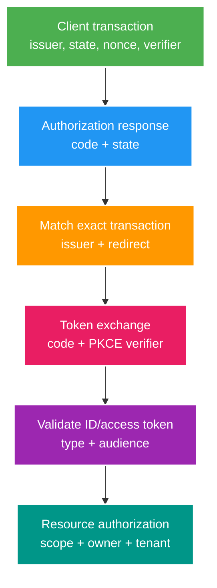

# Phân tích chuyên sâu: OAuth2/OIDC, PKCE, resource server và xoay khóa

> Type: `DEEP_DIVE` 
> Domain: `security` 
> Target depth: `D4 — chẩn đoán protocol mix-up, token substitution, JWKS outage/rotation và multi-service delegation` 
> Teaching readiness: `TEACHABLE_DRAFT` 
> Status: `DRAFT` 
> Evidence status: `NOT RUN` 
> Prerequisites: [OAuth2/OIDC core](../core/oauth2-oidc-resource-server-and-token-lifecycle.md) 
> Related cases: `SEC-04`; [question bank](../../question-bank/oauth2-oidc-resource-server-and-token-lifecycle.md) 
> Owner: `Project learner; Codex teaches, learner writes back` 
> Updated: `2026-07-26`

## 1. Câu hỏi trung tâm

Làm sao gắn authorization response với đúng browser transaction, issuer và client? Resource server chống token substitution cùng JWKS bị chiếm hoặc stale thế nào? Làm sao truyền identity/authority của user qua nhiều service mà không biến access token thành credential vạn năng?

## 2. Trạng thái của protocol và cách chống mix-up attack

Client hỗ trợ nhiều issuer phải bind authorization response với issuer đã chọn lúc bắt đầu. Nếu không, mix-up attack có thể gửi code tới token endpoint của attacker hoặc làm client nhận token từ issuer sai. Lưu transaction an toàn ở server gồm state, issuer, redirect URI, PKCE verifier, nonce, thời điểm tạo và trạng thái dùng một lần. Không nhét redirect nhạy cảm tùy ý vào state; destination sau login phải được allowlist riêng.

Authorization code chỉ dùng một lần và bind với client, redirect cùng challenge. PKCE dùng `S256` và verifier entropy cao, không dùng `plain` trừ ranh giới chuẩn bất khả kháng. Native app dùng claimed HTTPS/app link hoặc loopback theo BCP, không dùng custom URI nếu chưa phân tích hijack. Browser app cần SameSite, cookie và CSRF control phù hợp với BFF hay SPA.

## 3. Phân loại token và lỗi dùng token sai mục đích

Kiểm ID token gồm issuer chính xác, audience/client ID, `azp` khi có nhiều audience, nonce, time và signature. Profile của access-token JWT chứa audience của resource cùng claim phân quyền; ID token mô tả identity cho client đăng nhập nhưng không phải authority gọi API. Resource server phải từ chối token thiếu audience của nó dù token dùng cùng issuer/key.

Mẫu confused deputy nhiều service: API A nhận token dành cho A rồi forward sang B; B chấp nhận vì audience quá rộng. Nên token exchange để lấy token giảm quyền cho B, hoặc dùng service credential kèm actor context khi policy cần; lựa chọn khác là B authorize A theo trust contract đã ghi. Không forward refresh token. Tên scope cần governance để `admin` không mang nghĩa mơ hồ giữa các service.

Claim có thể stale sau khi role/tenant đổi. Có thể dùng token lifetime ngắn, step-up hoặc kiểm current state cho action nhạy cảm, entitlement version hay introspection; mỗi cách có đánh đổi latency/availability. Không dùng profile claim mà user tự sửa làm authority.

## 4. Hành vi của JWKS cache khi xảy ra lỗi

URL discovery/JWKS của issuer là configuration, không lấy từ token. Kiểm TLS/host và cache metadata. Với `kid` lạ, chỉ làm một single-flight refresh hữu hạn rồi từ chối; bão `kid` ngẫu nhiên không được tạo một fetch mỗi request. Có thể giữ last-known-good trong outage tạm thời theo max-stale, nhưng policy khẩn cấp khi key bị revoke có thể phải deny. Metric phải tách lỗi network, configuration, unknown-key, signature và claim mà không lộ token.

Xoay khóa theo receiver-first như phần JWT: verifier nhận key trước signer dùng key. Phải test cache nhiều region và clock skew. Chốt algorithm/key type; `kid` trùng hoặc key set quay lùi là cảnh báo vận hành. Nếu JWKS bị chiếm, signature vẫn có thể “pass”; chuỗi trust còn gồm vận hành issuer, DNS, TLS, configuration và provenance.

## 5. Các tình huống hỏng khó

### 5.1. Login CSRF làm đăng nhập nhầm tài khoản

Attacker bắt đầu login bằng tài khoản của chính mình rồi gửi callback/code link cho nạn nhân. Client không bind state sẽ đăng nhập trình duyệt nạn nhân vào tài khoản attacker; hành động và dữ liệu nạn nhân sau đó lộ sang attacker. Transaction state dùng một lần và bind với browser session ngăn lỗi này; nonce một mình không chống CSRF.

### 5.2. Chuỗi tấn công qua open redirect

Callback đã đăng ký nhưng chấp nhận `next=https://evil` tùy ý có thể làm code, token hoặc session artifact rò qua redirect/referrer. Callback phải khớp chính xác, còn destination tương đối sau login có allowlist riêng; không wildcard cả domain rộng.

### 5.3. Leo thang quyền do ánh xạ scope quá rộng

Mapper chung biến mọi chuỗi `roles`/`scope` thành Spring authority; một claim mới từ issuer có thể vô tình cấp admin. Phải allowlist issuer, client, token profile và ánh xạ tường minh. Contract test gửi claim/scope lạ và mặc định least privilege.

### 5.4. Bão request JWKS khi xoay khóa

Signer dùng K2 trước khi cache của region nhận key; request hợp lệ trả 401, client retry và mỗi API lại fetch JWKS. Cần single-flight/rate limit, synthetic probe theo giai đoạn và không cache failure vĩnh viễn. Deployment gate phải quan sát mọi region/service.

### 5.5. Giả định sai rằng front-channel logout đã thu hồi mọi token

Client xóa cookie nhưng refresh token hoặc mobile session vẫn còn; hoặc logout URL của IdP nhận post-logout redirect do attacker điều khiển. Phải tách local session, RP-initiated IdP session, token revocation và lifetime của access JWT; kiểm redirect/state theo chuẩn và provider.

## 6. Phòng lab chẩn đoán

Dùng test IdP tuân chuẩn. Bao phủ issuer/audience/token type sai; state/nonce thiếu hoặc lệch; code bị đánh cắp nhưng không có verifier; code reuse; biến thể redirect; bão unknown-`kid`, JWKS down, xoay K1–K2; mapper nhận claim lạ; và các ranh giới logout. Lưu protocol error đã làm sạch cùng số lần gọi. Bằng chứng hiện `NOT RUN`.

### 6.1. Ví dụ một browser transaction hoàn chỉnh

Khi bắt đầu login, client tạo transaction server-side gồm random state, PKCE verifier/challenge, selected issuer, exact redirect URI, nonce, creation time và post-login path đã allowlist. Browser chỉ mang opaque transaction handle trong cookie/state được bind phù hợp. Callback phải tìm đúng transaction chưa dùng, so constant-time state, xác nhận issuer/endpoint, rồi exchange code một lần với verifier. Sau token response, ID token được validate cho client login; access token được validate theo resource profile hoặc chuyển cho đúng API. Transaction được consume ngay cả khi exchange thất bại theo retry policy để không mở replay vô hạn.

`state`, `nonce` và PKCE giải bài toán khác nhau: state bind browser request/response và chống CSRF; nonce bind ID token với authentication transaction/replay; PKCE bind authorization code với client instance có verifier. Nói “đã có PKCE nên không cần state” bỏ sót login CSRF/mix-up. Confidential client secret cũng không thay PKCE trong các flow được BCP khuyến nghị vì code có thể bị chặn ngoài token endpoint.

### 6.2. Theo dấu quyền qua các service

API Gateway nhận access token audience `livestream-api` không đồng nghĩa mọi internal service được dùng token đó. Stream service có thể nhận token đúng audience và authorize owner. Khi gọi moderation service, dùng service identity với scoped operation và, nếu cần audit/delegation, actor context đã ký/bind; hoặc token exchange lấy token audience `moderation-api` với quyền thu hẹp. Moderation service không map mọi claim `roles` thành local admin và vẫn check tenant/resource.

Nếu service B cần current entitlement, token ngắn sống có thể chưa đủ cho immediate role revoke. Chọn introspection/current-state check cho high-risk operation, entitlement epoch, hoặc accept bounded staleness được ghi SLO. Forward original broad token dễ triển khai nhưng tăng lateral movement/blast radius và làm audience meaningless.

### 6.3. Chẩn đoán vận hành và migration

401 tăng sau IdP rollout: tách discovery/JWKS network, unknown `kid`, signature, issuer, audience, expiry/clock và token type. Nếu chỉ region A fail K2, so key-set generation/cache age; nếu mọi token cũ fail đúng lúc signer switch, K1 bị retire sớm; nếu ID token được gửi API, error phải là wrong token profile chứ không auto-accept vì signature pass. Log alias/version, không raw claims.

Khi thêm issuer mới, không dùng wildcard trust. Tạo issuer-specific configuration, algorithms, audiences, claim mapping và synthetic probes. Multi-issuer callback lưu selected issuer từ transaction thay vì đọc một issuer tùy ý từ response rồi trust discovery. Khi thay Spring Security/provider version, pin behavior và chạy conformance/negative tests; discovery metadata hoặc default authority prefix có thể làm authorization drift dù login vẫn thành công.

Logout design cần bảng bốn trạng thái: application session, refresh grant, IdP browser session và access JWT đã phát. Xóa một cookie chỉ xử lý cột đầu. User-facing promise và incident runbook phải nêu cái gì immediate, cái gì bounded bằng TTL và dependency nào cần online.

### 6.4. Liên kết tenant và vòng đời tài khoản

Không link local account chỉ bằng email string từ issuer mới. Cặp stable issuer + subject là external identity key; email có thể đổi, tái sử dụng hoặc chưa verified. Account linking cần authenticated proof ở cả sides hoặc admin/recovery flow có audit. Multi-tenant claim phải bind với local membership; token nói tenant X không tự tạo membership X. Deprovision/disable phải tác động session/refresh và high-risk access window, không chờ user login lại.

Step-up authentication cần lưu authentication context/time theo provider contract và bind sensitive operation; chỉ redirect login lại mà không yêu cầu stronger/fresh auth có thể trả cùng SSO session. Resource server/service quyết định assurance requirement nhưng không tự diễn giải arbitrary `amr/acr` values ngoài allowlist/contract.

### 6.5. Biên bản quyết định và cổng triển khai

Ghi flow/client type, redirect policy, transaction state storage, issuer allowlist, token profiles/audiences, authority mapping, browser storage/BFF choice, refresh ownership, logout semantics, key-cache outage và multi-service delegation. Planned change—issuer, client, scope, mapper, lifetime, Spring Security/provider major—phải có compatibility matrix và negative/canary tests.

Rollout gate không chỉ “login thành công”: wrong issuer/audience/type vẫn fail, state/code one-time, stolen code thiếu verifier fail, unknown scope không grant, K1/K2 probes pass mọi region, JWKS outage nằm trong policy và logout table đúng. Metrics dùng bounded issuer/client/error aliases; không label subject/token. Nếu chưa chạy, evidence giữ `NOT RUN`.

## 7. Các quyết định cần bảo vệ

BFF giữ token ở server và làm threat model của browser đơn giản hơn, đổi lại phải scale session/backend và chống CSRF. SPA gọi OAuth trực tiếp bỏ BFF nhưng tăng rủi ro XSS, lưu token và cấu hình CORS. Opaque token với introspection tập trung authority/revocation hiện tại nhưng thêm latency, dependency availability và privacy; JWT cho phép verify offline nhưng claim có thể stale và phải vận hành key. Chọn managed IdP hay self-host theo các tiêu chí đã giải thích ở core.

## 8. Interview nâng cao

Ở level Senior, giải thích state, nonce, PKCE và audience của token. Ở level Architect, phân tích nhiều issuer/service, BFF và JWKS outage/rotation. Ở level Expert, xử lý mix-up, token exchange/attenuation, discovery/key set bị chiếm và tính nhất quán của logout.

## 9. Bài tập diễn đạt lại và tự kiểm tra

> **Bài viết của tôi — `LEARNER TODO`:** explain transaction binding, resource token profile and one JWKS rotation outage.

1. **Question:** Multi-issuer client chống mix-up thế nào? 
   **Đọc lại nếu bí:** mục 2. 
   **Một câu trả lời tốt phải có:** chosen issuer transaction binding, state, endpoint/discovery, redirect/client and one-time code. 
   **My answer:** `LEARNER TODO`
2. **Question:** Service A gọi B dùng authority nào? 
   **Đọc lại nếu bí:** mục 3. 
   **Một câu trả lời tốt phải có:** audience, token exchange/downscope, service identity, actor context, no universal forwarding. 
   **My answer:** `LEARNER TODO`
3. **Question:** JWKS down có fail-open không? 
   **Đọc lại nếu bí:** mục 4–5.4. 
   **Một câu trả lời tốt phải có:** trusted cached keys/max-stale, unknown kid refresh bound, emergency revoke, telemetry and no unverified acceptance. 
   **My answer:** `LEARNER TODO`

## 10. Tài liệu tham khảo và trình bày lại

- [RFC 9700 — OAuth Security BCP](https://www.rfc-editor.org/rfc/rfc9700)
- [OpenID Connect Core](https://openid.net/specs/openid-connect-core-1_0.html)
- [RFC 9068 — JWT Access Token Profile](https://www.rfc-editor.org/rfc/rfc9068)

- [ ] Tôi xử lý mix-up/token substitution.
- [ ] Tôi thiết kế multi-service audience/authority.
- [ ] Tôi rehearse JWKS/rotation/logout failures.
- [ ] Evidence vẫn `NOT RUN`.
