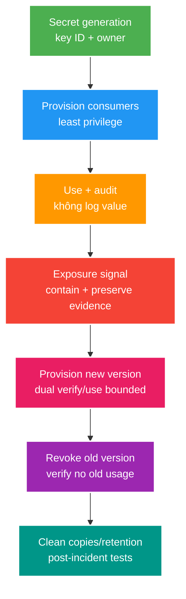

# Phân tích chuyên sâu: Xoay secret, che dữ liệu nhạy cảm và khoanh vùng sự cố

> Type: `DEEP_DIVE` 
> Domain: `security` 
> Target depth: `D4 — dẫn dắt secret exposure incident và rotate nhiều consumers mà không tạo secondary leak/outage` 
> Teaching readiness: `TEACHABLE_DRAFT` 
> Status: `DRAFT` 
> Evidence status: `NOT RUN` 
> Prerequisites: [Secret exposure core](../core/secret-exposure-and-audience-boundaries.md) 
> Related cases: `SEC-03`, `SEC-05`; [question bank](../../question-bank/stream-key-secret-exposure-and-log-redaction.md) 
> Owner: `Project learner; Codex teaches, learner writes back` 
> Updated: `2026-07-26`

## 1. Câu hỏi trung tâm

Khi secret xuất hiện trong log hoặc response, làm sao xác định phạm vi ảnh hưởng mà không tiếp tục sao chép nó? Làm sao xoay secret khi client/server nhiều phiên bản, cache và backup cùng tồn tại, đồng thời vẫn rollback được? Phải đặt bước che dữ liệu ở đâu để không có nơi nhận dữ liệu trước redactor?

## 2. Đồ thị nơi secret đi qua và trạng thái xoay secret

Đồ thị secret gồm nơi sinh/config manager, memory của workload, API response, log/trace, queue, cache, backup, artifact CI, máy developer và consumer phía sau. Chỉ đổi secret ở nguồn mà không cập nhật toàn đồ thị sẽ gây outage hoặc để credential cũ tiếp tục dùng được.

## 3. Kiến trúc che dữ liệu nhạy cảm

Thiết kế tốt nhất là không tạo event chứa dữ liệu nhạy cảm. Log request/response dùng allowlist field/header; audit event nghiệp vụ chỉ chứa ID không phải secret. Có thể đặt redactor nhiều lớp ở encoder của application, instrumentation của tracing và collector. Tuy nhiên redaction ở collector không xóa bản copy đã xuất hiện trước đó trong stdout, sidecar hoặc network.

Structured logging dễ áp policy hơn chuỗi tự do, nhưng exception message hoặc log thư viện vẫn có thể chứa URL, header và body. Wrapper logging không chặn được mọi `toString`, stack trace hay wire log của HTTP client. Test harness cần appender/exporter trong memory và một canary secret giả, rồi assert canary không xuất hiện trong log, trace hay error; không dùng secret thật để test.

Giá trị đã mask hoặc hash ổn định vẫn có thể nhạy cảm và cho phép correlation. Ưu tiên correlation ID ngẫu nhiên; chỉ dùng keyed fingerprint khi điều tra thật sự cần, đồng thời bảo vệ key và retention. Nếu redaction lỗi, không được làm request crash hoặc trả lại dữ liệu gốc như fallback.

## 4. Các giao thức xoay secret

Với **verifier secret** cho API/stream/webhook đến, provision K2 ở verifier trước, chuyển sender/client, chấp nhận kép trong cửa sổ hữu hạn, quan sát key ID rồi revoke K1. Với **key ký/mã hóa**, consumer phải verify/decrypt được K2 trước khi producer ghi K2; dữ liệu cũ có thể cần K1 để giải mã lâu hơn thời gian verify message. Với **database credential**, tạo principal/credential mới, triển khai connection pool, quan sát session cũ rồi revoke. Rollback code không được âm thầm kích hoạt lại credential đã revoke.

Metadata version không phải secret và configuration phải chọn tường minh. Thử mọi key làm tăng CPU, tạo timing ambiguity và kéo dài downgrade window. Chu kỳ rotation dựa trên threat, compliance và khả năng vận hành; xoay thủ công quá thường xuyên nhưng hay lỗi còn tệ hơn protocol tự động đã diễn tập.

## 5. Các tình huống hỏng khó

### 5.1. Secret trong log bị nhân bản qua nhiều tầng lưu trữ

Bearer token bị log ở application, chuyển qua collector, index vào hot storage, archive ở object store rồi copy sang support ticket. Xóa một index không phải khoanh vùng. Phải revoke token/session ngay, giới hạn quyền đọc log, giữ metadata điều tra mà không giữ token, kiểm kê retention/export, scrub hoặc để hết hạn theo policy, rotate nếu cả loại key bị lộ và thêm canary regression test. Xác định ai có thể đọc và token có bị dùng không; không dán token vào incident chat.

### 5.2. Dùng chung DTO owner/public làm lộ secret

Vì muốn “giảm trùng”, team gộp DTO owner/public rồi thêm stream key; public endpoint serialize cùng type. Schema, OpenAPI và code client tiếp tục phát tán field. Ngăn lỗi bằng DTO theo audience, ownership rõ và negative contract test. Khi đã lộ, phải rotate key và xóa bản copy khỏi cache/CDN, không chỉ sửa DTO.

### 5.3. Khoảng thời gian chấp nhận hai khóa không bao giờ kết thúc

Client cũ không quan sát được khiến team để K1 được chấp nhận mãi mãi, nên nguy cơ compromise còn nguyên. Kế hoạch rotation cần metric usage theo key ID hữu hạn, deadline, owner migration, cutoff và danh sách ngoại lệ. Consumer không xoay được phải được cô lập hoặc thay thế, không biến cửa sổ hai key thành vĩnh viễn.

### 5.4. Secret manager ngừng hoạt động

Nếu mỗi request đều tải secret trực tiếp, secret manager outage sẽ dừng traffic và tạo thundering retry. Cache secret trong memory với version/lease phù hợp, renewal single-flight và last-known-good policy bị giới hạn bởi rủi ro revoke. Bootstrap identity, secret-zero và kênh revoke khẩn cấp vẫn phải được bảo vệ riêng.

## 6. Quy trình xử lý sự cố và bằng chứng

Phân loại secret, authority và môi trường; khoanh vùng bằng revoke, disable hoặc ACL; giữ timestamp, key ID và access audit; xoay key; tìm trong sink, history và artifact bằng fingerprint/tool an toàn; xác minh key mới hoạt động và key cũ bị từ chối; thông báo bên liên quan; postmortem luồng dữ liệu và thêm test. Không rewrite git history phá hủy nếu chưa có kế hoạch phối hợp; secret đã clone phải coi là compromised và vẫn phải rotate.

Thí nghiệm đưa secret giả qua đường public, owner và error; kiểm log/trace collector; xoay config K1/K2; rollback giữa rollout và dừng secret manager. Bằng chứng hiện `NOT RUN`.

### 6.1. Ví dụ timeline xử lý sự cố

Giả sử access token xuất hiện trong application log lúc t0, được collector ingest t1 và archive t2. Containment đầu tiên là revoke session/token hoặc tăng relevant epoch; xóa log trước có thể phá evidence mà credential vẫn dùng được. Giới hạn quyền truy cập log, ghi lại dataset/index/object/version và reader audit, rồi tìm mọi copy bằng keyed fingerprint hoặc scanner được kiểm soát. Không đưa raw token vào query/chat/ticket. Nếu token chứa PII, incident còn có data-exposure dimension ngoài credential abuse.

Blast radius không chỉ là số log lines: token authority, expiry, audience, môi trường, ai truy cập sink và evidence sử dụng bất thường. Một stream key lâu sống có thể cần rotate ngay cả khi chưa thấy abuse; absence of evidence từ log không chứng minh chưa bị copy. Sau revoke, kiểm old credential bị từ chối ở mọi protocol, new credential hoạt động và client rollout không fallback về old.

### 6.2. Ma trận tương thích khi xoay secret

Trước rollout, lập matrix producer/consumer version và hành vi với K1/K2. Receiver-old chỉ biết K1; receiver-new biết K1+K2; sender-new có thể chọn key bằng config. Sequence planned là deploy receiver-new, chứng minh K2 verify, switch sender, theo dõi K1 usage, revoke K1. Rollback trước revoke có thể quay signer K1; sau revoke phải rollback code mà vẫn dùng K2, không tái kích hoạt credential compromised.

Với encryption at rest, retire encrypt key không đồng nghĩa destroy decrypt key: dữ liệu cũ, backup và legal retention có thể cần decrypt. Envelope encryption cho phép rewrap data keys thay vì rewrite toàn bộ payload, nhưng key lineage/authorization/backup restore phải được test. Với password/database credential, connection pool giữ session cũ; metric “config đã đổi” chưa chứng minh old credential không còn active.

### 6.3. Review luồng dữ liệu để phòng ngừa

Mỗi secret class cần owner, origin, allowed audiences, allowed sinks, transport/storage form, lifetime, rotation và emergency revoke. Review một request từ controller tới DTO mapper, exception, HTTP client, queue, cache, tracing và support tooling. Positive test chứng minh owner nhận secret chưa đủ; negative contract chứng minh public/moderator/analytics audience không có field và synthetic canary không xuất hiện ở logs/traces.

Framework version/config có thể bật request body/header logging qua actuator, debug HTTP client hoặc ingress. Production profile cần deny-list như defense, nhưng allow-list capture và “không tạo event chứa secret” vẫn là control chính. Upgrade logging/observability agent phải chạy lại canary vì sink nằm ngoài application code.

### 6.4. Backup, analytics và quyền được quên

Backup thường immutable nên không thể “xóa ngay một dòng secret”. Control hợp lý là revoke credential để bản sao vô dụng, mã hóa backup bằng key có lifecycle riêng, giới hạn reader, theo retention và chứng minh restore không tái kích hoạt credential. Nếu restore database cũ chứa ACTIVE secret/status, startup/reconciliation phải so current revocation epoch hoặc buộc rotate; restore correctness không chỉ là dữ liệu đọc được.

Analytics/data lake không nên nhận credential ngay từ đầu. Nếu raw payload ingestion từng chứa secret, phải inventory derived tables, cached extracts, notebooks và exports. Hash không tự anonymize secret có entropy thấp; stream key/token fingerprint dùng keyed hash chỉ khi có mục đích điều tra và retention. Access review phải bao gồm support/vendor accounts, không chỉ application service.

### 6.5. Checklist review theo loại secret

Với từng JWT signing key, webhook secret, stream key, database password và CI token, trả lời: ai tạo; ai được đọc/dùng; plaintext xuất hiện ở đâu; có tách environment/audience không; version/key ID nào; rotation receiver-first hay producer-first; old usage quan sát thế nào; emergency revoke bao lâu; backup/rollback làm gì; synthetic test nào chứng minh không leak. Một câu “để trong secret manager” chỉ trả lời storage, chưa trả lời toàn lifecycle.

Post-incident exit criteria gồm credential cũ bị reject, new path ổn định, mọi known sink được restrict/expired theo policy, no new canary leak, owner và deadline cho unknown copy, alert/audit hoạt động và decision record cập nhật. Không đóng incident chỉ vì log line đã bị xóa khỏi dashboard.

## 7. Các đánh đổi

DTO/credential theo audience làm tăng inventory nhưng giảm blast radius. Secret manager tập trung cải thiện governance nhưng thêm dependency runtime và bài toán bootstrap. Khoảng overlap hai key giữ availability nhưng kéo dài cửa sổ compromise. Plaintext chỉ hiển thị một lần tăng an toàn nhưng làm recovery/support khó hơn. Mã hóa log cho phép khôi phục có quyền, không phải lý do để log secret.

## 8. Interview nâng cao

Senior trình bày cách ngăn lộ qua DTO/log. Architect mở rộng sang đồ thị secret, rotation tự động và availability của manager. Expert phân tích khoanh vùng log đã nhân bản, vòng đời dữ liệu theo encryption key và xoay khẩn cấp trong multi-region/mixed version.

## 9. Bài tập diễn đạt lại và tự kiểm tra

> **Bài viết của tôi — `LEARNER TODO`:** response→log→archive exposure incident, containment and K1→K2 rollout.

1. **Question:** Redaction nên đặt ở đâu? 
   **Đọc lại nếu bí:** mục 3. 
   **Một câu trả lời tốt phải có:** avoid creation, application structured allowlist, instrumentation/collector defense, early sinks and canary tests. 
   **My answer:** `LEARNER TODO`
2. **Question:** Khi nào dual-key overlap kết thúc? 
   **Đọc lại nếu bí:** mục 4–5.3. 
   **Một câu trả lời tốt phải có:** key ID usage, deadline, consumer ownership, old rejection and compromise window. 
   **My answer:** `LEARNER TODO`
3. **Question:** Token lộ trong log cần làm gì trước? 
   **Đọc lại nếu bí:** mục 5.1 và 6. 
   **Một câu trả lời tốt phải có:** revoke/contain, access restriction, forensic-safe evidence, copy inventory, rotation/validation, regression. 
   **My answer:** `LEARNER TODO`

## 10. Tài liệu tham khảo và trình bày lại

- [OWASP Secrets Management Cheat Sheet](https://cheatsheetseries.owasp.org/cheatsheets/Secrets_Management_Cheat_Sheet.html)
- [OWASP Logging Cheat Sheet](https://cheatsheetseries.owasp.org/cheatsheets/Logging_Cheat_Sheet.html)

- [ ] Tôi map secret graph và rotation states.
- [ ] Tôi contain incident không tạo thêm leak.
- [ ] Tôi test redaction/rotation bằng synthetic secret.
- [ ] Evidence vẫn `NOT RUN`.
