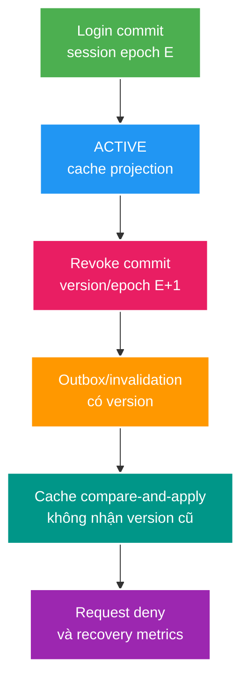

# Phân tích chuyên sâu: Tranh chấp khi thu hồi session, epoch và phục hồi cache

> Type: `DEEP_DIVE` 
> Domain: `security` 
> Target depth: `D4 — formalize revoke linearization, cache/event reorder và recovery under outage` 
> Teaching readiness: `TEACHABLE_DRAFT` 
> Status: `DRAFT` 
> Evidence status: `NOT RUN` 
> Prerequisites: [Session revocation core](../core/session-revocation-and-cache-consistency.md) 
> Related cases: `SEC-02`; [question bank](../../question-bank/logout-all-and-session-cache-invalidation.md) 
> Owner: `Project learner; Codex teaches, learner writes back` 
> Updated: `2026-07-26`

## 1. Câu hỏi trung tâm

“Logout-all có hiệu lực” tại thời điểm nào? Refresh đang chạy đồng thời có được phép thắng không? Cache hoặc event cũ tới sau có thể làm session sống lại không? Khi Redis hay pipeline invalidation hỏng, hệ thống giữ invariant bảo mật thế nào mà không làm PostgreSQL sập?

## 2. Máy trạng thái và điểm hiệu lực của việc thu hồi

Máy trạng thái session tối thiểu có `ACTIVE(version/epoch, expiry)`, `REVOKED(revokedAt, reason, version)` và `EXPIRED`. Trạng thái kết thúc không được quay lại `ACTIVE`. User có `revocationEpoch`; token và cache session mang epoch đã quan sát. Credential chỉ hợp lệ khi session active, chưa hết hạn và epoch của token/session không nhỏ hơn epoch hiện hành bắt buộc.

Điểm hiệu lực duy nhất thường là commit database của lệnh revoke hoặc tăng epoch. Refresh commit trước revoke có thể được chấp nhận, nhưng token kết quả phải mất hiệu lực sau khi epoch tăng nếu hợp đồng yêu cầu logout-all tức thời. Refresh commit sau revoke phải thất bại. Cần định nghĩa bằng thứ tự này; câu “gần real-time” không thể chuyển thành test.

## 3. Các cách dùng epoch để thu hồi hàng loạt

Status theo session cho phép revoke từng thiết bị. Epoch theo user vô hiệu mọi token mang epoch cũ chỉ bằng một write, nhưng resource server phải biết epoch hiện tại từ DB/cache; nếu không, access JWT vẫn sống tới hạn. Mô hình lai luôn kiểm session và user epoch khi refresh, dùng access token ngắn hạn và có thể kiểm epoch online cho action rủi ro cao. Epoch riêng cho role/credential tránh logout-all vì thay đổi không liên quan nhưng thêm claim và state.

Cache projection chứa session ID, user ID, status, session version, user epoch, expiry và serializer version. Compare-and-apply phải từ chối event `ACTIVE v5` tới sau `REVOKED v6`. Chỉ xóa key không phân biệt được loader cũ tới muộn; tombstone hoặc version marker giúp ngăn hồi sinh nhưng tốn memory và cần lifecycle. Database durable vẫn là fallback authority.

## 4. Các tranh chấp khó

### 4.1. Refresh chạy đồng thời với revoke

`Trefresh` kiểm `ACTIVE v5` rồi dừng; `Trevoke` commit `REVOKED v6`; sau đó `Trefresh` phát access token v5. Nếu access validator kiểm epoch/session hiện tại, token bị từ chối; nếu hoàn toàn stateless tới expiry, logout SLO bị vi phạm. Một lựa chọn là serialize refresh bằng row lock hoặc conditional version để không thể phát sau v6. Reproducer dùng barrier và assertion token cuối cùng có dùng được hay không.

### 4.2. Event tới cache sai thứ tự

Login/update tạo event `ACTIVE v5` bị trễ; event revoke v6 tới trước làm cache revoked, rồi v5 tới sau ghi đè thành active. So version ngăn lịch sử này. Invalidation chỉ xóa cộng loader stale tới sau cũng có thể populate lại; loader phải mang DB version và set có điều kiện hoặc tôn trọng tombstone.

### 4.3. Logout-all bỏ sót session

Set user-session trong Redis bỏ sót S3 do lần ghi trước thất bại. Thuật toán chỉ đọc Set sẽ invalidate S1/S2 nhưng quên S3. Bulk update trong DB hoặc user epoch vẫn revoke S3. Cache index chỉ là tối ưu; reconciliation so session active trong DB với index và sửa lệch.

### 4.4. Redis hỏng làm đường fallback quá tải

Mọi refresh fallback vào DB làm pool bão hòa; chính lệnh logout không lấy được connection, khiến độ trễ thu hồi quyền tăng. Tách và giới hạn concurrency fallback, ưu tiên write revoke, dùng breaker/load shedding và fail refresh nhanh để bảo vệ owner. Fail-closed vẫn có thể gây availability incident, nên cần capacity và UX plan.

## 5. Phân phối thay đổi và sửa cache bị lệch

Outbox row trong transaction revoke chứa session/user ID, version/epoch mới và event ID. Relay giao at-least-once; consumer idempotent và so version. Chỉ ack sau khi apply hoặc ghi nhận cache. Dead-letter/backlog phải có security SLO và cảnh báo. TTL giới hạn cache bị quên nhưng không thay replay. Reconciliation định kỳ là đường repair, không phải cơ chế correctness chính.

Nếu mất toàn bộ Redis, chỉ rebuild record `ACTIVE` hiện tại cùng version, không phát lại lịch sử event cũ một cách mù quáng. Warm với rate hữu hạn và ưu tiên session active; policy fallback/bypass trong lúc rebuild phải tường minh. Không restore snapshot Redis stale làm authority nếu chưa so epoch.

## 6. Chẩn đoán và thí nghiệm

Đo thời điểm revoke commit, lần deny đầu, độ trễ publish/apply invalidation, số version cũ bị từ chối, backlog, DB fallback và deny do dependency. Không gắn raw user/session ID vào metric. Test bốn race ở trên theo cách deterministic, restart Redis, outbox duplicate/reorder, cache snapshot cũ hơn DB, idempotency của logout và khả năng dùng token sau khi epoch đổi.

### 6.1. Ví dụ lịch sử: logout-all và refresh chạy đồng thời

Giả sử user epoch E=12, session S active version 4. Refresh request đọc S/E rồi dừng ở barrier. Logout-all transaction tăng epoch lên 13 và revoke sessions, commit tại t0. Sau t0, mọi token mang E=12 phải thất bại ở boundary được contract yêu cầu. Khi refresh tiếp tục, conditional write theo session version/epoch phải affected rows 0; nếu nó vẫn phát token E=12 thì access validator cần current-epoch check để deny. Nếu access path hoàn toàn offline, hệ thống chỉ hứa bounded revoke bằng access TTL chứ không thể gọi là immediate revoke.

Test cần lưu history, không chỉ response: commit timestamp, epoch/version đọc và ghi, token claims, cache value, lần đầu token bị deny. Chạy cả hai ordering refresh-before-revoke và revoke-before-refresh. Linearizability ở đây nghĩa kết quả tương thích một thứ tự duy nhất quanh DB commit; không nghĩa mọi cache update hoàn tất cùng microsecond.

### 6.2. Dùng máy trạng thái cache thay cho thao tác CRUD mù

Cache entry là projection có monotonic version, không chỉ JSON có TTL. Handler nhận event v13 khi cache v12 thì apply; nhận lại v12 thì ignore và tăng `stale_event_rejected`. Cache miss loader đọc DB v13 nhưng trước lúc set có thể event v14 đến; unconditional set sẽ hạ state. Dùng compare-and-set/script theo version hoặc read-after-event design phù hợp. Tombstone v13 ngăn một late loader v12 resurrect ACTIVE, nhưng tombstone TTL phải dài hơn maximum stale producer/retry horizon hoặc có owner check.

Serializer/schema version khác business version. Serializer mới không được tự biến missing field thành ACTIVE/default allow. Mixed deployment cần dual-read/single-write migration hoặc invalidate/rebuild projection có kiểm soát. Redis eviction cũng là miss, không phải bằng chứng session active; fallback phải đọc owner hoặc deny theo risk tier.

### 6.3. Runbook khi hỏng và cách tính capacity

Trước outage phải biết refresh QPS, cache hit ratio, DB query cost, pool headroom và maximum fallback concurrency. Nếu Redis mất và 5.000 refresh/s đồng loạt vào PostgreSQL có khả năng phục vụ 500/s, “fallback to DB” chỉ là mô tả collapse. Bounded semaphore/bulkhead, rate limiting theo session, jittered retry và ưu tiên connection cho revoke/login write giúp hệ thống giữ security control. Có thể trả retryable 503 thay vì xác thực bằng stale allow không giới hạn.

Runbook phân biệt Redis unavailable, invalidation consumer lag và corrupted/stale snapshot. Với unavailable: freeze risky cache writes, activate bounded fallback, monitor DB và revoke-to-deny SLO. Với backlog: giữ compare-version, scale/replay consumer và không bỏ qua old messages thiếu audit. Với restore: không nạp snapshot như authority; rebuild từ active owner records, canary compare một sample, rồi giảm fallback dần. Exit criteria gồm backlog zero/bounded, no stale apply, token E-old bị deny và DB pool trở về safe utilization.

### 6.4. Chọn SLO trung thực

Ba mức thường gặp: refresh revoke immediate nhưng access token sống ngắn; high-risk actions online-check epoch; hoặc mọi request online-check để revoke gần tức thời. Mức mạnh hơn tăng dependency và latency. Tài liệu/API/security response phải nói rõ maximum exposure window và behavior khi owner/cache unavailable. Senior không hứa “logout ngay” nếu kiến trúc chỉ kiểm khi token hết hạn.

### 6.5. Lịch sử lỗi trong multi-region và thảm họa

Nếu mỗi region có cache/replica, revoke commit ở primary nhưng refresh tại region khác có thể đọc replica lag. Region cần đọc owner có consistency đủ cho refresh/revoke hoặc mang monotonic epoch/version qua globally ordered mechanism phù hợp. “Redis replication” không tự tạo ordering giữa DB transaction, outbox và cache. Access token issued ở region B sau t0 phải bị deny theo contract; nếu không bảo đảm được, route refresh về authoritative region hoặc công bố bounded regional lag.

Disaster recovery phải test restore database tại point T và cache/snapshot tại point T-Δ. Sau restore, session nào còn authority? Nếu incident có revoke sau backup, credential có thể resurrect trừ khi revocation/epoch log được bảo toàn ngoài snapshot hoặc buộc global re-auth. Đây là security consequence của RPO/RTO. Runbook có thể tăng global credential epoch sau uncertain restore, chấp nhận logout để khôi phục invariant.

Decision record cho session subsystem gồm owner store, states/transitions, per-device/user epochs, access/refresh validation paths, linearization point, cache projection version, event delivery/repair, outage behavior, multi-region consistency và revoke SLO. Mỗi assertion phải có planned test; nếu chưa chạy vẫn ghi `NOT RUN`.

## 7. Các đánh đổi

Revoke access token tức thời cần online check mỗi request, TTL ngắn, push denylist hoặc epoch cache nên tăng dependency. Revoke hữu hạn theo access TTL đơn giản và available hơn. User epoch revoke O(1) nhưng ảnh hưởng rộng. Duyệt từng session chính xác hơn nhưng O(số session) và phải có maximum. Outbox đổi chi phí vận hành lấy invalidation intent durable; vẫn cần so version.

## 8. Interview nâng cao

Câu trả lời Architect định nghĩa linearization point và SLO, không dừng ở “xóa Redis”. Câu trả lời Expert phải bao phủ event `ACTIVE` tới muộn, khoảng trống commit refresh, DB fallback làm revoke bị nghẽn và rebuild cache sau thảm họa.

## 9. Bài tập diễn đạt lại và tự kiểm tra

> **Bài viết của tôi — `LEARNER TODO`:** định nghĩa logout-all linearization và kể refresh, event reorder, Redis-down histories.

1. **Question:** User epoch giúp gì và chưa giải quyết gì? 
   **Đọc lại nếu bí:** mục 2–3. 
   **Một câu trả lời tốt phải có:** O(1) revoke, token carried epoch, online/current check, access TTL and per-device limitation. 
   **My answer:** `LEARNER TODO`
2. **Question:** Late ACTIVE event bị chặn thế nào? 
   **Đọc lại nếu bí:** mục 3–5. 
   **Một câu trả lời tốt phải có:** monotonic version, compare-and-apply/tombstone, durable owner, duplicate/reorder handling. 
   **My answer:** `LEARNER TODO`
3. **Question:** Redis outage ảnh hưởng logout SLO ra sao? 
   **Đọc lại nếu bí:** mục 4.4 và 6. 
   **Một câu trả lời tốt phải có:** fallback load/pool priority, fail closed, shedding, write availability and measured revoke-to-deny. 
   **My answer:** `LEARNER TODO`

## 10. Tài liệu tham khảo và trình bày lại

- [OWASP Session Management Cheat Sheet](https://cheatsheetseries.owasp.org/cheatsheets/Session_Management_Cheat_Sheet.html)
- [Spring Security Session Management](https://docs.spring.io/spring-security/reference/servlet/authentication/session-management.html)

- [ ] Tôi formalize revoke point và race outcomes.
- [ ] Tôi xử lý cache/event reorder bằng version.
- [ ] Tôi có outage/rebuild plan.
- [ ] Evidence vẫn `NOT RUN`.
