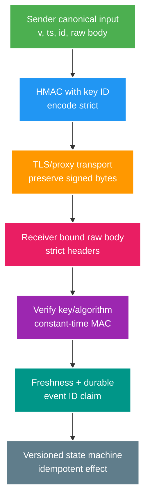

# Phân tích chuyên sâu: Chuẩn hóa webhook, chống replay và lỗi khi xoay secret

> Type: `DEEP_DIVE` 
> Domain: `security` 
> Target depth: `D4 — thiết kế signed protocol chịu intermediary mutation, replay/concurrency, key rotation và recovery` 
> Teaching readiness: `TEACHABLE_DRAFT` 
> Status: `DRAFT` 
> Evidence status: `NOT RUN` 
> Prerequisites: [Webhook core](../core/webhook-authentication-replay-and-idempotency.md) 
> Related cases: `SEC-05`; [question bank](../../question-bank/webhook-hmac-replay-and-secret-rotation.md) 
> Owner: `Project learner; Codex teaches, learner writes back` 
> Updated: `2026-07-26`

## 1. Câu hỏi trung tâm

Vì sao HMAC đúng ở sender nhưng sai sau proxy/framework? Kho lưu timestamp/event ID có race nào? Xoay key thế nào khi request ký K1 vẫn đang retry? Khi provider gửi lại sai thứ tự, authentication, idempotency và state machine tương tác ra sao?

## 2. Đặc tả byte truyền trên dây

Đặc tả protocol phải định nghĩa encoding byte, thường là UTF-8 cho text; delimiter hoặc length; đơn vị timestamp; tập ký tự của event ID; dạng canonical base64/hex của signature; cách xử lý header trùng/hoa-thường và body compression. Tránh phép nối mơ hồ như `ab|c` với `a|bc` bằng delimiter có grammar hạn chế hoặc length-prefix.

Phải verify đúng byte của body sau bước HTTP content decoding theo contract sender. Nếu CDN giải nén rồi nén lại, contract phải chọn representation được ký. Không ký hop-by-hop header. Từ chối nhiều signature header trừ khi rotation scheme định nghĩa rõ cách parse danh sách; header folding hoặc duplicate do proxy là input bảo mật cần xử lý.

## 3. Transaction chống replay và bảo đảm idempotency

Chỉ kiểm timestamp sau khi MAC hợp lệ để không tin freshness do attacker gửi trước một thao tác lưu trữ đắt. Dùng clock của server và giới hạn skew quá khứ/tương lai. Insert unique `(provider,eventId)` durable cùng business transition trong một transaction. Lưu payload digest, type và outcome; cùng event ID nhưng digest khác là conflict/tín hiệu bảo mật, không phải duplicate thành công.

Duplicate đồng thời tranh unique constraint; bên thua đọc outcome đã commit hoặc retry sau winner. Mẫu “check tồn tại, xử lý, rồi insert” có TOCTOU. Redis dedup phía trước giảm tải nhưng unique constraint DB vẫn sở hữu hiệu ứng durable. Retention của record dedup không được ngắn hơn retry horizon của provider cộng replay window và nhu cầu đối soát.

Ordering cần sequence hoặc resource version được ký. Chỉ apply transition khi version mới hơn như contract mong đợi; duplicate cùng ID và event stale khác ID là hai trường hợp riêng. Một số fact nên append-only để audit thay vì ghi đè current state.

## 4. Xoay secret khi vẫn còn request đang retry

Receiver nạp K2 trước khi sender chuyển. Sender gắn key ID cho mỗi delivery; retry thường giữ signature/key gốc, hoặc phải sinh delivery ID/version mới theo contract tường minh. Receiver verify kép K1/K2 tới hết tuổi retry K1 lớn nhất cộng queue, backoff và clock window. Metric usage quyết định cutoff. Nghỉ K1 quá sớm làm request thật lỗi; overlap vô hạn giữ nguyên nguy cơ compromise.

Nhiều signature có thể giúp rotation nhưng tăng phức tạp parse và downgrade. Ưu tiên tra key ID và một signature trừ khi chuẩn provider yêu cầu khác. Key ID lạ không được kích hoạt fetch từ xa tùy ý hoặc thử mọi key không giới hạn.

## 5. Các tình huống hỏng khó

### 5.1. Body bị đọc trước hoặc được mã hóa lại

Logging filter đọc `InputStream`, khiến JSON parser hoặc verifier phía sau thấy body rỗng hay body đã dựng lại; sender cũng có thể escape Unicode khác. Golden fixture ở đúng ranh giới controller/filter sẽ bắt lỗi. Dùng request wrapper cache có giới hạn hoặc verify tại filter sớm nhất hiểu body; tránh log raw body.

### 5.2. Nhầm đơn vị giây và mili-giây

Sender gửi giây nhưng receiver hiểu mili-giây làm mọi request thành quá cũ/quá tương lai; engineer có thể chữa sai bằng cách mở window rất lớn và tạo replay. Ghi đơn vị trong protocol/version và kiểm magnitude nghiêm ngặt. Test clock ở đúng biên ±window và skew.

### 5.3. Khoảng trống giữa ghi dấu duplicate và ghi hiệu ứng nghiệp vụ

Nếu insert dedup commit riêng rồi business effect thất bại, retry thấy duplicate và bỏ qua vĩnh viễn. Nếu effect commit trước dedup rồi crash, retry tạo hiệu ứng lặp. Claim và local effect phải cùng transaction/outbox; effect xuyên hệ thống cần workflow durable và downstream idempotent.

### 5.4. Bão retry trong lúc triển khai khóa mới

Sender chuyển K2 trước receiver; 401 kích hoạt retry exponential từ provider và khuếch đại outage. Triển khai receiver-first, probe K2 tổng hợp và monitoring; response contract phân biệt lỗi signature vĩnh viễn với lỗi nội bộ tạm thời. Không trả 2xx cho event chưa durable chỉ để dừng bão nếu chưa có quarantine/recovery plan.

### 5.5. Payload có chữ ký nhưng vẫn gây SSRF

Payload thật từ provider chứa media URL nhưng account provider bị chiếm hoặc tenant độc hại trỏ vào mạng nội bộ. HMAC chỉ xác thực sender, không chứng minh instruction an toàn. Vẫn phải chống SSRF và phân quyền network/payload.

## 6. Chẩn đoán và thí nghiệm

Golden vector lưu test key không nhạy cảm, input, MAC mong đợi và các trường hợp đổi byte/header/encoding. Test cùng ID đồng thời, cùng ID khác digest, clock cũ/tương lai, sequence sai thứ tự, crash boundary, K1 retry trong lúc xoay K2, header trùng, giới hạn body và không lộ log. Metric theo provider/key-version/result phải hữu hạn. Không log payload/signature production thô.

### 6.1. Một canonical contract có thể triển khai được

Ví dụ protocol v1 định nghĩa input theo length-prefix, không theo string join mơ hồ: `v1\n{len(ts)}:{ts}{len(id)}:{id}{len(body)}:{body-bytes}`. Timestamp là ASCII epoch seconds; event ID giới hạn ASCII/length; body là byte sequence sau HTTP content decoding nhưng trước JSON parsing; MAC là HMAC-SHA-256 và header encoded lowercase hex cố định. Đây chỉ là một lựa chọn—sender và receiver phải có cùng test vectors cho empty body, Unicode, newline, duplicate JSON key, whitespace và compressed transport.

Receiver giới hạn header/body trước allocation lớn, parse đúng một supported version/key ID/signature, resolve local trusted secret và compare MAC constant-time. Chỉ sau MAC success mới dùng timestamp/event ID để truy cập replay store. Parsing vẫn phải trả error category an toàn; không echo expected signature hay signed input.

### 6.2. Ma trận crash phân tích từng bước

Xét ba durable steps: claim event ID, apply domain transition, record outbox/result. Nếu claim commit riêng rồi app crash, retry bị coi duplicate dù effect chưa chạy. Nếu effect commit trước claim, retry chạy effect hai lần. Đặt claim, state transition và outbox trong một DB transaction giải quyết local atomicity; external call vẫn cần workflow/outbox và idempotency key downstream. HTTP 2xx chỉ sau durable acceptance, không nhất thiết sau mọi downstream side effect.

Concurrent duplicate A/B: một transaction thắng unique key; loser chờ/nhận conflict rồi đọc outcome. Nếu winner chưa commit và DB trả lock timeout, loser không được ghi “processed” giả; response retryable. Same event ID với different digest là protocol violation: quarantine/alert, không trả cached success của payload cũ một cách im lặng.

### 6.3. Ordering khác duplication

Event E10 và E11 có ID khác nên dedup không ngăn E10 tới sau E11. Resource version/sequence hoặc domain transition guard mới xử lý ordering. Một `stream.started` tới sau `stream.ended` có thể bị ignore như stale, audit như conflict hoặc kích hoạt reconciliation tùy contract. Không dùng timestamp client làm total order nếu clock không đáng tin. Với provider không cho sequence, thiết kế state machine idempotent/monotonic và query provider reconciliation khi ambiguity quan trọng.

### 6.4. Xoay khóa và xử lý khi secret bị lộ

Planned rotation giữ K1 đủ cho maximum signed retry horizon. Emergency compromise thì K1 có thể bị revoke ngay; authentic in-flight K1 deliveries sẽ fail và cần provider replay/reconciliation bằng K2. Runbook phải biết provider có re-sign hay preserve signature, retry retention bao lâu và endpoint nào request replay. Usage metric theo key ID chỉ nhận sau successful authentication; unknown/invalid attempts được tách để attacker không giả rằng K1 vẫn legitimately used.

Version/framework boundary: servlet filter có thể consume body, reverse proxy có thể decompress và JSON library có thể normalize. Golden test phải chạy ở deployed ingress/controller boundary, không chỉ unit test HMAC helper. Khi thay proxy/body-caching library, rerun fixtures và body-size/resource exhaustion cases.

### 6.5. Cách ly event lỗi và đối soát

Không phải mọi failure đều retry giống nhau. Unsupported version, invalid MAC và same-ID/different-digest là permanent/security categories; internal DB timeout hoặc unavailable dependency có thể retryable. Stale sequence có thể trả success-as-ignored nếu contract quy định. HTTP status/body phải theo provider retry semantics, nhưng không được trả 2xx cho event chưa durable chỉ để giảm alert. Quarantine giữ bounded metadata/payload theo privacy policy, lý do và operator workflow; nó không phải queue vô hạn.

Reconciliation endpoint/job lấy authoritative state từ provider bằng authenticated outbound call hoặc request signed replay. Nó xử lý missing/out-of-order event nhưng cũng là trust boundary: limit resource/tenant, pagination, rate và idempotency. Nếu provider không có reconciliation, local state machine cần conservative transition và manual recovery cho ambiguity có impact lớn.

### 6.6. Giới hạn capacity và chống lạm dụng

HMAC verification rẻ hơn business effect nhưng body buffering, JSON parsing và dedup DB vẫn bị abuse. Giới hạn request/body/header trước allocation, ingress rate theo provider/network plus global concurrency, và không mở DB connection trước basic structural/MAC gate. Tuy vậy attacker biết secret có thể gửi authentic flood; quota/circuit/broker isolation và provider incident contact vẫn cần. Signature chứng minh possession, không chứng minh request rate hợp lệ.

Decision record phải pin wire version, exact signed representation, key ownership/rotation, clock window, retry horizon, dedup owner/retention, ordering semantics, transaction/outbox, response categories, payload authorization và recovery. Thay bất kỳ proxy/framework/provider behavior nào đều kích hoạt golden/concurrency/fault suite.

## 7. Các đánh đổi

Ký raw body dễ tương thích khi byte được giữ nguyên; canonical format có cấu trúc giảm mơ hồ whitespace nhưng làm đặc tả/thư viện phức tạp. HMAC đơn giản nhưng shared key có blast radius; chữ ký bất đối xứng tách verifier nhưng tăng hạ tầng key. Window ngắn giảm replay nhưng xung đột với queue/backoff; kho event ID durable mới là lớp dedup chính. Fail-closed nghiêm bảo vệ integrity nhưng phải có recovery/quarantine khi provider outage.

## 8. Interview nâng cao

Câu trả lời Architect coi webhook là wire protocol có version cộng workflow. Câu trả lời Expert bao phủ encoding mơ hồ, retry horizon hai key, khoảng trống nguyên tử giữa dedup/effect và instruction độc hại nhưng có chữ ký thật.

## 9. Bài tập diễn đạt lại và tự kiểm tra

> **Bài viết của tôi — `LEARNER TODO`:** define signed bytes, event transaction and K1→K2 retry timeline.

1. **Question:** Canonicalization contract phải ghi gì? 
   **Đọc lại nếu bí:** mục 2. 
   **Một câu trả lời tốt phải có:** fields/order/encoding/delimiter, raw body/compression, headers/duplicates, signature encoding and version. 
   **My answer:** `LEARNER TODO`
2. **Question:** Dedup insert tách effect có failure gì? 
   **Đọc lại nếu bí:** mục 3 và 5.3. 
   **Một câu trả lời tốt phải có:** two partial orders, crash windows, atomic DB transaction/outbox/downstream idempotency. 
   **My answer:** `LEARNER TODO`
3. **Question:** K1 được retire khi nào? 
   **Đọc lại nếu bí:** mục 4 và 5.4. 
   **Một câu trả lời tốt phải có:** receiver-first, max retry/queue/window, usage metric, cutoff and emergency compromise. 
   **My answer:** `LEARNER TODO`

## 10. Tài liệu tham khảo và trình bày lại

- [RFC 2104 — HMAC](https://www.rfc-editor.org/rfc/rfc2104)
- [OWASP REST Security Cheat Sheet](https://cheatsheetseries.owasp.org/cheatsheets/REST_Security_Cheat_Sheet.html)

- [ ] Tôi đặc tả wire bytes không mơ hồ.
- [ ] Tôi xử lý replay, duplicate và ordering riêng.
- [ ] Tôi rotate với in-flight retry.
- [ ] Evidence vẫn `NOT RUN`.
