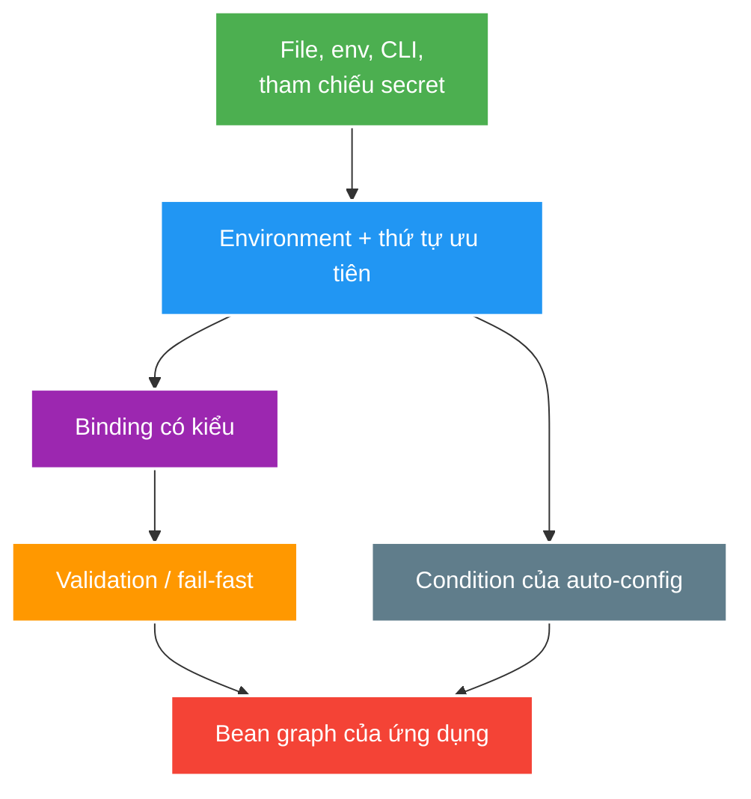

# Configuration and Profile Safety

> Type: `CORE` 
> Domain: `spring` 
> Target depth: `D3 — truy nguồn property, kiểm chứng binding/validation và ngăn cấu hình dev rò sang production` 
> Teaching readiness: `TEACHABLE_DRAFT` 
> Status: `DRAFT` 
> Evidence status: `NOT RUN` 
> Prerequisites: [IoC and bean lifecycle](ioc-bean-lifecycle-and-dependency-injection.md) 
> Related cases: [`CONFIG-UC-01`](../../../../use-case-catalog.md#31-foundation-và-senior-cases), [`SPRING-UC-01`](../../../../use-case-catalog.md#31-foundation-và-senior-cases) 
> Owner: `Project learner; Codex assists` 
> Updated: `2026-07-26`

Source canonical cho [configuration question bank](../../question-bank/configuration-isolation-and-production-safety.md). Exact precedence/auto-configuration behavior phải re-check theo Spring Boot baseline khi topic active.

## 0. Cách học file này

Chọn một property production-critical và truy từ external source tới effective `Environment`, typed binding, validation và bean condition. Không học thuộc precedence rời version; dùng origin/condition report của baseline. Chỉ ghi source/key, không in secret value.

## 1. Learning objectives

1. Phân biệt property source, profile, typed binding, validation và conditional bean creation.
2. Truy nguồn effective value mà không log secret.
3. Thiết kế fail-fast, environment isolation và startup tests cho production safety.

## 2. Mental model do người dạy cung cấp

Configuration là input của bean graph. Nhiều property sources cạnh tranh theo precedence để tạo effective values; binder chuyển chúng thành typed contract; validation chặn invalid state; conditions quyết định bean nào tồn tại. Profile chỉ bật một nhóm config/beans, không bảo vệ secret hay quyền truy cập.

## 3. Cơ chế cốt lõi

Spring `Environment` kết hợp profiles và property sources. Spring Boot thêm externalized configuration, typed `@ConfigurationProperties`, auto-configuration conditions và diagnostic reports. Nhiều source có precedence; effective value phải được xác định từ source/order cụ thể, không suy đoán từ một file YAML.

Typed binding gom cấu hình theo namespace, biểu diễn kiểu/units và hỗ trợ validation. Profile là coarse environment grouping, không phải authorization hoặc secret store. Conditional configuration làm bean graph thay đổi theo classpath/property/bean presence; mọi nhánh quan trọng cần startup test.

Secret phải đến từ kênh phù hợp, được redact và rotate; default credential/dev endpoint không được âm thầm hoạt động ở production. Fail-fast phù hợp cho invariant cấu hình bắt buộc; graceful degradation chỉ dùng khi capability thật sự optional và observable.

### Worked example — precedence và origin

YAML đặt timeout 2s nhưng environment variable đặt 30s; runtime dùng 30s theo precedence. Senior không sửa YAML rồi đoán, mà đọc effective value + origin đã redact. Với `@ConfigurationProperties`, dùng `Duration` và validation range giúp tránh nhầm milliseconds/seconds và chặn giá trị nguy hiểm lúc startup.

### Worked example — production deny

Dev seed endpoint hoặc default password không nên chỉ dựa vào “thường không bật profile dev”. Production startup test/assertion phải fail nếu bean dev tồn tại hoặc required secret reference thiếu. Đây là defense-in-depth chống profile typo và condition drift sau upgrade.

## 4. Invariants và boundaries

1. Production không có seed/default credential/dev endpoint hoặc verbose sensitive logging.
2. Required URL, timeout, pool size, key/secret reference có typed validation và unit rõ.
3. Effective config có thể audit theo source nhưng secret value không xuất hiện trong log/error.
4. Profile/condition matrix quan trọng có context-startup test.
5. Runtime refresh không làm vỡ atomicity của multi-property invariant.

## 5. Failure modes

| Failure | Trigger | Symptom |
| --- | --- | --- |
| Precedence surprise | Env/CLI overrides file | Sai endpoint/limit |
| Relaxed-binding typo | Tên gần giống/unknown field | Default nguy hiểm hoặc startup fail |
| Profile leakage | Dev bean/property active | Security/data exposure |
| Secret leakage | Actuator/log/error dump | Credential compromise |
| Conditional drift | Classpath/bean change | Bean graph khác sau upgrade |
| Partial refresh | Related values đổi lệch | Invalid runtime state |

## 6. Patterns và trade-off

| Pattern | Lợi ích | Trade-off |
| --- | --- | --- |
| Typed immutable properties | Contract rõ | Migration khi key đổi |
| Validation + fail-fast | Lỗi sớm | Optional environments cần defaults có chủ ý |
| Explicit production denylist/assertion | Chặn dev capability | Maintenance rule |
| Secret reference/provider | Rotation/audit | Availability/bootstrap dependency |
| Startup context matrix | Chứng minh condition | Test time và fixture |

## 7. Deep-dive và case

- [Configuration binding, auto-configuration and secret safety](../deep-dives/configuration-binding-autoconfiguration-and-secret-safety.md).
- `CONFIG-UC-01`: dev/prod isolation và config regression.
- `SPRING-UC-01`: condition report và bean graph.

## 8. Interview answer outline

Mô tả source→precedence→Environment→typed bind/validate→conditional graph; phân biệt profile, property source và condition. Nêu redacted origin diagnosis, fail-fast vs optional degradation và startup matrix dev/test/prod.

## 8.1. Hai worked examples và phản ví dụ

**Worked example tối thiểu — typed timeout:** bind connect/read timeout thành typed duration, validate positive/cross-field budget và fail startup khi required. Effective origin được quan sát nhưng secret value redacted.

**Worked example gần project — production guard:** prod startup rejects dev/test profile, default JWT/webhook secret, exposed debug endpoint và destructive schema config. Optional analytics có thể disable observable; auth/signing capability phải fail closed.

**Phản ví dụ:** đặt safe value trong `application-prod.yml` rồi tin nó thắng. Environment/command line/test override có precedence cao hơn; typo có thể fallback default. Phải audit canonical key, winning origin, binding/validation và bean/capability outcome.

## 9. Tóm tắt và learner write-back

- Effective value có thể không nằm ở file đang đọc.
- Typed binding tạo contract về type/unit/validation.
- Profile không phải security/secret boundary.
- Conditional bean graph cần startup regression test.

`LEARNER TODO — truy nguồn một property và thiết kế production-startup assertion.`

## 10. Guided self-check

1. **Question:** Profile, source và condition khác gì? **Đọc lại nếu bí:** mục 2–3. **Rubric:** grouping/activation vs key-value origin/precedence vs bean-creation predicate. **My answer:** `LEARNER TODO`
2. **Question:** Tìm effective value an toàn ra sao? **Đọc lại nếu bí:** examples, mục 4–5. **Rubric:** origin/precedence report, redact value, audit key/source. **My answer:** `LEARNER TODO`
3. **Question:** Fail-fast/degrade/test matrix? **Đọc lại nếu bí:** mục 3, 6. **Rubric:** required invariant fail, optional capability observable degrade, prod deny + context matrix. **My answer:** `LEARNER TODO`

## 11. Official references

- [Spring — Environment Abstraction](https://docs.spring.io/spring-framework/reference/core/beans/environment.html)
- [Spring Boot — Externalized Configuration](https://docs.spring.io/spring-boot/reference/features/external-config.html)
- [Spring Boot — Auto-configuration](https://docs.spring.io/spring-boot/reference/using/auto-configuration.html)

## 12. Teach-back checklist

- [ ] Tôi truy nguồn precedence và condition thay vì đoán.
- [ ] Tôi tách profile khỏi secret/security control.
- [ ] Tôi thiết kế fail-fast, redaction và startup matrix.
- [ ] Configuration evidence vẫn `NOT RUN`.
