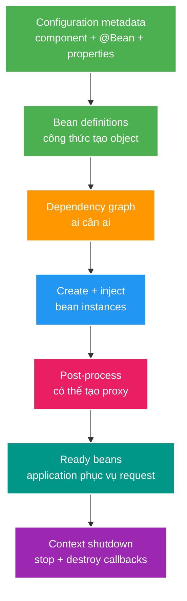
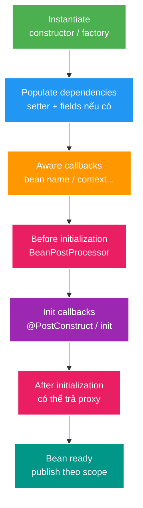

# Spring IoC, Bean Lifecycle và Dependency Injection

> Type: `CORE`<br>
> Domain: `spring`<br>
> Target depth: `D3 — giải thích bean graph, tái hiện lifecycle/scope failure và chẩn đoán startup condition`<br>
> Teaching readiness: `TEACHABLE_DRAFT`<br>
> Status: `DRAFT`<br>
> Evidence status: `NOT RUN`<br>
> Framework baseline: `Spring Boot 3.4 current project; re-check exact Spring Framework behavior when SPR-01 becomes active`<br>
> Prerequisites: Java object construction, interface và exception cơ bản<br>
> Related cases: [`SPRING-UC-01`](../../../../use-case-catalog.md#31-foundation-và-senior-cases), [`CREATE-UC-01`](../../../../use-case-catalog.md#31-foundation-và-senior-cases)<br>
> Owner: `Project learner; Codex teaches, learner writes back`<br>
> Updated: `2026-07-26`

## 0. Cách dùng tài liệu này

Tài liệu dành cho developer đã biết viết `@Service`, `@Repository`, `@Bean` nhưng chưa hiểu container thực sự làm gì. Nếu trước đây bạn chỉ nhớ “Spring dùng `@Autowired` để inject”, hãy đọc theo thứ tự từ mục 1 đến mục 13. Thời gian đọc dự kiến 60–90 phút.

Core này dạy mental model và lifecycle thông thường. Chi tiết early reference, post-processor ordering, scoped proxy và startup-condition experiment nằm trong [deep-dive](../deep-dives/bean-creation-scopes-cycles-and-startup-conditions.md). Proxy/AOP/transaction là topic riêng; ở đây chỉ giải thích đủ để hiểu vì sao object cuối cùng có thể là proxy.

## 1. Vì sao IoC container tồn tại?

Hãy bắt đầu bằng một service Java thuần:

```java
public final class StreamService {
    private final StreamRepository repository;
    private final Clock clock;

    public StreamService(StreamRepository repository, Clock clock) {
        this.repository = repository;
        this.clock = clock;
    }
}
```

`StreamService` không thể hoạt động nếu chưa có `StreamRepository` và `Clock`. Trong ứng dụng nhỏ, `main()` có thể tự `new` mọi object. Trong Spring Boot service, graph có thể gồm controller, service, repository, transaction manager, security filter, serializer, message listener và third-party client. Ta phải trả lời:

- Ai tạo từng object?
- Implementation nào được chọn cho một interface?
- Object sống bao lâu?
- Khi nào callback khởi tạo/hủy chạy?
- Làm sao infrastructure như transaction hoặc security bọc quanh business object?
- Nếu config thiếu hoặc có hai implementation thì application fail ở đâu?

Spring IoC container sở hữu việc **tạo, nối dependency và quản lý lifecycle** của object mà nó quản lý. Business class chỉ khai báo “tôi cần dependency này”; nó không tự đi tìm dependency trong một global registry và không tự quyết định lifecycle.

IoC không tự làm code thread-safe, không tự đặt transaction đúng và không sửa một domain design kém. Nó chỉ cung cấp cơ chế quản lý object graph; correctness vẫn phụ thuộc boundary và code của application.

## 2. Learning objectives và prerequisite bridge

Sau topic này, tôi có thể:

1. Phân biệt IoC, Dependency Injection, bean definition, bean instance và `ApplicationContext`.
2. Kể lifecycle một singleton bean từ definition tới object sẵn sàng phục vụ request.
3. Chọn constructor/setter/provider/scoped proxy theo loại dependency và scope.
4. Giải thích vì sao singleton không đồng nghĩa thread-safe.
5. Chẩn đoán missing bean, ambiguous bean, circular dependency và scope mismatch bằng causal reasoning.

Prerequisite duy nhất là Java object construction: constructor tạo một instance; reference truyền vào constructor cho phép object gọi collaborator. Spring không thay đổi nền tảng này. Container chỉ tự động hóa việc chọn constructor argument và quản lý thời điểm tạo/hủy object.

## 3. Từ vựng tối thiểu

### 3.1. IoC và Dependency Injection

**Inversion of Control (IoC)** là sự đảo chiều quyền điều khiển object lifecycle. Thay vì application code tự `new` và nối mọi collaborator, container thực hiện việc đó theo metadata/configuration.

**Dependency Injection (DI)** là một cơ chế để thực hiện IoC: dependency được đưa vào object qua constructor, setter hoặc method/factory parameter. DI không đồng nghĩa `@Autowired`; constructor Java thuần ở ví dụ đầu đã thể hiện DI.

### 3.2. Bean definition và bean instance

**Bean definition** là công thức/metadata: type nào, tạo bằng constructor hay factory method, scope gì, dependency nào và lifecycle metadata nào. Nó chưa phải object business đang chạy.

**Bean instance** là object thật được tạo từ definition. Với singleton scope, container thường giữ một shared instance cho definition đó trong `ApplicationContext` tương ứng.

### 3.3. `BeanFactory` và `ApplicationContext`

`BeanFactory` là contract nền cho việc truy xuất/tạo bean. `ApplicationContext` mở rộng capability với event, resource loading, message resolution, environment và việc đăng ký nhiều infrastructure processors. Trong Spring Boot application, ta thường tương tác với `ApplicationContext`, nhưng phần tạo bean cốt lõi vẫn dựa trên bean factory machinery.

### 3.4. Scope

Scope trả lời: **container tạo bao nhiêu instance và instance được chia sẻ trong boundary nào?** Singleton là một instance trên mỗi bean definition trong một container, không phải một object duy nhất toàn JVM. Prototype tạo instance mới mỗi lần container được yêu cầu cung cấp bean. Request/session scope gắn instance với web request/session.

## 4. Mental model cốt lõi — phần Agent dạy

Hãy hình dung Spring container như một **object graph builder có lifecycle**.



Diagram có sáu ý:

1. Annotation/configuration chỉ cung cấp metadata.
2. Container chuyển metadata thành bean definitions.
3. Container resolve graph: muốn tạo controller phải có service; muốn tạo service phải có repository.
4. Container tạo instance và inject dependencies.
5. Infrastructure processor có thể kiểm tra/chỉnh instance hoặc trả về proxy.
6. Container giữ instance theo scope và gọi lifecycle callbacks khi context đóng.

Container sở hữu lifecycle của **Spring-managed bean**. Object bạn tự tạo bằng `new` ở giữa business code không tự trở thành managed bean; Spring không inject, proxy hoặc gọi destroy callback cho nó.

> **Câu cần nhớ:** Bean là object được container tạo/quản lý từ bean definition; DI mô tả dependency graph, còn scope và lifecycle mô tả object đó được chia sẻ và sống bao lâu.

## 5. Cơ chế hoạt động từng bước

### 5.1. Bước 1 — đăng ký bean definitions

Definitions có thể đến từ component scanning (`@Component`, `@Service`, `@Repository`, `@Controller`), Java configuration (`@Bean`), auto-configuration hoặc programmatic registration. Stereotype annotations biểu diễn intent/layer, nhưng không tự bảo đảm architecture đúng.

Ví dụ:

```java
@Configuration
class TimeConfiguration {

    @Bean
    Clock applicationClock() {
        return Clock.systemUTC();
    }
}
```

Method `applicationClock()` mô tả cách tạo một `Clock` bean. Tên method thường trở thành bean name mặc định; return type giúp type-based resolution.

Trước khi phần lớn singleton được tạo, `BeanFactoryPostProcessor` có thể đọc/chỉnh bean definitions. Đây là definition-level extension; nó chưa xử lý từng object instance.

### 5.2. Bước 2 — resolve dependency

Khi tạo `StreamService`, container nhìn constructor và tìm candidate phù hợp cho từng parameter. Trường hợp đơn giản có đúng một bean assignable theo type. Nếu không có candidate, application thường fail startup. Nếu có nhiều candidate, cần `@Primary`, `@Qualifier` hoặc design/configuration làm lựa chọn rõ ràng.

Resolution không nên dựa vào “Spring đoán đúng bằng may mắn”. Ambiguity phải được giải bằng domain/infrastructure intent rõ. Bean name là một phần metadata, nhưng type và qualifier thường biểu đạt contract tốt hơn lookup string thủ công.

### 5.3. Bước 3 — instantiate và inject

Container gọi constructor/factory method. Với constructor injection, object nhận đầy đủ required dependencies ngay khi được tạo. Setter/method injection diễn ra sau construction và phù hợp hơn với truly optional dependency hoặc configuration pattern cụ thể.

Constructor injection được ưu tiên vì:

- required dependency hiện ngay trong API của class;
- reference có thể là `final`;
- test Java thuần chỉ cần gọi constructor;
- object không tồn tại ở trạng thái thiếu required dependency;
- constructor quá dài phơi bày class có quá nhiều responsibility.

Field injection ngắn về cú pháp nhưng giấu construction contract, cần reflection/container để set field và làm unit test/plain instantiation khó hơn.

### 5.4. Bước 4 — aware callbacks, initialization và post-processing

Lifecycle đầy đủ có nhiều hook; core cần nhớ sequence khái niệm sau:



`BeanPostProcessor` là extension point xử lý object instances. Infrastructure như annotation processing hoặc AOP proxy creation dùng cơ chế này. Vì proxy có thể xuất hiện sau initialization, init method chạy trên target đang được tạo; không nên mong transactional/security advice bọc quanh init callback.

`@PostConstruct` phù hợp để validate configuration hoặc chuẩn bị in-memory structure bounded. Không nên đặt remote I/O không bounded trong init: bean đang nằm trong creation path, startup có thể treo hoặc deadlock. Công việc cần chạy sau toàn bộ singleton initialization phải chọn lifecycle/event mechanism phù hợp và có failure policy.

### 5.5. Bước 5 — scope quyết định lookup và sharing

Singleton bean được dùng chung bởi nhiều request/threads. Container publish initialized singleton an toàn, nhưng **runtime mutable state bên trong bean vẫn là trách nhiệm của class**. Một `ArrayList` field bị nhiều request ghi vẫn không thread-safe chỉ vì object là Spring singleton.

Prototype có semantics “new instance mỗi lần container resolve/request bean”, không có nghĩa dependency prototype injected trực tiếp vào singleton tự đổi mỗi method call. Singleton chỉ được construct một lần, nên prototype dependency cũng được resolve ở thời điểm đó. Muốn lookup instance mới khi dùng, cần provider/method injection phù hợp.

Request/session scope cần active web scope. Khi inject request-scoped bean vào singleton, scoped proxy hoặc provider giữ một placeholder/reference có thể resolve target đúng theo request hiện tại. Proxy không kéo dài lifetime của request object; nó chỉ trì hoãn lookup tới lúc invocation.

### 5.6. Bước 6 — shutdown và destruction

Khi `ApplicationContext` đóng bình thường, lifecycle stop và destruction callbacks cho managed singleton được gọi theo contract/order phù hợp. `@PreDestroy` hoặc inferred `close()` thường dùng để release resource do bean sở hữu.

Prototype scope là boundary dễ quên: container tạo/configure prototype nhưng không quản lý destruction lifecycle đầy đủ như singleton. Nếu prototype giữ resource cần close, application phải có ownership/cleanup design rõ.

## 6. Worked examples

### 6.1. Ví dụ tối thiểu — constructor injection dễ test

```java
interface NotificationPort {
    void notifyOwner(long streamId);
}

final class StreamStartedHandler {
    private final NotificationPort notificationPort;

    StreamStartedHandler(NotificationPort notificationPort) {
        this.notificationPort = notificationPort;
    }

    void handle(long streamId) {
        notificationPort.notifyOwner(streamId);
    }
}
```

Class không import Spring. Production container inject implementation thật; unit test inject fake/mock. IoC nằm ở composition root/container, còn business object giữ Java contract rõ. DI không bắt domain class phụ thuộc framework.

### 6.2. Ví dụ ambiguity — hai implementation cùng type

```java
interface ThumbnailStorage {
    URI store(byte[] content);
}

@Component
class LocalThumbnailStorage implements ThumbnailStorage { /* ... */ }

@Component
class S3ThumbnailStorage implements ThumbnailStorage { /* ... */ }
```

Nếu một constructor chỉ yêu cầu `ThumbnailStorage`, container thấy hai candidates. Đây không phải lỗi ngẫu nhiên; application chưa biểu đạt policy chọn storage. Có thể dùng profile/conditional configuration để chỉ đăng ký một implementation, hoặc qualifier khi hai implementation cùng tồn tại vì hai purpose khác nhau. Dùng `@Primary` chỉ hợp lý khi có một default domain-wide thật sự.

### 6.3. Ví dụ thực tế — singleton service phải stateless theo request

```java
@Service
class ViewerService {
    private Long currentUserId; // Sai: shared mutable request state

    ViewerDto loadFor(Long userId) {
        this.currentUserId = userId;
        return query(this.currentUserId);
    }
}
```

Hai request có thể interleave: request A set user 10, request B set user 20, rồi request A query field và lấy user 20. Container không tạo service mới cho từng request vì default scope là singleton. Cách đúng là giữ `userId` trong local variable/method parameter; nếu state thật sự thuộc request, đặt nó trong request-scoped context có ownership rõ, không biến service thành session storage.

### 6.4. Phản ví dụ — service tự lookup dependency

```java
class GiftService {
    GiftRepository repository() {
        return GlobalContext.getBean(GiftRepository.class);
    }
}
```

Service Locator làm dependency ẩn: constructor không cho biết class cần repository; test phải boot/global-mock context; business code coupled vào container. `ApplicationContextAware` có use case cho infrastructure, nhưng dùng nó trong mọi service đi ngược IoC style.

## 7. Invariants và boundaries

1. **Required dependency phải có contract rõ tại construction.** Nếu object có thể được tạo mà thiếu dependency bắt buộc, failure chuyển từ startup/compile-time reasoning sang runtime branch khó đoán.
2. **Singleton business service không giữ mutable per-request state.** Container bảo đảm publication của initialized singleton, không serialize mọi method call và không làm collection field thread-safe.
3. **Managed behavior chỉ áp dụng cho managed object/call path.** Object tự `new` không tự có DI/proxy/lifecycle.
4. **Scope ngắn không được biến thành state sống dài hơn boundary.** Scoped proxy trì hoãn lookup; nó không cho phép lưu request target vào singleton/static cache.
5. **Initialization phải bounded và không dựa vào bean chưa ready.** Remote work dài trong creation path có thể giữ creation lock, kéo dài startup hoặc deadlock.
6. **Container boundary là một `ApplicationContext`, không phải toàn JVM/cluster.** Nhiều contexts có thể có các singleton instances khác nhau; multi-node state cần DB/cache/broker coordination riêng.

## 8. Các khái niệm dễ nhầm

### IoC và DI

IoC là nguyên lý rộng về ai giữ control. DI là cách đưa collaborator vào object. Event callback/framework lifecycle cũng thể hiện IoC, nhưng không phải mọi IoC đều là constructor injection.

### Scope và thread safety

Scope mô tả số instance/lifetime/sharing. Thread safety mô tả behavior khi nhiều threads truy cập. Singleton thường bị nhiều threads dùng chung nên càng cần stateless hoặc synchronization đúng; scope không cung cấp synchronization tự động.

### Stereotype và architecture

`@Service` cho biết intent, không tự cấm controller gọi repository hay tự mở transaction. Architecture cần package/module rules, review và tests.

| Khái niệm | Câu hỏi nó trả lời | Không trả lời |
| --- | --- | --- |
| Bean definition | Object được tạo như thế nào? | Instance hiện tại có thread-safe không? |
| Scope | Bao nhiêu instance, sống trong boundary nào? | Mutation có synchronized không? |
| DI | Dependency đi vào object bằng cách nào? | Implementation có đúng business rule không? |
| Stereotype | Bean có intent/layer gì? | Layer rule có được enforce không? |
| Proxy | Invocation nào được intercept? | Mọi internal call có đi qua proxy không? |

## 9. Misconceptions và failure modes

### Failure story 1 — ambiguous dependency

Trigger: một interface có hai beans cùng type và injection point không có selection rule. Container không thể chứng minh candidate nào đúng nên fail startup. Symptom thường là exception liệt kê candidates. Cách xử lý đúng bắt đầu từ policy: chỉ một bean nên tồn tại theo configuration, có default thật sự, hay caller cần qualifier semantic? Đổi tên bean ngẫu nhiên chỉ che design ambiguity.

### Failure story 2 — circular dependency

`StreamService` cần `NotificationService`, trong khi `NotificationService` lại cần `StreamService`. Với constructor injection, container không thể tạo object hoàn chỉnh nào trước: để tạo A cần B, để tạo B cần A. Startup failure phơi bày cycle sớm.

Cố chuyển một phía sang setter/lazy có thể làm application start nhưng không trả lời vì sao ownership quay vòng. Thường cần tách orchestration, đưa shared rule vào service thứ ba, đảo dependency qua port hoặc dùng domain event khi semantics thật sự asynchronous.

### Failure story 3 — prototype tưởng là “mỗi lần gọi method”

Prototype được inject trực tiếp vào singleton tại lúc singleton được tạo. Developer kỳ vọng ID/state mới mỗi invocation nhưng nhận cùng reference. Evidence đơn giản là ghi identity qua hai calls; root cause là lookup time, không phải prototype scope “không hoạt động”. Provider/scoped lookup chỉ nên thêm khi need thật sự rõ.

| Misconception | Vì sao sai | Cách kiểm chứng |
| --- | --- | --- |
| `@Service` tự tạo transaction | Stereotype không phải transaction boundary | Inspect proxy/advisors và transaction-active test |
| Singleton là một instance toàn JVM | Scope thuộc container/definition | Tạo hai contexts và so instance |
| Singleton đồng nghĩa thread-safe | Scope không khóa runtime mutable state | Concurrent request test trên shared field |
| Field injection tốt vì ngắn | Nó giấu required contract | Thử instantiate class trong plain unit test |
| `@Lazy` sửa circular design | Nó đổi creation timing, không sửa ownership | Vẽ dependency graph/business responsibility |

## 10. Solution patterns và trade-offs

**Constructor injection** là default tốt cho required collaborators. **Explicit `@Bean` factory** phù hợp third-party class hoặc construction cần config. **Qualifier/custom annotation** diễn đạt selection khi nhiều implementations cùng tồn tại. **Provider/scoped proxy** giải quyết lookup-time/scope bridge, nhưng thêm runtime indirection. **Conditional configuration** bật capability theo environment/classpath, đồng thời làm startup state-space lớn hơn và cần test matrix.

| Option | Điểm mạnh | Failure dễ gặp | Khi dùng |
| --- | --- | --- | --- |
| Constructor injection | Contract rõ, immutable reference, test thuần | Constructor dài phơi bày cohesion kém | Required dependency |
| Setter/method injection | Hỗ trợ optional/reconfiguration cụ thể | Object có intermediate state | Truly optional dependency |
| Field injection | Ít code bề mặt | Hidden contract, reflection/test coupling | Tránh trong application code mới |
| Provider lookup | Tạo/lấy dependency theo invocation | Framework coupling, lỗi muộn | Prototype/optional/lazy lookup có lý do |
| Scoped proxy | Bridge singleton -> request/session | Proxy/type/context surprise | Web-scoped dependency cần truy cập từ longer scope |

Decision phải bắt đầu từ ownership và lifetime, không bắt đầu từ annotation nào ngắn nhất.

## 11. Áp dụng vào project và thực tế

Khi `SPR-01` active, không cần đọc toàn bộ source. Chọn một vertical path controller -> service -> repository và làm:

1. Vẽ constructor dependency graph.
2. Xác nhận beans nào singleton và có mutable fields hay không.
3. Chỉ ra bean nào có thể được proxied vì transaction/security/async.
4. Tìm init/destroy callbacks và đánh giá work có bounded không.
5. Tạo context test tối thiểu cho missing/ambiguous/circular/config branch.
6. Chỉ ghi evidence sau khi test/startup output thật tồn tại.

Với `CREATE-UC-01`, reusable rule là controller/service nên stateless theo request và dependency contract rõ. Endpoint/path cụ thể vẫn thuộc learning case.

## 12. Góc nhìn phỏng vấn

### 12.1. Câu trả lời 30 giây

“IoC nghĩa là container giữ quyền tạo và quản lý object graph; DI là cách container cung cấp collaborators cho object, ưu tiên qua constructor. Spring lưu bean definitions, resolve dependencies, tạo/inject instance, chạy lifecycle/post-processors và giữ instance theo scope. Scope không đồng nghĩa thread safety.”

Đây là teaching example; learner cần diễn đạt lại bằng từ của mình.

### 12.2. Outline Senior khoảng 2 phút

1. Bắt đầu từ object graph problem và IoC/DI distinction.
2. Kể definition -> resolve -> instantiate -> inject -> initialize -> proxy -> ready -> destroy.
3. Giải thích constructor injection và hidden cost của field injection.
4. Nêu singleton/request/prototype lookup semantics.
5. Kể một failure: ambiguity, cycle hoặc mutable singleton state.
6. Chốt boundary: managed object/context scope, proxy/call path và multi-node state nằm ngoài IoC.

### 12.3. Follow-up thường gặp

- “Prototype inject vào singleton có tạo mới mỗi call không?” — mục 5.5 và 9.
- “Tại sao constructor injection bắt được cycle?” — mục 9.
- “`@PostConstruct` có transaction không?” — mục 5.4; sau đó đọc proxy/AOP core.
- “Singleton service có thread-safe không?” — mục 6.3 và 7.

## 13. Tóm tắt cô đọng

1. IoC chuyển object creation/lifecycle control sang container; DI đưa collaborators vào object.
2. Bean definition là công thức; bean instance là object thật.
3. Container resolve dependency graph trước/khi tạo dependent instances.
4. Constructor injection làm required contract rõ và test Java thuần dễ.
5. Post-processors có thể xử lý hoặc bọc bean bằng proxy sau initialization.
6. Singleton là một shared instance theo container/definition, không phải thread-safety guarantee.
7. Prototype nói về lookup/creation; direct injection vào singleton chỉ resolve lúc singleton tạo.
8. Scoped proxy trì hoãn target lookup theo request/session, không kéo dài lifetime target.
9. Missing/ambiguous/circular dependencies nên fail rõ; workaround timing không thay design reasoning.
10. Managed behavior chỉ áp dụng cho object do container quản lý và invocation đi qua boundary phù hợp.

## 14. Bài tập diễn đạt lại — phần của tôi

Viết 10–18 câu theo scaffold:

1. **Problem:** Vì sao ứng dụng cần container thay vì `new` rải rác?
2. **Vocabulary:** Phân biệt IoC, DI, bean definition, instance và scope.
3. **Lifecycle:** Kể từ definition tới ready bean và shutdown.
4. **Example:** Dùng một service/controller/repository graph để minh họa.
5. **Failure:** Chọn singleton state, ambiguity hoặc circular dependency và kể causal chain.
6. **Decision:** Khi nào constructor injection, khi nào provider/scoped proxy?

> **Bài viết của tôi — `LEARNER TODO`:** lần đầu được nhìn mục 13; lần thứ hai đóng tài liệu và nói lại khoảng hai phút.

## 15. Self-check có hướng dẫn

1. **Question:** IoC và DI khác nhau thế nào?<br>
   **Đọc lại nếu bí:** mục 1 và 3.1.<br>
   **Một câu trả lời tốt phải có:** control ownership, injection mechanism và ví dụ không phụ thuộc annotation.<br>
   **My answer:** `LEARNER TODO`
2. **Question:** Bean definition, bean instance và dependency graph khác nhau thế nào?<br>
   **Đọc lại nếu bí:** mục 3.2 và 4.<br>
   **Một câu trả lời tốt phải có:** metadata, object thật, dependency edges và container ownership.<br>
   **My answer:** `LEARNER TODO`
3. **Question:** Kể lifecycle một singleton tới khi proxy-ready.<br>
   **Đọc lại nếu bí:** mục 5.1–5.4.<br>
   **Một câu trả lời tốt phải có:** definition, resolution, construction, injection, callbacks, post-processing/proxy, publication.<br>
   **My answer:** `LEARNER TODO`
4. **Question:** Vì sao singleton không đồng nghĩa thread-safe?<br>
   **Đọc lại nếu bí:** mục 5.5, 6.3 và 7.<br>
   **Một câu trả lời tốt phải có:** shared instance, concurrent callers, mutable runtime state và safe alternative.<br>
   **My answer:** `LEARNER TODO`
5. **Question:** Prototype inject trực tiếp vào singleton được resolve khi nào?<br>
   **Đọc lại nếu bí:** mục 5.5 và failure story 3.<br>
   **Một câu trả lời tốt phải có:** singleton construction time, lookup semantics và provider alternative.<br>
   **My answer:** `LEARNER TODO`
6. **Question:** Bạn xử lý circular dependency thế nào mà không chỉ thêm `@Lazy`?<br>
   **Đọc lại nếu bí:** failure story 2.<br>
   **Một câu trả lời tốt phải có:** graph/ownership diagnosis, refactor alternatives và khi event/port phù hợp.<br>
   **My answer:** `LEARNER TODO`
7. **Question:** Tại sao không làm remote I/O dài trong `@PostConstruct`?<br>
   **Đọc lại nếu bí:** mục 5.4.<br>
   **Một câu trả lời tốt phải có:** creation path/lock, startup blocking/deadlock, bounded initialization và lifecycle alternative.<br>
   **My answer:** `LEARNER TODO`
8. **Question:** Managed object boundary ảnh hưởng DI/proxy/lifecycle ra sao?<br>
   **Đọc lại nếu bí:** mục 4, 6.4 và 7.<br>
   **Một câu trả lời tốt phải có:** container-created object, `new` counterexample, context boundary và proxy topic link.<br>
   **My answer:** `LEARNER TODO`

## 16. Official references

- [Spring Framework — Dependencies and Configuration in Detail](https://docs.spring.io/spring-framework/reference/core/beans/dependencies.html)
- [Spring Framework — Using `@Autowired`](https://docs.spring.io/spring-framework/reference/core/beans/annotation-config/autowired.html)
- [Spring Framework — Bean Scopes](https://docs.spring.io/spring-framework/reference/core/beans/factory-scopes.html)
- [Spring Framework — Customizing the Nature of a Bean](https://docs.spring.io/spring-framework/reference/core/beans/factory-nature.html)
- [Spring Framework — Container Extension Points](https://docs.spring.io/spring-framework/reference/core/beans/factory-extension.html)

## 17. Teach-back checklist

- [ ] Tôi giải thích IoC/DI mà không chỉ nói `@Autowired`.
- [ ] Tôi vẽ được definition -> graph -> lifecycle -> proxy -> ready.
- [ ] Tôi giải thích constructor injection bằng contract/testability, không bằng style preference.
- [ ] Tôi phân biệt singleton scope với thread safety.
- [ ] Tôi kể được ít nhất hai failure theo causal chain.
- [ ] Tôi biết khi nào cần đọc deep-dive về cycle/scoped proxy/startup conditions.
- [ ] Startup/scope/reproducer evidence vẫn `NOT RUN`.
