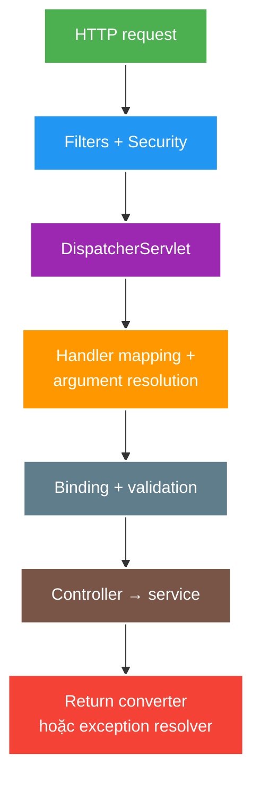

# MVC Request Pipeline, Validation and Error Handling

> Type: `CORE` 
> Domain: `spring` 
> Target depth: `D3 — lần theo request end-to-end, tái hiện validation/error branch và kiểm chứng security/async context` 
> Teaching readiness: `TEACHABLE_DRAFT` 
> Status: `DRAFT` 
> Evidence status: `NOT RUN` 
> Prerequisites: HTTP request/response, IoC and servlet fundamentals 
> Related cases: [`CREATE-UC-01`](../../../../use-case-catalog.md#31-foundation-và-senior-cases), [`AUTHZ-UC-01`](../../../../use-case-catalog.md#31-foundation-và-senior-cases) 
> Owner: `Project learner; Codex assists` 
> Updated: `2026-07-26`

Source canonical cho [Spring MVC question bank](../../question-bank/mvc-request-pipeline-validation-and-error-handling.md).

## 0. Cách học file này

Lần theo cả success path lẫn failure path. Với mỗi stage, ghi input, owner và lỗi có thể phát sinh. Security filter failure không đi qua cùng route với exception trong controller; validation shape không thay business invariant hay database constraint.

## 1. Learning objectives

1. Lần theo filter/security chain, `DispatcherServlet`, handler mapping/adapter, argument resolution, validation, controller, return handler và exception resolver.
2. Phân biệt malformed request, binding failure, method validation, business invariant và authorization failure.
3. Thiết kế stable error contract, correlation và test cho success/failure/async dispatch.

## 2. Mental model do người dạy cung cấp

MVC là pipeline chuyển HTTP bytes thành typed application call rồi chuyển result/failure về HTTP contract. Filter/security bao quanh servlet dispatch; `DispatcherServlet` route và resolve argument; controller giữ boundary mỏng; service giữ business invariant; exception resolver chỉ map failure đã có meaning sang response an toàn.

## 3. Cơ chế cốt lõi

Servlet filters chạy quanh dispatch; Spring Security thường nằm trong filter chain trước controller. `DispatcherServlet` tìm handler qua `HandlerMapping`, gọi bằng `HandlerAdapter`, resolve arguments, convert/bind/validate input, rồi dùng return-value handler và message converter để tạo response.

Exception có thể được xử lý bởi resolver chain, gồm `@ExceptionHandler`/`@ControllerAdvice`, status mappings và default framework handling. Error contract phải phân biệt client syntax/shape, field validation, business conflict, authentication/authorization và server failure mà không rò chi tiết nhạy cảm.

Bean validation bảo vệ shape/constraint tại boundary; domain/service vẫn phải bảo vệ invariant phụ thuộc current state hoặc concurrency. Async dispatch có lifecycle và context propagation riêng; thread-local/security/trace context không được mặc định tồn tại sau handoff.

### Worked example — ba loại invalid

Một field số nhận chuỗi chữ fail conversion trước controller. Title rỗng có thể fail Bean Validation ở request DTO. “Chỉ owner được kết thúc stream đang LIVE” cần authenticated principal + current DB state và race-safe update ở service/DB. Map cả ba thành cùng generic `400` sẽ làm sai semantics và khó vận hành.

### Worked example — error contract

Mỗi response lỗi nên có stable machine code, safe message/field violations và correlation ID. Stack trace, SQL, token hay internal class không ra client. Test phải cover unauthenticated `401`, authenticated-but-forbidden `403`, malformed/validation `400`, absent `404`, conflict `409`, unexpected `500` và không có sensitive leakage.

## 4. Invariants và boundaries

1. Controller mỏng: boundary validation/authorization, orchestration call và DTO response.
2. Không trả entity trực tiếp; serialization contract không phụ thuộc persistence graph.
3. Một failure class map ổn định sang HTTP status/error code; không catch rộng biến mọi lỗi thành `200` hoặc `500` mơ hồ.
4. Ownership/authorization được kiểm tra tại layer có đủ context và có regression test.
5. Logging có correlation nhưng không ghi token/password/payload nhạy cảm đầy đủ.

## 5. Failure taxonomy

| Failure | Layer điển hình | Kết quả mong đợi |
| --- | --- | --- |
| Malformed JSON/type | Message conversion | `400`, safe detail |
| Constraint violation | Argument/method validation | `400`, field/global violations |
| Unauthorized/forbidden | Security filter/method | `401`/`403` đúng semantics |
| Missing resource | Application service | `404` stable code |
| State conflict | Domain/DB invariant | `409` hoặc semantics đã document |
| Unexpected bug | Resolver cuối | `500`, correlation, no leakage |

## 6. Patterns và trade-off

| Pattern | Lợi ích | Rủi ro |
| --- | --- | --- |
| Global exception mapping | Contract nhất quán | Mapping quá rộng che bug |
| DTO + validation groups | Boundary rõ | Group complexity/coupling |
| Service invariant check + DB constraint | Defense in depth | Cần map race/constraint error |
| Problem-details-like envelope | Machine-readable | Migration/compatibility cost |
| Async MVC | Giải phóng request thread | Context, timeout, cancellation phức tạp |

## 7. Deep-dive và case

- [MVC security, validation, async and error pipeline](../deep-dives/mvc-security-validation-async-and-error-pipeline.md).
- `CREATE-UC-01`: request DTO, invariant và error mapping.
- `AUTHZ-UC-01`: URL rule, method rule và ownership failure.

## 8. Interview answer outline

Đi end-to-end qua filter/security, dispatcher, mapping/adapter, argument resolution/validation, controller/service và resolver/converter. Phân loại lỗi theo owner/status, giải thích validation vs invariant, rồi nêu async context/cancellation và test matrix.

## 9. Tóm tắt và learner write-back

- Security/filter và controller exception có thể đi qua resolver path khác nhau.
- Binding/validation chỉ bảo vệ input shape/local constraints.
- Business invariant cần state/concurrency owner.
- Error envelope là compatibility và security contract.

`LEARNER TODO — vẽ pipeline của một endpoint và map sáu failure branches.`

## 10. Guided self-check

1. **Question:** Các stage chạy ở đâu? **Đọc lại nếu bí:** diagram và mục 3. **Rubric:** filter before/around dispatch, interceptor handler, resolver arguments, resolver exceptions. **My answer:** `LEARNER TODO`
2. **Question:** Validation và invariant khác gì? **Đọc lại nếu bí:** examples, mục 4–5. **Rubric:** shape/local constraint vs current state/ownership/concurrency/DB. **My answer:** `LEARNER TODO`
3. **Question:** Test matrix tối thiểu? **Đọc lại nếu bí:** error-contract example. **Rubric:** 400/401/403/404/409/500, stable payload, leakage and ownership assertions. **My answer:** `LEARNER TODO`

## 11. Official references

- [Spring MVC — Processing](https://docs.spring.io/spring-framework/reference/web/webmvc/mvc-servlet/sequence.html)
- [Spring MVC — Validation](https://docs.spring.io/spring-framework/reference/web/webmvc/mvc-controller/ann-validation.html)
- [Spring MVC — Exceptions](https://docs.spring.io/spring-framework/reference/web/webmvc/mvc-servlet/exceptionhandlers.html)

## 12. Teach-back checklist

- [ ] Tôi lần được request và exception path end-to-end.
- [ ] Tôi tách input validation khỏi state invariant.
- [ ] Tôi nêu async/context/security boundary.
- [ ] MVC/error evidence vẫn `NOT RUN`.
