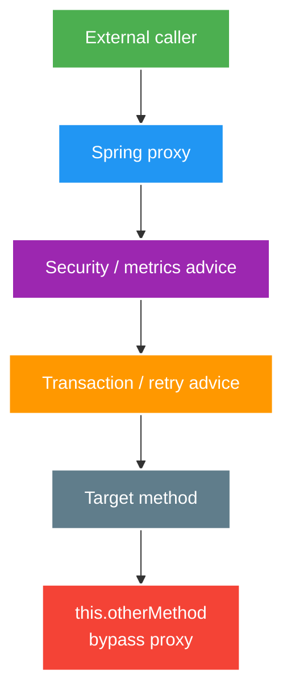

# Proxies, AOP and Transactional Boundaries

> Type: `CORE` 
> Domain: `spring` 
> Target depth: `D3 — dự đoán advice có chạy hay không, tái hiện self-invocation và kiểm chứng transaction boundary` 
> Teaching readiness: `TEACHABLE_DRAFT` 
> Status: `DRAFT` 
> Evidence status: `NOT RUN` 
> Prerequisites: [IoC and bean lifecycle](ioc-bean-lifecycle-and-dependency-injection.md) 
> Related cases: [`SPRING-UC-01`](../../../../use-case-catalog.md#31-foundation-và-senior-cases), [`GIFT-UC-01`](../../../../use-case-catalog.md#gift-uc-01) 
> Owner: `Project learner; Codex assists` 
> Updated: `2026-07-26`

Source canonical cho [proxy/AOP question bank](../../question-bank/proxies-aop-and-transactional-boundaries.md). Transaction semantics chi tiết ở [transaction core](transaction-rollback-and-propagation.md).

## 0. Cách học file này

Mọi annotation AOP phải được đọc cùng call path. Vẽ object reference caller đang giữ, proxy chain và target; nếu invocation không đi qua proxy thì đừng kỳ vọng advice. Sau đó xếp thứ tự transaction/security/retry/cache/async để thấy scope và side effect thay đổi.

## 1. Learning objectives

1. Phân biệt target, proxy, interceptor/advice và invocation đi qua proxy.
2. Giải thích self-invocation, method visibility, finality và proxy type ảnh hưởng behavior.
3. Đặt transaction, security, retry, cache và async boundary tại public application operation hợp lý.

## 2. Mental model do người dạy cung cấp

Spring proxy là object đứng trước target. Caller gọi proxy; proxy chạy interceptor quanh target giống các lớp ngoặc. Annotation là metadata để xây chain, không tự thay bytecode mọi call. `this.method()` dispatch trực tiếp trong target nên không quay ra object proxy mà caller giữ.

## 3. Cơ chế cốt lõi

Spring AOP thường tạo proxy quanh bean. External caller giữ proxy; proxy chọn interceptor theo pointcut rồi gọi target. Một lời gọi `this.otherMethod()` bên trong target không quay lại proxy, nên advice gắn trên `otherMethod` có thể không chạy.

JDK dynamic proxy dựa trên interface; class-based proxy tạo subclass và không thể override behavior không proxyable như final/private method. Exact limitation phụ thuộc framework/version/configuration, vì vậy phải kiểm tra baseline đang chạy thay vì học thuộc một câu tuyệt đối.

Advice order quan trọng: transaction, authorization, retry, cache, metrics và async có thể thay đổi resource scope hoặc số lần side effect. Annotation presence không chứng minh advice được áp dụng; phải kiểm tra call path, proxy và observable effect.

### Worked example — self-invocation

`createGift()` gọi `this.writeAudit()` và `writeAudit()` gắn `REQUIRES_NEW`. Vì call không qua proxy, transaction mới không được mở; audit vẫn tham gia outer transaction hoặc không có transaction tùy caller. Tách `AuditService` managed bean tạo external proxy call rõ hơn self-injection workaround.

### Worked example — advice order

Retry ngoài transaction tạo physical transaction mới cho mỗi attempt; retry nằm trong một transaction có thể retry trên resource đã rollback-only hoặc giữ lock quá lâu. Authorization nên chặn trước side effect. Thứ tự phải được chứng minh bằng test log transaction identity/attempt và database outcome, không chỉ đọc annotation.

## 4. Invariants và boundaries

1. Business operation cần cross-cutting concern phải được gọi qua managed proxy hoặc dùng explicit programmatic boundary.
2. Transaction không bao phủ remote system atomically; retry bên ngoài/inside transaction phải được quyết định có chủ ý.
3. Không đặt annotation trên private/internal helper rồi giả định nó tạo boundary mới.
4. Advice order phải bảo toàn authorization, idempotency và metrics semantics.

## 5. Failure modes

| Failure | Trigger | Symptom |
| --- | --- | --- |
| Self-invocation bypass | `this.method()` | Transaction/retry/cache không chạy |
| Object tự tạo bằng `new` | Ngoài container | Không có proxy/advice |
| Wrong proxy contract | Cast/type/final limitation | Startup/runtime failure hoặc no advice |
| Advice order sai | Retry + transaction/async | Transaction quá rộng, duplicate side effect |
| Exception bị nuốt | Catch/convert không đúng | Rollback rule không kích hoạt |

## 6. Patterns và trade-off

| Option | Khi dùng | Trade-off |
| --- | --- | --- |
| Tách application service | External proxy call rõ | Thêm abstraction |
| Self-injection/proxy exposure | Legacy workaround hẹp | Coupling framework, dễ recursion/confusion |
| `TransactionTemplate` | Boundary động/explicit | Infrastructure code trong flow |
| Aspect riêng | Concern tái sử dụng | Pointcut/order/testing complexity |
| Domain decorator explicit | Cần visibility/control | Wiring nhiều nhưng behavior dễ đọc |

## 7. Deep-dive và case

- [Proxy self-invocation, advice order and context](../deep-dives/proxy-self-invocation-advice-order-and-context.md).
- `SPRING-UC-01`: reproducer cho call qua proxy và self-call.
- `GIFT-UC-01`: transaction/retry/idempotency order quanh ledger operation.

## 8. Interview answer outline

Vẽ caller→proxy→advice→target, giải thích self-invocation bằng dispatch. So JDK/class proxy ở mức contract cần thiết, rồi phân tích advice order và remote boundary. Đưa reproducer quan sát transaction active/attempt/commit.

## 9. Tóm tắt và learner write-back

- Annotation không đảm bảo invocation đã đi qua proxy.
- Self-invocation là call-path problem.
- Advice nesting đổi resource scope và failure semantics.
- Remote side effect không trở thành atomic nhờ `@Transactional`.

`LEARNER TODO — vẽ proxy chain của một service project và dự đoán self-call.`

## 10. Guided self-check

1. **Question:** Vì sao `@Transactional` có thể không chạy? **Đọc lại nếu bí:** mục 2–3 và example. **Rubric:** unmanaged object, self-call, proxyability/call path. **My answer:** `LEARNER TODO`
2. **Question:** Retry ngoài/trong transaction khác gì? **Đọc lại nếu bí:** advice order example và mục 4. **Rubric:** physical transaction per attempt, rollback-only/lock/side-effect consequences. **My answer:** `LEARNER TODO`
3. **Question:** Chứng minh order bằng gì? **Đọc lại nếu bí:** mục 3, 6. **Rubric:** call/attempt/transaction identity, commit/rollback and authorization side-effect assertions. **My answer:** `LEARNER TODO`

## 11. Official references

- [Spring AOP — Proxying Mechanisms](https://docs.spring.io/spring-framework/reference/core/aop/proxying.html)
- [Spring — Declarative Transaction Management](https://docs.spring.io/spring-framework/reference/data-access/transaction/declarative.html)

## 12. Teach-back checklist

- [ ] Tôi vẽ đúng proxy/target/call path.
- [ ] Tôi giải thích self-invocation bằng dispatch, không bằng khẩu quyết.
- [ ] Tôi phân tích advice order và remote boundary.
- [ ] Proxy/transaction evidence vẫn `NOT RUN`.
