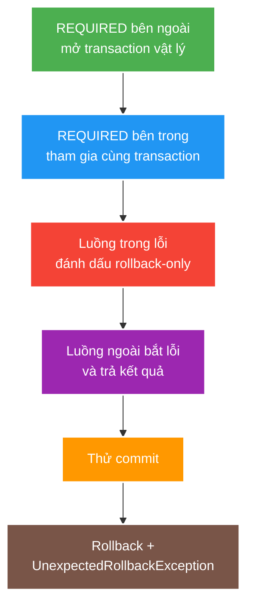

# Transaction, Rollback and Propagation

> Type: `CORE` 
> Domain: `spring` 
> Target depth: `D3 — dự đoán physical transaction, tái hiện rollback/propagation anomaly và kiểm chứng crash boundary` 
> Teaching readiness: `TEACHABLE_DRAFT` 
> Status: `DRAFT` 
> Evidence status: `NOT RUN` 
> Prerequisites: [Spring proxies](proxies-aop-and-transactional-boundaries.md), relational transaction fundamentals 
> Related cases: [`GIFT-UC-01`](../../../../use-case-catalog.md#gift-uc-01), [`SPRING-UC-01`](../../../../use-case-catalog.md#31-foundation-và-senior-cases) 
> Owner: `Project learner; Codex assists` 
> Updated: `2026-07-26`

Source canonical cho [transaction question bank](../../question-bank/transaction-rollback-and-propagation.md).

## 0. Cách học file này

Kể transaction như timeline physical: lấy connection, begin, SQL/flush, mark rollback-only, commit/rollback, release. Sau đó đặt từng logical annotation scope lên timeline. Cuối cùng chèn crash trước/sau commit để thấy DB, broker và cache không cùng atomic boundary.

## 1. Learning objectives

1. Phân biệt logical scope do annotation mô tả với physical resource transaction/connection.
2. Giải thích rollback rule, rollback-only, propagation và isolation bằng execution sequence.
3. Thiết kế boundary ngắn, giữ invariant và không giả DB + Redis/message là một atomic transaction.

## 2. Mental model do người dạy cung cấp

Logical transaction scope là lời hứa của từng method; physical transaction là resource transaction thật. Nhiều scope `REQUIRED` có thể chia sẻ một physical transaction và rollback-only flag. Commit chỉ xảy ra ở boundary ngoài cùng, nên outer method có thể chạy tiếp nhưng cuối cùng bị từ chối commit do inner failure.

## 3. Cơ chế cốt lõi

Transaction interceptor mở hoặc tham gia transaction theo metadata, bind resource vào execution context, gọi target rồi commit hoặc rollback. Runtime exception/error thường kích hoạt rollback mặc định; checked exception cần rule tường minh nếu muốn rollback. Catch và nuốt exception có thể cho phép commit ngoài ý muốn.

`REQUIRED` tham gia existing physical transaction hoặc tạo mới. `REQUIRES_NEW` suspend outer resource và tạo independent physical transaction, vì vậy cần connection khác và có thể gây pool exhaustion. `NESTED` thường dựa trên savepoint trong cùng physical transaction và phụ thuộc transaction manager/resource support.

Inner `REQUIRED` đánh dấu rollback-only nhưng outer vẫn cố commit có thể dẫn tới `UnexpectedRollbackException`; đó là tín hiệu caller không được tin commit đã thành công. Isolation kiểm soát anomaly giữa concurrent transactions, không sửa mọi lost update nếu read-modify-write/locking/versioning sai.

### Worked example — `REQUIRES_NEW` và pool

Mỗi outer transaction giữ một connection rồi gọi inner `REQUIRES_NEW`, inner phải mượn connection khác. Nếu 20 request outer chạy cùng lúc với pool 20, cả 20 giữ connection và cùng chờ connection thứ hai: stall giống deadlock. Propagation choice vì thế là capacity decision, không chỉ rollback semantics.

### Worked example — dual write

DB commit thành công rồi process crash trước publish RabbitMQ/Redis update. Rollback không còn khả dụng. Outbox ghi business state và event record trong cùng DB transaction; relay publish at-least-once nên consumer phải idempotent. Đây là cách thu hẹp crash window chứ không biến hai system thành one transaction.

## 4. Invariants và boundaries

1. Transaction bao phủ một business invariant trên resource có thể coordinate, không bao phủ remote I/O dài.
2. Side effect ngoài DB cần outbox/idempotency/reconciliation phù hợp, không claim atomicity giả.
3. Rollback policy và exception translation phải được test cho checked/runtime/constraint failures.
4. Propagation mới phải có lý do và connection-pool impact.
5. Commit success chỉ chứng minh local transaction; client timeout vẫn có thể tạo ambiguous outcome.

## 5. Failure modes

| Failure | Causal chain | Symptom |
| --- | --- | --- |
| Self-invocation | Bypass proxy | No transaction/new propagation |
| Swallowed exception | Catch without rollback | Partial business state commits |
| Rollback-only surprise | Inner joins and marks rollback | `UnexpectedRollbackException` |
| `REQUIRES_NEW` pressure | Outer holds connection, inner requests another | Pool wait/deadlock-like stall |
| Long transaction | Remote call/large work inside | Lock wait, bloat, p99 increase |
| Dual-write gap | DB commit then Redis/broker fails | Divergent state/missing event |

## 6. Trade-off matrix

| Option | Atomic scope | Cost/risk | Typical use |
| --- | --- | --- | --- |
| `REQUIRED` | Shared local transaction | Coupled rollback | One application operation |
| `REQUIRES_NEW` | Independent local commit | Extra connection, semantic split | Audit only with explicit failure policy |
| `NESTED` | Savepoint | Resource-specific | Partial rollback within one DB tx |
| Optimistic version | Conditional write | Retry/conflict | Moderate contention aggregate |
| Pessimistic lock | Serialized rows | Wait/deadlock | Short critical invariant |
| Outbox | DB state + event record atomic | Relay/duplication handling | Reliable event publication |

## 7. Deep-dive và case

- [Transaction propagation, isolation and crash windows](../deep-dives/transaction-propagation-isolation-and-crash-windows.md).
- `GIFT-UC-01`: balance/ledger invariant, duplicate command và event publication.
- `SPRING-UC-01`: proxy, rollback rule và propagation reproducer.

## 8. Interview answer outline

Phân biệt logical/physical, dựng sequence rollback-only, so propagation bằng connection/commit ownership. Nêu isolation không thay optimistic/pessimistic invariant design và chốt dual-write bằng outbox/idempotency/reconciliation cùng ambiguous client timeout.

## 8.1. Hai worked examples và phản ví dụ

**Worked example tối thiểu — rollback-only:** inner `REQUIRED` ném runtime, outer catch nhưng physical transaction đã rollback-only; commit ném `UnexpectedRollbackException`. Failure taxonomy/owner phải rõ thay vì catch rộng.

**Worked example gần project — `REQUIRES_NEW` pool:** outer giữ connection A, inner cần B; nhiều requests có thể giữ hết pool rồi cùng chờ. Test barrier/pool metrics; inner independent commit cũng không rollback theo outer.

**Phản ví dụ:** gọi payment provider trong DB transaction để mong `@Transactional` rollback cả hai. External success/local rollback vẫn xảy ra; cần idempotency/state/reconciliation và transaction ngắn.

## 9. Tóm tắt và learner write-back

- `REQUIRED` scopes có thể chia sẻ một physical transaction.
- Catch exception không xóa rollback-only.
- `REQUIRES_NEW` dùng thêm resource và tách commit semantics.
- Local commit không atomic với cache/broker/remote system.

`LEARNER TODO — vẽ physical transactions và crash windows cho GIFT-UC-01.`

## 10. Guided self-check

1. **Question:** Logical và physical transaction khác gì? **Đọc lại nếu bí:** mục 2–3. **Rubric:** annotation scope vs actual resource/connection/commit owner. **My answer:** `LEARNER TODO`
2. **Question:** Sequence `UnexpectedRollbackException`? **Đọc lại nếu bí:** diagram. **Rubric:** inner joins, marks rollback-only, outer catches, outer commit fails. **My answer:** `LEARNER TODO`
3. **Question:** Dual write gap xử lý ra sao? **Đọc lại nếu bí:** dual-write example, mục 4–6. **Rubric:** crash windows, outbox/idempotent consumer/reconciliation; no false atomicity. **My answer:** `LEARNER TODO`

## 11. Official references

- [Spring — Transaction Management](https://docs.spring.io/spring-framework/reference/data-access/transaction.html)
- [Spring — Transaction Propagation](https://docs.spring.io/spring-framework/reference/data-access/transaction/declarative/tx-propagation.html)
- [Spring — Rolling Back a Declarative Transaction](https://docs.spring.io/spring-framework/reference/data-access/transaction/declarative/rolling-back.html)

## 12. Teach-back checklist

- [ ] Tôi dự đoán connection/commit/rollback cho từng propagation.
- [ ] Tôi nêu pool và crash-window consequence.
- [ ] Tôi không claim atomicity xuyên DB/cache/broker.
- [ ] Transaction evidence vẫn `NOT RUN`.
