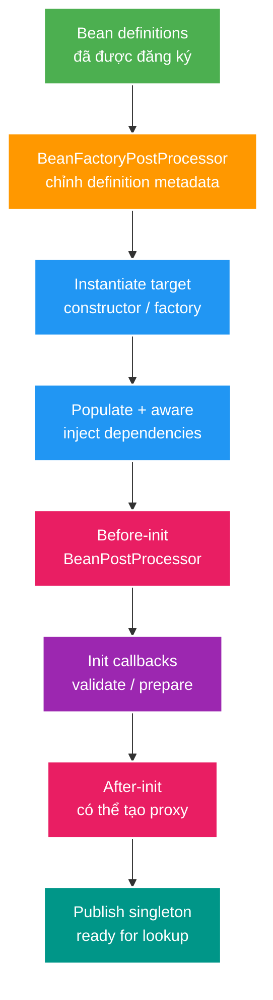
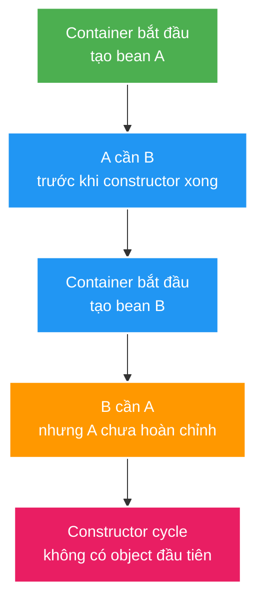
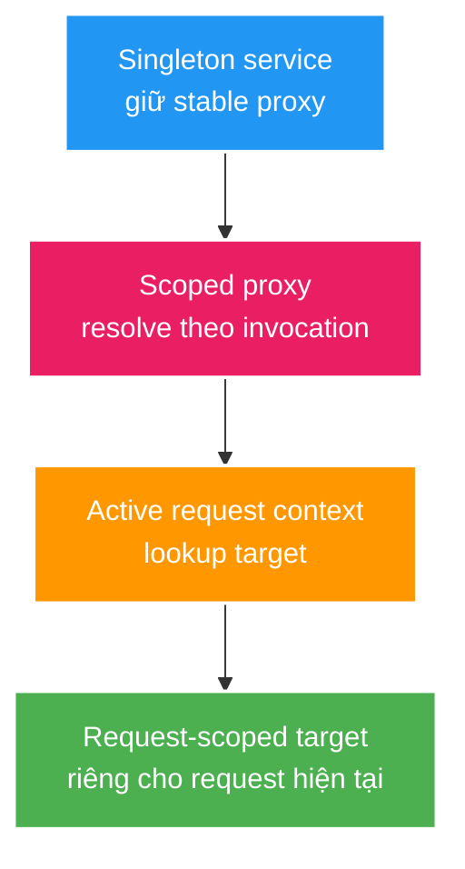
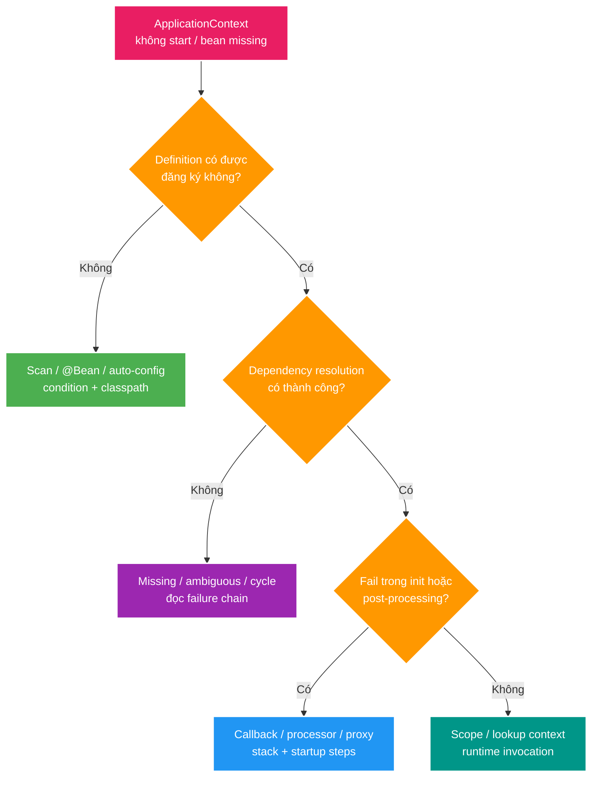

# Spring Bean Creation Internals, Scopes, Cycles và Startup Conditions

> Type: `DEEP_DIVE`<br>
> Domain: `spring`<br>
> Target depth: `D3 — trace bean creation, scope bridge và conditional startup failure bằng reproducer`<br>
> Teaching readiness: `TEACHABLE_DRAFT`<br>
> Status: `DRAFT`<br>
> Evidence status: `NOT RUN`<br>
> Framework baseline: `Spring Boot 3.4 current project; internals are not public compatibility contracts`<br>
> Prerequisites: [Spring IoC, Bean Lifecycle và Dependency Injection](../core/ioc-bean-lifecycle-and-dependency-injection.md)<br>
> Related cases: [`SPRING-UC-01`](../../../../use-case-catalog.md#31-foundation-và-senior-cases), [`CONFIG-UC-01`](../../../../use-case-catalog.md#31-foundation-và-senior-cases)<br>
> Owner: `Project learner; Codex teaches, learner writes back`<br>
> Updated: `2026-07-26`

## 0. Cách dùng và câu hỏi trung tâm

Core đã dạy container đi từ bean definition tới ready bean. Deep-dive này trả lời bốn câu khó hơn:

1. Definition-level và instance-level extension points khác nhau ở đâu?
2. Spring từng “cố giải” một số circular dependency bằng early reference như thế nào, và vì sao proxy làm chuyện đó nguy hiểm?
3. Khi scope dài inject scope ngắn, proxy/provider thực sự trì hoãn điều gì?
4. Làm sao debug “bean không tồn tại” khi root cause là condition/profile/classpath/configuration?

Đọc mục 1–5 trước, sau đó dùng diagnostic walkthrough và self-check. Internals như singleton caches là implementation detail, hữu ích để chẩn đoán nhưng không phải API contract để application phụ thuộc.

## 1. Recap có giới hạn

Container giữ bean definitions, resolve dependency graph, tạo instance, inject collaborator, chạy lifecycle callbacks và post-processors, rồi giữ/tra instance theo scope. Constructor injection cần dependency hoàn chỉnh trước khi constructor caller hoàn tất. `BeanPostProcessor` có thể trả về proxy sau initialization. Singleton là shared instance trong context, không phải thread-safety guarantee.

Nếu năm câu trên chưa rõ, quay lại [core mục 4–5](../core/ioc-bean-lifecycle-and-dependency-injection.md#4-mental-model-cốt-lõi--phần-agent-dạy) trước khi đọc tiếp.

## 2. Internal mechanism — từ definitions tới singleton publication

### 2.1. Hai lớp extension point

**`BeanFactoryPostProcessor`** làm việc với bean definitions trước khi phần lớn singleton instances được tạo. Nó có thể chỉnh metadata, resolve placeholders hoặc đăng ký thêm definitions. Vì nó chạy ở definition phase, việc kéo application bean lên quá sớm từ đây có thể làm bean bỏ lỡ các processors chưa được đăng ký đầy đủ.

**`BeanPostProcessor`** làm việc với từng bean instance quanh initialization. Nó có thể inject annotation-driven metadata, validate instance hoặc thay raw target bằng proxy. Đây là lý do “constructor đã chạy” chưa đồng nghĩa reference cuối cùng mà collaborator nhận là raw object.



Spring documentation nêu initialization callback chạy trên target trước khi AOP proxy hoàn tất. Vì vậy transaction/security interceptor không nên được trông đợi quanh `@PostConstruct`. Nếu init method gọi method “có `@Transactional`” trên chính bean, call path/lifecycle vẫn không tạo boundary mà developer tưởng tượng.

### 2.2. Singleton creation lock và safe publication

Spring bảo vệ singleton creation/publication bằng container synchronization. Sau initialization thành công, threads khác lookup bean thấy initialized configuration state. Điều đó không làm runtime mutation an toàn. Nếu bean thay đổi fields sau publication, Java Memory Model rules vẫn áp dụng: cần immutable state, confinement, `volatile`, lock hoặc concurrent structure phù hợp.

Initialization callback thường nằm trong singleton creation path/lock. Một `@PostConstruct` gọi database/HTTP không bounded có thể:

1. giữ creation progress của bean graph;
2. chờ bean/resource khác cũng đang startup;
3. kéo dài readiness hoặc tạo initialization deadlock;
4. làm failure khó phân biệt giữa config sai và dependency ngoài unavailable.

Init callback nên validate config và chuẩn bị bounded in-memory structure. Expensive work sau khi tất cả singleton sẵn sàng có thể dùng `SmartInitializingSingleton`, context refresh event hoặc lifecycle component phù hợp, nhưng vẫn phải có timeout, retry/failure policy và readiness semantics.

### 2.3. Lifecycle callbacks không phải business invocation

Spring hỗ trợ nhiều mechanisms như `@PostConstruct`, `InitializingBean.afterPropertiesSet()` và custom init method. Nếu kết hợp với method names khác nhau, chúng có documented order; nhưng application thường nên chọn một convention để giảm surprise. Tương tự với `@PreDestroy`, `DisposableBean.destroy()` và custom destroy.

`Lifecycle`/`SmartLifecycle` dành cho component có start/stop semantics như listener/consumer/background process. `phase` điều khiển ordering; startup dùng phase thấp trước, shutdown đảo chiều. Đây là operational lifecycle, khác với object construction callback.

## 3. Circular dependency và early reference

### 3.1. Vì sao constructor cycle không thể hoàn tất?

Giả sử A cần B trong constructor và B cần A:



Không có fully constructed A để inject vào B, cũng không có B để hoàn tất A. Fail startup là outcome tốt hơn việc publish object nửa khởi tạo.

### 3.2. Early singleton reference giải được gì?

Trong một số setter/field cycles và khi circular references được cho phép, Spring internals có thể expose **early reference** của singleton đang được tạo. Conceptually:

1. instantiate raw A nhưng chưa hoàn tất population/init;
2. đăng ký factory có thể cung cấp early reference A;
3. bắt đầu tạo B;
4. B cần A nên nhận early A/reference;
5. hoàn tất B, inject B vào A;
6. hoàn tất init/post-processing A;
7. publish final singleton.

Spring internals dùng các structures cho fully created singleton, early references và singleton factories. Tên/cache/order là implementation detail, có thể đổi giữa framework versions. Application không nên “thiết kế dựa trên three-level cache”; mental model chỉ dùng để hiểu tại sao early exposure tồn tại.

### 3.3. Proxy mismatch/pathological case

Nếu A cuối cùng cần được wrapped bởi transaction/security/async proxy, B phải nhận reference tương thích với final exposed bean. Một raw early target lọt vào B trong khi callers khác nhận proxy có thể tạo hai call behaviors: B gọi raw A và bypass advice; phần còn lại gọi proxied A.

Infrastructure cố cung cấp early proxy reference khi cần, nhưng custom post-processor/order/cycle phức tạp có thể tạo identity/advice surprise. Đây là lý do cycle + proxy là design smell mạnh: correctness phụ thuộc lifecycle internals thay vì business boundary rõ.

Spring Boot 3.4 mặc định `spring.main.allow-circular-references=false`. Không bật nó như fix đầu tiên. Vẽ graph và hỏi:

- A/B có thực sự cùng responsibility không?
- Có application orchestrator thứ ba không?
- Một direction có thể đảo qua interface/port không?
- Interaction có thật sự cần synchronous call hai chiều, hay domain event phù hợp?

## 4. Scope bridge — lookup time quan trọng hơn annotation

### 4.1. Prototype trong singleton

```java
@Component
@Scope("prototype")
class CorrelationBuffer { /* mutable per-operation state */ }

@Service
class ExportService {
    private final CorrelationBuffer buffer;

    ExportService(CorrelationBuffer buffer) {
        this.buffer = buffer;
    }
}
```

`ExportService` singleton chỉ được construct một lần. Container resolve `CorrelationBuffer` một lần để truyền vào constructor đó. Prototype scope hứa “mỗi lần container được yêu cầu tạo/resolve target thì có instance mới”, không hứa “mỗi method call trên singleton tự inject lại”.

Nếu mỗi operation thật sự cần buffer mới, code có thể inject `ObjectProvider<CorrelationBuffer>` và gọi `getObject()` trong operation. Trade-off là business service biết framework provider. Một factory application-owned đôi khi diễn đạt ownership rõ hơn.

### 4.2. Request scope trong singleton

Không thể tạo concrete request target khi application startup vì chưa có request. Scoped proxy giải quyết bằng hai lớp reference:



Singleton giữ proxy lâu dài. Mỗi invocation trên proxy hỏi active request scope để lấy target đúng. Nếu call xảy ra ngoài request context, lookup có thể fail. Nếu code lấy concrete target rồi lưu vào static/singleton field, nó phá lifetime boundary; proxy không cứu được leaked reference.

### 4.3. Destruction ownership

Request/session targets được scope quản lý và hủy theo boundary tương ứng. Prototype là khác biệt quan trọng: container khởi tạo/configure instance nhưng không theo dõi full destruction lifecycle sau khi giao cho caller. Resource-owning prototype cần caller/factory quản lý close; nếu không sẽ leak.

## 5. Startup conditions và auto-configuration graph

Một bean “không có” không nhất thiết do component scan sai. Spring Boot auto-configuration có thể phụ thuộc:

- class/resource có trên classpath;
- property value hoặc property tồn tại;
- profile/environment;
- application type (servlet/reactive/non-web);
- bean khác tồn tại hoặc không tồn tại;
- user-defined bean làm default auto-config back off.

Do đó source code không đổi nhưng dependency/classpath/configuration thay đổi vẫn có thể làm bean graph khác.

Condition Evaluation Report giải thích condition nào matched hoặc không. Nó là diagnostic evidence, không phải acceptance test. Test nên assert capability outcome: có đúng một bean, không có bean khi class absent, user bean override được dùng, invalid property fail startup.

### Startup condition matrix có reasoning

1. **Property missing/default/valid/invalid:** kiểm tra behavior của absence và validation, không chỉ happy path.
2. **Classpath present/absent:** optional integration phải back off sạch khi library không có.
3. **User bean present/absent:** auto-config default phải nhường customization theo contract.
4. **Profile/environment:** dev-only bean không xuất hiện production context.
5. **Dependency unavailable/slow:** quyết định fail-fast hay degraded optional capability; không để init treo vô hạn.

`ApplicationContextRunner` phù hợp tạo context nhỏ với property/user configuration/classloader variants. Nó không thay full application startup test cho interaction giữa nhiều auto-configurations, và không chạy trong native image theo Spring Boot documentation.

## 6. Pathological cases theo causal chain

### Case 1 — remote call trong `@PostConstruct`

1. Container giữ singleton creation progress và gọi init callback.
2. Callback gọi HTTP service chưa ready, không có bounded timeout.
3. Bean chưa được publish; dependent beans tiếp tục chờ.
4. Application không đạt readiness hoặc deadlock với startup dependency vòng ngoài.
5. Thread dump/startup steps cho thấy creation thread chờ network; condition report không phải root evidence.
6. Mitigation: chỉ validate/prepare bounded state trong init; chuyển external work sang lifecycle phase thích hợp với timeout/failure/readiness policy.

Residual risk: chuyển work “sang async” nhưng không gắn readiness/ownership có thể làm app nhận traffic khi prerequisite chưa chuẩn bị xong.

### Case 2 — cycle bị che rồi transaction mất tác dụng

1. A và B setter-inject lẫn nhau; circular reference được bật.
2. B nhận early reference của A trong lúc A chưa hoàn tất post-processing.
3. A cuối cùng được transaction proxy wrap.
4. Call qua normal lookup đi proxy; call B -> A có nguy cơ dùng reference behavior khác trong custom/pathological setup.
5. Symptom là transaction/advice không nhất quán theo caller.
6. Evidence cần bean identity/target/advisor inspection và minimal context test; fix bền vững là bỏ cycle, không unwrap/reproxy trong business code.

### Case 3 — scoped proxy được gọi ngoài request

1. Singleton background worker giữ request-scoped proxy.
2. Worker chạy sau request hoặc từ scheduler không có active request context.
3. Proxy cố resolve target nhưng scope không active.
4. Runtime exception xuất hiện xa startup và xa injection point.
5. Root cause là ownership/context mismatch, không phải missing bean.
6. Mitigation: truyền immutable data cần thiết vào task hoặc tạo explicit task context; không phụ thuộc request object sau boundary.

## 7. Diagnostic và experiment walkthrough

### 7.1. Startup failure decision flow



### 7.2. Planned reproducer set

1. **Constructor cycle:** context có A -> B -> A; assert startup failure và dependency path.
2. **Prototype lookup:** direct injection so với provider; assert identity qua hai operations.
3. **Request scope:** call proxy trong MockMvc request và ngoài active scope; assert two outcomes.
4. **Conditional bean:** `ApplicationContextRunner` với property/class present/absent và user override; assert bean presence/count.
5. **Slow init:** controlled latch/fake client trong init; capture startup thread state/timeout, không gọi real external service.

Toàn bộ vẫn `NOT RUN`. Danh sách trên mô tả procedure/hypothesis, không phải evidence.

### 7.3. Evidence giải thích được gì?

- Context failure proves graph/config branch cụ thể không start; không chứng minh production classpath giống test.
- Identity test proves lookup timing; không tự chứng minh thread safety.
- Condition report explains match reasons; acceptance assertion mới bảo vệ desired outcome.
- Startup timing/thread dump chỉ ra nơi chờ; cần controlled dependency để kết luận causal.

## 8. Version và cross-layer boundaries

| Boundary | Điều phải re-check |
| --- | --- |
| Spring Boot 3.4 | Circular references và bean overriding mặc định `false`; exact property/auto-config behavior |
| Framework upgrade | Processor ordering/internal singleton implementation không phải public contract |
| AOP/transaction | Final exposed proxy, self-invocation và advice order thuộc proxy deep-dive |
| Java concurrency | Runtime mutable singleton state vẫn theo JMM; container chỉ safe-publish initialized bean |
| Native/AOT | Reflection/proxy/dynamic registration constraints có thể thay đổi startup model |
| Multi-context/test | Một JVM có thể có nhiều contexts và singleton instances khác nhau |

Internals giúp diagnosis nhưng solution phải dựa trên public contract: explicit dependencies, acyclic ownership, bounded lifecycle, correct scopes và tests.

## 9. Architecture trade-offs

**Eager singleton** fail sớm và làm graph predictable, đổi lại startup cost. **Lazy initialization** giảm initial startup và tránh tạo unused beans, nhưng chuyển missing config/dependency failure sang request đầu tiên. **Provider** làm lookup timing explicit nhưng coupled framework ở call site. **Scoped proxy** trong suốt hơn với caller nhưng có type/context/runtime indirection. **Redesign graph** tốn refactor nhất nhưng loại bỏ dependency vào circular-reference internals.

| Option | Failure timing | Reasoning clarity | Operational cost | Khi phù hợp |
| --- | --- | --- | --- | --- |
| Eager singleton | Startup | Cao | Startup time/resource | Required service capability |
| Lazy bean | First use | Trung bình | Cold-path surprise | Truly optional/heavy capability |
| Provider/factory | Invocation | Explicit | Framework/factory code | Per-operation creation |
| Scoped proxy | Invocation/context | Ẩn hơn | Proxy/context debugging | Web scope bridge chuẩn |
| Redesign acyclic graph | Compile/startup | Cao nhất | Refactor | Circular ownership/advice risk |

Không chọn lazy/provider chỉ để “application start được”. Chọn khi lookup timing/lifetime là requirement thật.

## 10. Áp dụng và phỏng vấn nâng cao

### Áp dụng vào project khi `SPR-01` active

- Chọn một bean graph nhỏ có service/repository/config bean.
- Tạo context test cho một missing/ambiguous/cycle branch.
- Kiểm tra mutable singleton fields và lifecycle callbacks.
- Chọn một conditional configuration quan trọng, test on/off/invalid branch.
- Ghi actual command/output trong case/experiment, không trong reusable theory.

### Outline Senior

Giải thích definition-level vs instance-level processors, lifecycle tới final proxy, scope lookup time, rồi kể một cycle/scope/startup failure với evidence.

### Outline Architect

Đưa thêm startup availability/readiness, optional capability policy, environment matrix, upgrade fragility và cách test bean graph mà không boot toàn hạ tầng.

### Outline Expert

Phân tích early reference + proxy identity/pathology, singleton creation lock/deadlock, internal contract risk và minimal reproducer phân biệt condition, resolution, initialization và scope failure.

## 11. Tóm tắt cô đọng

1. Factory post-processors xử lý definitions; bean post-processors xử lý instances và có thể tạo proxy.
2. Init callback chạy trong creation path; giữ nó bounded và không giả định AOP advice bọc quanh.
3. Constructor cycle không có fully constructed object đầu tiên; failure sớm là hữu ích.
4. Early reference là implementation mechanism cho một số cycles, không phải architecture pattern.
5. Cycle kết hợp proxy làm identity/advice correctness khó chứng minh.
6. Prototype/request scope phải được hiểu theo lookup time và ownership.
7. Scoped proxy trì hoãn target lookup; nó không cho phép target thoát scope.
8. Bean graph có thể đổi theo property/profile/classpath/user bean; condition report giải thích nhưng test bảo vệ outcome.
9. Startup diagnosis đi theo registration -> resolution -> initialization/post-processing -> scope lookup.
10. Internals nhạy version; application design phải dựa trên public contract và evidence.

## 12. Bài tập diễn đạt lại — phần của tôi

Viết 12–20 câu theo scaffold:

1. **Extension points:** definition processor và instance processor khác nhau thế nào?
2. **Lifecycle:** raw target trở thành final exposed proxy theo sequence nào?
3. **Cycle:** tại sao constructor cycle fail; early reference cố làm gì; proxy tạo risk gì?
4. **Scope:** prototype/scoped proxy thay đổi lookup time ra sao?
5. **Diagnosis:** bean missing/startup fail đi qua decision flow nào?
6. **Decision:** khi nào lazy/provider hợp lệ, khi nào phải redesign?

> **Bài viết của tôi — `LEARNER TODO`:** lần đầu được nhìn mục 11; lần thứ hai đóng file và trình bày khoảng 3–5 phút.

## 13. Self-check có hướng dẫn

1. **Question:** `BeanFactoryPostProcessor` và `BeanPostProcessor` khác phase và object xử lý thế nào?<br>
   **Đọc lại nếu bí:** mục 2.1.<br>
   **Một câu trả lời tốt phải có:** definitions trước instantiation so với instances quanh init, cùng premature-creation risk.<br>
   **My answer:** `LEARNER TODO`
2. **Question:** Vì sao init callback không nên kỳ vọng transaction proxy?<br>
   **Đọc lại nếu bí:** mục 2.1 và 2.3.<br>
   **Một câu trả lời tốt phải có:** raw target/init timing, final proxy sau processing và business boundary alternative.<br>
   **My answer:** `LEARNER TODO`
3. **Question:** Early reference giải cycle nào và vì sao không phải design pattern?<br>
   **Đọc lại nếu bí:** mục 3.2–3.3.<br>
   **Một câu trả lời tốt phải có:** partial lifecycle, setter/field scenario, proxy/identity risk, version/internal contract.<br>
   **My answer:** `LEARNER TODO`
4. **Question:** Prototype injected vào singleton khác provider lookup ra sao?<br>
   **Đọc lại nếu bí:** mục 4.1.<br>
   **Một câu trả lời tốt phải có:** singleton construction time, per-invocation lookup và ownership/cleanup.<br>
   **My answer:** `LEARNER TODO`
5. **Question:** Scoped proxy làm gì khi singleton gọi request-scoped dependency?<br>
   **Đọc lại nếu bí:** mục 4.2.<br>
   **Một câu trả lời tốt phải có:** stable proxy, active scope lookup, target lifetime và outside-context failure.<br>
   **My answer:** `LEARNER TODO`
6. **Question:** Condition report cho biết gì và không chứng minh gì?<br>
   **Đọc lại nếu bí:** mục 5 và 7.3.<br>
   **Một câu trả lời tốt phải có:** match explanation, capability assertion, classpath/config matrix và production gap.<br>
   **My answer:** `LEARNER TODO`
7. **Question:** Remote I/O trong `@PostConstruct` tạo causal failure nào?<br>
   **Đọc lại nếu bí:** mục 2.2 và case 1.<br>
   **Một câu trả lời tốt phải có:** creation lock/path, startup/readiness/deadlock, bounded alternative và residual async risk.<br>
   **My answer:** `LEARNER TODO`
8. **Question:** Thiết kế minimal reproducer phân biệt registration, resolution và initialization failure.<br>
   **Đọc lại nếu bí:** mục 7.1–7.2.<br>
   **Một câu trả lời tốt phải có:** one-variable contexts, expected outcome, exact assertion và evidence limitation.<br>
   **My answer:** `LEARNER TODO`

## 14. Official references

- [Spring Framework — Container Extension Points](https://docs.spring.io/spring-framework/reference/core/beans/factory-extension.html)
- [Spring Framework — Customizing the Nature of a Bean](https://docs.spring.io/spring-framework/reference/core/beans/factory-nature.html)
- [Spring Framework — Bean Scopes](https://docs.spring.io/spring-framework/reference/core/beans/factory-scopes.html)
- [Spring Boot 3.4 — Common Application Properties](https://docs.spring.io/spring-boot/3.4/appendix/application-properties/index.html)
- [Spring Boot 3.4 — Testing Auto-configuration](https://docs.spring.io/spring-boot/3.4/reference/features/developing-auto-configuration.html#features.developing-auto-configuration.testing)
- [Spring Framework source — `DefaultSingletonBeanRegistry`](https://github.com/spring-projects/spring-framework/blob/main/spring-beans/src/main/java/org/springframework/beans/factory/support/DefaultSingletonBeanRegistry.java)

## 15. Teach-back checklist

- [ ] Tôi phân biệt definition phase, instance phase và final proxy publication.
- [ ] Tôi giải thích constructor cycle và early-reference risk mà không coi internals là API.
- [ ] Tôi dự đoán prototype/request lookup behavior qua singleton.
- [ ] Tôi chẩn đoán startup theo registration -> resolution -> init/post-process -> scope.
- [ ] Tôi thiết kế được context tests/failure injection nhưng không bịa output.
- [ ] Tôi nêu version/upgrade boundary và residual risk.
- [ ] Reproducer/startup evidence vẫn `NOT RUN`.
