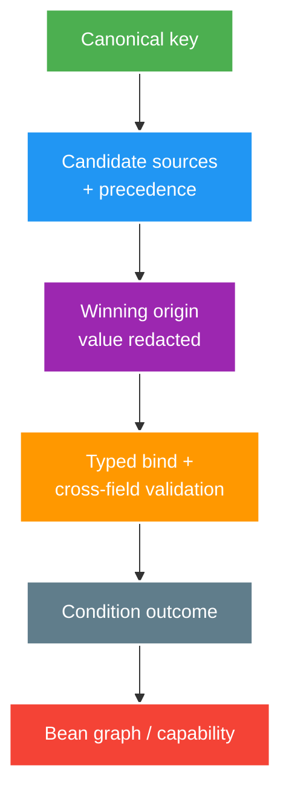

# Configuration Binding, Auto-configuration and Secret Safety

> Type: `DEEP_DIVE` 
> Domain: `spring` 
> Target depth: `D3 — audit effective config/conditions và chứng minh production safety bằng startup matrix` 
> Teaching readiness: `TEACHABLE_DRAFT` 
> Status: `DRAFT` 
> Evidence status: `NOT RUN` 
> Prerequisites: [Configuration core](../core/configuration-and-profile-safety.md) 
> Related cases: [`CONFIG-UC-01`](../../../../use-case-catalog.md#31-foundation-và-senior-cases), [`AUTHZ-UC-01`](../../../../use-case-catalog.md#31-foundation-và-senior-cases) 
> Owner: `Project learner; Codex assists` 
> Updated: `2026-07-26`

## 0. Mental model và cách học

Audit config bằng provenance graph: canonical key, candidates, winning origin, typed value, validation và bean outcome. Secret value bị che nhưng origin/version vẫn quan sát được. Upgrade dependency được coi là input có thể thay condition graph dù application source không đổi.

## 1. Binding and precedence reasoning

Worked example: `pool.size=20` và `queue.size=0` có thể từng field hợp lệ nhưng cặp không phù hợp policy. Typed immutable configuration cần class-level validation. Nếu runtime refresh hai field riêng, intermediate snapshot có thể invalid; publish nguyên snapshot versioned/atomic phù hợp hơn.

Config audit bắt đầu bằng key canonical, bound type/unit, all possible sources và winning source. YAML nesting, environment-variable transformation, command-line/system properties và test overrides có thể tạo effective value khác file đang đọc. Unknown/deprecated key policy cần rõ để typo không silently fall back.

Một nhóm property liên quan như connect/read timeout hoặc pool size/queue size cần cross-field validation. Runtime refresh từng field có thể tạo intermediate invalid state; immutable snapshot/versioned refresh an toàn hơn khi feature hỗ trợ dynamic config.

## 2. Auto-configuration reasoning

Auto-configuration là conditional bean definitions dựa trên classpath, bean absence/presence, properties và environment. User bean có thể làm default back off. Dependency upgrade/classpath change vì vậy có thể đổi graph mà source application không đổi.

Condition evaluation report giúp giải thích match/no-match. Test phải assert capability outcome, không snapshot toàn report dễ brittle. `@ConditionalOnMissingBean` cũng có ordering/search-scope nuance; exact behavior cần xem docs/version active.

## 3. Secret and production safety

Rotation không chỉ thay value: producer/consumer có thể cần overlap key versions, audit active key ID và rollback plan. Missing JWT/webhook key phải fail closed/startup; optional analytics endpoint có thể disable kèm health/metric. Tuyệt đối không “degrade” authentication bằng default secret.

Secret value không nằm trong git, default config, exception, actuator dump hoặc command history. Rotation cần overlap/version/refresh/restart plan. Authorization/webhook/JWT secret missing hoặc placeholder phải fail closed/fail startup; optional analytics endpoint có thể degrade nếu policy ghi rõ.

Production guard nên kiểm tra forbidden profiles/dev endpoints/default credentials, excessive SQL/security logging, schema destructive settings và exposed diagnostics. Guard là defense-in-depth, không thay deployment policy/secret manager.

## 4. Failure injection matrix

| Injection | Expected behavior |
| --- | --- |
| Required key missing | Startup fails with safe actionable message |
| Invalid duration/range | Binding validation fails |
| Dev profile in prod | Guard rejects startup |
| Secret provider unavailable | Fail policy matches criticality |
| User override bean present | Auto-config backs off as designed |
| Optional class absent | Capability disabled and observable |

Evidence `NOT RUN`; bảng là acceptance plan.

## 5. Operability trade-offs

| Choice | Benefit | Cost/risk |
| --- | --- | --- |
| Fail-fast | Không chạy invalid state | Availability giảm nếu dependency config tạm lỗi |
| Default fallback | Startup dễ | Silent unsafe behavior |
| Runtime refresh | No restart | Consistency/rollback/audit complexity |
| Restart rollout | Immutable process config | Deployment latency |
| Central secret/config service | Rotation/audit | Bootstrap dependency |

## 6. Interview outline, recap và learner write-back

Trình bày provenance→binding→validation→condition→capability, rồi production guard và rotation. Nêu startup failure-injection matrix và dependency-upgrade regression test.

- Unknown key/typo policy quan trọng như precedence.
- Condition graph phụ thuộc classpath/bean/property/order.
- Secret criticality quyết định fail policy.
- Runtime refresh cần atomic multi-property snapshot.

`LEARNER TODO — audit một config group và lập enabled/disabled/invalid matrix.`

## 7. Guided self-check

1. **Question:** Chứng minh source thắng an toàn? **Đọc lại nếu bí:** mental model, mục 1. **Rubric:** canonical key, origin/precedence/key version, redacted value. **My answer:** `LEARNER TODO`
2. **Question:** Upgrade đổi graph ra sao? **Đọc lại nếu bí:** mục 2, 4. **Rubric:** classpath/conditions/default backoff and capability assertion. **My answer:** `LEARNER TODO`
3. **Question:** Fail hay degrade? **Đọc lại nếu bí:** mục 3–5. **Rubric:** security/data-critical fail closed; optional observable disable; explicit policy/test. **My answer:** `LEARNER TODO`

## 8. References

- [Spring Boot — Externalized Configuration](https://docs.spring.io/spring-boot/reference/features/external-config.html)
- [Spring Boot — Creating Auto-configuration](https://docs.spring.io/spring-boot/reference/features/developing-auto-configuration.html)

## 9. Teach-back checklist

- [ ] Tôi audit precedence/binding/condition theo evidence.
- [ ] Tôi có production guard và secret rotation story.
- [ ] Tôi test enabled/disabled/invalid startup branches.
- [ ] Evidence vẫn `NOT RUN`.
