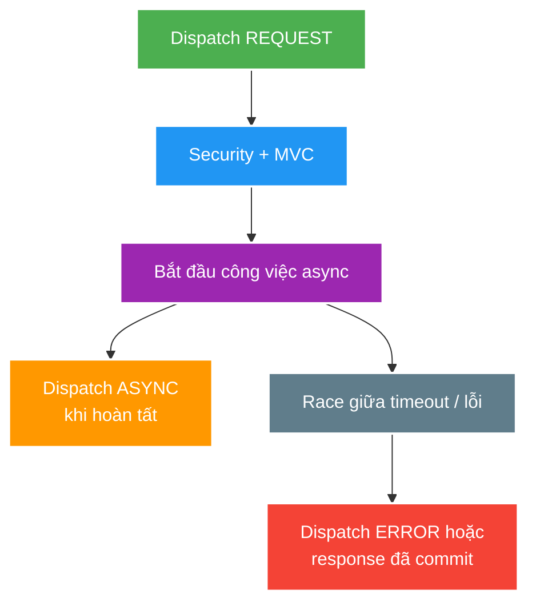

# Pipeline MVC: security, validation, async và xử lý lỗi

> Type: `DEEP_DIVE` 
> Domain: `spring` 
> Target depth: `D3 — tái hiện dispatch/error/async branches và chứng minh authorization + contract không drift` 
> Teaching readiness: `TEACHABLE_DRAFT` 
> Status: `DRAFT` 
> Evidence status: `NOT RUN` 
> Prerequisites: [MVC pipeline core](../core/mvc-request-pipeline-validation-and-error-handling.md) 
> Related cases: [`AUTHZ-UC-01`](../../../../use-case-catalog.md#31-foundation-và-senior-cases), [`CREATE-UC-01`](../../../../use-case-catalog.md#31-foundation-và-senior-cases) 
> Owner: `Project learner; Codex assists` 
> Updated: `2026-07-26`

## 0. Mental model và cách học

Request không chỉ có một dispatch. Async/error flow có thể quay lại filter chain với dispatch type khác; response commit là point of no return cho status/headers. Vẽ REQUEST, ASYNC, ERROR branches và đánh dấu auth context, timeout và exactly-once cleanup.

## 1. Pipeline detail

Filter có thể chạy ở dispatch `REQUEST`, `ASYNC` và `ERROR` tùy cách đăng ký. Security có thể từ chối ở bước authentication/authorization trước khi MVC tìm handler. `HandlerInterceptor` nhìn thấy handler đã map nhưng không thay thế security filter chain hoặc kiểm tra ownership trong service.

Argument resolution gồm chuyển đổi path/query/header/body và validation. Việc có nhận `BindingResult` ngay cạnh argument hay không có thể quyết định controller tự nhận lỗi hay framework ném exception. Method validation và argument validation có thể sinh loại exception khác giữa các baseline Spring, nên global handler phải có regression test đúng phiên bản project.

Thứ tự giải quyết exception bị ảnh hưởng bởi handler cục bộ, ordering của controller advice, response status mapping và default resolver. Khi response đã commit hoặc streaming đã bắt đầu, exception đến sau không thể đáng tin cậy thay header/body bằng error envelope thông thường.

## 2. Security and error invariants

1. `401` nghĩa là cần authentication hoặc credential không hợp lệ; `403` nghĩa là caller đã xác thực nhưng thiếu quyền theo hợp đồng.
2. Không làm lộ resource có tồn tại nếu policy ownership chủ động che thông tin đó.
3. Error body ổn định, máy đọc được và không chứa stack trace, SQL, token hoặc tên class nội bộ.
4. Thứ tự/nội dung lỗi validation đủ tất định cho client/test mà không phụ thuộc chi tiết nội bộ của provider.
5. Async timeout/error path clears context and completes resource exactly once.

## 3. Pathological cases

Worked example: timeout callback và remote completion gần như đồng thời. Nếu cả hai cùng release permit/write response, hệ thống double-complete hoặc corrupt metrics. Một atomic terminal-state transition phải quyết định winner; loser chỉ cleanup idempotently. Controlled barrier test ép hai branches gặp nhau thay vì sleep ngẫu nhiên.

Với streaming, sau khi headers/bytes đã flush, exception resolver không thể thay toàn response bằng JSON error chuẩn. Contract phải quy định stream termination/trailer/protocol signal và observability riêng.

| Case | Why difficult | Evidence needed |
| --- | --- | --- |
| Error after response committed | Cannot rewrite contract | Streaming/flush integration test |
| Async timeout vs completion race | Double callback/release | Controlled barrier test |
| Ownership check after entity load | Existence/timing leak | 403/404 policy tests |
| Converter exception bypasses controller | Different resolver path | Malformed payload test |
| Multiple advice handlers | Order ambiguity | Exact exception/status assertion |

## 4. Test matrix

- Authentication: missing, malformed, expired/session-invalid, valid.
- Authorization: wrong role, wrong owner, banned/muted/state-invalid.
- Input: malformed JSON, missing field, boundary value, cross-field/business invariant.
- Output: lỗi serialize, async timeout hoặc exception xảy ra trước/sau khi response commit.
- Contract: content type, status, envelope/error code, correlation and no sensitive detail.

Tests/evidence vẫn `NOT RUN`.

## 5. Async boundary

Servlet async giải phóng request thread của container trong lúc công việc hoàn tất ở nơi khác; nó không biến downstream blocking thành non-blocking. Timeout budget, capacity của executor, truyền context, cancellation và dispatch type đều phải cấu hình. Virtual thread thay đổi chi phí thread, không tăng database connection/remote service capacity và không tự bảo đảm security đúng.

## 6. Trade-off matrix

| Choice | Advantage | Risk |
| --- | --- | --- |
| One global advice | Consistency | Over-broad catch/order |
| Domain-specific mapper | Precise semantics | More mapping code |
| Mask forbidden as not-found | Reduce enumeration | Debug/support ambiguity |
| Async MVC | Request-thread efficiency | Context/race/timeout complexity |
| Streaming | Time-to-first-byte | Error contract after commit limited |

### 6.1. Pathology walkthrough — malformed body chưa bao giờ vào controller

JSON sai syntax hoặc type conversion fail trong argument resolution. Controller breakpoint không chạy, nên local try/catch hoặc manual validation không xử lý được. Exception resolver/advice phải map exact exception family của Spring baseline sang stable error code, không leak parser/class details. Integration test gửi malformed content type/body qua security filter và assert status, envelope, correlation cùng no side effect.

Business validation lại thuộc service/domain sau syntactic/bean validation. Gộp mọi exception thành `400` che authorization/ownership/conflict và làm client retry sai. Error taxonomy phải phản ánh contract, không phản ánh package class nội bộ.

### 6.2. Pathology walkthrough — timeout và completion cùng tranh response

Remote completion đến đúng lúc async timeout callback chạy. Nếu cả hai write response/release permit/finish metrics, có double completion hoặc resource counter âm. Dùng atomic terminal state `PENDING -> COMPLETED | TIMED_OUT | FAILED`; winner sở hữu response, loser chỉ idempotent cleanup/cancel. Barrier test ép race ở seam trước terminal transition và chạy cả hai orderings.

Security/MDC/tracing context phải được capture tối thiểu, restore và clear trên worker. Servlet async giải phóng request thread nhưng không làm JDBC/network non-blocking và không kéo transaction/context tự động qua thread.

### 6.3. Pathology walkthrough — response đã commit thì JSON error envelope không còn khả dụng

Streaming endpoint flush headers/bytes rồi serialization/provider fail. `@ControllerAdvice` không thể đổi status/body đã gửi. Contract phải có stream-level close/error signal, client retry/resume semantics và telemetry. Test cần flush thật qua container/proxy, không chỉ MockMvc object mapping nếu muốn chứng minh committed-response behavior.

### 6.4. Evidence procedure

Chạy matrix REQUEST/ASYNC/ERROR dispatch với missing/invalid/valid auth; malformed conversion; ownership masking; timeout/completion barrier; exception trước/sau commit. Assert filter/advice invocation count, terminal owner, context cleanup, exact status/content type/envelope và no sensitive detail/effect. Pin Spring Boot/Security baseline vì exception/dispatch defaults có thể thay. Evidence `NOT RUN`.

### 6.5. Vì sao cùng một exception có thể tạo response khác nhau?

Kết quả phụ thuộc exception phát sinh ở dispatch nào và response đã commit hay chưa. Lỗi trong security filter có thể không đi qua `@ControllerAdvice`; lỗi convert/validate argument xảy ra trước controller; lỗi service đi qua handler chain; lỗi sau khi streaming đã ghi byte đầu tiên không thể thay toàn bộ body bằng error envelope. Với async request, timeout hoặc completion có thể tạo dispatch mới, khiến filter chạy lại nếu registration cho phép. Vì vậy “global exception handler bắt mọi lỗi” là mental model sai.

Reproducer cần ma trận authentication fail, authorization fail, malformed JSON, validation fail, business exception, serializer fail và async timeout. Mỗi nhánh assert status, content type, error code, correlation ID, không lộ secret/stack trace và không có side effect trái phép. Đồng thời ghi filter/interceptor/controller/advice nào đã chạy và response committed state. Pin Spring Boot/Framework vì exception type và default resolver có thể thay giữa baseline; test hợp đồng quan sát được quan trọng hơn phụ thuộc tên exception nội bộ.

## 7. Dàn ý phỏng vấn, tóm tắt và phần người học viết lại

Trace dispatch types, security/error owners, response commit và async race. Nêu `401`/`403`/masked `404` policy, malformed conversion before controller và test matrix exact status/envelope/no leakage.

- Filter registration theo dispatch type ảnh hưởng context/security.
- Response committed giới hạn error recovery.
- Async timeout và completion cần single terminal owner.
- Virtual thread không sửa DB capacity hay authorization.

`LEARNER TODO — vẽ REQUEST/ASYNC/ERROR flow và terminal-state race.`

## 8. Guided self-check

1. **Question:** Malformed JSON đi branch nào? **Đọc lại nếu bí:** mục 1, core pipeline. **Rubric:** converter/argument resolution before controller; resolver maps error. **My answer:** `LEARNER TODO`
2. **Question:** Timeout race completion vì sao? **Đọc lại nếu bí:** diagram, mục 3–5. **Rubric:** independent callbacks, atomic winner, idempotent cleanup/cancel. **My answer:** `LEARNER TODO`
3. **Question:** Khi nào 404 thay 403? **Đọc lại nếu bí:** mục 2–4. **Rubric:** deliberate anti-enumeration policy, consistent tests/logging/support trade-off. **My answer:** `LEARNER TODO`

## 9. References

- [Spring MVC — Processing](https://docs.spring.io/spring-framework/reference/web/webmvc/mvc-servlet/sequence.html)
- [Spring MVC — Asynchronous Requests](https://docs.spring.io/spring-framework/reference/web/webmvc/mvc-ann-async.html)

## 10. Teach-back checklist

- [ ] Tôi trace REQUEST/ASYNC/ERROR branches.
- [ ] Tôi test security policy và no-leak error contract.
- [ ] Tôi nêu response-commit limitation.
- [ ] Evidence vẫn `NOT RUN`.
