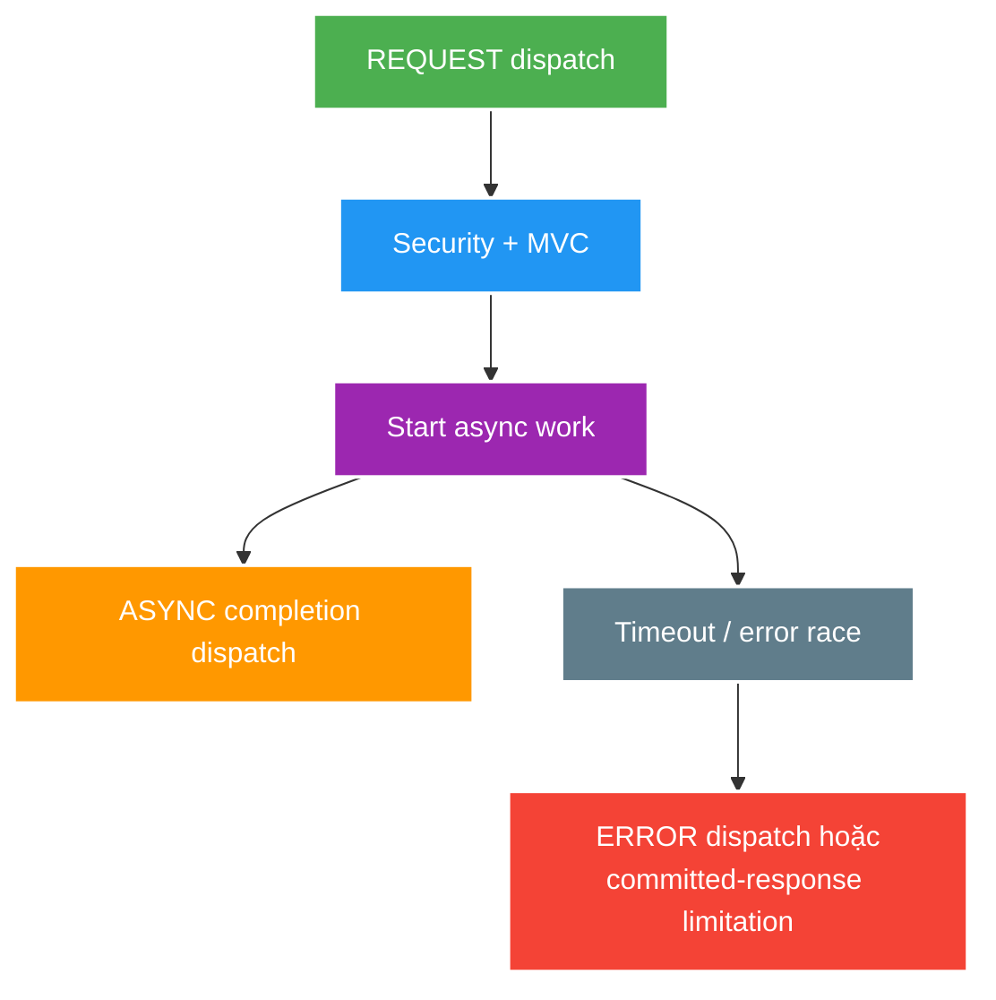

# MVC Security, Validation, Async and Error Pipeline

> Type: `DEEP_DIVE` 
> Domain: `spring` 
> Target depth: `D3 — tái hiện dispatch/error/async branches và chứng minh authorization + contract không drift` 
> Teaching readiness: `TEACHABLE_DRAFT` 
> Status: `DRAFT` 
> Evidence status: `NOT RUN` 
> Prerequisites: [MVC pipeline core](../core/mvc-request-pipeline-validation-and-error-handling.md) 
> Related cases: [`AUTHZ-UC-01`](../../../../use-case-catalog.md#31-foundation-và-senior-cases), [`CREATE-UC-01`](../../../../use-case-catalog.md#31-foundation-và-senior-cases) 
> Owner: `Project learner; Codex assists` 
> Updated: `2026-07-26`

## 0. Mental model và cách học

Request không chỉ có một dispatch. Async/error flow có thể quay lại filter chain với dispatch type khác; response commit là point of no return cho status/headers. Vẽ REQUEST, ASYNC, ERROR branches và đánh dấu auth context, timeout và exactly-once cleanup.

## 1. Pipeline detail

Filters can run on REQUEST, ASYNC and ERROR dispatch depending on registration. Security authentication/authorization may reject before MVC mapping. Handler interceptors see mapped handler but are not a substitute for the security filter chain or service ownership checks.

Argument resolution includes path/query/header/body conversion and validation. `BindingResult` handling can change whether controller receives errors or framework throws. Method validation and argument validation can raise different exception types across framework baselines, so the global handler must have regression tests for the project version.

Exception resolution order can be affected by local handlers, controller advice ordering, response status mapping and default resolver. Once response is committed or streaming has started, a later exception cannot reliably replace headers/body with the normal error envelope.

## 2. Security and error invariants

1. `401` means authentication needed/invalid; `403` means authenticated request lacks permission under the contract.
2. Resource existence must not be leaked when ownership policy intentionally masks it.
3. Error body is stable, machine-readable and does not include stack trace, SQL, token or internal class names.
4. Validation error order/content is deterministic enough for clients/tests without coupling to provider internals.
5. Async timeout/error path clears context and completes resource exactly once.

## 3. Pathological cases

Worked example: timeout callback và remote completion gần như đồng thời. Nếu cả hai cùng release permit/write response, hệ thống double-complete hoặc corrupt metrics. Một atomic terminal-state transition phải quyết định winner; loser chỉ cleanup idempotently. Controlled barrier test ép hai branches gặp nhau thay vì sleep ngẫu nhiên.

Với streaming, sau khi headers/bytes đã flush, exception resolver không thể thay toàn response bằng JSON error chuẩn. Contract phải quy định stream termination/trailer/protocol signal và observability riêng.

| Case | Why difficult | Evidence needed |
| --- | --- | --- |
| Error after response committed | Cannot rewrite contract | Streaming/flush integration test |
| Async timeout vs completion race | Double callback/release | Controlled barrier test |
| Ownership check after entity load | Existence/timing leak | 403/404 policy tests |
| Converter exception bypasses controller | Different resolver path | Malformed payload test |
| Multiple advice handlers | Order ambiguity | Exact exception/status assertion |

## 4. Test matrix

- Authentication: missing, malformed, expired/session-invalid, valid.
- Authorization: wrong role, wrong owner, banned/muted/state-invalid.
- Input: malformed JSON, missing field, boundary value, cross-field/business invariant.
- Output: serialization failure, async timeout, exception before/after commit.
- Contract: content type, status, envelope/error code, correlation and no sensitive detail.

Tests/evidence vẫn `NOT RUN`.

## 5. Async boundary

Servlet async frees the container request thread while work completes later; it does not make downstream work non-blocking. Timeout budget, executor capacity, context propagation, cancellation and dispatch type all need configuration. Virtual threads change thread cost, not DB connection/remote service capacity or security correctness.

## 6. Trade-off matrix

| Choice | Advantage | Risk |
| --- | --- | --- |
| One global advice | Consistency | Over-broad catch/order |
| Domain-specific mapper | Precise semantics | More mapping code |
| Mask forbidden as not-found | Reduce enumeration | Debug/support ambiguity |
| Async MVC | Request-thread efficiency | Context/race/timeout complexity |
| Streaming | Time-to-first-byte | Error contract after commit limited |

## 7. Interview outline, recap và learner write-back

Trace dispatch types, security/error owners, response commit và async race. Nêu `401`/`403`/masked `404` policy, malformed conversion before controller và test matrix exact status/envelope/no leakage.

- Filter registration theo dispatch type ảnh hưởng context/security.
- Response committed giới hạn error recovery.
- Async timeout và completion cần single terminal owner.
- Virtual thread không sửa DB capacity hay authorization.

`LEARNER TODO — vẽ REQUEST/ASYNC/ERROR flow và terminal-state race.`

## 8. Guided self-check

1. **Question:** Malformed JSON đi branch nào? **Đọc lại nếu bí:** mục 1, core pipeline. **Rubric:** converter/argument resolution before controller; resolver maps error. **My answer:** `LEARNER TODO`
2. **Question:** Timeout race completion vì sao? **Đọc lại nếu bí:** diagram, mục 3–5. **Rubric:** independent callbacks, atomic winner, idempotent cleanup/cancel. **My answer:** `LEARNER TODO`
3. **Question:** Khi nào 404 thay 403? **Đọc lại nếu bí:** mục 2–4. **Rubric:** deliberate anti-enumeration policy, consistent tests/logging/support trade-off. **My answer:** `LEARNER TODO`

## 9. References

- [Spring MVC — Processing](https://docs.spring.io/spring-framework/reference/web/webmvc/mvc-servlet/sequence.html)
- [Spring MVC — Asynchronous Requests](https://docs.spring.io/spring-framework/reference/web/webmvc/mvc-ann-async.html)

## 10. Teach-back checklist

- [ ] Tôi trace REQUEST/ASYNC/ERROR branches.
- [ ] Tôi test security policy và no-leak error contract.
- [ ] Tôi nêu response-commit limitation.
- [ ] Evidence vẫn `NOT RUN`.
