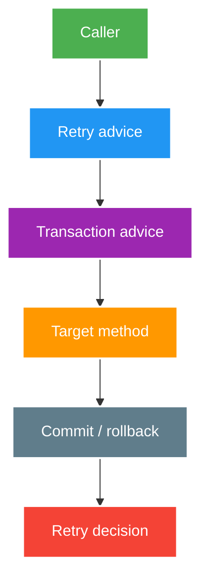

# Proxy Self-invocation, Advice Order and Context

> Type: `DEEP_DIVE` 
> Domain: `spring` 
> Target depth: `D3 — chứng minh invocation path, advice nesting và context handoff bằng test quan sát được` 
> Teaching readiness: `TEACHABLE_DRAFT` 
> Status: `DRAFT` 
> Evidence status: `NOT RUN` 
> Prerequisites: [Proxy/AOP core](../core/proxies-aop-and-transactional-boundaries.md) 
> Related cases: [`SPRING-UC-01`](../../../../use-case-catalog.md#31-foundation-và-senior-cases), [`GIFT-UC-01`](../../../../use-case-catalog.md#gift-uc-01) 
> Owner: `Project learner; Codex assists` 
> Updated: `2026-07-26`

## 0. Mental model và cách học

Viết advice như ngoặc lồng: outer chạy before, gọi inner, rồi chạy after. Hoán đổi ngoặc sẽ đổi transaction lifetime, retry attempt và async thread. Invocation phải đi qua proxy trước khi chain này tồn tại; context thread-bound phải được bàn giao riêng khi đổi thread.

## 1. Invocation proof

Một advice chỉ có cơ hội chạy khi invocation đi qua proxy có matching advisor. Call từ collaborator tới proxied public method khác với target gọi `this.method()`. Annotation trên implementation cũng phải được metadata resolution tìm thấy theo proxy/interface/class setup thực tế.

Đừng chứng minh bằng việc in class name duy nhất. Test observable contract: transaction active flag/resource commit, authorization denial, retry attempt count, cache hit, async thread/context và metrics span. Với version/proxy mode khác nhau, chạy matrix thay vì khái quát tuyệt đối.

## 2. Advice nesting

Worked example: attempt 1 ném transient DB exception, attempt 2 thành công. Với retry outer/transaction inner, integration test phải thấy hai transaction và chỉ commit attempt 2. Đổi order có thể khiến attempt 2 chạy trong transaction đã rollback-only. Test observable outcome tốt hơn assert class là proxy.

Giả sử chain outer-to-inner là `retry -> transaction -> target`: mỗi attempt có thể mở transaction mới. Nếu `transaction -> retry -> target`, nhiều attempts có thể ở cùng logical transaction đã rollback-only hoặc giữ resource lâu. `async` ngoài transaction chuyển invocation sang executor rồi transaction có thể mở tại worker; transaction ngoài async thường kết thúc trước worker thực hiện.

Security phải chạy trước side effect. Cache quanh authorization cần key/scope và hit-path vẫn bảo vệ caller. Metrics/tracing nên phân biệt logical operation với retry attempts mà không double-count outcome.

## 3. Context boundaries

Async handoff cần capture minimum trace/security context, restore trên worker và clear trong `finally`. Transaction resource không được copy như MDC; worker mở boundary riêng nếu cần. Async submission trước outer commit còn có thể chạy sớm và đọc state chưa commit, hoặc mất hoàn toàn khi process crash.

Thread-local context như security, MDC, tracing và transaction không tự động có semantics đúng sau executor/virtual-thread/reactive handoff. Context propagation cần explicit mechanism, cleanup và test để tránh leak identity giữa tasks. Transaction resource nói chung không được “mang” sang arbitrary async work.

## 4. Pathological cases

| Case | Hậu quả |
| --- | --- |
| Self-call tới `REQUIRES_NEW` | Không có transaction mới |
| Retry exception bị translated/caught | Policy không match hoặc commit sai |
| Cached method trước authorization | Cross-user data leak |
| Async audit trong outer transaction | Chạy trước commit hoặc mất event khi crash |
| Context decorator không clear | User/trace leak sang task sau |

## 5. Experiment plan

1. Gọi cùng method qua external bean và self-call; assert transaction/attempt count.
2. Hoán đổi explicit decorator order; inject failure attempt 1, success attempt 2; ghi commit count.
3. Handoff executor; assert security/MDC presence và cleanup ở task kế.
4. Kill process quanh commit/async submission để chỉ ra crash window.

Evidence hiện `NOT RUN`; sequence trên là kế hoạch, không phải kết quả.

## 6. Decision guide

| Need | Preferred boundary |
| --- | --- |
| Transaction application operation | Public service/decorator hoặc template explicit |
| Internal algorithm step | Plain method, không giả proxy boundary |
| Durable post-commit effect | Outbox/transaction synchronization có failure design |
| Async context | Explicit capture/restore/clear |
| Complex advice ordering | Explicit decorators + integration tests |

## 7. Interview outline, recap và learner write-back

Vẽ exact call/advice nesting; nói self-invocation, retry/transaction order, async context và crash window. Evidence phải là active transaction/commit/attempt/security/cache outcome.

- Proxy behavior thuộc invocation path, không thuộc annotation text đơn lẻ.
- Advice order đổi semantics.
- Context propagation cần restore và cleanup.
- Durable post-commit effect không nên dựa vào fire-and-forget.

`LEARNER TODO — vẽ hai advice orders và expected transaction count.`

## 8. Guided self-check

1. **Question:** Hai advice orders khác gì? **Đọc lại nếu bí:** diagram và mục 2. **Rubric:** tx per attempt vs shared/rollback-only scope and commit count. **My answer:** `LEARNER TODO`
2. **Question:** Vì sao async không kế thừa transaction? **Đọc lại nếu bí:** mục 2–3. **Rubric:** thread/resource-bound context, caller boundary ends, worker needs new boundary. **My answer:** `LEARNER TODO`
3. **Question:** Evidence advice thật chạy? **Đọc lại nếu bí:** mục 1, 5. **Rubric:** observable transaction/auth/retry/cache/thread outcome. **My answer:** `LEARNER TODO`

## 9. References

- [Spring AOP — Understanding AOP Proxies](https://docs.spring.io/spring-framework/reference/core/aop/proxying.html)
- [Spring — Transaction-bound Events](https://docs.spring.io/spring-framework/reference/data-access/transaction/event.html)

## 10. Teach-back checklist

- [ ] Tôi reason bằng invocation path/advice nesting.
- [ ] Tôi xử lý context propagation và cleanup.
- [ ] Tôi chỉ ra crash window của async side effect.
- [ ] Evidence vẫn `NOT RUN`.
