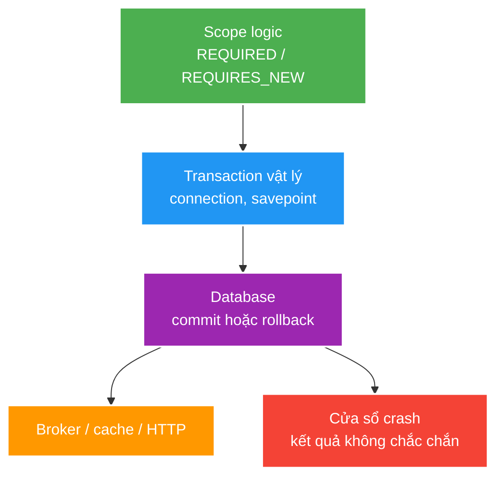

# Transaction propagation, isolation và các cửa sổ crash

> Type: `DEEP_DIVE` 
> Domain: `spring` 
> Target depth: `D3 — dựng lịch concurrent/commit/crash và chứng minh invariant bằng integration test` 
> Teaching readiness: `TEACHABLE_DRAFT` 
> Status: `DRAFT` 
> Evidence status: `NOT RUN` 
> Prerequisites: [Transaction core](../core/transaction-rollback-and-propagation.md) 
> Related cases: [`GIFT-UC-01`](../../../../use-case-catalog.md#gift-uc-01), [`EVT-UC-01`](../../../../use-case-catalog.md#31-foundation-và-senior-cases) 
> Owner: `Project learner; Codex assists` 
> Updated: `2026-07-26`

## 0. Mental model và cách học

Vẽ ba lớp chồng nhau: logical method scopes, physical connections/transactions và effects ngoài database. Propagation quyết định lớp một map sang lớp hai; crash windows xuất hiện giữa lớp hai và ba. Isolation chỉ có meaning khi gắn với access pattern và invariant cụ thể.

## 1. Physical resource reasoning

Propagation phải được kể bằng connections/resources thực tế. Outer `REQUIRED` giữ connection A; inner `REQUIRES_NEW` suspend A và cần connection B. Khi nhiều request cùng giữ A rồi chờ B, pool nhỏ có thể đứng dù database không deadlock theo row locks. `NESTED` dùng savepoint trên A nếu resource manager hỗ trợ; rollback savepoint không phát event/side effect bên ngoài ngược lại.

Read-only metadata thường là optimization/hint và intent, không phải security guarantee tuyệt đối. Flush có thể xảy ra trước commit hoặc query tùy persistence context; SQL executed không đồng nghĩa transaction committed.

## 2. Isolation anomalies

Worked example: hai transaction cùng đọc balance 100 rồi cùng trừ 80. Nếu update không có version/condition/row lock, kết quả cuối có thể 20 thay vì từ chối một lệnh; isolation label đơn lẻ chưa chứng minh lost-update invariant. Một `UPDATE ... WHERE version=?` với row-count check hoặc lock làm linearization point explicit.

| Anomaly/problem | Câu hỏi cần trả lời |
| --- | --- |
| Dirty/non-repeatable/phantom read | DB isolation cụ thể ngăn gì? |
| Lost update | Write có condition/version/lock không? |
| Write skew | Invariant trải nhiều rows được khóa/constraint thế nào? |
| Stale persistence context | Query/refresh/clear semantics? |
| Deadlock | Lock order và retry owner? |

Tên isolation level không đủ; PostgreSQL implementation và access pattern cụ thể quyết định outcome. Unique/check/exclusion constraint, conditional update, optimistic version hoặc pessimistic lock thường là phần proof của invariant.

## 3. Crash windows

Đọc mỗi row như câu hỏi “process chết ngay tại mũi tên thì hệ thống phục hồi bằng gì?”. Outbox giải DB→broker intent nhưng vẫn duplicate; cache cần invalidate/version/TTL; client timeout sau commit cần idempotency/status query. Không có một annotation Spring đóng được các gaps này.

| Sequence | Gap |
| --- | --- |
| DB commit -> publish broker | Crash làm mất event |
| Publish -> DB commit | Consumer thấy event của rollback |
| DB commit -> cache update | Stale cache khi crash/update fail |
| Remote call -> DB commit | External success, local rollback |
| DB commit -> HTTP response | Client timeout, outcome ambiguous |

Outbox đưa state change và event intent vào cùng DB transaction; relay vẫn at-least-once nên consumer/idempotency cần xử lý duplicate. Cache thường dùng invalidate/update-after-commit với stale window và recovery policy, không phải atomicity giả.

## 4. Reproducer plan

1. Propagation test assert outer/inner commit/rollback combinations và `UnexpectedRollbackException`.
2. Pool test: concurrent outer transactions gọi `REQUIRES_NEW`, đo in-use/pending/timeouts.
3. Isolation test dùng barriers để ép lịch lost update/write skew/lock wait.
4. Kill/fault injection tại từng dual-write boundary; query DB/outbox/cache/broker state sau restart.

Không có experiment nào đã chạy; evidence `NOT RUN`.

## 5. Design decisions

| Invariant | Preferred owner |
| --- | --- |
| Unique business identity | DB constraint + mapped conflict |
| Aggregate concurrent update | Version/conditional update/lock |
| DB state + event intent | Transactional outbox |
| Cache freshness | Version/TTL/invalidation/reconciliation |
| External payment + local ledger | Idempotency + state machine + reconciliation |

### 5.1. Pathology walkthrough — `REQUIRES_NEW` tự làm cạn pool

Mỗi outer transaction giữ connection A rồi gọi inner `REQUIRES_NEW`, suspend A và chờ connection B. Với pool 10 và 10 outer requests đồng thời, tất cả 10 connections có thể bị giữ, không ai lấy được B. Đây là pool starvation do propagation, không nhất thiết database row deadlock. Evidence cần pool active/pending/acquire timeout và thread stacks; tăng pool chỉ dời ngưỡng nếu nested concurrency không bounded.

Option gồm bỏ nested transaction, tách durable work qua outbox, reserve pool capacity có tính toán hoặc bound caller concurrency. Inner commit độc lập cũng có semantic cost: outer rollback không undo effect inner.

### 5.2. Pathology walkthrough — `REQUIRED` inner bị catch nhưng outer vẫn rollback

Inner cùng physical transaction ném runtime exception và đánh rollback-only. Outer catch exception rồi trả success logic; lúc commit framework ném `UnexpectedRollbackException`. Cách sửa không phải catch rộng, mà xác định failure taxonomy/transaction owner: cho failure propagate, đổi business result trước khi mark rollback, hoặc tách boundary thật nếu independent effect hợp lệ. Test assert final DB state và thrown outcome, không chỉ method return trước commit.

### 5.3. Pathology walkthrough — external success/local rollback

Trong DB transaction, service gọi payment provider thành công rồi insert ledger fail/deadlock. Database rollback nhưng charge ngoài không rollback. Giữ transaction lâu hơn còn tăng locks/pool pressure. Dùng operation state/idempotency key, provider status và reconciliation/compensation; không tuyên bố atomicity qua `@Transactional`.

Ngược lại DB commit rồi publish/cache update có crash gap. Outbox bảo vệ event intent; cache dùng version/invalidation/rebuild; response loss dùng idempotency/status. Mỗi boundary có recovery owner riêng.

### 5.4. Reproducer/evidence details

Propagation test ghi physical connection/transaction IDs và commit/rollback combinations. Pool test dùng barriers để giữ outers trước inner acquire. Isolation test chạy two-connection histories với exact PostgreSQL isolation. Crash test đặt deterministic faultpoints before/after DB commit, publish/cache/response rồi inspect durable states after restart. Pin Spring proxy/rollback rules, JPA flush mode, pool và PostgreSQL version. Evidence `NOT RUN`.

### 5.5. Phân biệt bốn thời điểm thường bị gọi chung là “đã ghi DB”

Entity thay đổi trong persistence context chưa chắc đã phát SQL. `flush` đẩy SQL xuống connection nhưng transaction vẫn có thể rollback. Database commit mới làm thay đổi bền vững theo transaction; response gửi thành công lại là mốc khác mà client quan sát. Vì vậy log “insert executed” trước commit không chứng minh nghiệp vụ đã hoàn tất, còn client timeout sau commit không chứng minh nghiệp vụ thất bại. Khi debug, phải gắn timeline vào transaction ID và các mốc flush/commit/response.

Isolation cũng không thay thế invariant proof. Ví dụ hai gift cùng đọc balance rồi ghi lại có thể lost update ở một access pattern, trong khi `UPDATE wallet SET balance=balance-? WHERE balance>=?` với kiểm row count tạo linearization point rõ hơn. Invariant trải nhiều row có thể cần lock order, constraint hoặc isolation mạnh hơn. Reproducer phải dùng hai connection thật và barrier đúng sau read/trước write; một unit test gọi service tuần tự không chạm failure mechanism.

Với mỗi dual-write, hãy chỉ ra owner phục hồi. Database + outbox cùng transaction do database bảo vệ; relay có thể publish trùng nên consumer giữ inbox/idempotency. Cache update sau commit có stale window nên cần version/TTL/invalidation và đường rebuild. Remote provider thành công nhưng local rollback cần operation state, tra status và reconciliation. Không có một propagation setting chung giải quyết cả ba ranh giới.

## 6. Interview outline, recap và learner write-back

Trả lời bằng connection/savepoint/commit thật, sau đó dựng concurrent schedule và crash matrix. Chốt owner: DB constraint/version/lock cho durable invariant; outbox + idempotent consumer cho event; reconciliation cho external effect.

- `REQUIRES_NEW` cần resource độc lập và có pool consequence.
- Isolation level không thay conditional write proof.
- SQL execute/flush không đồng nghĩa commit.
- Dual-write reliability luôn cần recovery story.

`LEARNER TODO — vẽ connections và crash matrix của GIFT-UC-01.`

## 7. Guided self-check

1. **Question:** Vì sao `REQUIRES_NEW` cạn pool? **Đọc lại nếu bí:** mục 1 và core example. **Rubric:** outer giữ A, inner cần B, concurrent outers exhaust pool. **My answer:** `LEARNER TODO`
2. **Question:** Isolation và optimistic locking khác lớp nào? **Đọc lại nếu bí:** mục 2, 5. **Rubric:** visibility/schedule anomaly vs conditional conflict/lost-update invariant. **My answer:** `LEARNER TODO`
3. **Question:** Crash matrix phục hồi thế nào? **Đọc lại nếu bí:** mục 3–5. **Rubric:** outbox/idempotency/cache recovery/status query by each boundary. **My answer:** `LEARNER TODO`

## 8. References

- [Spring — Transaction Propagation](https://docs.spring.io/spring-framework/reference/data-access/transaction/declarative/tx-propagation.html)
- [PostgreSQL — Transaction Isolation](https://www.postgresql.org/docs/current/transaction-iso.html)

## 9. Teach-back checklist

- [ ] Tôi reason bằng connection/savepoint/commit thực tế.
- [ ] Tôi ép được concurrency schedule bằng barrier.
- [ ] Tôi có crash-window và reconciliation story.
- [ ] Evidence vẫn `NOT RUN`.
