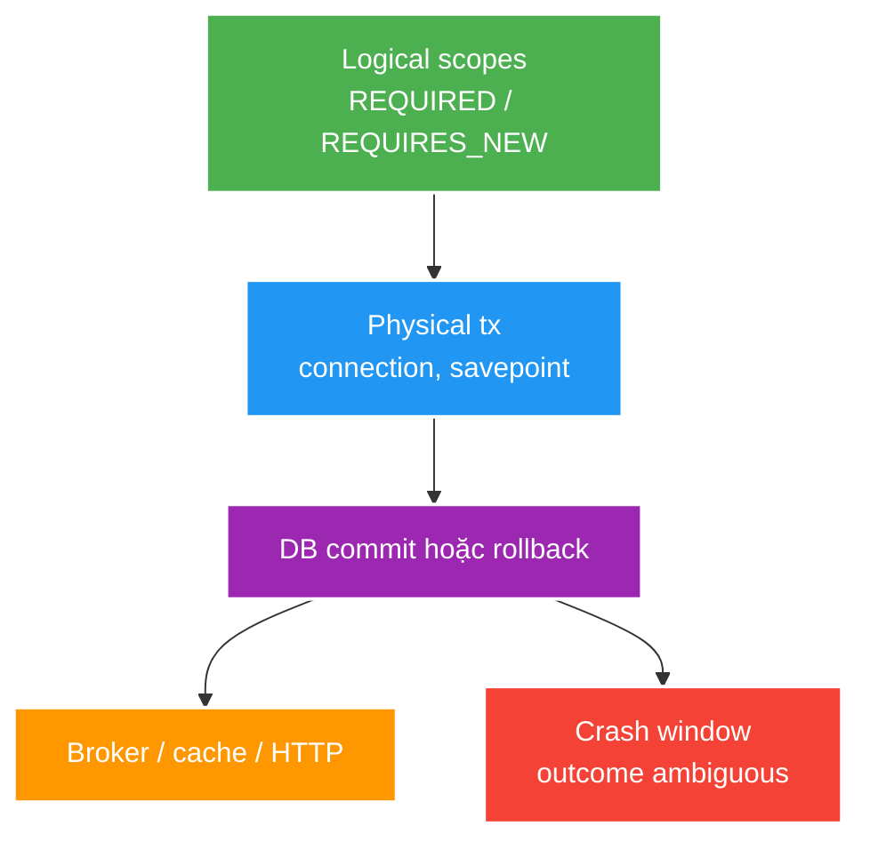

# Transaction Propagation, Isolation and Crash Windows

> Type: `DEEP_DIVE` 
> Domain: `spring` 
> Target depth: `D3 — dựng lịch concurrent/commit/crash và chứng minh invariant bằng integration test` 
> Teaching readiness: `TEACHABLE_DRAFT` 
> Status: `DRAFT` 
> Evidence status: `NOT RUN` 
> Prerequisites: [Transaction core](../core/transaction-rollback-and-propagation.md) 
> Related cases: [`GIFT-UC-01`](../../../../use-case-catalog.md#gift-uc-01), [`EVT-UC-01`](../../../../use-case-catalog.md#31-foundation-và-senior-cases) 
> Owner: `Project learner; Codex assists` 
> Updated: `2026-07-26`

## 0. Mental model và cách học

Vẽ ba lớp chồng nhau: logical method scopes, physical connections/transactions và effects ngoài database. Propagation quyết định lớp một map sang lớp hai; crash windows xuất hiện giữa lớp hai và ba. Isolation chỉ có meaning khi gắn với access pattern và invariant cụ thể.

## 1. Physical resource reasoning

Propagation phải được kể bằng connections/resources thực tế. Outer `REQUIRED` giữ connection A; inner `REQUIRES_NEW` suspend A và cần connection B. Khi nhiều request cùng giữ A rồi chờ B, pool nhỏ có thể đứng dù database không deadlock theo row locks. `NESTED` dùng savepoint trên A nếu resource manager hỗ trợ; rollback savepoint không phát event/side effect bên ngoài ngược lại.

Read-only metadata thường là optimization/hint và intent, không phải security guarantee tuyệt đối. Flush có thể xảy ra trước commit hoặc query tùy persistence context; SQL executed không đồng nghĩa transaction committed.

## 2. Isolation anomalies

Worked example: hai transaction cùng đọc balance 100 rồi cùng trừ 80. Nếu update không có version/condition/row lock, kết quả cuối có thể 20 thay vì từ chối một lệnh; isolation label đơn lẻ chưa chứng minh lost-update invariant. Một `UPDATE ... WHERE version=?` với row-count check hoặc lock làm linearization point explicit.

| Anomaly/problem | Câu hỏi cần trả lời |
| --- | --- |
| Dirty/non-repeatable/phantom read | DB isolation cụ thể ngăn gì? |
| Lost update | Write có condition/version/lock không? |
| Write skew | Invariant trải nhiều rows được khóa/constraint thế nào? |
| Stale persistence context | Query/refresh/clear semantics? |
| Deadlock | Lock order và retry owner? |

Tên isolation level không đủ; PostgreSQL implementation và access pattern cụ thể quyết định outcome. Unique/check/exclusion constraint, conditional update, optimistic version hoặc pessimistic lock thường là phần proof của invariant.

## 3. Crash windows

Đọc mỗi row như câu hỏi “process chết ngay tại mũi tên thì hệ thống phục hồi bằng gì?”. Outbox giải DB→broker intent nhưng vẫn duplicate; cache cần invalidate/version/TTL; client timeout sau commit cần idempotency/status query. Không có một annotation Spring đóng được các gaps này.

| Sequence | Gap |
| --- | --- |
| DB commit -> publish broker | Crash làm mất event |
| Publish -> DB commit | Consumer thấy event của rollback |
| DB commit -> cache update | Stale cache khi crash/update fail |
| Remote call -> DB commit | External success, local rollback |
| DB commit -> HTTP response | Client timeout, outcome ambiguous |

Outbox đưa state change và event intent vào cùng DB transaction; relay vẫn at-least-once nên consumer/idempotency cần xử lý duplicate. Cache thường dùng invalidate/update-after-commit với stale window và recovery policy, không phải atomicity giả.

## 4. Reproducer plan

1. Propagation test assert outer/inner commit/rollback combinations và `UnexpectedRollbackException`.
2. Pool test: concurrent outer transactions gọi `REQUIRES_NEW`, đo in-use/pending/timeouts.
3. Isolation test dùng barriers để ép lịch lost update/write skew/lock wait.
4. Kill/fault injection tại từng dual-write boundary; query DB/outbox/cache/broker state sau restart.

Không có experiment nào đã chạy; evidence `NOT RUN`.

## 5. Design decisions

| Invariant | Preferred owner |
| --- | --- |
| Unique business identity | DB constraint + mapped conflict |
| Aggregate concurrent update | Version/conditional update/lock |
| DB state + event intent | Transactional outbox |
| Cache freshness | Version/TTL/invalidation/reconciliation |
| External payment + local ledger | Idempotency + state machine + reconciliation |

## 6. Interview outline, recap và learner write-back

Trả lời bằng connection/savepoint/commit thật, sau đó dựng concurrent schedule và crash matrix. Chốt owner: DB constraint/version/lock cho durable invariant; outbox + idempotent consumer cho event; reconciliation cho external effect.

- `REQUIRES_NEW` cần resource độc lập và có pool consequence.
- Isolation level không thay conditional write proof.
- SQL execute/flush không đồng nghĩa commit.
- Dual-write reliability luôn cần recovery story.

`LEARNER TODO — vẽ connections và crash matrix của GIFT-UC-01.`

## 7. Guided self-check

1. **Question:** Vì sao `REQUIRES_NEW` cạn pool? **Đọc lại nếu bí:** mục 1 và core example. **Rubric:** outer giữ A, inner cần B, concurrent outers exhaust pool. **My answer:** `LEARNER TODO`
2. **Question:** Isolation và optimistic locking khác lớp nào? **Đọc lại nếu bí:** mục 2, 5. **Rubric:** visibility/schedule anomaly vs conditional conflict/lost-update invariant. **My answer:** `LEARNER TODO`
3. **Question:** Crash matrix phục hồi thế nào? **Đọc lại nếu bí:** mục 3–5. **Rubric:** outbox/idempotency/cache recovery/status query by each boundary. **My answer:** `LEARNER TODO`

## 8. References

- [Spring — Transaction Propagation](https://docs.spring.io/spring-framework/reference/data-access/transaction/declarative/tx-propagation.html)
- [PostgreSQL — Transaction Isolation](https://www.postgresql.org/docs/current/transaction-iso.html)

## 9. Teach-back checklist

- [ ] Tôi reason bằng connection/savepoint/commit thực tế.
- [ ] Tôi ép được concurrency schedule bằng barrier.
- [ ] Tôi có crash-window và reconciliation story.
- [ ] Evidence vẫn `NOT RUN`.
