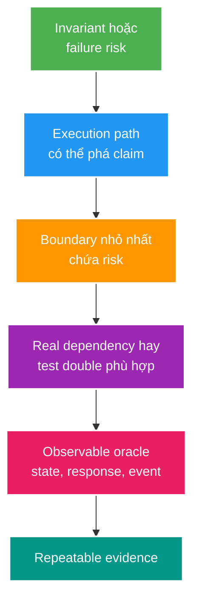

# Testing Strategy và Hermetic Integration Tests

> Type: `CORE`<br>
> Domain: `testing-observability`<br>
> Target depth: `D3 — chọn test boundary theo risk, thiết kế test deterministic/hermetic và chứng minh infrastructure semantics bằng evidence tái lập được`<br>
> Teaching readiness: `TEACHABLE_DRAFT`<br>
> Status: `DRAFT`<br>
> Evidence status: `NOT RUN`<br>
> Prerequisites: Java/JUnit fundamentals, [Spring IoC](../../../spring/theory/core/ioc-bean-lifecycle-and-dependency-injection.md), [transaction core](../../../spring/theory/core/transaction-rollback-and-propagation.md)<br>
> Related cases: [`TEST-UC-01`](../../../../use-case-catalog.md#31-foundation-và-senior-cases), preview owner `TEST-01`<br>
> Owner: `Project learner; Codex teaches, learner writes back`<br>
> Updated: `2026-07-26`

## 0. Cách dùng tài liệu này

Tài liệu dành cho developer đã biết viết `@Test` nhưng còn chọn annotation theo thói quen, mock quá nhiều hoặc gặp tình trạng test pass ở máy cá nhân nhưng fail trên CI. Đọc theo thứ tự từ risk và test boundary tới hermeticity, Testcontainers và CI lifecycle. Sau khi đọc, bạn phải thiết kế được **test nhỏ nhất nhưng vẫn đi qua boundary có khả năng phá invariant**.

Đây là preview cho `TEST-01`, chưa active case và chưa có test nào chạy. Không dùng nội dung này để tuyên bố project đã có hermetic harness.

## 1. Vì sao topic này tồn tại?

Test không có giá trị chỉ vì nó xanh. Một test chỉ cung cấp evidence cho đúng đường thực thi, dữ liệu và boundary mà nó thật sự chạy qua. Unit test mock repository có thể chứng minh service gọi `save`, nhưng không chứng minh unique constraint, transaction rollback, serializer Redis hoặc RabbitMQ acknowledgement. Ngược lại, một end-to-end test khổng lồ có thể đi qua mọi layer nhưng chậm, khó định vị lỗi và vẫn bỏ sót các branch quan trọng.

Vấn đề cốt lõi là **confidence có phạm vi**. Ta bắt đầu từ invariant hoặc failure risk, tìm nơi behavior có thể lệch production, rồi chọn boundary nhỏ nhất chứa nơi đó. Hermeticity giúp cùng test giữ meaning ổn định giữa laptop, CI và thứ tự chạy khác nhau. Testcontainers tăng fidelity của infrastructure, nhưng không tự tạo fixture đúng, cleanup đúng hay assertion có ý nghĩa.

Topic này không chứng minh production không bao giờ lỗi. Test là sampling có chủ đích; observability, rollout và incident learning vẫn cần thiết.

## 2. Learning objectives và prerequisites

Sau topic này, tôi có thể:

1. Phân biệt unit, slice, integration, contract và end-to-end theo system boundary thay vì annotation.
2. Chọn test double hoặc real dependency dựa trên failure cần bắt.
3. Kiểm soát clock, randomness, configuration, data và lifecycle để test deterministic/hermetic.
4. Dùng Testcontainers có version, readiness, schema, isolation và cleanup policy rõ.
5. Giải thích một flaky test bằng causal chain và thiết kế evidence để sửa root cause.

Nếu chưa quen Spring context, cần nhớ: Spring Test có thể cache `ApplicationContext`; state trong singleton, database hoặc external dependency không tự reset chỉ vì test method mới bắt đầu.

## 3. Từ vựng tối thiểu

**System under test (SUT)** là phần hệ thống test đang thực thi thật. Nếu service thật nhưng repository bị mock, persistence không nằm trong SUT.

**Test oracle** là điều quyết định pass/fail: assertion trên response, state, event hoặc invariant. Một test có setup tốt nhưng oracle yếu vẫn tạo false confidence.

**Test double** thay dependency thật. Stub trả dữ liệu; mock còn xác minh interaction; fake có implementation đơn giản hoạt động; spy bọc object để quan sát hoặc override một phần. Tên gọi ít quan trọng hơn boundary đã bị thay.

**Deterministic** nghĩa cùng controlled inputs tạo cùng outcome. **Repeatable** nghĩa có thể chạy lại ổn định trong environment đã định. **Hermetic** nghĩa test kiểm soát dependency, configuration, data và lifecycle thuộc boundary; không dựa vào state/service ẩn có sẵn.

**Production fidelity** là mức test dependency hành xử giống production ở semantics cần kiểm tra. PostgreSQL container có fidelity về dialect/constraint/locking cao hơn H2 cho PostgreSQL-specific behavior, nhưng vẫn không mô phỏng topology, data volume hoặc OS production đầy đủ.

## 4. Mental model cốt lõi — phần Agent phải dạy

Đừng chọn test từ tên layer. Hãy đi từ claim cần bảo vệ tới nơi claim có thể hỏng.



Ví dụ claim “refresh token không được dùng làm access token” có parser/claim classification, security filter chain, session lookup và HTTP error mapping. Unit test chỉ parser chưa đủ; ít nhất một HTTP security integration test phải đi qua wiring thật. Ngược lại, không cần E2E browser cho mọi malformed token nếu lower-level tests đã cover exhaustive branches.

Câu cần nhớ: **test boundary phải chứa mechanism có thể làm claim sai; test rộng hơn không tự động tốt hơn.**

## 5. Cơ chế hoạt động từng bước

### 5.1. Viết claim trước test

Claim tốt quan sát được: “hai gift command cùng idempotency identity chỉ tạo một ledger effect”, không phải “service hoạt động đúng”. Ghi actor, initial state, trigger, expected state/response/event và forbidden outcome. Từ đó mới biết oracle nằm ở đâu.

### 5.2. Chọn boundary theo failure

- Pure calculation/invariant trong memory: unit test thường đủ.
- Jackson mapping, validation, security filter, JPA query/constraint: cần slice hoặc integration boundary chạy framework thật.
- Consumer/provider independently deployed: contract test bảo vệ wire examples và compatibility.
- Một critical journey xuyên nhiều deployed components: số ít end-to-end tests.

Test portfolio thường có nhiều fast tests vì feedback rẻ, nhưng không áp quota pyramid máy móc. Một repository chứa SQL phức tạp cần integration tests nhiều hơn một pure library.

### 5.3. Kiểm soát nondeterminism

Inject `Clock` khi behavior phụ thuộc time; dùng sequence/fixed ID provider khi identity ảnh hưởng assertion; lưu seed cho randomized/property test; pin timezone/locale khi parsing/formatting. Không thêm `if (test)` vào production behavior. Tạo seam ở dependency tự nhiên, rồi production wiring dùng implementation thật.

`Thread.sleep` không đồng bộ với condition; nó chỉ đoán scheduler/environment sẽ hoàn tất đúng lúc. Với eventual outcome, poll bounded condition bằng Awaitility-like mechanism, giữ deadline và failure diagnostics.

### 5.4. Kiểm soát data và lifecycle

Mỗi test cần initial state explicit và namespace/cleanup strategy. Transactional rollback chỉ cleanup những write tham gia cùng test-managed transaction; async consumer, separate transaction hoặc external Redis/broker state có thể sống ngoài rollback. `@DirtiesContext` có thể reset context nhưng đắt và không phải default cure cho shared-state design.

### 5.5. Provision infrastructure thật có kiểm soát

Testcontainers tạo dependency thật trong container và expose connection runtime. Với Spring Boot 3.4, `@ServiceConnection` có thể cung cấp `ConnectionDetails`; `@DynamicPropertySource` là alternative linh hoạt hơn. Chọn một convention rõ, pin image version, wait readiness thực, chạy migration/schema và chỉ sau đó mới seed data.

Container running không đồng nghĩa application dependency ready. Port open có thể xảy ra trước schema/migration, broker exchange hoặc user permission sẵn sàng.

## 6. Worked examples

### 6.1. Ví dụ tối thiểu — deterministic expiry

```java
final class SessionPolicy {
    private final Clock clock;

    SessionPolicy(Clock clock) {
        this.clock = clock;
    }

    boolean isExpired(Instant expiresAt) {
        return !Instant.now(clock).isBefore(expiresAt);
    }
}
```

Test dùng `Clock.fixed` và kiểm tra trước/đúng/sau expiry mà không sleep. Exact instant là controlled input; oracle là policy boolean. Production wiring dùng system clock. Seam tồn tại vì time là dependency nghiệp vụ, không phải vì test muốn hack code.

### 6.2. Ví dụ gần project — unique gift effect

Risk nằm ở transaction/unique constraint và concurrent requests, nên mock repository là boundary quá hẹp. Integration test cần PostgreSQL thật, migration thật và hai workers được barrier cho cùng bắt đầu. Oracle không chỉ là HTTP response: query durable ledger rows và balance/version sau khi cả hai hoàn tất. Nếu broker event thuộc claim, cần outbox/consumer evidence riêng thay vì suy từ `repository.save()`.

### 6.3. Phản ví dụ — container dùng chung nhưng data không isolate

Suite tạo một PostgreSQL container static để tiết kiệm startup. Test A insert user email cố định và không cleanup; Test B giả định email chưa tồn tại. Chạy riêng đều xanh, chạy đổi thứ tự thì B fail unique constraint. Docker không tạo hermeticity: shared database state là hidden input. Fix có thể là rollback thật sự bao phủ writes, truncate có kiểm soát, unique namespace per test hoặc schema/database per worker, tùy parallelism/cost.

## 7. Invariants và boundaries

1. Test chỉ đọc state do chính setup hoặc declared fixture tạo. Nếu đọc shared residue, result phụ thuộc order.
2. Mọi external resource có owner bắt đầu, readiness gate, cleanup và failure diagnostics.
3. Oracle phải quan sát business effect ở owner boundary. Verify mock call không chứng minh commit.
4. Parallel execution chỉ bật khi namespace/resource strategy chịu được concurrency.
5. Test failure phải tái lập được từ command, version, seed/data và environment tối thiểu.

Boundary quan trọng: hermetic không nhất thiết offline hoặc một process. Test có thể dùng container/network thật nếu chúng được provision và cô lập theo contract. Ngược lại, unit test có thể không hermetic nếu đọc system time, environment variable hoặc static state không kiểm soát.

## 8. Các khái niệm dễ nhầm

Unit/integration không phải đồng nghĩa fast/slow. Integration test nhỏ với PostgreSQL shared lifecycle có thể nhanh; unit test property-based lớn có thể chậm. Phân loại theo collaboration thực.

Mock không xấu; mock phù hợp khi interaction chính là contract hoặc dependency đắt/không deterministic và behavior thật được bảo vệ ở layer khác. Vấn đề là dùng mock cho chính semantics cần chứng minh.

Coverage nói code đã được execute, không nói assertion có phân biệt đúng/sai. Mutation testing có thể kiểm tra oracle strength bằng cách thay behavior và xem test có đỏ, nhưng cũng có equivalent mutants và chi phí tính toán.

## 9. Misconceptions và failure modes

### 9.1. Flaky test do shared state

Trigger là order/parallel run khác. State từ test trước còn trong DB/cache/static field; test sau thấy initial state khác. Symptom là test fail không ổn định hoặc chỉ fail toàn suite. Chứng minh bằng random order, repeated run và state snapshot trước setup. Mitigation là explicit fixture ownership/cleanup/namespace; retry test chỉ che contamination.

### 9.2. False confidence do mock

Test định nghĩa mock trả entity và verify `save`. Production fail vì mapping constraint, transaction rollback hoặc SQL query sai. Test xanh vì nó chỉ chứng minh flow do chính mock mô tả. Chứng minh bằng integration test tại boundary thật; giữ unit test cho branches nhưng không dùng nó thay persistence evidence.

### 9.3. CI-only failure do environment drift

Timezone, image tag, CPU, port, Docker availability hoặc test concurrency khác laptop. Fix là pin/declare dependency và capture diagnostics, không thêm sleep. Nếu test thật sự cần resource đặc biệt, CI job phải provision và health-check rõ.

## 10. Solution patterns và trade-offs

Fast unit tests cho exhaustive domain branches; slice tests cho focused framework adapter; hermetic integration tests cho DB/cache/broker/security wiring; contract tests cho independently evolving parties; end-to-end cho critical journeys. Portfolio phải bám regression history, blast radius và detectability.

Container per test isolate mạnh nhưng startup/resource đắt. Singleton container + per-test schema/namespace thường cân bằng hơn, nhưng parallel cleanup phức tạp. Reusable containers là experimental và không phù hợp CI theo tài liệu Testcontainers hiện tại; không dùng nó làm nền tảng correctness.

## 11. Áp dụng vào project và thực tế

Khi `TEST-01` active, audit tối thiểu:

- test nào đang phụ thuộc PostgreSQL/Redis/RabbitMQ local có sẵn;
- schema/migration được tạo bằng đường nào;
- test data có leak qua class/order không;
- clock/UUID/ports/env nào là hidden input;
- security/transaction/cache/broker risks nào đang bị mock;
- command CI nào tái lập cùng boundary.

`TEST-UC-01` nên scope một failure concrete: cùng test pass local nhưng fail CI do residue/readiness/config. Chưa tạo case hoặc sửa harness trong preview này.

## 12. Góc nhìn phỏng vấn

### 12.1. Câu trả lời 30 giây

“Tôi chọn test theo risk và boundary có thể làm invariant sai. Unit test bảo vệ pure logic; integration test chạy framework/infrastructure semantics thật; contract bảo vệ consumer-provider; ít E2E cho critical flow. Hermetic test kiểm soát dependency, config, data và lifecycle; Testcontainers tăng fidelity nhưng không thay isolation/readiness/cleanup.”

### 12.2. Câu trả lời Senior khoảng 2 phút

Nêu một invariant, chỉ ra vì sao mock boundary thiếu, mô tả deterministic seams và container lifecycle, rồi nói trade-off startup vs isolation. Kết thúc bằng cách điều tra flaky test: repeat/random order, capture seed/state/timing, sửa root cause và không retry để làm xanh.

### 12.3. Follow-up có thể đào sâu

- Transaction rollback có cleanup được async write không? Đọc lại mục 5.4.
- Container singleton chạy parallel isolate thế nào? Đọc mục 6.3 và deep-dive.
- Contract test thay E2E tới đâu? Nó không chứng minh routing/performance/toàn business journey.

## 13. Tóm tắt cô đọng

- Test cung cấp confidence có phạm vi, không phải chứng minh tuyệt đối.
- Bắt đầu từ invariant/failure risk, rồi chọn boundary nhỏ nhất chứa mechanism.
- Hermeticity là control input, data, dependency và lifecycle; Docker chỉ là provisioning.
- Real infrastructure cần version, readiness, schema, isolation, cleanup và diagnostics.
- Deterministic seams cho time/ID/random giúp tái lập mà không cần test-only branch.
- Oracle phải quan sát owner state/effect, không chỉ interaction do mock dựng.
- Flakiness là signal về uncontrolled input/race/lifecycle; retry không phải fix.

## 14. Bài tập diễn đạt lại — phần của tôi

1. Bối cảnh: vì sao một suite xanh vẫn có thể không bảo vệ production?
2. Mental model: từ invariant tới boundary, dependency và oracle.
3. Mechanism: kể lifecycle của một hermetic integration test.
4. Failure: mô tả shared-state hoặc readiness failure theo causal chain.
5. Decision: khi nào mock, khi nào dùng Testcontainers?

> **Bài viết của tôi — `LEARNER TODO`:** viết 10–15 câu. Lần hai đóng tài liệu và trình bày lại khoảng hai phút.

## 15. Self-check có hướng dẫn

1. **Question:** Unit, slice, integration, contract và E2E khác nhau theo boundary nào?<br>
   **Đọc lại nếu bí:** mục 3 và 5.2.<br>
   **Một câu trả lời tốt phải có:** SUT/collaboration thật, loại failure bắt được, confidence/cost và giới hạn từng loại.<br>
   **My answer:** `LEARNER TODO`
2. **Question:** Vì sao một test dùng container vẫn có thể không hermetic?<br>
   **Đọc lại nếu bí:** mục 5.4–5.5 và 6.3.<br>
   **Một câu trả lời tốt phải có:** hidden state/config, readiness, fixture/cleanup, parallel namespace và version.<br>
   **My answer:** `LEARNER TODO`
3. **Question:** Chọn boundary cho rule refresh token không được dùng làm access token.<br>
   **Đọc lại nếu bí:** mục 4 và 5.2.<br>
   **Một câu trả lời tốt phải có:** unit classification, HTTP/security-chain integration, persistence/session khi liên quan và negative oracle.<br>
   **My answer:** `LEARNER TODO`
4. **Question:** Điều tra test chỉ fail khi chạy cả suite ra sao?<br>
   **Đọc lại nếu bí:** mục 9.1–9.3.<br>
   **Một câu trả lời tốt phải có:** random/repeat/order, capture initial state/environment, shared owner và root-cause mitigation.<br>
   **My answer:** `LEARNER TODO`

## 16. Official references

- [Spring Boot 3.4 — Testcontainers](https://docs.spring.io/spring-boot/3.4/reference/testing/testcontainers.html)
- [Testcontainers for Java — JUnit 5 integration](https://java.testcontainers.org/test_framework_integration/junit_5/)
- [Testcontainers — Manual lifecycle control](https://java.testcontainers.org/test_framework_integration/manual_lifecycle_control/)
- [JUnit 5 User Guide — test lifecycle and parallel execution](https://junit.org/junit5/docs/current/user-guide/)

## 17. Teach-back checklist

- [ ] Tôi chọn test từ risk/invariant, không từ annotation quen tay.
- [ ] Tôi nói rõ boundary nào bị mock và confidence nào mất.
- [ ] Tôi thiết kế clock/data/resource lifecycle deterministic.
- [ ] Tôi giải thích Testcontainers không tự tạo hermeticity.
- [ ] Tôi có thể chẩn đoán một flaky test bằng causal evidence.
- [ ] Project test/harness evidence vẫn `NOT RUN`.
