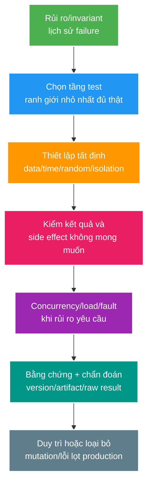

# Nền tảng kiểm thử: chiến lược, contract, concurrency, tải và mutation

> Type: `CORE` 
> Domain: `testing` 
> Target depth: `D3 — chọn test theo rủi ro/ranh giới và tạo bằng chứng cho concurrency, hiệu năng và failure` 
> Teaching readiness: `TEACHABLE_DRAFT` 
> Status: `DRAFT` 
> Evidence status: `NOT RUN` 
> Prerequisites: unit/integration basics; project contracts 
> Related cases: `TEST-02`; [question bank](../../question-bank/testing-strategy-contract-concurrency-load-and-mutation.md) 
> Owner: `Project learner; Codex teaches, learner writes back` 
> Updated: `2026-07-26`

## 1. Chiến lược test là cách phân bổ chi phí theo rủi ro

Mỗi loại test trả lời một câu hỏi lỗi khác nhau; test pyramid hay test trophy chỉ là mô hình tham khảo. Hãy bắt đầu từ invariant, hợp đồng hoặc failure cần ngăn chặn, rồi chọn tầng test rẻ nhất nhưng vẫn chứa đúng cơ chế có thể làm invariant sai. Unit test phù hợp với nhánh logic và state; slice test kiểm tra wiring của framework; integration test đi qua database/cache/broker/security thật; contract test kiểm tra tương thích giữa producer và consumer; end-to-end dành cho vài hành trình quan trọng; load/fault test đo capacity và phục hồi; mutation test kiểm tra assertion có thật sự phát hiện logic bị đổi hay không.

Tỷ lệ coverage chỉ cho biết dòng hoặc nhánh đã được chạy; nó không chứng minh assertion đúng hay requirement đã được bảo vệ.

## 2. Unit/slice/integration

Unit test cô lập nhánh domain/service bằng fake hoặc mock ở port có ý nghĩa. Nó nhanh, nhưng mock transaction/query/proxy của JPA có thể tạo sự tự tin sai. Slice test như MockMvc/JPA kiểm serializer, validation, security mapping hoặc repository query. Integration test dùng dependency tương thích thật qua Testcontainers/local để kiểm migration, constraint, serializer, transaction và hành vi mạng. Tránh mock mọi collaborator rồi chỉ assert số lần gọi.

Với controller, kiểm status/body/content type/auth và không có side effect khi bị từ chối. Với service, kiểm invariant/state/result. Với repository, kiểm SQL/query plan/constraint khi liên quan. Với consumer, kiểm inbox, business effect và kết quả ack. Dùng test builder tường minh; không để random hoặc clock production chạy không kiểm soát.

## 3. Contract test

API contract gồm method, path, request, response, error, auth, idempotency, pagination và compatibility, không chỉ JSON schema. Provider test implementation; consumer test các interaction đại diện; OpenAPI/schema validation bổ sung kiểm tra cấu trúc. Event còn có ý nghĩa, version, default, enum, ordering và reader cũ/mới. Webhook/provider phải test đúng chuỗi byte, chữ ký và retry.

Consumer-driven contract có thể đóng băng hành vi ngẫu nhiên và không kiểm performance, data hay business rule; cần governance, deprecation và telemetry sử dụng. Chạy ma trận mixed-version cùng negative case. Không coi shared DTO library là “contract test” vì hai bên có thể đổi cùng lúc và che incompatibility.

## 4. Concurrency tests

Dùng barrier/latch để hai transaction gặp đúng interleaving định trước; database thật phải dùng transaction/connection riêng. Assert invariant, row, version và outcome cuối, không dùng sleep. Lặp các lịch sử quan trọng như cùng idempotency key, lost update, lock/deadlock và refresh/revoke. Unit test in-memory không chứng minh isolation database hoặc hành vi nhiều node.

Concurrency test vẫn có thể không tất định nếu scheduler tự quyết race; cần điều phối checkpoint hoặc test-only hook quanh ranh giới bền vững. Stress lặp lại chỉ là bằng chứng bổ sung. Luôn có timeout để CI không treo và thu lock/thread dump khi lỗi.

## 5. Property/mutation

Property-based test sinh nhiều input, kiểm invariant và thu nhỏ case thất bại; ví dụ tổng ledger được bảo toàn hoặc pagination không trùng trong snapshot cố định. Model-based test so implementation với state machine tham chiếu. Fuzz parser/security/resource limit bằng harness có bound để tránh phá môi trường.

Mutation testing cố tình đổi condition, boundary hoặc return rồi xem test có fail không. Mutation còn sống cho thấy assertion yếu/thiếu hoặc thay đổi tương đương. Chỉ áp dụng chọn lọc ở module nghiệp vụ quan trọng vì tốn thời gian. Mutation score không chứng minh requirement đã đầy đủ.

## 6. Load/performance

Định nghĩa distribution của workload, arrival model, kích thước/skew dữ liệu, môi trường/tool/version/warmup và SLO. Open model làm lộ hàng đợi; closed model có thể che coordinated omission. Đo baseline rồi tăng concurrency/throughput tới saturation; theo dõi p50/p95/p99/error, CPU/memory/GC/pool/database/query/broker/queue. Soak test tìm leak, spike test đo phục hồi và stress test tìm trần.

Performance test có nhiễu; so sánh trong môi trường kiểm soát và biểu diễn độ tin cậy, chỉ đặt regression gate thô ở metric đủ ổn định. Profile bottleneck trước khi sửa. Không chạy tải phá hoại trên production nếu chưa có governance rõ ràng.

## 7. Fault/chaos and evidence

Chèn lỗi tại điểm được đặt tên: mất response sau commit, Redis down, broker redelivery, database delay, process kill hoặc mất zone/node. Định nghĩa steady state/invariant, blast radius, điều kiện an toàn/dừng, mức suy giảm/phục hồi kỳ vọng và metric. Chaos không có giả thuyết chỉ là tạo outage để trình diễn.

Evidence phải ghi command, config, version, dataset, timeline, raw result, diễn giải và artifact. Test pass với fault mô phỏng không chứng minh disaster recovery production. Evidence ở đây vẫn `NOT RUN`.

## 8. Flakiness/hermeticity

Kiểm soát time, random, locale, timezone, network, port, data và namespace khi chạy song song. Không phụ thuộc thứ tự hoặc môi trường chia sẻ. Chờ condition với timeout thay vì sleep. Cleanup bằng transaction/truncate/schema/container theo chiến lược an toàn. Retry một test flaky chỉ che regression; quarantine phải có owner, deadline và evidence trong lúc sửa gốc.

## 8.1. Worked example tối thiểu — cùng một rule cần đúng test layer

Rule: amount phải positive. Unit test gọi domain/service với `0`, `-1` và valid amount; assert domain result/exception. Test này rẻ và đủ falsify branching rule, nhưng không chứng minh JSON `"amount": "abc"` được map đúng error contract, database constraint tồn tại hay unauthorized request không side effect.

Vì vậy thêm MockMvc/slice test cho malformed/validation/status/envelope và database integration test cho constraint/transaction nếu invariant cần durable defense. Không cần end-to-end/load test chỉ để chứng minh `amount > 0`; chọn layer nhỏ nhất chứa failure mechanism. Đây là ý nghĩa risk allocation, không phải “mọi feature cần đủ mọi loại test”.

## 8.2. Worked example gần project — gift idempotency/concurrency evidence ladder

Invariant: cùng actor + operation key + payload chỉ tạo tối đa một gift/debit. Evidence ladder:

1. Unit test state machine xử lý same/different payload và terminal outcome.
2. PostgreSQL integration test chứng minh unique/conditional write trong transaction thật.
3. Deterministic concurrency test dùng hai connections và barrier sau claim/read; assert một business effect, stable/conflict outcomes và ledger conservation.
4. HTTP contract test drop/retry same key, kiểm status/body và authorization.
5. Fault test kill/drop response sau commit, restart rồi retrieve/reconcile outcome.
6. Load test gift spike đo duplicates, locks/retries, p99/resources với workload đã mô tả.

Mỗi layer trả lời câu khác. Concurrency test không chứng minh 100k capacity; load test không thay invariant assertions; mock provider không chứng minh network unknown outcome.

## 8.3. Phản ví dụ — 95% coverage nhưng unauthorized request vẫn ghi DB

Controller tests assert response status; service mocks được configure throw access denied trước repository. Một refactor đổi advice order làm repository write trước authorization, nhưng tests vẫn cover các lines và chỉ kiểm `403`. Coverage cao không phát hiện thiếu negative side-effect assertion. Test tốt phải query database/outbox/broker sau denial và chứng minh không effect ở boundary thật.

Mutation survivor bỏ ownership check là signal rõ: hoặc test đang ở sai layer, hoặc assertion chưa bảo invariant. Giải pháp là thêm assertion mục tiêu, không viết snapshot lớn/interaction verification chỉ để tăng score.

## 8.4. Cách thiết kế evidence statement

Mỗi test/experiment ghi: risk/invariant; exact layer/boundary; setup/data/time/random; procedure/interleaving/fault; positive và negative assertions; versions/artifact; claim nó hỗ trợ; limitation. Một test `NOT RUN` vẫn chỉ là plan. Khi chạy, raw result/command phải được lưu ở experiment artifact trước khi đổi evidence status.

## 9. Phần người học viết lại và câu hỏi tự kiểm tra có hướng dẫn

> **Bài viết của tôi — `LEARNER TODO`:** ánh xạ một invariant của gift sang unit, integration, concurrency, contract, load và fault test.

1. **Question:** Chọn test layers cho rule amount positive mà không over-test như thế nào? 
   **Đọc lại nếu bí:** mục 1–2 và 8.1. 
   **Một câu trả lời tốt phải có:** failure mechanism, cheapest realistic layer, unit versus MVC/DB boundary, negative side effect và điều không cần load/E2E. 
   **My answer:** `LEARNER TODO`
2. **Question:** Thiết kế evidence ladder cho gift idempotency/concurrency ra sao? 
   **Đọc lại nếu bí:** mục 3–4, 7 và 8.2. 
   **Một câu trả lời tốt phải có:** unit/real DB/barrier/contract/fault/load roles, final invariant, exact versions và limitation từng claim. 
   **My answer:** `LEARNER TODO`
3. **Question:** Vì sao coverage/mutation score không tự chứng minh authorization correctness? 
   **Đọc lại nếu bí:** mục 5 và 8.3–8.4. 
   **Một câu trả lời tốt phải có:** line execution versus requirement/assertion, no-side-effect boundary, survivor diagnosis và evidence statement. 
   **My answer:** `LEARNER TODO`

## 10. References

- [Spring Boot — Testing](https://docs.spring.io/spring-boot/reference/testing/index.html)
- [JUnit 5 User Guide](https://junit.org/junit5/docs/current/user-guide/)
- [Testcontainers for Java](https://java.testcontainers.org/)

- [ ] Evidence remains `NOT RUN`.
