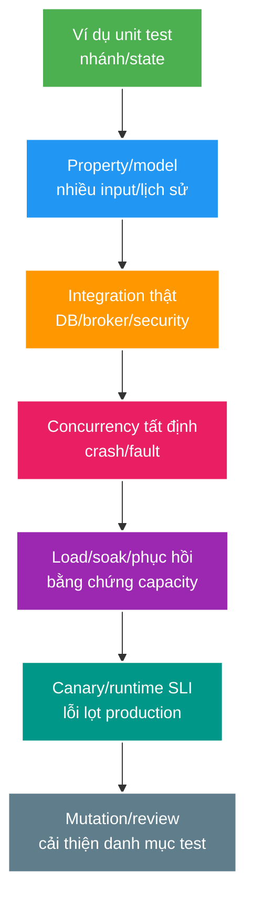

# Deep-dive: concurrency tất định, contract, mutation và bằng chứng tải

> Type: `DEEP_DIVE` 
> Domain: `testing` 
> Target depth: `D4 — thiết kế danh mục bằng chứng theo rủi ro và chẩn đoán sự tự tin giả hoặc test chập chờn` 
> Teaching readiness: `TEACHABLE_DRAFT` 
> Status: `DRAFT` 
> Evidence status: `NOT RUN` 
> Prerequisites: [Testing strategy core](../core/testing-strategy-contract-concurrency-load-and-mutation.md) 
> Related cases: `TEST-02`; [question bank](../../question-bank/testing-strategy-contract-concurrency-load-and-mutation.md) 
> Owner: `Project learner; Codex teaches, learner writes back` 
> Updated: `2026-07-26`

## 1. Thang bằng chứng

Một test xanh chỉ hỗ trợ kết luận trong đúng setup và assertion đã chạy. Thang bằng chứng đi từ ví dụ cụ thể, property, ranh giới tích hợp thật, concurrency/fault có kiểm soát, tải đại diện, tới tín hiệu production. Không được lấy kết quả ở tầng thấp để tuyên bố thay cho tầng chưa chạy: unit test không chứng minh capacity, còn load test không chứng minh invariant dữ liệu.

## 2. Bộ khung tái hiện race theo cách tất định

Ví dụ với `lost update`: transaction A và B dùng hai connection riêng, cùng dừng ở barrier sau khi đọc, rồi test chủ động cho phép từng bên ghi theo thứ tự đã chọn. Cuối test phải lưu SQLState, kết quả của mỗi transaction và hàng dữ liệu cuối. Với refresh/revoke token, barrier đặt sau bước kiểm tra nhưng trước conditional update. Với relay, điểm chèn lỗi đặt quanh commit, publish và ack; mock không thể tái hiện process bị hệ điều hành kill hay trạng thái mạng không chắc chắn.

Hook chỉ phục vụ test có nguy cơ lọt vào production, nên phải cô lập bằng profile, package nội bộ hoặc dependency proxy có thể điều khiển. Không dùng `sleep` để đoán scheduler. Khi timeout, harness phải in phase và thread state để chẩn đoán. Chạy cả hai thứ tự ghi và stress lặp lại nếu cần; assertion kiểm tra lịch sử có thể giải thích theo một thứ tự hợp lệ, không cố định một thread phải thắng.

Test deadlock cho hai transaction khóa các hàng theo thứ tự ngược nhau, kỳ vọng database hủy một transaction rồi luồng retry chạy idempotent; không nên cố định transaction nào là nạn nhân vì database được quyền chọn. Với isolation `SERIALIZABLE`, một lịch sử gây anomaly phải dẫn tới ít nhất một transaction bị abort. Khi rủi ro nằm ở nhiều node, test phải dùng các app instance hoặc owner database tách biệt thay vì hai lời gọi trong cùng object.

## 3. Ma trận tiến hóa contract

Chạy ma trận provider cũ/mới × consumer cũ/mới với fixture có trường lạ, thiếu trường optional, enum mới, error/auth/idempotency thay đổi. Thay đổi Protobuf, event hoặc JSON cần xét cả ý nghĩa chứ không chỉ schema. Lưu contract theo phiên bản. Một mock sinh từ contract vẫn có thể pass trong khi provider thật dùng authorization hoặc giới hạn payload khác, vì vậy cần provider verification trong CI và integration ở môi trường gần thật.

Schema registry thường chỉ kiểm tương thích cấu trúc; consumer vẫn có thể dựa vào ý nghĩa hoặc thứ tự. Cần telemetry sử dụng và deprecation. Chỉ xóa thay đổi breaking sau cửa sổ retention, replay và client migration. Negative contract còn phải chứng minh secret field không xuất hiện và audience đúng.

## 4. Mutation diagnosis

Mutation sống sót thường là đổi `<` thành `<=`, bỏ condition, trả `null`, nuốt exception hoặc bypass authorization. Trước hết hỏi mutation có tương đương không; nếu làm đổi hành vi thật, thêm assertion ở đúng layer/invariant thay vì snapshot nhiễu. Không biến mutation score thành KPI khiến đội viết test vô nghĩa. Loại generated/config cẩn thận và tập trung vào wallet, auth hoặc state machine.

Mutation có thể phơi bày test chỉ kiểm HTTP 200 mà không kiểm database hoặc side effect khi unauthorized. Nó không mô phỏng hạ tầng, config hoặc protocol thật, nên phải bổ sung integration/fault test.

## 5. Những bẫy khi tạo bằng chứng tải

`Coordinated omission` xảy ra khi virtual user chờ response rồi mới gửi request tiếp. Service càng chậm thì công cụ càng gửi ít, làm hàng đợi thật bị che khuất và số đo latency trông đẹp giả tạo. `Open arrival model` lên lịch request độc lập với response nên phơi bày áp lực hàng đợi tốt hơn. Cũng phải tính warmup/JIT/cache, dữ liệu quá nhỏ hoặc không có skew, chạy localhost không có network/TLS/auth, chỉ nhìn average, hết ephemeral port hoặc chính máy phát tải bị nghẽn. Luôn theo dõi saturation của load generator.

Ghi baseline về hình dạng workload và tài nguyên nghẽn. Test spike kèm phục hồi/drain backlog, soak để tìm leak và chèn failure dưới tải. Dùng random seed tất định khi có thể, bảo vệ secret/data, và so đúng commit/artifact/config trong khi ghi nhận nhiễu môi trường.

Kết quả luôn có điều kiện. Tuyên bố “hỗ trợ 100k” phải ghi số connection, message rate/payload, room skew, thời lượng, phần cứng, error/p99, resource, headroom và fault đã thử.

## 6. Chẩn đoán test chập chờn

Phân loại flakiness theo timing/race, shared state/order, external dependency, port/resource, timezone/clock, random, container startup/cleanup, async chưa được chờ hoặc framework chạy song song. Tái hiện bằng seed, order, log, thread và container identity. Sửa synchronization/isolation/condition wait; không thêm sleep tùy ý hoặc retry mười lần.

Quarantine chỉ tạm gỡ test khỏi quality gate, nhưng test vẫn phải hiển thị cùng owner, deadline và rủi ro. Cả lúc test flaky pass lẫn flaky fail đều làm giảm niềm tin vào suite. Theo dõi tỷ lệ flaky, lỗi lọt production và thời gian chạy để quyết định ưu tiên sửa.

## 7. An toàn khi chèn lỗi

Mỗi fault experiment phải có giả thuyết, steady state, ngưỡng dừng, blast radius, môi trường và owner. Dùng proxy/Toxiproxy, kill container hoặc test clock trong môi trường cô lập. Tránh phá production. Khôi phục/cleanup đúng tài nguyên đã đổi; thu before/during/after và invariant dữ liệu. Tool chèn lỗi chạy thành công nhưng không có assertion thì chưa phải evidence.

## 8. Danh mục bằng chứng cho project

Với gift: unit test business rule; integration test constraint database; concurrency test cùng key/balance; API contract cho idempotency; kill outbox/consumer; load spike và đối soát invariant. Với security: negative test HTTP/WS/token, rotation key và JWKS outage. Với Redis: stale fill, stampede và ngân sách database khi outage. Với realtime: reconnect và slow consumer. Chỉ mở từng thí nghiệm khi checkpoint/case yêu cầu; hiện chưa chạy.

### 8.1. Pathology A — test concurrency dùng sleep chỉ tạo cảm giác an toàn

Hai threads `sleep(100)` rồi update không bảo đảm cả hai đã đọc state cũ trước write; scheduler/CI load có thể serialize chúng. Test pass hoặc fail ngẫu nhiên và không biết history nào đã chạy. Harness đúng dùng barrier/latch tại seam sau read, separate transactions/connections, release writes theo order có chủ ý và capture final invariant/SQLState. Timeout của harness phải dump phase/thread state để failure có thể điều tra.

Một tested interleaving không chứng minh mọi histories. Nó chứng minh implementation xử lý history đã mô tả trong exact DB/isolation/version. Bổ sung property/stress/model checking khi state space cần, nhưng vẫn ghi boundary của claim.

### 8.2. Pathology B — contract schema pass nhưng consumer vẫn hỏng

Event thêm enum value là structurally additive, schema registry cho pass. Consumer Java dùng `switch` không default hoặc coi mọi value ngoài `LIVE` là `ENDED`, nên behavior sai. Contract test phải bao gồm semantic fixtures: unknown enum/field, missing optional, duplicate delivery, out-of-order version và auth/error semantics. Provider verification bằng mock không thay real broker/serializer/security integration.

Compatibility matrix old/new provider × old/new consumer và replay/retention window quyết định khi nào được remove field. Telemetry usage/dead-letter cho evidence migration, không chỉ CI green.

### 8.3. Pathology C — load test báo p99 đẹp vì coordinated omission

Closed-loop virtual user chờ response rồi mới gửi tiếp. Khi service chậm, offered requests/second tự giảm, queue pressure biến mất và histogram bỏ qua users đáng lẽ tới trong lúc chờ. Open arrival model giữ schedule độc lập và ghi dropped/late iterations; phải kiểm load generator không bão hòa.

“100k viewers” cần connection count, message/heartbeat/reconnect rates, room skew, payload, duration, TLS/auth/network, hardware/config, errors/p99/resources/headroom và fault/recovery. Một test chỉ open idle sockets không chứng minh fanout capacity. Warmup/JIT/cache và representative hot room phải được ghi.

### 8.4. Pathology D — mutation score cao nhưng authorization effect chưa được assert

Tests chỉ assert HTTP 403/200 hoặc snapshot JSON. Mutation bỏ ownership check nhưng mock vẫn throw ở layer khác, hoặc mutation sống vì test không assert database/broker không đổi khi unauthorized. Response đúng chưa chứng minh no side effect. Khi mutant sống, phân loại equivalent, missing assertion hay wrong layer; thêm invariant assertion nhỏ nhất, không viết test vô nghĩa để “giết điểm”.

## 8.5. Evidence statement và quality gate

Mỗi kết quả phải viết: hypothesis; artifact/commit/config; environment/data/workload; procedure/fault; raw signals; assertions; limitations; reproduction command. Unit/contract result không được nâng thành load/recovery claim. Flaky retry không biến failure thành pass; quarantine cần owner/deadline/risk và giữ visible.

Version boundary gồm JUnit/test framework parallelism, PostgreSQL isolation, Testcontainers image, broker/client, serializer và load generator. Clock/random/ports/shared containers phải controlled hoặc ghi rõ. Failure injection có steady-state, blast radius, abort và cleanup; chỉ chạy isolated trong task này `NOT RUN`.

## 8.6. Interview outline

Senior chọn test theo risk/invariant, mô tả deterministic race và escaped gap. Architect thiết kế portfolio cost/gate, contract evolution và load/fault environments. Expert giới hạn proof, phát hiện coordinated omission/generator bottleneck, reason về mutation survivors/flakiness và nối production SLI vào learning loop.

## 9. Phần người học viết lại và tự kiểm tra

> **Bài viết của tôi — `LEARNER TODO`:** viết một lịch sử hai transaction tất định và một kết luận bằng chứng tải có nêu rõ giới hạn.

1. **Question:** Thiết kế test hai transaction deterministic thay vì dùng sleep như thế nào? 
   **Đọc lại nếu bí:** mục 2 và 8.1. 
   **Một câu trả lời tốt phải có:** separate transactions, barrier phase/order, invariant/SQLState assertions, diagnostic timeout và claim limitation. 
   **My answer:** `LEARNER TODO`
2. **Question:** Vì sao structural contract compatibility chưa chứng minh semantic compatibility? 
   **Đọc lại nếu bí:** mục 3 và 8.2. 
   **Một câu trả lời tốt phải có:** old/new matrix, unknown enum/field/ordering example, real boundary, replay window và telemetry. 
   **My answer:** `LEARNER TODO`
3. **Question:** Một statement “hỗ trợ 100k viewers” cần evidence gì để không gây hiểu nhầm? 
   **Đọc lại nếu bí:** mục 5 và 8.3/8.5. 
   **Một câu trả lời tốt phải có:** workload shape, open/closed arrival, environment/data, errors/latency/resources/headroom, fault/recovery và limitations. 
   **My answer:** `LEARNER TODO`

## 10. References

- [PIT Mutation Testing](https://pitest.org/)
- [k6 — Open and Closed Models](https://grafana.com/docs/k6/latest/using-k6/scenarios/concepts/open-vs-closed/)
- [Testcontainers — CI](https://java.testcontainers.org/supported_docker_environment/continuous_integration/)

- [ ] Evidence remains `NOT RUN`.
