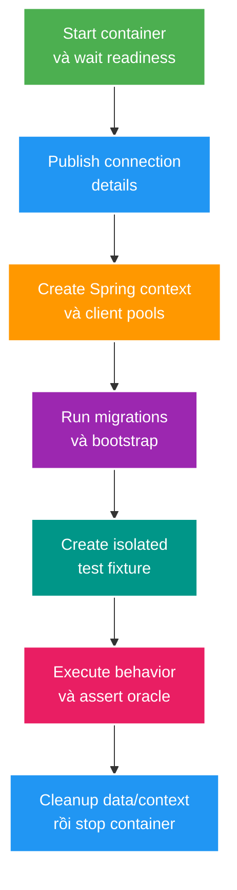

# Testcontainers Lifecycle, Isolation và CI Failure Modes

> Type: `DEEP_DIVE` 
> Domain: `testing-observability` 
> Target depth: `D3 — thiết kế và chẩn đoán container lifecycle, context reuse, parallel data isolation, readiness và CI resource failure bằng procedure tái lập` 
> Teaching readiness: `TEACHABLE_DRAFT` 
> Status: `DRAFT` 
> Evidence status: `NOT RUN` 
> Prerequisites: [Testing strategy và hermetic integration tests](../core/testing-strategy-and-hermetic-tests.md) 
> Related cases: [`TEST-UC-01`](../../../../use-case-catalog.md#31-foundation-và-senior-cases), preview owner `TEST-01` 
> Owner: `Project learner; Codex teaches, learner writes back` 
> Updated: `2026-07-26`

## 1. Cách đọc và câu hỏi trung tâm

Core theory đã giải thích vì sao Testcontainers chỉ là một phần của hermeticity. Deep-dive này trả lời bốn câu khó hơn:

1. Container, Spring `ApplicationContext`, connection pool và test data có lifetime nào?
2. Vì sao tối ưu container reuse/context caching dễ tạo contamination hoặc shutdown-order failure?
3. Parallel tests phải isolate database, Redis và RabbitMQ theo namespace nào?
4. Khi CI fail, signal nào phân biệt Docker/startup/readiness/schema/data/resource exhaustion?

Không có harness nào được triển khai trong tài liệu này; mọi procedure là kế hoạch `NOT RUN`.

## 2. Recap có giới hạn

Một hermetic integration test phải sở hữu declared inputs và lifecycle. Container cung cấp dependency engine/protocol thật; Spring context tạo clients/pools/beans kết nối tới dependency; migration tạo schema; fixture tạo initial state; test kích hoạt behavior; oracle đọc durable outcome; cleanup trả environment về trạng thái cho run kế tiếp.

Các lifetime không mặc định trùng nhau. Container static có thể sống cả class/suite; context được cache qua nhiều classes; transaction chỉ bao method; async consumer sống sau response; connection pool đóng khi context shutdown. Đây là nguồn của nhiều lỗi “chỉ CI mới có”.

## 3. Internal mechanism

### 3.1. Lifecycle graph

Thứ tự shutdown cũng quan trọng. Nếu container dừng trước Spring beans/pools cleanup, destroy callbacks có thể chạm dependency đã mất. Spring Boot 3.4 ghi nhận container bean gắn lifecycle vào test `ApplicationContext`; khi context đóng, container dừng theo lifecycle đó. Với static JUnit containers, owner lại là Testcontainers extension/class lifecycle. Không trộn hai ownership model vô thức.

### 3.2. Spring context cache và dynamic connection

Spring Test cache context theo merged configuration để giảm startup. Hai test classes có cùng context key có thể reuse bean graph và pools. `@DynamicPropertySource` cung cấp runtime host/port; `@ServiceConnection` trong Boot 3.4 cung cấp typed `ConnectionDetails` và các details này có precedence trên connection properties tương ứng.

Nếu mỗi subclass tạo container khác nhưng context bị cache/reuse không đúng assumption, bean có thể giữ connection URL của container trước. Nếu đánh dấu mọi class `@DirtiesContext`, correctness có thể trở lại nhưng suite chậm và che ownership thiết kế kém. Cần quyết định container/context scope cùng nhau.

### 3.3. Readiness khác liveness

Docker state `running` hoặc TCP port open chỉ chứng minh process/socket sống. PostgreSQL có thể chưa accept authentication; Flyway chưa chạy; RabbitMQ chưa tạo exchange/queue; Redis script/serializer wiring chưa sẵn sàng. Wait strategy nên kiểm tra dependency readiness ở lớp phù hợp, còn application bootstrap/migration phải có assertion riêng.

Fixed sleep tạo hai failure: quá ngắn trên CI chậm gây flaky, quá dài trên laptop làm feedback tệ. Poll condition có deadline và log cuối cùng giúp cả correctness lẫn diagnosis.

### 3.4. Isolation strategy theo dependency

**PostgreSQL:** rollback per test chỉ đủ khi toàn write nằm cùng transaction. Alternative gồm truncate tables theo FK-safe order, schema/database per test worker hoặc unique business namespace. Migration thường chạy một lần per database/schema owner.

**Redis:** prefix key bằng test/run ID và xóa prefix có kiểm soát. `FLUSHALL` phá parallel tests và nguy hiểm nếu target nhầm environment; không dùng cleanup rộng.

**RabbitMQ:** queue/exchange/routing key unique per test/run; consumer readiness và message drain cần explicit. Shared durable queue làm test tranh message và phụ thuộc order.

Isolation mạnh nhất không luôn rẻ nhất. Mục tiêu là không có hai tests có thể đọc/ghi cùng logical namespace ngoài shared immutable fixture.

## 4. Pathological và failure cases

### 4.1. Singleton container + transactional cleanup giả

**Initial state:** suite dùng một PostgreSQL container; test method gắn rollback. **Event:** application publish event, consumer chạy thread khác và ghi audit bằng transaction riêng. **Internal change:** test transaction rollback, audit row vẫn commit. **Symptom:** test sau thấy row thừa hoặc unique conflict. **Evidence:** query tables sau rollback, correlate transaction/thread/event timeline. **Mitigation:** await/clean external effect theo owner, unique namespace hoặc thiết kế harness truncate/schema isolation. Residual risk là background work còn chạy lúc cleanup; cần drain/stop gate.

### 4.2. Context cache giữ endpoint cũ

**Initial state:** class A khởi container và Spring context với dynamic port. **Event:** container A dừng, class B tạo container B nhưng context key bị coi tương đương. **Internal change:** cached datasource/client vẫn trỏ port A. **Symptom:** connection refused ngẫu nhiên theo class order. **Evidence:** log container ID/port, context identity và datasource URL đã redact. **Mitigation:** align shared container with shared context hoặc tạo distinct context configuration; chỉ dùng `@DirtiesContext` khi lifecycle thực sự thay đổi.

### 4.3. Parallel cleanup xóa data của test khác

Test A và B chạy song song trên shared Redis/PostgreSQL. A hoàn tất và truncate/clear toàn store trong khi B đang assert. B fail missing state. Failure biến mất khi chạy riêng hoặc sequential. Evidence cần test IDs trong keys/rows và timeline cleanup. Mitigation là namespace per worker/test và cleanup scoped; resource lock chỉ là fallback khi dependency thật sự không partition được.

### 4.4. CI resource exhaustion bị hiểu nhầm là application bug

Nhiều forks/containers cùng pull/start, Docker disk hoặc memory cạn; container killed/health timeout, application log chỉ thấy connection reset. Evidence cần Docker/container exit code/log, host memory/disk, image pull timing và concurrent suite topology. Giảm fork/container fan-out, reuse có kiểm soát trong một job hoặc tăng resource có measurement. Không tăng mọi timeout vì nó chỉ kéo dài failure nếu capacity thiếu.

## 5. Cross-layer và version boundary

Spring Boot `@ServiceConnection` cần module `spring-boot-testcontainers`; supported container types/factories thay đổi theo Boot version. Với `GenericContainer`, Boot có thể cần `name` hint để chọn connection details. Khi nâng Boot/Testcontainers, re-check factory matching, context lifecycle và deprecated test property integration.

Testcontainers JUnit 5 extension quản lý fields gắn `@Container`; tài liệu hiện tại cảnh báo parallel execution với extension là unsupported và có thể gây side effects. JUnit parallel execution là opt-in và còn phụ thuộc execution mode; shared JVM resources như system properties/timezone có thể dùng `@ResourceLock`, nhưng lock không thay external data isolation.

Reusable containers của Testcontainers hiện là experimental và không phù hợp CI. Chúng tối ưu developer startup nhưng giữ state/lifecycle ngoài run, trái mục tiêu CI repeatability nếu dùng không kiểm soát.

Network/container test vẫn không mô phỏng production topology: không có multi-AZ latency, data volume, managed-service policy hoặc broker cluster semantics trừ khi setup explicit. Claim phải giới hạn ở version/config/workload đã test.

## 6. Diagnostic và experiment walkthrough

### Hypothesis

“Test fail toàn suite vì shared database state/background consumer, không phải business assertion.”

### Setup

Pin commit, JDK, Maven command, Docker/Testcontainers/Spring versions, image tags, timezone và parallel/fork config. Gắn unique run/test ID vào fixture. Capture container IDs/ports, context identity và dependency logs mà không log secret.

### Procedure

1. Chạy test riêng lặp lại 20 lần; giữ raw summary.
2. Chạy cùng predecessor/successor nghi ngờ ở hai orders.
3. Randomize/order/parallel theo seed được lưu.
4. Snapshot relevant rows/keys/queues trước setup, sau action, sau cleanup.
5. Disable background consumer hoặc đổi namespace như một biến duy nhất.
6. Lặp lại cùng command và so failure rate/state residue.

### Interpretation

Nếu test riêng luôn pass nhưng state trước setup khác sau predecessor và fix namespace loại failure, hypothesis được hỗ trợ. Nếu container exit/readiness log fail trước fixture, chuyển hypothesis sang resource/startup. Hai mươi lần xanh không chứng minh race không tồn tại; procedure chỉ tăng confidence trong phạm vi schedule/workload.

Evidence hiện `NOT RUN`; không có số liệu mẫu nào là kết quả project.

## 7. Architecture decisions và trade-offs

**Container per class/test** dễ hiểu ownership nhưng startup/image/resource cost cao. **Singleton per suite + isolated namespace** nhanh hơn nhưng đòi hỏi cleanup/parallel discipline. **Shared external CI service** giảm startup nhưng tăng contamination/version drift và cần lease/namespace governance. Với Stage 0 safety net, ưu tiên correctness/repeatability trước, sau đó profile suite để tối ưu.

Schema-per-worker tốt cho PostgreSQL parallelism nhưng migration/schema creation cost tăng. Transaction rollback nhanh nhưng không cover async/separate transactions. Truncate đơn giản về mental model nhưng phải quản lý FK/background access. Không có cleanup strategy universal.

Image tag pin theo exact compatible version làm run tái lập; digest mạnh hơn trước tag mutation nhưng khó đọc/nâng cấp. Policy tốt ghi version owner, upgrade cadence và compatibility matrix thay vì `latest`.

## 8. Áp dụng và phỏng vấn nâng cao

Với `live-stream-backend`, future `TEST-01` cần PostgreSQL, Redis và RabbitMQ theo đúng risk, không mặc định start cả ba cho mọi test. Tạo harness shared chỉ sau khi map test slices. Security HTTP test có thể chỉ cần app + database; Redis serializer test cần Redis; consumer idempotency cần broker + durable owner.

**Senior outline:** lifecycle, readiness, isolation và cleanup; một flaky causal chain và evidence.

**Architect outline:** CI topology, container/context scope, parallel namespace, image/version governance, runtime/cost budget và quality gate.

**Expert outline:** background transaction contamination, cached endpoint/lifecycle race, fault injection, giới hạn của container fidelity và cách tránh false confidence.

## 9. Tóm tắt, learner write-back và self-check

- Container, context, pool, transaction, background worker và fixture có lifetime khác nhau.
- Readiness phải được kiểm tra ở đúng layer; process running chưa đủ.
- Cleanup strategy phải bao phủ external/async writes và parallel namespaces.
- Context caching là optimization có correctness assumptions.
- CI diagnosis cần container/host/context/data evidence, không chỉ application stack trace.
- Version-sensitive lifecycle/integration phải re-check khi nâng Boot/Testcontainers/JUnit.

> **Bài viết của tôi — `LEARNER TODO`:** vẽ lifecycle, chọn isolation cho PostgreSQL/Redis/RabbitMQ và kể một CI failure theo 8–15 câu.

1. **Question:** Vì sao rollback của test không cleanup được mọi write? 
   **Đọc lại nếu bí:** mục 3.4 và 4.1. 
   **Một câu trả lời tốt phải có:** transaction scope/thread, async/separate transaction, durable residue, drain/namespace/cleanup owner. 
   **My answer:** `LEARNER TODO`
2. **Question:** Spring context cache và dynamic container endpoint có thể lệch nhau thế nào? 
   **Đọc lại nếu bí:** mục 3.2 và 4.2. 
   **Một câu trả lời tốt phải có:** context cache key/lifetime, datasource/client giữ endpoint, class order signal và lifecycle-alignment fix. 
   **My answer:** `LEARNER TODO`
3. **Question:** Thiết kế parallel isolation cho ba infrastructure types ra sao? 
   **Đọc lại nếu bí:** mục 3.4 và 4.3. 
   **Một câu trả lời tốt phải có:** schema/database hoặc unique rows, Redis prefix, Rabbit namespace, scoped cleanup và resource-lock limitation. 
   **My answer:** `LEARNER TODO`
4. **Question:** Phân biệt readiness failure với resource exhaustion trên CI bằng evidence nào? 
   **Đọc lại nếu bí:** mục 3.3, 4.4 và 6. 
   **Một câu trả lời tốt phải có:** dependency health/log, exit code, host memory/disk/pull, timing, concurrent topology và one-variable experiment. 
   **My answer:** `LEARNER TODO`

## 10. Official references và teach-back checklist

- [Spring Boot 3.4 — Testcontainers](https://docs.spring.io/spring-boot/3.4/reference/testing/testcontainers.html)
- [Testcontainers — JUnit 5 integration](https://java.testcontainers.org/test_framework_integration/junit_5/)
- [Testcontainers — Manual lifecycle control](https://java.testcontainers.org/test_framework_integration/manual_lifecycle_control/)
- [Testcontainers — Reusable containers are experimental](https://java.testcontainers.org/features/reuse/)
- [JUnit 5 — parallel execution and resource locks](https://junit.org/junit5/docs/current/user-guide/)

- [ ] Tôi vẽ đúng container/context/pool/data lifecycle.
- [ ] Tôi phân biệt liveness, readiness và schema/application readiness.
- [ ] Tôi chọn isolation/cleanup theo dependency và parallelism.
- [ ] Tôi chẩn đoán từ evidence thay vì thêm sleep/timeout.
- [ ] Tôi nêu version/fidelity boundary của harness.
- [ ] Project harness evidence vẫn `NOT RUN`.
