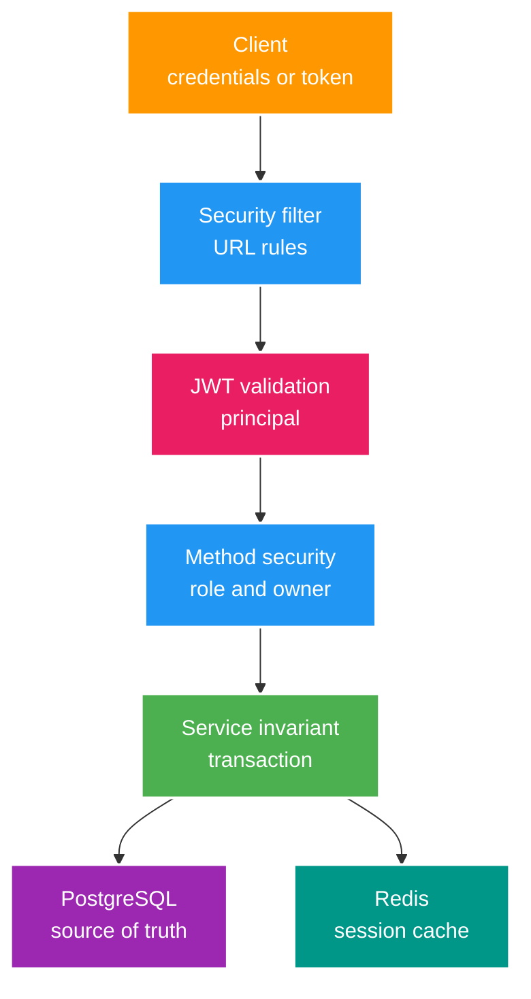

# Security và Authorization Flow

> Trạng thái: `CURRENT + STAGE 0 TARGET` 
> Cập nhật: 2026-07-25 
> Bản thiết kế 2025 được lưu tại [archive](../archive/2025-reference/authorization-flow.md).

## 1. Mental model

- Authentication trả lời “caller là ai”.
- Authorization trả lời “caller được làm gì trên resource này”.
- JWT là carrier; refresh session trong PostgreSQL mới là durable revocation state.
- Redis chỉ tăng tốc lookup. Cache không được làm một session đã revoke sống lại.

## 2. Current token/session flow

### Login và register

1. Validate credential/input.
2. Tạo `UserSession` trong PostgreSQL, tối đa dự kiến 5 active session/user.
3. Cache `SessionCacheDTO` theo session expiry.
4. Sinh access token và refresh token.

### Access request

1. `JwtAuthenticationFilter` đọc bearer token.
2. `JwtTokenProvider` validate signature/expiry và load user details.
3. `SecurityFilterChain` áp URL rule; `@PreAuthorize` áp role/ownership chi tiết.

Current gap: access và refresh token chưa được phân biệt chắc chắn bằng token type/audience trong mọi validation path.

### Refresh

1. Parse session ID từ refresh token.
2. Đọc cache trước; cache miss fallback PostgreSQL.
3. Kiểm tra session active/chưa hết hạn và cập nhật `lastUsedAt`.
4. Sinh token mới.

### Logout

- Logout một device: update DB status rồi xóa `session:v1:{sessionId}`.
- Logout all: update toàn bộ DB session nhưng hiện chưa xóa toàn bộ cache của user.

## 3. Current security gaps

| ID | Gap | Failure mode | Gate |
| --- | --- | --- | --- |
| SEC-01 | Access/refresh token type confusion | Refresh token có thể đi qua access-token path | Claim/type validation + negative tests |
| SEC-06 | `/api/auth/**` public quá rộng | `/me` và `/logout-all` không được URL layer bảo vệ | Matcher tường minh + method-authorization negative tests |
| SEC-02 | Logout-all không invalidate cache | Session đã revoke vẫn cache-hit | User-session index hoặc bounded invalidation |
| SEC-03 | Stream key trong public DTO/log | Secret exposure | DTO theo audience + log redaction |
| SEC-05 | Webhook shared secret tĩnh | Replay/spoof nếu secret lộ | HMAC + timestamp + event ID |
| CFG-01 | Dev/test endpoint trong default context | Production attack surface | Profile/conditional bean tests |

## 4. Target invariants

- Access token có `typ=access`; refresh token có `typ=refresh` và session ID.
- Chỉ register/login/refresh là public trong auth group; logout policy phải được quyết định và test rõ.
- Revoke trong PostgreSQL phải thắng mọi cache hit.
- Role không thay ownership check; ownership không thay business invariant.
- Authentication failure là `401`; caller hợp lệ nhưng thiếu quyền là `403`.
- Token, password, stream key và webhook secret không được log.

## 5. Action token và step-up authentication

Action token, donation và withdrawal chưa được implement. Chỉ thêm chúng trong wallet/gift learning case sau khi có threat model, one-time semantics, TTL, binding tới user/action/amount và replay test. Không coi nội dung trong archive là current contract.

## 6. Verification bắt buộc

- Unit test cho claim/type/expiry parsing.
- MockMvc test cho public, authenticated, role và ownership matrix.
- Integration test cho revoke, cache hit/miss và logout-all.
- Negative tests cho refresh token dùng làm access token và ngược lại.
- Webhook tests cho signature sai, timestamp cũ, duplicate event và secret rotation.
