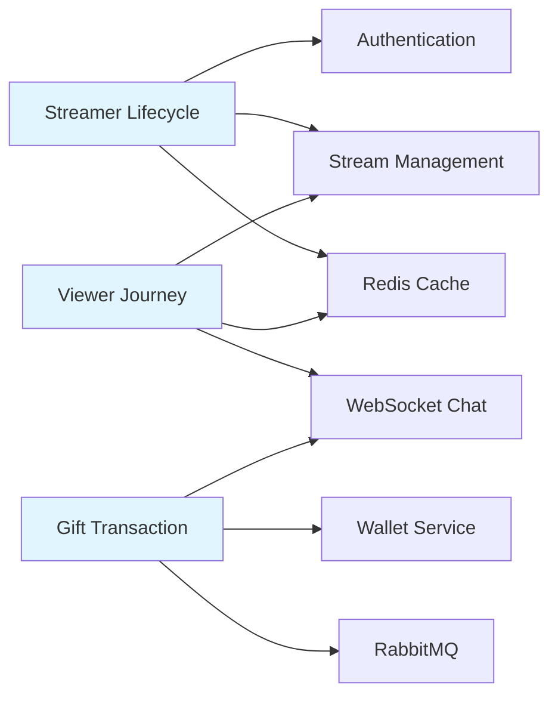
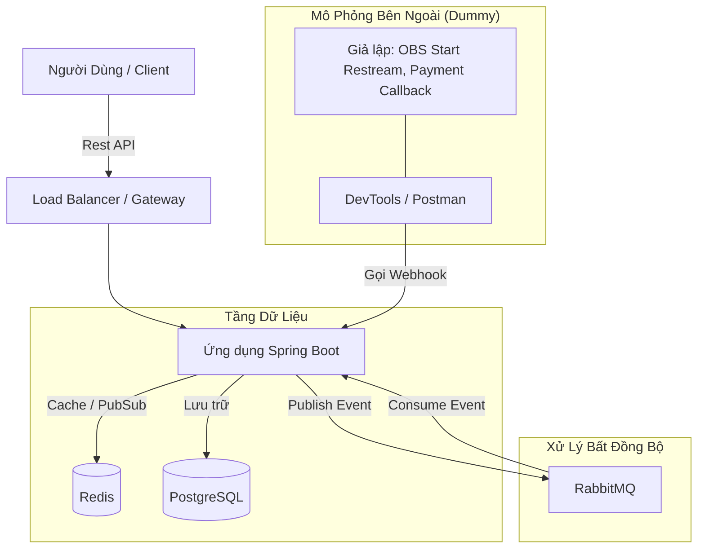

# Tài Liệu Thiết Kế Hệ Thống: Spring Boot Livestream Backend

## 0. Business Context

> **Đọc trước**: [Business Flows & Use Cases](business_flows.md) để hiểu nghiệp vụ trước khi đọc technical design.

### Core Use Cases Supported

Hệ thống được thiết kế để support 7 use cases chính:

1. **UC-01: User Registration & Authentication** - Quản lý identity và access control
2. **UC-02: Streamer Creates Livestream** - Content creators phát sóng
3. **UC-03: Viewer Watches Stream** - Audience xem và tương tác
4. **UC-04: Real-time Chat Interaction** - Community engagement
5. **UC-05: Gift Sending & Wallet Management** - Monetization
6. **UC-06: Analytics & Leaderboard** - Data insights và gamification
7. **UC-07: Admin Moderation** - Platform governance

### Business Requirements → Technical Decisions

| Business Requirement | Technical Solution | Rationale |
|---------------------|-------------------|-----------|
| **Real-time chat** với thousands concurrent users | Redis Pub/Sub + WebSocket | In-memory speed, horizontal scaling |
| **Unique viewer tracking** không duplicate | Redis HyperLogLog | Memory-efficient probabilistic counting |
| **Gift transactions** phải atomic | PostgreSQL Transactions + Optimistic Locking | Data integrity, prevent double-spend |
| **Async gift processing** không block user | RabbitMQ Message Queue | Decouple heavy operations, retry logic |
| **Session-backed auth** để revoke tokens | PostgreSQL user_sessions table | Centralized session management |
| **Leaderboard** update real-time | Redis Sorted Sets | O(log N) updates, fast ranking |

### User Flows → System Components

---

## 1. Bối Cảnh & Mục Tiêu

- **Mục tiêu**: Xây dựng Backend hiệu năng cao cho nền tảng Livestream.
- **Công nghệ**: Java 17, Spring Boot 3.x.
- **Thành phần cốt lõi**: Redis (Caching, Pub/Sub), RabbitMQ (Xử lý bất đồng bộ), PostgreSQL (Lưu trữ).
- **Ràng buộc**: Tập trung vào logic Backend. Các tương tác Frontend (Media Server, Cổng thanh toán) sẽ được **GIẢ LẬP (Dummy)** để tăng tốc độ phát triển và kiểm thử.

## 2. Kiến Trúc Tổng Quan

## 3. Lý Do Chọn Công Nghệ

| Công nghệ                   | Sử dụng trong dự án                                  | Tại sao?                                                                                                 |
| :-------------------------- | :--------------------------------------------------- | :------------------------------------------------------------------------------------------------------- |
| **Java 17 / Spring Boot 3** | Core Backend                                         | Mạnh mẽ, hệ sinh thái lớn, hiệu năng tốt.                                                                |
| **Redis**                   | Phân phối Chat, Lưu Session, Đếm View, Bảng xếp hạng | Tốc độ in-memory cần thiết cho các tính năng realtime. Pub/Sub giúp scale chat server.                   |
| **RabbitMQ**                | Giao dịch quà tặng, Thông báo, Lưu log chat          | Tách biệt các tác vụ ghi nặng (lưu log) khỏi luồng realtime. Đảm bảo tính toàn vẹn dữ liệu cho quà tặng. |
| **WebSocket (STOMP)**       | Chat Realtime & Thông báo                            | Giao thức tiêu chuẩn cho giao tiếp hai chiều (Server <-> Client).                                        |

## 4. Thiết Kế Chi Tiết Module

### 4.1. Xác Thực & Phân Quyền (RBAC)

- **Cơ chế**: JWT + Session-backed Refresh Token.
  - Access Token: 15 phút, stateless.
  - Refresh Token: 30 ngày, chứa session_id, check DB mỗi lần refresh.
- **Vai trò**:
  - `ROLE_USER`: Xem, chat, tặng quà.
  - `ROLE_STREAMER`: Có thể bắt đầu stream.
  - `ROLE_ADMIN`: Quản lý user, xem báo cáo.
- **Luồng**:
  1. Đăng nhập → Tạo session trong DB (user_sessions) → Trả JWT.
  2. Refresh → Check session status trong DB → Cấp AT mới.
  3. Logout → Revoke session (status = REVOKED) → RT tự chết.
- **Tiền tệ (Donate/Withdraw)**:
  - Action Token: Redis, 60s TTL, one-time.
  - Step-up auth cho số tiền lớn (OTP, 2FA).

### 4.2. Quản Lý Stream (Webhook Giả Lập)

Vì không sử dụng Media Server thật (như SRS), chúng ta tạo **Simulation Controller** để giả lập hành vi.

- **Logic Thực Tế**: OBS -(RTMP)-> Media Server -(Webhook)-> Spring Boot.
- **Logic Giả Lập**: Developer tools gọi API -> Spring Boot.
- **Endpoints**:
  - `POST /api/dev/simulate/stream/start`: Input `{streamKey}`. Logic: Kiểm tra Key -> Set `isLive=true` -> Thông báo cho Followers (Async).
  - `POST /api/dev/simulate/stream/end`: Input `{streamKey}`. Logic: Set `isLive=false`.

### 4.3. Hệ Thống Chat Real-time

- **Kiến trúc**:
  - Client gửi tin nhắn -> WebSocket Controller.
  - Controller -> **Redis Pub/Sub** (Topic: `room.{roomId}`).
  - Redis Subscriber (trên tất cả instance) -> Đẩy xuống WebSocket cho client trong phòng.
  - Controller -> **RabbitMQ** (Queue: `chat.log`).
  - RabbitMQ Consumer -> Lưu vào DB `chat_logs` (Insert theo batch để tối ưu).
- **Tính năng**:
  - Mute/Ban: Lưu `muted_users:{roomId}` trong Redis Set. Kiểm tra trước khi publish.

### 4.4. Ví & Hệ Thống Tặng Quà (Dòng Tiền)

- **Tiền tệ**: "Coins".
- **Nạp tiền (Giả lập)**:
  - `POST /api/dev/simulate/payment/deposit`: Input `{userId, amount}`. Cộng tiền trực tiếp vào tài khoản.
- **Luồng Tặng Quà (Transactional)**:
  1.  **API**: `POST /api/gifts/send`.
  2.  **Validate**: Số dư > Giá quà.
  3.  **Atomic Deduct**: Trừ ví `balance = balance - price` (Optimistic Locking).
  4.  **Async**: Gửi message vào RabbitMQ `gift.transaction`.
  5.  **Consumer**:
      - Cộng Coin vào Ví Streamer.
      - Tạo bản ghi Transaction.
      - Push "Donation Alert" vào phòng Chat (WebSocket).

### 4.5. Analytics (Redis HLL & Sorted Sets)

- **Đếm View**:
  - Sự kiện: User join WebSocket room.
  - Hành động: `PFADD stream:{id}:views {userId}` (HyperLogLog).
  - Lấy số lượng: `PFCOUNT stream:{id}:views`.
- **Bảng Xếp Hạng**:
  - Hành động: `ZINCRBY leaderboard:daily {amount} {userId}` (Khi tặng quà).

## 5. Thiết Kế Cơ Sở Dữ Liệu (Nháp)

- `users`: id, username, password_hash, email, role.
- `user_profiles`: user_id, display_name, avatar, bio.
- `wallets`: id, user_id, balance (BigDecimal), updated_at.
- `streams`: id, streamer_id, stream_key, title, is_live, started_at.
- `transactions`: id, from_user_id, to_user_id, amount, type (DEPOSIT, GIFT), created_at.
- `chat_logs`: id, stream_id, user_id, content, created_at.

## 6. Các Bước Tiếp Theo

1.  Khởi tạo dự án Spring Boot.
2.  Cấu hình Docker Compose cho Redis & RabbitMQ.
3.  Implement các Controller "Dummy" (Webhook & Payment) trước để gỡ chặn testing.
