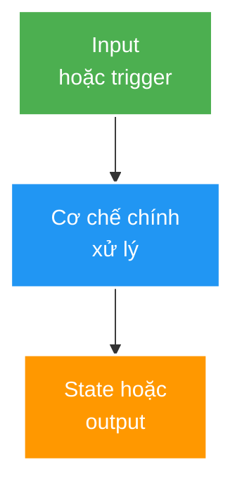

# <Tên topic bằng tiếng Việt rõ nghĩa; giữ IT English term cần thiết>

> Type: `CORE | DEEP_DIVE` 
> Domain: `java | spring | security | database | redis | messaging | distributed-systems | architecture | testing-observability` 
> Target depth: `D1 | D2 | D3 | D4; mô tả điều kiện đạt` 
> Teaching readiness: `OUTLINE_ONLY | TEACHABLE_DRAFT | LEARNER_VALIDATED` 
> Status: `DRAFT | LEARNER_REVIEWED | EVIDENCE_LINKED` 
> Evidence status: `NOT RUN | PARTIAL | EVIDENCE_LINKED` 
> Prerequisites: `<link tới kiến thức phải biết trước>` 
> Related cases: `<links>` 
> Owner: `<learner>` 
> Updated: `YYYY-MM-DD`

## 0. Cách dùng tài liệu này

Nói rõ tài liệu dành cho ai, cần đọc theo thứ tự nào, mất khoảng bao lâu và sau khi đọc người học làm được gì. Phân biệt ba mức readiness:

- `OUTLINE_ONLY`: mới là khung coverage/cheat sheet; **không dùng làm giáo trình tự học**.
- `TEACHABLE_DRAFT`: đã đủ giải thích, ví dụ và sơ đồ để một developer chưa biết topic có thể tự học; vẫn cần learner phản biện.
- `LEARNER_VALIDATED`: learner đã diễn đạt lại, hoàn thành self-check và sửa các điểm tối nghĩa; chưa đồng nghĩa có runtime evidence.

`Status` và `Evidence status` vẫn độc lập với readiness. Một tài liệu viết hay không chứng minh người học đã hiểu hoặc implementation đã đúng.

## Nguyên tắc viết bắt buộc

Theory là **bài giảng canonical**, không phải outline, glossary dump hoặc cheat sheet. Agent phải cung cấp đủ kiến thức trước khi yêu cầu learner trả lời.

1. Viết tiếng Việt tự nhiên, có dấu. Giữ IT English term quen thuộc như `bean`, `proxy`, `transaction`, `happens-before`; giải nghĩa khi xuất hiện lần đầu.
2. Mỗi khái niệm mới đi theo nhịp: **vấn đề -> trực giác -> định nghĩa -> cơ chế -> ví dụ -> giới hạn**.
3. Không đặt ba hoặc nhiều thuật ngữ chưa giải nghĩa trong cùng một câu.
4. Table/matrix chỉ dùng để **cô đọng sau khi đã giải thích**. Không dùng table thay cho causal explanation.
5. Khi topic có sequence, lifecycle, state machine, ownership hoặc causal chain, thêm Mermaid diagram. Diagram phải tuân thủ `$mermaid-styling`, trả lời một câu hỏi rõ và đọc được trong Markdown viewport.
6. `CORE` phải có tối thiểu hai worked examples: một ví dụ nhỏ cô lập mechanism và một ví dụ gần project/thực tế.
7. `DEEP_DIVE` phải giải thích ít nhất hai pathological/failure cases theo từng bước, có diagnostic/experiment implication và version boundary nếu behavior nhạy version.
8. Không dùng `LEARNER TODO` thay cho phần giảng. Marker này chỉ xuất hiện trong phần learner write-back/self-check **sau** toàn bộ teaching content.
9. Mỗi self-check chỉ rõ kiến thức nằm ở section nào và rubric của một câu trả lời tốt; không đưa đáp án thuộc lòng hoàn chỉnh.
10. Không padding để đạt word count. Heuristic thông thường: core khoảng 1.500–3.500 từ, deep-dive khoảng 1.800–4.000 từ; topic phức tạp có thể dài hơn nếu cấu trúc vẫn rõ.

---

# Cấu trúc cho `CORE`

## 1. Vì sao topic này tồn tại?

Bắt đầu từ một vấn đề mà developer có thể hình dung. Trả lời:

- Nếu không hiểu topic này thì lỗi/quyết định nào dễ sai?
- Topic giải quyết vấn đề gì?
- Topic **không** giải quyết vấn đề gì?

Không mở đầu bằng định nghĩa trừu tượng.

## 2. Learning objectives và prerequisites

Sau topic này, tôi có thể:

1. `<Giải thích mechanism bằng lời dễ hiểu>`
2. `<Áp dụng vào một ví dụ>`
3. `<Nhận diện failure/misconception>`
4. `<Bảo vệ một trade-off ở mức target depth>`

Ghi rõ prerequisite và cung cấp link. Nếu prerequisite nhỏ, giải thích bridge 2–5 câu thay vì buộc người học tự tìm.

## 3. Từ vựng tối thiểu

Giới thiệu từng term trước khi dùng dày đặc. Với mỗi term:

- nghĩa trong topic;
- ví dụ một câu;
- term dễ nhầm và điểm khác biệt.

Chỉ sau phần giải thích mới dùng bảng cô đọng nếu thật sự giúp đọc nhanh.

## 4. Mental model cốt lõi — phần Agent phải dạy

Đây **không phải** phần learner tự đoán. Agent cung cấp một mô hình đủ cụ thể để người mới có thể hình dung:

1. Có những actor/component/state nào?
2. Ai sở hữu lifecycle hoặc state?
3. Dữ liệu/control đi từ đâu tới đâu?
4. Boundary nào làm assumption thay đổi?
5. Một câu ngắn nào learner cần nhớ?

Khi phù hợp, có diagram ngay tại đây. Ví dụ width-safe:

Giải thích diagram bằng prose; không để người học tự giải mã node/arrow.

## 5. Cơ chế hoạt động từng bước

Chia thành các subsection theo sequence/layer. Mỗi bước trả lời:

- điều gì kích hoạt bước này;
- component/state nào tham gia;
- điều gì thay đổi;
- kết quả hoặc failure được truyền sang bước sau ra sao.

Nếu có code, dùng ví dụ nhỏ compile được về mặt ý tưởng và giải thích từng phần quan trọng. Không ném một block code dài rồi bỏ đó.

## 6. Worked examples

### 6.1. Ví dụ tối thiểu để thấy mechanism

Đưa input, code/sequence, output mong đợi và giải thích **vì sao** có output đó.

### 6.2. Ví dụ gần thực tế/project

Dùng một scenario quen thuộc như request livestream, gift, reconnect hoặc database write. Chỉ minh họa reusable theory; path/file cụ thể của project vẫn giữ trong learning case.

### 6.3. Phản ví dụ

Đưa một cách làm trông hợp lý nhưng sai, rồi phân tích causal chain dẫn tới lỗi.

## 7. Invariants và boundaries

Với mỗi invariant:

1. phát biểu bằng câu hoàn chỉnh;
2. giải thích vì sao cần đúng;
3. đưa counterexample khi nó bị phá;
4. nói boundary nơi invariant không còn đủ, ví dụ one JVM -> multi-node hoặc DB -> broker.

## 8. Các khái niệm dễ nhầm

Giải thích bằng prose trước, sau đó mới dùng bảng comparison. Comparison phải có một ví dụ quyết định, không chỉ khác nhau ở keyword.

## 9. Misconceptions và failure modes

Mỗi failure quan trọng dùng causal chain:

`Trigger -> internal mechanism -> observable symptom -> cách chứng minh -> hướng xử lý`

Table ở cuối chỉ là bản tóm tắt. Ít nhất hai failure phổ biến phải có đoạn phân tích đầy đủ.

## 10. Solution patterns và trade-offs

Giải thích mỗi option bảo vệ invariant nào, đánh đổi gì và khi nào quyết định phải đổi. Sau phần prose mới thêm matrix để ôn nhanh.

## 11. Áp dụng vào project và thực tế

- Chỉ rõ signal/code boundary cần tìm khi case được active.
- Đưa checklist quan sát/debug/implementation, nhưng không bịa evidence.
- Link learning case/use-case catalog; không duplicate current project detail.

## 12. Góc nhìn phỏng vấn

### 12.1. Câu trả lời 30 giây

Cung cấp cấu trúc: định nghĩa dễ hiểu -> mechanism chính -> boundary quan trọng. Đây là teaching example, không phải câu trả lời cá nhân của learner.

### 12.2. Câu trả lời Senior khoảng 2 phút

Cung cấp outline có failure, trade-off và một ví dụ thực tế.

### 12.3. Follow-up interviewer có thể đào sâu

Nêu câu follow-up và section cần đọc lại để trả lời.

## 13. Tóm tắt cô đọng

5–10 bullet theo thứ tự reasoning, không phải một list keyword rời rạc. Đây là phần learner quay lại ôn sau khi đã đọc toàn bài.

## 14. Bài tập diễn đạt lại — phần của tôi

Chỉ tới đây mới yêu cầu learner viết. Không dùng prompt mơ hồ kiểu “hãy mô tả topic”. Cung cấp scaffold:

1. **Bối cảnh:** Vấn đề ban đầu là gì?
2. **Mental model:** Có actor/state/boundary nào?
3. **Mechanism:** Kể 4–7 bước theo thứ tự.
4. **Failure:** Nếu bỏ một boundary thì hỏng thế nào?
5. **Decision:** Khi nào dùng, khi nào không?

> **Bài viết của tôi — `LEARNER TODO`:** viết 8–15 câu theo scaffold trên. Được phép nhìn lại mục 13 ở lần đầu; lần thứ hai đóng tài liệu và nói lại.

## 15. Self-check có hướng dẫn

Mỗi câu theo format:

1. **Question:** `<câu hỏi>` 
   **Đọc lại nếu bí:** mục `<x.y>` 
   **Một câu trả lời tốt phải có:** `<3–5 ý/rubric, không viết nguyên đáp án>` 
   **My answer:** `LEARNER TODO`

Có câu foundation, application và senior failure/trade-off. Không hỏi kiến thức chưa được dạy trong file hoặc prerequisite đã link.

## 16. Official references

- Dùng primary/official sources và ghi section liên quan.
- Với version-sensitive claim, pin version trong prose và source.
- Reference dùng để kiểm chứng/đào sâu; tài liệu này vẫn phải tự giải thích đủ, không đẩy việc dạy sang external link.

## 17. Teach-back checklist

- [ ] Tôi kể được mental model không nhìn notes.
- [ ] Tôi chạy qua được worked example và phản ví dụ.
- [ ] Tôi giải thích ít nhất một failure theo causal chain.
- [ ] Tôi bảo vệ được một trade-off và điều kiện đổi quyết định.
- [ ] Tôi trả lời được foundation và senior self-check bằng lời của mình.
- [ ] Tôi biết theory này sẽ nối vào case/evidence nào.

---

# Cấu trúc cho `DEEP_DIVE`

Deep-dive giả định learner đã đọc core, nhưng vẫn phải là bài giảng hoàn chỉnh cho phần nâng cao. Không copy core và không biến internals thành keyword dump.

## 1. Cách đọc và câu hỏi trung tâm

Nêu 2–4 câu hỏi mà core chưa trả lời đủ. Link chính xác tới core section cần nhớ.

## 2. Recap có giới hạn

Nhắc lại mental model core trong tối đa 5–10 câu để tạo điểm tựa. Không chép lại toàn bộ định nghĩa.

## 3. Internal mechanism

Phân tích lifecycle/state/algorithm/data structure đến mức target depth. Có diagram cho internal sequence hoặc state machine nếu nó giúp hiểu hơn prose.

## 4. Pathological và failure cases

Ít nhất hai case được phân tích theo từng bước:

1. trạng thái ban đầu;
2. event/interleaving/fault;
3. internal state thay đổi;
4. symptom quan sát được;
5. evidence phân biệt nó với nguyên nhân gần giống;
6. mitigation và residual risk.

## 5. Cross-layer và version boundary

Phân tích interaction với JVM/Spring/DB/cache/broker/network, scale/HA/security/operability. Với behavior thay đổi theo Java/Spring/library version, ghi rõ version matrix và điều cần re-check.

## 6. Diagnostic hoặc experiment walkthrough

Mô tả hypothesis, setup, procedure, signal và cách diễn giải. Nếu chưa chạy, ghi `NOT RUN`; không tạo output giả. Người học phải hiểu experiment chứng minh hoặc không chứng minh điều gì.

## 7. Architecture decisions và trade-offs

So sánh alternatives bằng invariant, workload và failure recovery. Matrix chỉ là phần cô đọng sau reasoning.

## 8. Áp dụng và phỏng vấn nâng cao

Nối vào use case/project boundary và cung cấp outline trả lời `SENIOR`, `ARCHITECT`, `EXPERT`. Phân biệt knowledge answer với claim cần evidence.

## 9. Tóm tắt, learner write-back và self-check

Dùng cùng scaffold/rubric như core nhưng câu hỏi tập trung causal explanation, diagnosis, version boundary và trade-off. `LEARNER TODO` chỉ nằm ở đây.

## 10. Official references và teach-back checklist

Dùng primary sources và checklist chứng minh learner hiểu internals, không chỉ nhớ tên mechanism.
